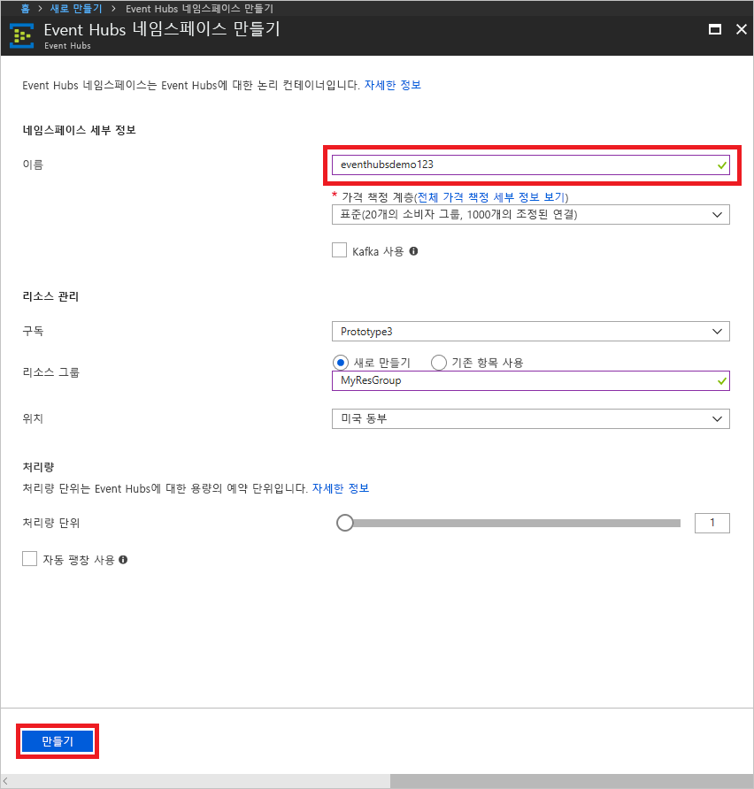
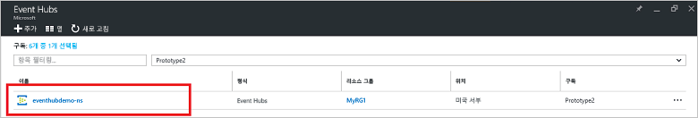
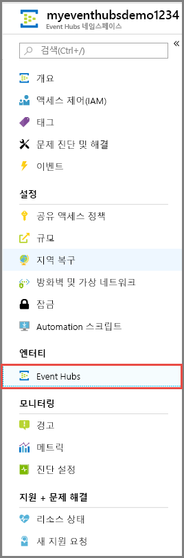
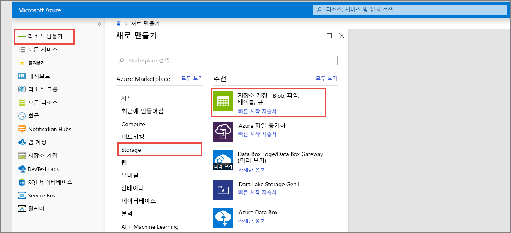
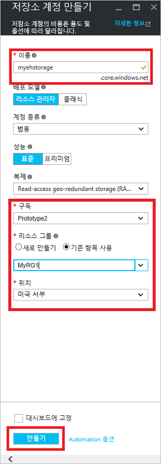
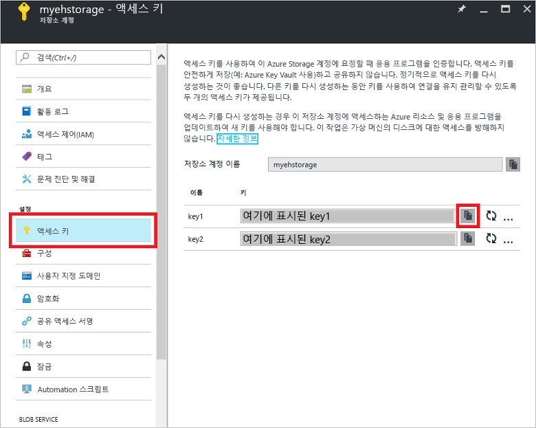

# 빠른 시작: Azure Portal을 사용하여 이벤트 허브 만들기

Azure Event Hubs는 초당 수백만 개의 이벤트를 수신하고 처리할 수 있는 확장성이 뛰어난 데이터 스트리밍 플랫폼 및 수집 서비스입니다. 이 빠른 시작에서는 [Azure Portal](https://portal.azure.com)을 사용하여 이벤트 허브를 만든 다음, .NET Standard SDK를 사용하여 이벤트 허브에서 송수신하는 방법을 보여 줍니다.

이 빠른 시작을 완료하려면 Azure 구독이 필요합니다. 구독이 없으면 시작하기 전에 [계정을 만드세요][].

## 필수 조건

이 빠른 시작을 완료하려면 다음 항목이 있어야 합니다.

- [Visual Studio 2017 업데이트 3(버전 15.3, 26730.01)](http://www.visualstudio.com/vs) 이상
- [.NET Standard SDK](https://www.microsoft.com/net/download/windows) 버전 2.0 이상

## 리소스 그룹 만들기

리소스 그룹은 Azure 리소스에 대한 논리적 컬렉션입니다. 모든 리소스는 리소스 그룹에서 배포 및 관리됩니다. 다음을 수행하여 리소스 그룹을 만듭니다.

1. 왼쪽 탐색에서 **리소스 그룹**을 클릭합니다. 그런 다음, **추가**를 클릭합니다.

   ![][1]

2. 리소스 그룹에 대한 고유한 이름을 입력합니다. 시스템에서 즉시 이 이름이 현재 선택한 Azure 구독에서 사용 가능한지 확인합니다.

3. **구독**에서 리소스 그룹을 만들려는 Azure 구독의 이름을 클릭합니다.

4. 리소스 그룹의 지리적 위치를 선택합니다.

5. **만들기**를 클릭합니다.

   ![][2]

## Event Hubs 네임스페이스 만들기

Event Hubs 네임스페이스는 정규화된 도메인 이름으로 참조되는 고유한 범위 지정 컨테이너를 제공하며, 하나 이상의 이벤트 허브를 만듭니다. 포털을 사용하여 리소스 그룹에 네임스페이스를 만들려면 다음을 수행합니다.

1. [Azure Portal][]에 로그온하고 화면 왼쪽 위에서 **리소스 만들기**를 클릭합니다.

2. **사물 인터넷**을 클릭한 다음, **Event Hubs**를 클릭합니다.

3. **네임스페이스 만들기**에서 네임스페이스 이름을 입력합니다. 시스템에서 사용 가능한 이름인지 즉시 확인합니다.

   

4. 네임스페이스 이름을 사용할 수 있게 설정한 후 가격 책정 계층(기본 또는 표준)을 선택합니다. 또한 리소스를 만들 Azure 구독, 리소스 그룹 및 위치를 선택합니다.
 
5. **만들기** 를 클릭하여 네임스페이스를 만듭니다. 시스템에서 리소스를 완전히 프로비전하기까지 몇 분 동안 기다려야 할 수 있습니다.

6. 네임스페이스 포털 목록에서 새로 만든 네임스페이스를 클릭합니다.

7. **공유 액세스 정책**을 클릭한 후 **RootManageSharedAccessKey**를 클릭합니다.
    
8. 복사 단추를 클릭하여 클립보드에 대한 **RootManageSharedAccessKey** 연결 문자열을 복사합니다. 나중에 사용하기 위해 이 연결 문자열을 임시 위치(예: 메모장)에 저장합니다.
    
## 이벤트 허브 만들기

네임 스페이스 안에 이벤트 허브를 만들려면 다음을 수행합니다.

1. Event Hubs 네임스페이스 목록에서 새로 만든 네임스페이스를 클릭합니다.      
   
     

2. 네임스페이스 창에서 **Event Hubs**를 클릭합니다.
   
    

1. 창의 위쪽에서 **+ 이벤트 허브 추가**를 클릭합니다.
   
    
1. 이벤트 허브의 이름을 입력한 다음, **만들기**를 클릭합니다.
   
    

축하합니다. 포털을 사용하여 Event Hubs 네임스페이스와, 그 네임스페이스 안에 이벤트 허브를 만들었습니다.

## 이벤트 처리기 호스트에 대한 저장소 계정 만들기

이벤트 처리기 호스트는 영구적 검사점을 관리하여 Event Hubs의 이벤트 수신을 간소화하고 병렬 수신을 수행하는 지능형 에이전트입니다. 검사점 지정을 위해 이벤트 처리기 호스트에는 저장소 계정이 필요합니다. 다음 예제에서는 저장소 계정을 만들고 액세스를 위해 키를 가져오는 방법을 보여 줍니다.

1. [Azure Portal][Azure Portal]에 로그온하고 화면 왼쪽 위에서 **새로 만들기**를 클릭합니다.

2. **저장소**를 클릭한 다음, **저장소 계정**을 클릭합니다.
   
    

3. **저장소 계정 만들기**에서 저장소 계정의 이름을 입력합니다. 리소스를 만들 Azure 구독, 리소스 그룹 및 위치를 선택합니다. 그런 다음, **만들기**를 클릭합니다.
   
    

4. 저장소 계정 목록에서 새로 만든 저장소 계정을 클릭합니다.

5. 저장소 계정 창에서 **액세스 키**를 클릭합니다. 나중에 사용하기 위해 **key1** 값을 복사합니다.
   
    

## 샘플 다운로드 및 실행

다음 단계는 이벤트를 이벤트 허브로 보내고 이벤트 처리기 호스트를 사용하여 그러한 이벤트를 수신하는 샘플 코드를 실행하는 것입니다. 

먼저 [SampleSender](https://github.com/Azure/azure-event-hubs/tree/master/samples/DotNet/Microsoft.Azure.EventHubs/SampleSender) 및 [SampleEphReceiver](https://github.com/Azure/azure-event-hubs/tree/master/samples/DotNet/Microsoft.Azure.EventHubs/SampleEphReceiver) 샘플을 GitHub에서 다운로드하거나 [azure-event-hubs 리포지토리](https://github.com/Azure/azure-event-hubs)를 복제합니다.

### 보낸 사람

1. Visual Studio를 열고 **파일** 메뉴에서 **열기**를 클릭한 다음, **프로젝트/솔루션**을 클릭합니다.

2. 이전에 다운로드한 **SampleSender** 샘플 폴더를 찾고 SampleSender.sln을 두 번 클릭하여 Visual Studio에서 프로젝트를 로드합니다.

3. 솔루션 탐색기에서 Program.cs 파일을 두 번 클릭하여 Visual Studio 편집기에서 엽니다.

4. 네임스페이스를 만들 때 얻은 연결 문자열로 `EventHubConnectionString` 값을 바꿉니다.

5. 네임스페이스 안에서 만든 이벤트 허브의 이름으로 `EventHubName`을 바꿉니다.

6. **빌드** 메뉴에서 **솔루션 빌드**를 클릭하여 오류가 없는지 확인합니다.

### 받는 사람

1. Visual Studio를 열고 **파일** 메뉴에서 **열기**를 클릭한 다음, **프로젝트/솔루션**을 클릭합니다.

2. 1단계에서 다운로드한 **SampleEphReceiver** 샘플 폴더를 찾고 SampleEphReceiver.sln 파일을 두 번 클릭하여 Visual Studio에서 프로젝트를 로드합니다.

3. 솔루션 탐색기에서 Program.cs 파일을 두 번 클릭하여 Visual Studio 편집기에서 엽니다.

4. 다음 변수 값을 바꿉니다.
    1. `EventHubConnectionString`: 네임스페이스를 만들 때 얻은 연결 문자열로 바꿉니다.
    2. `EventHubName`: 네임스페이스 안에서 만든 이벤트 허브의 이름으로 바꿉니다.
    3. `StorageContainerName`: 저장소 컨테이너의 이름입니다. 고유한 이름을 지정하며, 앱을 실행하면 컨테이너가 만들어집니다.
    4. `StorageAccountName`: 만든 저장소 계정의 이름입니다.
    5. `StorageAccountKey`: Azure Portal에서 가져온 저장소 계정 키입니다.

5. **빌드** 메뉴에서 **솔루션 빌드**를 클릭하여 오류가 없는지 확인합니다.

### 앱 실행

먼저 **SampleSender** 응용 프로그램을 실행하고 100개의 메시지가 전송되는 것을 관찰합니다. **Enter**를 눌러 프로그램을 종료합니다.

![][3]

그런 다음, **SampleEphReceiver** 앱을 실행하고 이벤트 처리기 호스트에 메시지가 수신되는 것을 관찰합니다.

![][4]
 
## 리소스 정리

포털을 사용하여 저장소 계정, 네임스페이스, 이벤트 허브를 제거할 수 있습니다. 

1. Azure Portal의 왼쪽 창에서 **모든 리소스**를 클릭합니다. 
2. 삭제하려는 저장소 계정 또는 네임스페이스를 클릭합니다. 네임스페이스를 삭제하면 그 안의 모든 이벤트 허브도 제거됩니다.
3. 화면 맨 위의 메뉴 모음에서 **삭제**를 클릭합니다. 삭제를 확인합니다. 

## 다음 단계

이 문서에서는 이벤트 허브에서 이벤트를 보내고 받는 데 필요한 Event Hubs 네임스페이스 및 기타 리소스를 만들었습니다. 자세히 알아보려면 다음 자습서를 계속합니다.

> [!div class="nextstepaction"]
> [Event Hubs 데이터 스트림에서 잘못된 데이터 시각화](event-hubs-tutorial-visualize-anomalies.md)

[계정을 만드세요]: https://azure.microsoft.com/free/?ref=microsoft.com&utm_source=microsoft.com&utm_medium=docs&utm_campaign=visualstudio
[Azure Portal]: https://portal.azure.com/
[1]: ./media/event-hubs-quickstart-portal/resource-groups1.png
[2]: ./media/event-hubs-quickstart-portal/resource-groups2.png
[3]: ./media/event-hubs-quickstart-portal/sender1.png
[4]: ./media/event-hubs-quickstart-portal/receiver1.png
