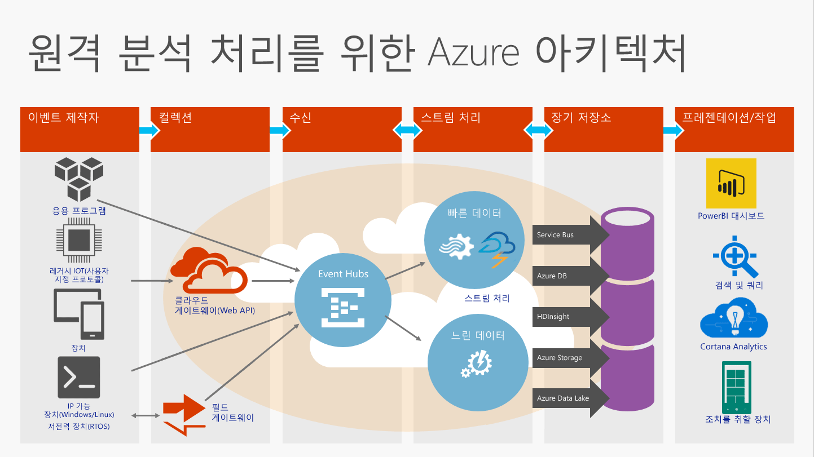

# Event Hubs란?

Azure Event Hubs는 초당 수백만 개의 이벤트를 수신하고 처리할 수 있는 확장성이 뛰어난 데이터 스트리밍 플랫폼 및 이벤트 수집 서비스입니다. Event Hubs는 분산된 소프트웨어와 장치에서 생성된 이벤트, 데이터 또는 원격 분석을 처리하고 저장할 수 있습니다. Event Hub로 전송된 데이터는 실시간 분석 공급자 또는 일괄 처리/저장소 어댑터를 사용하여 변환하고 저장할 수 있습니다. Event Hubs는 짧은 대기 시간과 엄청난 규모의 [게시-가입 기능](/biztalk/core/publish-and-subscribe-architecture)을 제공함으로써 빅 데이터를 위한 "램프" 역할을 수행합니다.

예를 들어 Event Hubs를 사용하면 모바일 앱의 동작 추적, 웹 팜의 트래픽 정보, 콘솔 게임의 게임 내 이벤트 캡처 또는 산업용 컴퓨터, 연결된 차량 또는 다른 장치에서 수집한 원격 분석을 수행할 수 있습니다.

## Azure Event Hubs 개요

Event Hubs가 솔루션 아키텍처에서 수행하는 일반적인 역할은 *이벤트 수집기*라고 하는 이벤트 파이프라인에 대한 "현관"으로서의 역할입니다. 이벤트 ingestor는 이러한 이벤트에서 이벤트 스트림의 프로덕션을 분리하는 이벤트 게시자와 이벤트 소비자 간에 작용하는 구성 요소 또는 서비스입니다. 다음 그림은 이 아키텍처를 보여 줍니다.

Event Hubs는 메시지 스트림 처리 기능을 제공하지만 기존 엔터프라이즈 메시지와 다른 특징을 가지고 있습니다. Event Hubs 기능은 높은 처리량 및 이벤트 처리 시나리오를 중심으로 구축됩니다. 따라서 Event Hubs는 [Azure Service Bus](https://azure.microsoft.com/services/service-bus/) 메시지와 다르며, 토픽과 같은 [Service Bus 메시지](/azure/service-bus-messaging/) 엔터티에 사용할 수 있는 기능 일부를 구현하지 않습니다.

## Event Hubs 기능

Event Hubs는 다음과 같은 주요 요소를 제공합니다.

- [**이벤트 생산자/게시자**](event-hubs-features.md#event-publishers): 이벤트 허브에 데이터를 보내는 엔터티입니다. 이벤트는 AMQP 1.0 또는 HTTPS를 통해 게시됩니다.
- [**캡처**](event-hubs-features.md#capture): Event Hubs 스트리밍 데이터를 캡처하고 Azure Blob Storage 계정에 저장할 수 있습니다.
- [**파티션**](event-hubs-features.md#partitions): 각 소비자에서 이벤트 스트림의 특정 하위 집합 또는 파티션만 읽을 수 있게 합니다.
- [**SAS 토큰**](event-hubs-features.md#sas-tokens): 이벤트 게시자를 식별하고 인증합니다.
- [**이벤트 소비자**](event-hubs-features.md#event-consumers): 이벤트 허브에서 이벤트 데이터를 읽는 엔터티입니다. 이벤트 소비자는 AMQP 1.0을 통해 연결합니다. 
- [**소비자 그룹**](event-hubs-features.md#consumer-groups): 각 이벤트 스트림을 개별적으로 볼 수 있는 다중 소비 응용 프로그램을 제공하여 소비자가 독립적으로 작동할 수 있게 합니다.
- [**처리량 단위**](event-hubs-features.md#capacity): 미리 구입한 용량의 단위입니다. 단일 파티션에는 처리량 단위 하나의 최대 크기가 있습니다.

이러한 요소와 다른 Event Hubs 기능에 대한 자세한 기술적 내용은 [Event Hubs 기능 개요](event-hubs-features.md)를 참조하세요. 

## 다음 단계

Event Hubs 가격에 대한 자세한 내용은 [Event Hubs 가격](https://azure.microsoft.com/pricing/details/event-hubs/)을 참조하세요.

Event Hubs에 대한 자세한 내용은 다음 링크를 방문하세요.

* [Event Hubs 자습서](event-hubs-dotnet-standard-getstarted-send.md) 시작
* [Event Hubs FAQ](event-hubs-faq.md)
* [Event Hubs를 사용하는 샘플 응용 프로그램](https://github.com/Azure/azure-event-hubs/tree/master/samples)
 
 

