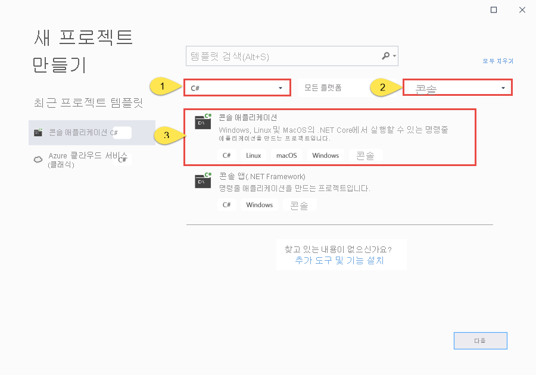
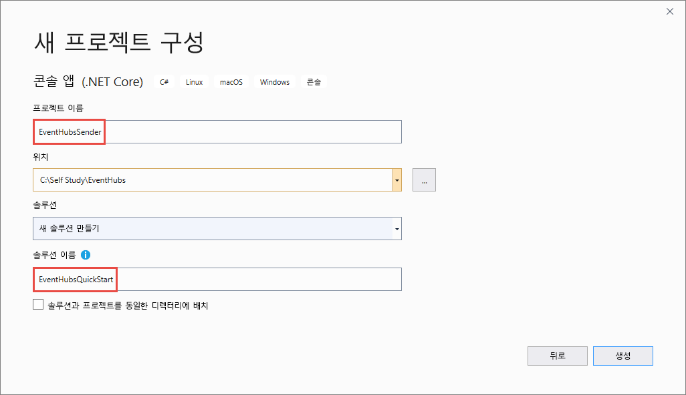

# <a name="send-events-to-and-receive-events-from-azure-event-hubs---net-azuremessagingeventhubs"></a>Azure Event Hubs에서 이벤트 보내기 및 받기 - .NET(Azure.Messaging.EventHubs) 
이 빠른 시작에서는 **Azure.Messaging.EventHubs** .NET 라이브러리를 사용하여 이벤트 허브와 이벤트를 주고 받는 방법을 보여줍니다. 

> [!IMPORTANT]
> 이 빠른 시작에서는 새 **Azure.Messaging.EventHubs** 라이브러리를 사용합니다. 이전 **Microsoft.Azure.EventHubs** 라이브러리를 사용하는 빠른 시작은 [Microsoft.Azure.EventHubs 라이브러리를 사용하여 이벤트 보내기 및 받기](event-hubs-dotnet-standard-getstarted-send.md)를 참조하세요. 


## <a name="prerequisites"></a>사전 요구 사항
Azure Event Hubs를 처음 사용하는 경우 이 빠른 시작을 수행하기 전에 [Event Hubs 개요](event-hubs-about.md)를 참조하세요. 

이 빠른 시작을 완료하려면 다음 필수 구성 요소가 필요합니다.

- **Microsoft Azure 구독**. Azure Event Hubs를 비롯한 Azure 서비스를 사용하려면 구독이 필요합니다.  기존 Azure 계정이 없는 경우 [평가판](https://azure.microsoft.com/free/)에 가입하거나 [계정을 만들 때](https://azure.microsoft.com) MSDN 구독자 혜택을 사용할 수 있습니다.
- **Microsoft Visual Studio 2019** Azure Event Hubs 클라이언트 라이브러리는 C# 8.0에 도입된 새 기능을 사용합니다.  이전 C# 언어 버전으로 라이브러리를 계속 사용할 수 있지만 새 구문은 사용할 수 없습니다. 전체 구문을 사용하려면 [.NET Core SDK](https://dotnet.microsoft.com/download) 3.0 이상으로 컴파일하고 [언어 버전](https://docs.microsoft.com/dotnet/csharp/language-reference/configure-language-version#override-a-default)을 `latest`로 설정하는 것이 좋습니다. Visual Studio를 사용하는 경우 Visual Studio 2019 이전 버전은 C# 8.0 프로젝트를 빌드하는 데 필요한 도구와 호환되지 않습니다. 체험 Community 버전을 비롯한 Visual Studio 2019는 [여기](https://visualstudio.microsoft.com/vs/)서 다운로드할 수 있습니다.
- **Event Hubs 네임스페이스 및 이벤트 허브 만들기** 첫 번째 단계에서는 [Azure Portal](https://portal.azure.com)을 사용하여 Event Hubs 형식의 네임스페이스를 만들고 애플리케이션에서 Event Hub와 통신하는 데 필요한 관리 자격 증명을 얻습니다. 네임스페이스 및 이벤트 허브를 만들려면 [이 문서](event-hubs-create.md)의 절차를 따릅니다. 그리고 다음 문서의 지침에 따라 **Event Hubs 네임스페이스에 대한 연결 문자열**을 가져옵니다. [연결 문자열 가져오기](event-hubs-get-connection-string.md#get-connection-string-from-the-portal) 이 빠른 시작의 뒷부분에서 연결 문자열을 사용합니다.

## <a name="send-events"></a>이벤트 보내기 
이 섹션에서는 이벤트 허브로 이벤트를 전송하는 .NET Core 콘솔 애플리케이션을 만드는 방법을 보여줍니다. 

### <a name="create-a-console-application"></a>콘솔 애플리케이션 만들기

1. Visual Studio 2019를 시작합니다. 
1. **새 프로젝트 만들기**를 선택합니다. 
1. **새 프로젝트 만들기** 대화 상자에서 다음 단계를 수행합니다. 이 대화 상자가 표시되지 않으면 메뉴에서 **파일**을 선택하고 **새로 만들기**를 선택한 다음, **프로젝트**를 선택합니다. 
    1. 프로그래밍 언어로 **C#** 을 선택합니다.
    1. 애플리케이션 유형으로 **콘솔**을 선택합니다. 
    1. 결과 목록에서 **콘솔 앱(.NET Core)** 을 선택합니다. 
    1. 그다음에 **다음**을 선택합니다. 

            
1. 프로젝트 이름으로 **EventHubsSender**, 솔루션 이름으로 **EventHubsQuickStart**를 입력한 다음, **확인**을 선택하여 프로젝트를 만듭니다. 

    

### <a name="add-the-event-hubs-nuget-package"></a>Event Hubs NuGet 패키지 추가

1. 메뉴에서 **도구** > **NuGet 패키지 관리자** > **패키지 관리자 콘솔**을 선택합니다. 
1. 다음 명령을 실행하여 **Azure.Messaging.EventHubs** NuGet 패키지를 설치합니다.

    ```cmd
    Install-Package Azure.Messaging.EventHubs
    ```


### <a name="write-code-to-send-messages-to-the-event-hub"></a>이벤트 허브에 메시지를 전송하는 코드 작성

1. **Program.cs** 파일 위에 다음 `using` 문을 추가합니다.

    ```csharp
    using System.Text;
    using System.Threading.Tasks;
    using Azure.Messaging.EventHubs;
    using Azure.Messaging.EventHubs.Producer;
    ```

2. Event Hubs 연결 문자열 및 이벤트 허브 이름에 대한 `Program` 클래스에 상수를 추가합니다. 대괄호 안의 자리 표시자를 이벤트 허브를 만들 때 얻은 적절한 값으로 바꿉니다. `{Event Hubs namespace connection string}`이 네임스페이스 수준 연결 문자열이며 이벤트 허브 문자열이 아님을 확인합니다. 

    ```csharp
    private const string connectionString = "<EVENT HUBS NAMESPACE - CONNECTION STRING>";
    private const string eventHubName = "<EVENT HUB NAME>";
    ```

3. `Main` 메서드를 다음 `async Main` 메서드로 바꿉니다. 자세한 내용은 코드 주석을 참조하세요. 

    ```csharp
        static async Task Main()
        {
            // Create a producer client that you can use to send events to an event hub
            await using (var producerClient = new EventHubProducerClient(connectionString, eventHubName))
            {
                // Create a batch of events 
                using EventDataBatch eventBatch = await producerClient.CreateBatchAsync();

                // Add events to the batch. An event is a represented by a collection of bytes and metadata. 
                eventBatch.TryAdd(new EventData(Encoding.UTF8.GetBytes("First event")));
                eventBatch.TryAdd(new EventData(Encoding.UTF8.GetBytes("Second event")));
                eventBatch.TryAdd(new EventData(Encoding.UTF8.GetBytes("Third event")));

                // Use the producer client to send the batch of events to the event hub
                await producerClient.SendAsync(eventBatch);
                Console.WriteLine("A batch of 3 events has been published.");
            }
        }
    ```
5. 프로그램을 빌드하고 오류가 없는지 확인합니다.
6. 프로그램을 실행하고 확인 메시지가 나타날 때까지 기다립니다. 
7. Azure Portal에서 이벤트 허브가 메시지를 받았는지 확인할 수 있습니다. **메트릭** 섹션에서 **메시지** 보기로 전환합니다. 페이지를 새로 고쳐 차트를 업데이트합니다. 메시지가 수신되었다는 내용이 표시될 때까지 몇 초 정도 걸릴 수 있습니다. 

    [](./media/getstarted-dotnet-standard-send-v2/verify-messages-portal.png#lightbox)

    > [!NOTE]
    > 정보 제공을 위한 주석을 비롯한 전체 소스 코드는 [GitHub의 이 파일](https://github.com/Azure/azure-sdk-for-net/blob/master/sdk/eventhub/Azure.Messaging.EventHubs/samples/Sample03_PublishAnEventBatch.cs)을 참조하세요.

## <a name="receive-events"></a>이벤트 수신
이 섹션에서는 이벤트 처리기를 사용하여 이벤트 허브에서 메시지를 수신하는 .NET Core 콘솔 애플리케이션을 작성하는 방법을 보여줍니다. 이벤트 처리기는 이벤트 허브에서 이벤트를 간편하게 수신할 수 있도록 이러한 이벤트 허브의 영구적 검사점과 병렬 수신을 관리합니다. 이벤트 처리기는 특정 이벤트 허브 및 소비자 그룹과 연결됩니다. 이벤트 처리기는 이벤트 허브의 여러 파티션에서 이벤트를 수신하고, 사용자가 제공하는 코드를 사용하여 처리기 대리자에 전달하여 처리합니다. 


> [!NOTE]
> Azure Stack Hub에서 실행 중인 경우 해당 플랫폼은 Azure에서 일반적으로 사용할 수 있는 것과 다른 버전의 Storage Blob SDK를 지원할 수 있습니다. 예를 들어 [Azure Stack Hub 버전 2002](https://docs.microsoft.com/azure-stack/user/event-hubs-overview)에서 실행 중인 경우 스토리지 서비스에 사용할 수 있는 가장 높은 버전은 2017-11-09입니다. 이 경우 이 섹션의 다음 단계 외에도 스토리지 서비스 API 버전 2017-11-09를 대상으로 하는 코드를 추가해야 합니다. 특정 Storage API 버전을 대상으로 지정하는 방법에 대한 예제는 [GitHub에 대한 이 샘플](https://github.com/Azure/azure-sdk-for-net/tree/master/sdk/eventhub/Azure.Messaging.EventHubs.Processor/samples/Sample10_RunningWithDifferentStorageVersion.cs)을 참조하세요. Azure Stack Hub에서 지원되는 Azure Storage 서비스 버전에 대한 자세한 내용은 [Azure Stack Hub스토리지: 차이점 및 고려 사항](https://docs.microsoft.com/azure-stack/user/azure-stack-acs-differences)을 참조하세요.

### <a name="create-an-azure-storage-and-a-blob-container"></a>Azure Storage 및 BLOB 컨테이너 만들기
이 빠른 시작에서는 Azure Storage를 검사점 저장소로 사용합니다. 다음 단계에 따라 Azure Storage 계정을 만듭니다. 

1. [Azure Storage 계정 만들기](/azure/storage/common/storage-account-create?tabs=azure-portal)
2. [Blob 컨테이너 만들기](../storage/blobs/storage-quickstart-blobs-portal.md#create-a-container)
3. [스토리지 계정에 대한 연결 문자열 가져오기](../storage/common/storage-configure-connection-string.md)

    연결 문자열과 컨테이너 이름을 적어 둡니다. 수신 코드에서 사용합니다. 


### <a name="create-a-project-for-the-receiver"></a>수신기에 대한 프로젝트 만들기

1. 솔루션 탐색기 창에서 **EventHubQuickStart** 솔루션을 마우스 오른쪽 단추로 클릭하고, **추가**를 가리키고, **새 프로젝트**를 선택합니다. 
1. **콘솔 앱(.NET Core)** 을 선택하고, **다음**을 선택합니다. 
1. **프로젝트 이름**에 **EventHubsReceiver**를 입력하고 **만들기**를 선택합니다. 

### <a name="add-the-event-hubs-nuget-package"></a>Event Hubs NuGet 패키지 추가

1. 메뉴에서 **도구** > **NuGet 패키지 관리자** > **패키지 관리자 콘솔**을 선택합니다. 
1. 다음 명령을 실행하여 **Azure.Messaging.EventHubs** NuGet 패키지를 설치합니다.

    ```cmd
    Install-Package Azure.Messaging.EventHubs
    ```
1. 다음 명령을 실행하여 **Azure.Messaging.EventHubs.Processor** NuGet 패키지를 설치합니다.

    ```cmd
    Install-Package Azure.Messaging.EventHubs.Processor
    ```    

### <a name="update-the-main-method"></a>Main 메서드 업데이트 

1. **Program.cs** 파일 맨 위에 다음 `using` 문을 추가합니다.

    ```csharp
    using System.Text;
    using System.Threading.Tasks;
    using Azure.Storage.Blobs;
    using Azure.Messaging.EventHubs;
    using Azure.Messaging.EventHubs.Consumer;
    using Azure.Messaging.EventHubs.Processor;
    ```
1. Event Hubs 연결 문자열 및 이벤트 허브 이름에 대한 `Program` 클래스에 상수를 추가합니다. 대괄호 안의 자리 표시자를 이벤트 허브를 만들 때 얻은 적절한 값으로 바꿉니다. 대괄호 안의 자리 표시자를 이벤트 허브 및 스토리지 계정을 만들 때 얻은 적절한 값으로 바꿉니다(액세스 키 - 기본 연결 문자열). `{Event Hubs namespace connection string}`이 네임스페이스 수준 연결 문자열이며 이벤트 허브 문자열이 아님을 확인합니다.

    ```csharp
        private const string ehubNamespaceConnectionString = "<EVENT HUBS NAMESPACE - CONNECTION STRING>";
        private const string eventHubName = "<EVENT HUB NAME>";
        private const string blobStorageConnectionString = "<AZURE STORAGE CONNECTION STRING>";
        private const string blobContainerName = "<BLOB CONTAINER NAME>";
    ```
3. `Main` 메서드를 다음 `async Main` 메서드로 바꿉니다. 자세한 내용은 코드 주석을 참조하세요. 

    ```csharp
        static async Task Main()
        {
            // Read from the default consumer group: $Default
            string consumerGroup = EventHubConsumerClient.DefaultConsumerGroupName;

            // Create a blob container client that the event processor will use 
            BlobContainerClient storageClient = new BlobContainerClient(blobStorageConnectionString, blobContainerName);

            // Create an event processor client to process events in the event hub
            EventProcessorClient processor = new EventProcessorClient(storageClient, consumerGroup, ehubNamespaceConnectionString, eventHubName);

            // Register handlers for processing events and handling errors
            processor.ProcessEventAsync += ProcessEventHandler;
            processor.ProcessErrorAsync += ProcessErrorHandler;

            // Start the processing
            await processor.StartProcessingAsync();

            // Wait for 10 seconds for the events to be processed
            await Task.Delay(TimeSpan.FromSeconds(10));

            // Stop the processing
            await processor.StopProcessingAsync();
        }    
    ```
1. 이제 다음 이벤트 및 오류 처리기 메서드를 클래스에 추가합니다. 

    ```csharp
        static async Task ProcessEventHandler(ProcessEventArgs eventArgs)
        {
            // Write the body of the event to the console window
            Console.WriteLine("\tRecevied event: {0}", Encoding.UTF8.GetString(eventArgs.Data.Body.ToArray()));

            // Update checkpoint in the blob storage so that the app receives only new events the next time it's run
            await eventArgs.UpdateCheckpointAsync(eventArgs.CancellationToken);
        }

        static Task ProcessErrorHandler(ProcessErrorEventArgs eventArgs)
        {
            // Write details about the error to the console window
            Console.WriteLine($"\tPartition '{ eventArgs.PartitionId}': an unhandled exception was encountered. This was not expected to happen.");
            Console.WriteLine(eventArgs.Exception.Message);
            return Task.CompletedTask;
        }    
    ```
1. 프로그램을 빌드하고 오류가 없는지 확인합니다.

    > [!NOTE]
    > 정보 제공을 위한 주석을 비롯한 전체 소스 코드는 [GitHub의 이 파일](https://github.com/Azure/azure-sdk-for-net/blob/master/sdk/eventhub/Azure.Messaging.EventHubs.Processor/samples/Sample01_HelloWorld.cs)을 참조하세요.
6. 수신기 애플리케이션을 실행합니다. 
1. 이벤트가 수신되었다는 메시지가 표시됩니다. 

    

    이러한 이벤트는 앞에서 송신기 프로그램을 실행하여 이벤트 허브로 보낸 세 개 이벤트입니다. 


## <a name="next-steps"></a>다음 단계
GitHub에서 다음 샘플을 확인합니다. 

- [GitHub에 대한 Event Hubs 샘플](https://github.com/Azure/azure-sdk-for-net/tree/master/sdk/eventhub/Azure.Messaging.EventHubs/samples)
- [GitHub의 이벤트 처리기 샘플](https://github.com/Azure/azure-sdk-for-net/tree/master/sdk/eventhub/Azure.Messaging.EventHubs.Processor/samples)
- [RBAC(역할 기반 액세스 제어) 샘플](https://github.com/Azure/azure-event-hubs/tree/master/samples/DotNet/Azure.Messaging.EventHubs/ManagedIdentityWebApp)
