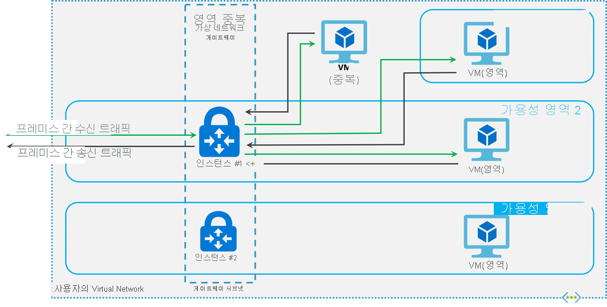

# ExpressRoute 가상 네트워크 게이트웨이 및 FastPath
Azure virtual network 및 ExpressRoute 통해 온-프레미스 네트워크에 연결 하려면 가상 네트워크 게이트웨이 먼저 만들어야 합니다. 가상 네트워크 게이트웨이 두 가지 용도로 사용 됩니다: 네트워크 간의 네트워크 트래픽 라우팅 exchange IP 경로입니다. 이 문서에서는 게이트웨이 형식과 게이트웨이 Sku SKU에서 예상 되는 성능을 설명 합니다. 이 문서에서는 ExpressRoute 설명 [FastPath](#fastpath), 성능 향상을 위해 가상 네트워크 게이트웨이 사용 하지 않으려면 온-프레미스 네트워크에서 네트워크 트래픽을 사용 하도록 설정 하는 기능입니다.

[!INCLUDE [updated-for-az](../../includes/updated-for-az.md)]

## 게이트웨이 유형

가상 네트워크 게이트웨이를 만들 때 몇 가지 설정을 지정해야 합니다. 필수 설정 중 하나인 '-GatewayType'은 게이트웨이를 ExpressRoute에 사용할 것인지 아니면 VPN 트래픽에 사용할 것인지 지정합니다. 두 가지 게이트웨이 유형은 다음과 같습니다.

* **Vpn** - 공용 인터넷을 통해 암호화된 트래픽을 전송하려면 'Vpn' 유형의 게이트웨이를 사용합니다. 이를 VPN 게이트웨이라고도 합니다. 사이트 간, 지점 및 사이트 간, VNet 간 연결은 모두 VPN Gateway를 사용합니다.

* **ExpressRoute** - 개인 연결을 통해 네트워크 트래픽을 전송하려면 'ExpressRoute' 유형의 게이트웨이를 사용합니다. 이를 ExpressRoute 게이트웨이라고도 하며 ExpressRoute를 구성할 때 사용되는 게이트웨이 유형입니다.

각각의 가상 네트워크에는 게이트웨이 유형당 하나의 가상 네트워크 게이트웨이가 있을 수 있습니다. 예를 들어 -GatewayType Vpn을 사용하는 하나의 가상 네트워크 게이트웨이와 -GatewayType ExpressRoute를 사용하는 하나의 가상 네트워크 게이트웨이가 있을 수 있습니다.

## 게이트웨이 SKU
[!INCLUDE [expressroute-gwsku-include](../../includes/expressroute-gwsku-include.md)]

더 강력한 게이트웨이 SKU로 게이트웨이 업그레이드 하려는 경우 대부분의 경우에서 ' 크기 조정-AzVirtualNetworkGateway' PowerShell cmdlet을 사용할 수 있습니다. 표준 및 고성능 SKU로 업그레이드하는 경우에 가능합니다. 하지만 초고성능 SKU로 업그레이드하려면 게이트웨이를 다시 만들어야 합니다. 게이트웨이를 다시 만들면 가동 중지 시간이 발생합니다.

### 게이트웨이 SKU에서 예상된 성능
다음 표에서는 게이트웨이 형식과 예상된 성능을 보여줍니다. 이 표는 리소스 관리자 배포 모델과 클래식 배포 모델 모두에 적용됩니다.

[!INCLUDE [expressroute-table-aggthroughput](../../includes/expressroute-table-aggtput-include.md)]

> [!IMPORTANT]
> 애플리케이션 성능은 엔드투엔드 대기 시간 및 애플리케이션을 여는 트래픽 흐름 수와 같은 여러 요인에 따라 달라집니다. 테이블의 숫자는 이상적인 환경에서 애플리케이션이 이론상 수행할 수 있는 상한값을 나타냅니다.
>
>

### 영역 중복 게이트웨이 SKU

Azure Availability Zones에 ExpressRoute 게이트웨이를 배포할 수도 있습니다. 이렇게 하면 게이트웨이가 여러 가용성 영역에 물리적으로 그리고 논리적으로 분리되므로 Azure로의 온-프레미스 네트워크 연결을 영역 수준 장애로부터 보호할 수 있습니다.

영역 중복 게이트웨이는 ExpressRoute 게이트웨이에 특정 새 게이트웨이 SKU를 사용합니다.

* ErGw1AZ
* ErGw2AZ
* ErGw3AZ

새 게이트웨이 SKU는 사용자의 요구 사항에 가장 적합한 다른 배포 옵션도 지원합니다. 새 게이트웨이 SKU를 사용하여 가상 네트워크 게이트웨이를 만들 때 특정 영역에 게이트웨이를 배포하는 옵션도 제공됩니다. 이를 영역 게이트웨이라고 합니다. 영역 게이트웨이를 배포하면 게이트웨이의 모든 인스턴스가 동일한 가용성 영역에 배포됩니다.

## FastPath
ExpressRoute 가상 네트워크 게이트웨이 네트워크 라우팅을 교환 하 고 네트워크 트래픽을 전송 하도록 설계 되었습니다. FastPath는 온-프레미스 네트워크와 가상 네트워크 간에 데이터 경로 성능 향상을 위해 설계 되었습니다. 사용 하도록 설정 하면 FastPath 네트워크 트래픽을 보내는 가상 네트워크에서 가상 컴퓨터에 직접 게이트웨이 무시 합니다. 

FastPath는 사용할 수 있습니다 [ExpressRoute 직접](expressroute-erdirect-about.md) 만 합니다. 경우에만이 기능을 설정할 수 있습니다. 즉, 있습니다 [가상 네트워크 연결](expressroute-howto-linkvnet-arm.md) ExpressRoute 직접 포트에서 만든 ExpressRoute 회로에 있습니다. FastPath 가상 네트워크와 온-프레미스 네트워크 간의 경로 교환 하기 위해 가상 네트워크 게이트웨이 여전히 필요 합니다. Ultra Performance 또는 ErGw3AZ 가상 네트워크 게이트웨이 여야 합니다.

FastPath는 다음과 같은 기능을 지원 하지 않습니다.
* 게이트웨이 서브넷에서 UDR: 온-프레미스 네트워크에서 네트워크 트래픽을 가상 네트워크 게이트웨이 전송할 수 있도록 계속 합니다. 가상 네트워크의 게이트웨이 서브넷에 UDR을 적용 하는 경우.
* VNet 피어 링: 있는 경우 다른 가상 네트워크가 피어 링 된 가상 네트워크를 전송할 수 있도록 다른 가상 네트워크 (즉, 소위 "스포크" Vnet)에 온-프레미스 네트워크에서 네트워크 트래픽을 계속 ExpressRoute에 연결 된 게이트웨이입니다. 이를 해결 하려면 모든 가상 네트워크를 ExpressRoute 회로 직접 연결 합니다.

## REST API 및 PowerShell cmdlet
가상 네트워크 게이트웨이 구성을 위해 REST API와 PowerShell cmdlet을 사용할 경우 추가 기술 리소스 및 특정 구문 요구 사항에 대해서는 다음 페이지를 참조하세요.

| **클래식** | **리소스 관리자** |
| --- | --- |
| [PowerShell](https://docs.microsoft.com/powershell/module/servicemanagement/azure/?view=azuresmps-4.0.0#azure) |[PowerShell](https://docs.microsoft.com/powershell/module/az.network#networking) |
| [REST API](https://msdn.microsoft.com/library/jj154113.aspx) |[REST API](https://msdn.microsoft.com/library/mt163859.aspx) |

## 다음 단계
사용 가능한 연결 구성에 대한 자세한 내용은 [ExpressRoute 개요](expressroute-introduction.md) 를 참조하세요.

ExpressRoute 게이트웨이 생성에 대한 자세한 내용은 [ExpressRoute에 대해 가상 네트워크 게이트웨이 만들기](expressroute-howto-add-gateway-resource-manager.md)를 참조하세요.

영역 중복 게이트웨이 구성에 대한 자세한 내용은 [영역 중복 가상 네트워크 게이트웨이 만들기](../../articles/vpn-gateway/create-zone-redundant-vnet-gateway.md)를 참조하세요.

참조 [ExpressRoute 가상 네트워크 링크](expressroute-howto-linkvnet-arm.md) FastPath를 사용 하도록 설정 하는 방법에 대 한 자세한 내용은 합니다. 
