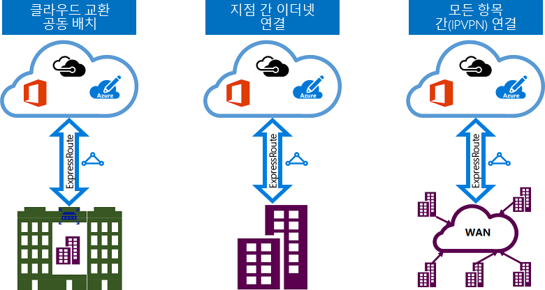

# ExpressRoute 연결 모델
온-프레미스 네트워크와 Microsoft 클라우드 간 연결은 [CloudExchange 공동 배치](#CloudExchange), [지점 간 이더넷 연결](#Ethernet) 및 [임의(IPVPN) 연결](#IPVPN)이라는 세 가지 방법으로 만들 수 있습니다. 연결 공급자는 하나 이상의 연결 모델을 제공할 수 있습니다. 연결 공급자로 작업하여 사용자에게 적합한 다양한 모델을 선택할 수 있습니다.
  

## 클라우드 Exchange에 배치
클라우드 Exchange를 사용하여 설비에 공존하는 경우 공동 배치 공급자의 이더넷 Exchange를 통해 Microsoft 클라우드로 가상 간 연결을 나열할 수 있습니다. 공동 배치 공급자는 공동 시설의 인프라와 Microsoft 클라우드 간에 2계층 간 연결 또는 관리된 3계층 간 연결을 제공할 수 있습니다.

## 지점 간 이더넷 연결
지점 간 이더넷 연결을 통해 온-프레미스 데이터 센터/사무소를 Microsoft 클라우드에 연결할 수 있습니다. 지점 간 이더넷 공급자는 사이트와 Microsoft 클라우드 간에 2계층 연결 또는 관리된 3계층 연결을 제공합니다.

## 임의(IPVPN)의 네트워크
Microsoft 클라우드로 WAN을 통합할 수 있습니다. IPVPN 공급자(일반적으로 MPLS VPN)는 지사 및 데이터 센터 간에 임의의 연결을 제공합니다. Microsoft 클라우드는 다른 지사와 마찬가지로 보이도록 WAN에 상호 연결될 수 있습니다. WAN 공급자는 일반적으로 관리된 3계층 연결을 제공합니다. Express 경로 기능 및 특징은 위의 모든 연결 모델에 걸쳐 동일합니다. 

## 다음 단계
* Express 경로 연결 및 라우팅 도메인에 대해 알아봅니다. [Express 경로 회로 및 라우팅 도메인](expressroute-circuit-peerings.md)을 참조하세요.
* ExpressRoute 기능에 대해 알아봅니다. [ExpressRoute 기술 개요](expressroute-introduction.md) 참조
* 서비스 공급자를 찾습니다. [Express 경로 파트너 및 피어링 위치](expressroute-locations.md)를 확인하세요.
* 모든 필수 조건이 충족되었는지 확인합니다. [Express 경로 필수 조건](expressroute-prerequisites.md)을 참조하세요.
* [라우팅](expressroute-routing.md), [NAT](expressroute-nat.md) 및 [QoS](expressroute-qos.md)에 대한 요구 사항을 참조하세요.
* Express 경로 연결을 구성합니다.
  * [ExpressRoute 회로 만들기](expressroute-howto-circuit-portal-resource-manager.md)
  * [라우팅 구성](expressroute-howto-routing-portal-resource-manager.md)
  * [VNet을 ExpressRoute 회로에 연결](expressroute-howto-linkvnet-portal-resource-manager.md)