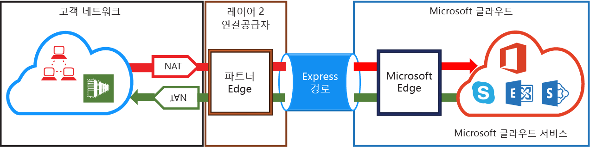
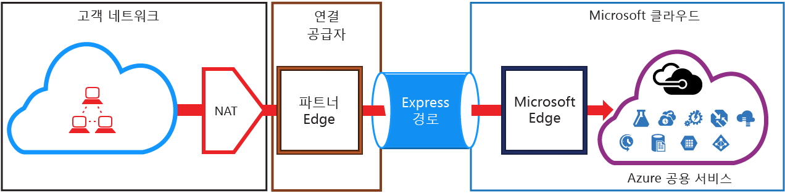

# ExpressRoute NAT 요구 사항
ExpressRoute를 사용하여 Microsoft 클라우드 서비스에 연결하려면 NAT을 설치하고 관리해야 합니다. 일부 연결 공급자는 NAT을 관리 서비스로 설치하고 관리해 줍니다. 연결 공급자를 확인하여 그런 서비스를 제공하는지를 확인합니다. 그렇지 않은 경우 아래에 설명한 요구 사항을 준수해야 합니다. 

[ExpressRoute 회로 라우팅 도메인](expressroute-circuit-peerings.md) 페이지를 검토하여 다양한 라우팅 도메인의 개요를 가져옵니다. 공용 Azure 및 Microsoft 피어링에 대한 공용 IP 주소 요구 사항을 충족하려면 네트워크와 Microsoft 간에 NAT를 설치하는 것이 좋습니다. 이 섹션에서는 설치해야 하는 NAT 인프라에 대한 자세한 설명을 제공합니다.

## Microsoft 피어링에 대한 NAT 요구 사항
Microsoft 피어링 경로를 사용하면 Azure 공용 피어링 경로를 통해 지원하지 않는 Microsoft 클라우드 서비스에 연결할 수 있습니다. 서비스 목록에는 Exchange Online, SharePoint Online, 비즈니스용 Skype 및 Dynamics 365와 같은 Office 365 서비스가 포함됩니다. Microsoft는 Microsoft 피어링에 양방향 연결을 지원할 예정입니다. Microsoft 클라우드 서비스에 보내는 트래픽은 Microsoft 네트워크를 입력하기 전에 유효한 공용 IPv4 주소에 SNAT되어야 합니다. Microsoft 클라우드 서비스에서 네트워크에 보내는 트래픽은 [비대칭 라우팅](expressroute-asymmetric-routing.md)을 방지하기 위해 인터넷 에지에서 SNAT되어야 합니다. 아래 그림은 Microsoft 피어링에 어떻게 NAT을 설치할지에 대한 개략적인 그림을 제공합니다.

 

### Microsoft에 보내는 네트워크에서 생성된 트래픽
* 트래픽이 유효한 공용 IPv4 주소로 Microsoft 피어링 경로를 입력하고 있는지 확인해야 합니다. Microsoft는 지역별 라우팅 인터넷 레지스트리(RIR) 또는 인터넷 라우팅 레지스트리(IRR)에 대한 IPv4 NAT 주소 풀에 관해 소유자의 유효성을 검사할 수 있어야 합니다. 확인은 피어링된 AS 번호 및 NAT.에 사용된 IP 주소에 기반하여 수행됩니다. 라우팅 레지스트리에 대한 정보는 [ExpressRoute 라우팅 요구 사항](expressroute-routing.md) 을 참조합니다.
* Azure 공용 피어링 설치 및 기타 ExpressRoute 회로에 사용되는 IP 주소는 BGP 세션을 통해 Microsoft에 보급하지 말아야 합니다. 피어링을 통해 보급된 NAT IP 접두사의 길이에 대한 제한은 없습니다.
  
  > [!IMPORTANT]
  > Microsoft에 보급된 NAT IP 풀은 인터넷에 보급되지 않아야 합니다. 다른 Microsoft 서비스에 대한 연결을 중단합니다.
  > 
  > 

### 네트워크에 보내는 Microsoft에서 생성된 트래픽
* 특정 시나리오는 네트워크 내에서 호스팅되는 서비스 엔드포인트에 대한 연결을 시작하기 위해 Microsoft이 필요합니다. 시나리오의 일반적인 예는 Office 365에서 네트워크에 호스팅된 ADFS 서버에 대한 연결입니다. 이러한 경우 네트워크에서 Microsoft 피어링에 적절한 접두사를 유출해야 합니다. 
* [비대칭 라우팅](expressroute-asymmetric-routing.md)을 방지할 수 있도록 네트워크 내부의 서비스 엔드포인트에 대한 인터넷 에지에서 Microsoft 트래픽을 SNAT해야 합니다. 대상 IP가 ExpressRoute를 통해 받은 경로와 일치하는 요청 **및 회신**은 항상 ExpressRoute를 통해 전송됩니다. 요청은 인터넷을 통해 수신되고 회신은 ExpressRoute를 통해 전송되는 경우 비대칭 라우팅이 있는 것입니다. 인터넷 에지에서 들어오는 Microsoft 트래픽을 SNAT하면 회신 트래픽이 강제로 인터넷 에지로 돌아가기 때문에 문제가 해결됩니다.

## Azure 공용 피어링에 대한 NAT 요구 사항

> [!NOTE]
> Azure 공용 피어링은 새 회로에 사용할 수 없습니다.
> 

Azure 공용 피어링 경로를 사용하면 해당 공용 IP 주소에 걸쳐 Azure에서 호스팅되는 모든 서비스에 연결할 수 있습니다. [Expess 경로 FAQ](expressroute-faqs.md) 에 나열된 서비스와 Microsoft Azure에서 ISV가 호스팅하는 서비스를 포함합니다. 

> [!IMPORTANT]
> 공용 피어링의 Microsoft Azure 서비스에 대한 연결은 항상 네트워크에서 Microsoft 네트워크로 시작됩니다. 따라서 Microsoft Azure 서비스에서 ExpressRoute의 네트워크로 세션을 초기화할 수 없습니다. 초기화를 시도하는 경우 이러한 보급된 IP에 전송된 패킷은 ExpressRoute 대신 인터넷을 사용합니다.
> 

공용 피어링에 대한 Microsoft Azure에 보내는 트래픽은 Microsoft 네트워크를 입력하기 전에 유효한 공용 IPv4 주소에 SNAT되어야 합니다. 아래 그림은 위의 요구 사항을 충족하도록 어떻게 NAT을 설치할지에 대한 높은 수준의 그림을 제공합니다.

 

### NAT IP 풀 및 경로 광고
트래픽이 유효한 공용 IPv4 주소로 Azure 공용 피어링 경로를 입력하고 있는지 확인해야 합니다. Microsoft는 지역별 라우팅 인터넷 레지스트리(RIR) 또는 인터넷 라우팅 레지스트리(IRR)에 대한 IPv4 NAT 주소 풀에 관해 소유권의 유효성을 검사할 수 있어야 합니다. 확인은 피어링된 AS 번호 및 NAT.에 사용된 IP 주소에 기반하여 수행됩니다. 라우팅 레지스트리에 대한 정보는 [ExpressRoute 라우팅 요구 사항](expressroute-routing.md) 을 참조합니다.

피어링을 통해 보급된 NAT IP 접두사의 길이에 대한 제한은 없습니다. NAT 풀을 모니터링하고 NAT 세션이 부족하지 않은지를 확인해야 합니다.

> [!IMPORTANT]
> Microsoft에 보급된 NAT IP 풀은 인터넷에 보급되지 않아야 합니다. 다른 Microsoft 서비스에 대한 연결을 중단합니다.
> 
> 

## 다음 단계
* [라우팅](expressroute-routing.md) 및 [QoS](expressroute-qos.md)에 대한 요구 사항을 참조합니다.
* 워크플로 정보는 [ExpressRoute 회로 프로비전 워크플로 및 회로 상태](expressroute-workflows.md)를 참조하세요.
* ExpressRoute 연결을 구성합니다.
  
  * [ExpressRoute 회로 만들기](expressroute-howto-circuit-portal-resource-manager.md)
  * [라우팅 구성](expressroute-howto-routing-portal-resource-manager.md)
  * [VNet을 ExpressRoute 회로에 연결](expressroute-howto-linkvnet-portal-resource-manager.md)

