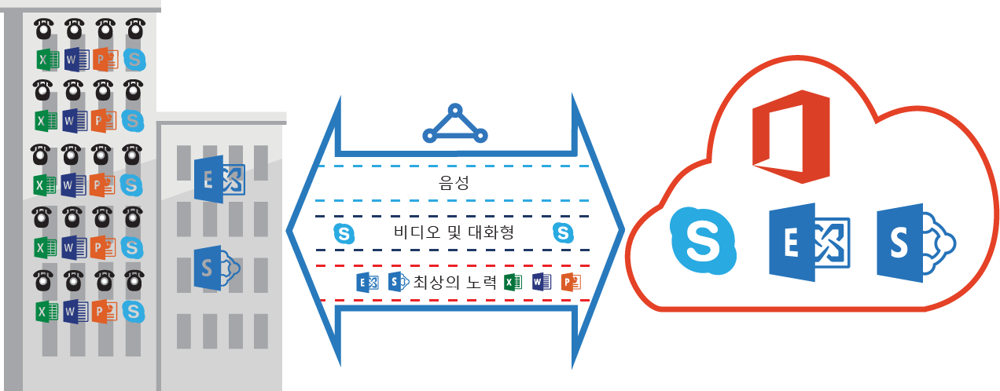

# ExpressRoute QoS 요구 사항
비즈니스용 Skype에는 차별화된 QoS 처리를 필요로 하는 다양한 워크로드가 있습니다. ExpressRoute를 통해 음성 서비스를 사용하려면 아래에 설명한 요구 사항을 준수해야 합니다.

> [!NOTE]
> QoS 요구 사항은 Microsoft 피어링에만 적용합니다. Azure 공용 피어링 및 Azure 프라이빗 피어링에서 수신하는 네트워크 트래픽의 DSCP 값은 0으로 다시 설정됩니다. 
> 
> 

다음 표에서 Microsoft Teams 및 Skype for Business에 사용한 DSCP 표시의 목록을 제공 합니다. 자세한 내용은 [비즈니스용 Skype에 대한 QoS 관리](https://docs.microsoft.com/SkypeForBusiness/manage/network-management/qos/managing-quality-of-service-QoS) 를 참조합니다.

| **트래픽 클래스** | **처리(DSCP 표시)** | **Microsoft Teams 및 비즈니스 워크 로드에 대 한 Skype** |
| --- | --- | --- |
| **음성** |EF (46) |Skype/Lync 음성 |
| **대화형** |AF41 (34) |비디오, VBSS |
| |AF21 (18) |앱 공유 | 
| **기본값** |AF11 (10) |파일 전송 |
| |CS0 (0) |다른 항목 |

* 워크로드를 분류하고 올바른 DSCP 값을 표시해야 합니다. 네트워크에서 DSCP 표시를 설정하는 방법은 [여기](https://docs.microsoft.com/SkypeForBusiness/manage/network-management/qos/configuring-port-ranges-for-your-skype-clients#configure-quality-of-service-policies-for-clients-running-on-windows-10) 에 제공된 가이드를 따릅니다.
* 네트워크 내에서 여러 QoS 큐를 구성하고 지원해야 합니다. 음성은 독립 실행형 클래스이고 [RFC 3246](https://www.ietf.org/rfc/rfc3246.txt)에 지정된 EF 처리를 받아야 합니다. 
* 큐 메커니즘, 정체 감지 정책 및 트래픽 클래스 당 대역폭 할당을 결정할 수 있습니다. 하지만 비즈니스 워크로드용 Skype에 대한 DSCP 표시를 유지해야 합니다. AF31 (26)와 같이 위에 나열되지 않은 DSCP 표시를 사용하면 패킷을 Microsoft에 보내기 전에 이 DSCP 값을 0으로 다시 작성해야 합니다. Microsoft는 위의 테이블에 나와 있는 DSCP 값으로 표시되는 패킷을 보냅니다. 

## 다음 단계
* [라우팅](expressroute-routing.md) 및 [NAT](expressroute-nat.md)에 대한 요구 사항을 참조합니다.
* ExpressRoute 연결을 구성하려면 다음 링크를 참조하세요.
  
  * [ExpressRoute 회로 만들기](expressroute-howto-circuit-classic.md)
  * [라우팅 구성](expressroute-howto-routing-classic.md)
  * [VNet을 ExpressRoute 회로에 연결](expressroute-howto-linkvnet-classic.md)

