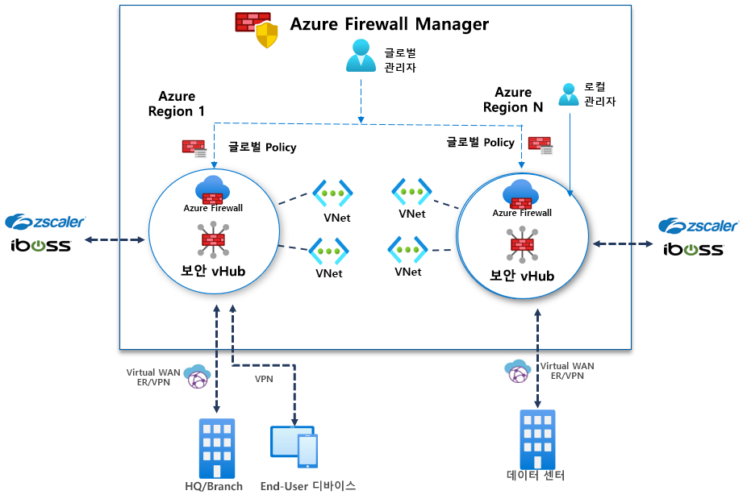

# Azure Firewall Manager Preview란?

[!INCLUDE [Preview](../../includes/firewall-manager-preview-notice.md)]

Azure Firewall Manager Preview는 클라우드 기반 보안 경계에 대한 중앙 보안 정책 및 경로 관리를 제공하는 보안 관리 서비스입니다. 이 서비스는 허브 및 스포크 아키텍처를 쉽게 만들 수 있도록 하는 Microsoft 관리 리소스인 [Azure Virtual WAN 허브](../virtual-wan/virtual-wan-about.md#resources)에서 작동합니다. 보안 및 라우팅 정책이 이러한 허브와 연결된 경우에는 *[보안 가상 허브](secured-virtual-hub.md)* 라고도 합니다. 

## Azure Firewall Manager Preview 기능

Azure Firewall Manager Preview는 다음과 같은 기능을 제공합니다.

### 중앙 Azure Firewall 배포 및 구성

여러 다른 Azure 지역 및 구독에 걸쳐 있는 여러 Azure Firewall 인스턴스를 중앙에서 배포하고 구성할 수 있습니다. 

### 계층 구조 정책(글로벌 및 로컬)

Azure Firewall Manager Preview를 사용하여 여러 보안 가상 허브에서 Azure Firewall 정책을 중앙에서 관리할 수 있습니다. 중앙의 IT 팀은 글로벌 방화벽 정책을 작성하여 팀 간에 조직 전체 방화벽 정책을 적용할 수 있습니다. 로컬로 작성된 방화벽 정책을 사용하면 DevOps 셀프 서비스 모델을 사용하여 민첩성을 강화할 수 있습니다.

### 고급 보안을 위해 타사 Security-as-a-Service와 통합

Azure Firewall 외에도 타사의 SECaaS(Security as a Service) 공급자를 통합하여 VNet 및 분기 인터넷 연결에 대한 추가 네트워크 보호를 제공할 수 있습니다.

- V2I(VNet과 인터넷 간) 트래픽 필터링

   - 선호하는 타사 보안 공급자를 사용하여 아웃바운드 가상 네트워크 트래픽을 필터링합니다.
   - Azure에서 실행되는 클라우드 워크로드에 고급 사용자 인식 인터넷 보호를 활용합니다.

- B2I(분기와 인터넷 간) 트래픽 필터링

   Azure 연결 및 글로벌 배포를 활용하여 분기와 인터넷 간 시나리오에 대해 타사 필터링을 쉽게 추가할 수 있습니다.

신뢰할 수 있는 보안 공급자에 대한 자세한 내용은 [Azure Firewall Manager 신뢰할 수 있는 보안 파트너(미리 보기)란?](trusted-security-partners.md)을 참조하세요.

### 중앙 경로 관리

스포크 가상 네트워크에서 UDR(사용자 정의 경로)을 수동으로 설정하지 않고도 필터링 및 로깅을 위해 보안 허브로 트래픽을 쉽게 라우팅할 수 있습니다. B2I(분기와 인터넷 간) 트래픽 필터링을 위한 타사 공급자를 B2V(분기와 VNet 간), V2V(VNet 간) 및 V2I(VNet과 인터넷 간)를 위한 Azure Firewall과 함께 사용할 수 있습니다. B2V 또는 V2V에 Azure Firewall이 필요하지 않은 경우, V2I 트래픽 필터링을 위해 타사 공급자를 사용할 수도 있습니다. 

## 지역 가용성

퍼블릭 미리 보기는 다음 지역에서 지원됩니다.

- 영국 서부, 영국 남부, 북유럽, 서유럽, 프랑스 중부, 프랑스 남부
- 오스트레일리아 동부, 오스트레일리아 중부, 오스트레일리아 중부 2, 오스트레일리아 남동부
- 캐나다 중부
- 미국 동부, 미국 서부, 미국 동부 2, 미국 중남부, 미국 서부 2, 미국 중부, 미국 중북부, 미국 중서부

Azure Firewall 정책은 이러한 지역에서만 만들 수 있지만 다른 지역에서 사용할 수 있습니다. 예를 들어, 미국 서부에서 만든 정책을 미국 동부에서 사용할 수 있습니다. 

## 알려진 문제

Azure Firewall Manager Preview에는 다음과 같이 알려진 문제가 있습니다.

|문제  |설명  |해결 방법  |
|---------|---------|---------|
|수동으로 만든 중앙 VNet이 지원되지 않음|현재 Azure Firewall Manager는 가상 서버를 사용하여 만든 네트워크를 지원합니다. 수동으로 만든 직접 만든 허브 VNet은 아직 지원되지 않습니다.|지금은 Virtual Hubs를 사용하여 만든 허브 및 스포크 네트워크에서 Azure Firewall Manager를 사용합니다. 현재 조사 중입니다.
|타사 필터링 제한 사항|타사 공급자를 사용한 V2I 트래픽 필터링은 Azure Firewall B2V 및 V2V에서 지원되지 않습니다.|현재 조사 중입니다.|
|트래픽 분할은 현재 지원되지 않습니다.|Office 365 및 Azure 퍼블릭 PaaS 트래픽 분할은 현재 지원되지 않습니다. 따라서 V2I 또는 B2I에 대해 타사 공급자를 선택하면 모든 Azure 퍼블릭 PaaS 및 Office 365 트래픽도 파트너 서비스를 통해 전송됩니다.|허브의 트래픽 분할을 현재 조사 중입니다.
|지역별로 허브 1개|지역별로 허브를 둘 이상 사용할 수 없습니다.|한 지역에 여러 가상 WAN을 만듭니다.|
|기본 정책은 로컬 정책과 동일한 지역에 있어야 합니다.|기본 정책과 동일한 지역에 모든 로컬 정책을 만듭니다. 보안 허브의 한 지역에 생성된 정책을 다른 지역에서 계속 적용할 수 있습니다.|현재 조사 중입니다.|
|보안 Virtual Hub에서 허브 간 통신이 작동하지 않음|보안 Virtual Hub 간 통신은 아직 지원되지 않습니다.|현재 조사 중입니다.|

## 다음 단계

- [Azure Firewall Manager Preview 배포 개요](deployment-overview.md) 검토
- [보안 가상 허브](secured-virtual-hub.md)에 대해 알아보기