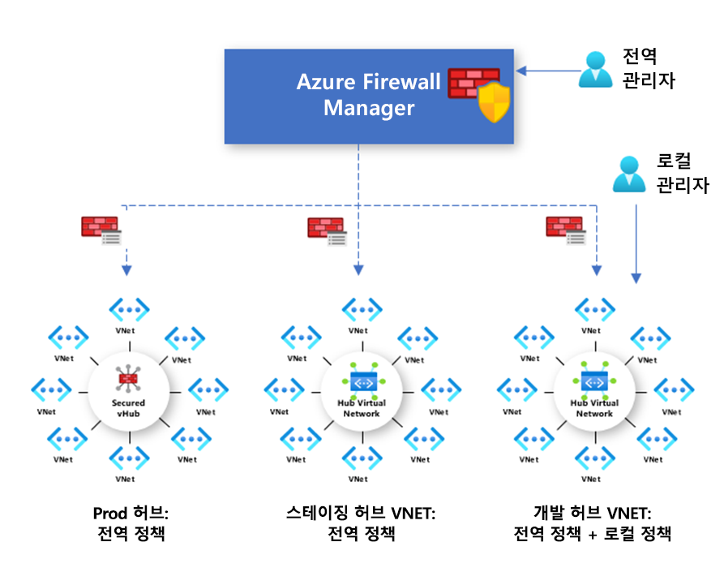

# Azure Firewall Manager 미리 보기 정책 개요

[!INCLUDE [Preview](../../includes/firewall-manager-preview-notice.md)]

방화벽 정책은 NAT, 네트워크 및 애플리케이션 규칙 컬렉션과 위협 인텔리전스 설정을 포함하는 Azure 리소스입니다. 보안 가상 허브 및 Hub Virtual Networks의 여러 Azure Firewall 인스턴스에서 사용할 수 있는 글로벌 리소스입니다. 정책은 여러 지역 및 구독에서 작동합니다.

## 정책 만들기 및 연결

정책은 Azure Portal, REST API, 템플릿, Azure PowerShell 및 CLI를 포함한 여러 가지 방법으로 만들고 관리할 수 있습니다.

포털 또는 Azure PowerShell을 사용하여 Azure Firewall에서 기존 규칙을 마이그레이션하여 정책을 만들 수도 있습니다. 자세한 내용은 [Azure Firewall 구성을 Azure Firewall 정책(미리 보기)으로 마이그레이션하는 방법](migrate-to-policy.md)을 참조하세요. 

정책은 하나 이상의 가상 허브 또는 VNet과 연결할 수 있습니다. 방화벽은 계정과 연결된 모든 구독 및 모든 지역에 있을 수 있습니다.

## 계층 구조 정책

새 정책은 처음부터 새로 만들거나 기존 정책에서 상속할 수 있습니다. DevOps는 상속을 사용하여 조직에서 규정한 기본 정책에 따라 로컬 방화벽 정책을 만들 수 있습니다.

비어 있지 않은 부모 정책을 사용하여 만든 정책은 부모 정책의 모든 규칙 컬렉션을 상속합니다. 부모 정책에서 상속된 네트워크 규칙 컬렉션에는 항상 새 정책의 일부로 정의된 네트워크 규칙 컬렉션보다 높은 우선 순위가 지정됩니다. 애플리케이션 규칙 컬렉션에도 동일한 논리가 적용됩니다. 그러나 네트워크 규칙 컬렉션은 상속과 관계없이 항상 애플리케이션 규칙 컬렉션보다 먼저 처리됩니다.

위협 인텔리전스 모드도 부모 정책에서 상속됩니다. 이 동작을 재정의하기 위해 위협 인텔리전스 모드를 다른 값으로 설정할 수 있지만 해제할 수는 없습니다. 더 엄격한 값으로만 재정의할 수 있습니다. 예를 들어 부모 정책이 **경고만**으로 설정된 경우 이 로컬 정책을 **경고 및 거부**로 구성할 수 있습니다.

NAT 규칙 컬렉션은 지정된 방화벽에 따라 다르므로 상속되지 않습니다.

상속을 사용하면 부모 정책에 대한 변경 내용이 연결된 방화벽 자식 정책에 자동으로 적용됩니다.

## 기존 규칙 및 정책

Azure Firewall은 기존 규칙과 정책을 모두 지원합니다. 다음 표에서는 정책과 규칙을 비교합니다.

|         |정책  |규칙  |
|---------|---------|---------|
|포함     |NAT, 네트워크, 애플리케이션 규칙 및 위협 인텔리전스 설정|NAT, 네트워크 및 애플리케이션 규칙 |
|보호     |가상 허브 및 Virtual Network|Virtual Network만|
|포털 환경     |Firewall Manager를 사용한 중앙 관리|독립 실행형 방화벽 환경|
|여러 방화벽 지원     |방화벽 정책(여러 방화벽에서 사용할 수 있는 별도의 리소스)|수동으로 규칙 내보내기/가져오기 또는 타사 관리 솔루션 사용 |
|가격 책정     |방화벽 연결 기반 청구, [가격 책정](#pricing) 참조|무료|
|지원되는 배포 메커니즘     |포털, REST API, 템플릿, Azure PowerShell 및 CLI|포털, REST API, 템플릿, PowerShell 및 CLI |
|릴리스 상태     |공개 미리 보기|일반 공급|

## 가격 책정

정책에 대한 요금은 방화벽 연결을 기준으로 청구됩니다. 방화벽 연결이 없거나 하나인 정책은 무료입니다. 방화벽 연결이 여러 개인 정책은 고정 요율로 청구됩니다. 자세한 내용은 [Azure Firewall Manager 가격](https://azure.microsoft.com/pricing/details/firewall-manager/)을 참조하세요.

## 다음 단계

Azure Firewall을 배포하는 방법에 대한 자세한 내용은 [자습서: Azure Portal에서 Azure Firewall Manager 미리 보기를 사용하여 클라우드 네트워크 보호](secure-cloud-network.md)를 참조하세요.
