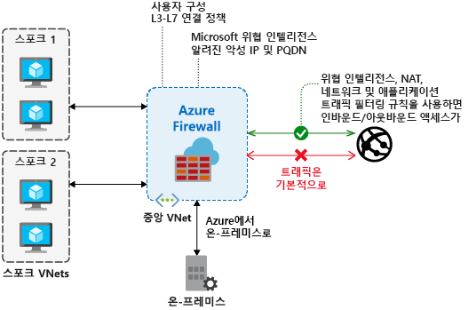

# Azure Firewall이란?

Azure Firewall은 Azure Virtual Network 리소스를 보호하는 관리되는 클라우드 기반 네트워크 보안 서비스입니다. 고가용성 및 무제한 클라우드 확장성이 내장되어 있는 서비스 형태의 완전한 상태 저장 방화벽입니다. 

구독 및 가상 네트워크 전반에 걸쳐 애플리케이션 및 네트워크 연결 정책을 중앙에서 만들고, 적용하고 기록할 수 있습니다. Azure Firewall은 가상 네트워크 리소스에 정적 공용 IP 주소를 사용하기 때문에 외부 방화벽이 사용자의 가상 네트워크에서 시작된 트래픽을 식별할 수 있습니다.  이 서비스는 로깅 및 분석을 위해 Azure Monitor와 완전히 통합됩니다.

## 기능

Azure Firewall에서는 다음과 같은 기능이 제공됩니다.

### 기본 제공되는 고가용성

고가용성이 내장되어 있어서 부하 분산 장치가 추가로 필요하지 않으며 아무것도 구성할 필요가 없습니다.

### 무제한 클라우드 확장성

Azure Firewall은 변화하는 트래픽 흐름을 수용하기 위해 필요한 만큼 확장이 가능하기 때문에 최대 트래픽에 대한 예산을 마련할 필요가 없습니다.

### 애플리케이션 FQDN 필터링 규칙

아웃바운드 HTTP/S 트래픽을 와일드 카드를 포함한 FQDN(정규화된 도메인 이름) 목록으로 제한할 수 있습니다. 이 기능에는 SSL 종료가 필요하지 않습니다.

### 네트워크 트래픽 필터링 규칙

원본 및 대상 IP 주소, 포트 및 프로토콜별로 네트워크 필터링 규칙을 중앙에서 만들거나 *허용*하거나 *거부*할 수 있습니다. Azure Firewall은 상태를 완전히 저장하기 때문에 다양한 유형의 연결에서 올바른 패킷을 구별할 수 있습니다. 여러 구독 및 가상 네트워크 전반에 규칙이 적용되고 기록됩니다.

### FQDN 태그

FQDN 태그를 활용하면 방화벽을 통해 잘 알려진 Azure 서비스 네트워크 트래픽을 쉽게 허용할 수 있습니다. 방화벽을 통해 Windows 업데이트 네트워크 트래픽을 허용하려는 경우를 예로 들어 보겠습니다. 이렇게 하려면 애플리케이션 규칙을 만들고 Windows 업데이트 태그를 포함합니다. 그러면 Windows 업데이트의 네트워크 트래픽이 방화벽을 통해 이동할 수 있습니다.

### 서비스 태그

서비스 태그는 보안 규칙 생성에 대한 복잡성을 최소화할 수 있는 IP 주소 접두사의 그룹을 나타냅니다. 고유한 서비스 태그를 직접 만들거나 태그 내에 포함된 IP 주소를 지정할 수 없습니다. Microsoft에서는 서비스 태그에서 압축한 주소 접두사를 관리하고 주소를 변경하는 대로 서비스 태그를 자동으로 업데이트합니다.

### 위협 인텔리전스

방화벽에서 알려진 악성 IP 주소 및 도메인과 주고받는 트래픽을 경고하고 거부할 수 있도록 하기 위해 위협 인텔리전스 기반 필터링을 사용하도록 설정할 수 있습니다. IP 주소 및 도메인은 Microsoft 위협 인텔리전스 피드에서 제공됩니다.

### 아웃바운드 SNAT 지원

모든 아웃바운드 가상 네트워크 트래픽 IP 주소는 Azure Firewall 공용 IP로 변환됩니다(원본 네트워크 주소 변환). 가상 네트워크에서 발생하는 트래픽을 식별하여 원격 인터넷 대상으로 허용할 수 있습니다.

### 인바운드 DNAT 지원

방화벽 공용 IP 주소로 전송되는 인바운드 네트워크 트래픽은 변환(Destination Network Address Translation)된 다음 가상 네트워크의 개인 IP 주소로 필터링됩니다. 

### Azure Monitor 로깅

모든 이벤트가 Azure Monitor와 통합되기 때문에 스토리지 계정에 로그를 보관하고 Event Hub에 이벤트를 스트리밍하거나 Azure Monitor 로그에 보낼 수 있습니다.

## 알려진 문제

Azure Firewall의 알려진 문제는 다음과 같습니다.

|문제  |설명  |해결 방법  |
|---------|---------|---------|
|ASC(Azure Security Center) JIT(Just-in-Time) 기능과의 충돌|JIT를 사용하여 가상 머신에 액세스하는 경우, Azure Firewall을 기본 게이트웨이로 가리키는 사용자 정의 경로가 포함된 서브넷에 가상 머신이 있으면 ASC JIT가 작동하지 않습니다. 들어오는 패킷은 가상 머신 공용 IP(JIT가 액세스를 여는)를 통하지만 반환 경로는 방화벽을 경유하는 비대칭 라우팅 때문에 발생합니다. 이렇게 하면 방화벽에 세션이 설정되어 있지 않기 때문에 패킷이 손실됩니다.|이 문제를 해결하려면 JIT 가상 머신을 방화벽에 대한 사용자 정의 경로가 없는 별도의 서브넷에 배치합니다.|
TCP/UDP 프로토콜이 아닌 프로토콜(예: ICMP)에 대한 네트워크 필터링 규칙은 인터넷 바운드 트래픽에 작동하지 않습니다.|TCP/UDP 프로토콜이 아닌 프로토콜에 대한 네트워크 필터링 규칙은 공용 IP 주소에 대한 SNAT에 작동하지 않습니다. TCP/UDP 프로토콜이 아닌 프로토콜은 스포크 서브넷과 VNet 간에 지원됩니다.|Azure Firewall은 표준 Load Balancer를 사용하기 때문에 [현재 IP 프로토콜을 위한 SNAT를 지원하지 않습니다](https://docs.microsoft.com/azure/load-balancer/load-balancer-standard-overview#limitations). 향후 릴리스에서 이 시나리오를 지원할 수 있는 옵션을 모색하고 있습니다.|
|ICMP에 대한 PowerShell 및 CLI 지원 누락|Azure PowerShell 및 CLI는 네트워크 규칙에 유효한 프로토콜로 ICMP를 지원하지 않습니다.|여전히 포털 및 REST API를 통해 ICMP를 프로토콜로 사용할 수 있습니다. 조만간 PowerShell 및 CLI에 ICMP를 추가하기 위한 작업이 진행 중입니다.|
|FQDN 태그는 프로토콜: 설정할 포트가 필요|FQDN 태그를 사용하는 애플리케이션 규칙은 포트: 프로토콜 정의가 필요합니다.|**https**를 포트: 프로토콜 값으로 사용할 수 있습니다. FQDN 태그를 사용할 때 이 필드 옵션이 작동하도록 하기 위한 작업이 진행 중입니다.|
|방화벽을 다른 리소스 그룹 또는 구독으로 이동하는 기능은 지원되지 않습니다.|방화벽을 다른 리소스 그룹 또는 구독으로 이동하는 기능은 지원되지 않습니다.|이 기능은 로드맵에 있습니다. 방화벽을 다른 리소스 그룹 또는 구독으로 이동하려면 현재 인스턴스를 삭제하고 새 리소스 그룹 또는 구독에서 다시 만들어야 합니다.|
|네트워크 및 애플리케이션 규칙의 포트 범위|높은 포트가 관리 및 상태 프로브용으로 예약되어 있으므로, 포트는 64,000으로 제한됩니다. |이 제한 사항을 완화하기 위해 노력하고 있습니다.|
|위협 인텔리전스 경고는 마스킹될 수 있습니다.|아웃바운드 필터링의 대상이 80/443인 네트워크 규칙은 위협 전용 모드로 구성되면 위협 인텔리전스 경고를 마스킹합니다.|애플리케이션 규칙을 사용하여 80/443에 대한 아웃바운드 필터링을 만듭니다. 또는 위협 인텔리전스 모드를 **경고 및 거부**로 변경합니다.|
|Azure Firewall에서 이름 확인에 Azure DNS만 사용|Azure Firewall은 Azure DNS만 사용해서 FQDN을 확인합니다. 사용자 지정 DNS 서버는 지원되지 않습니다. 다른 서브넷의 DNS 확인에는 영향을 주지 않습니다.|이 제한 사항을 완화하기 위해 노력하고 있습니다.
## 다음 단계

- [자습서: Azure Portal을 사용하여 Azure Firewall 배포 및 구성](tutorial-firewall-deploy-portal.md)
- [템플릿을 사용하여 Azure Firewall 배포](deploy-template.md)
- [Azure Firewall 테스트 환경 만들기](scripts/sample-create-firewall-test.md)