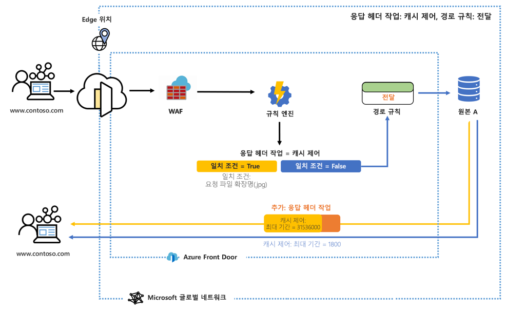
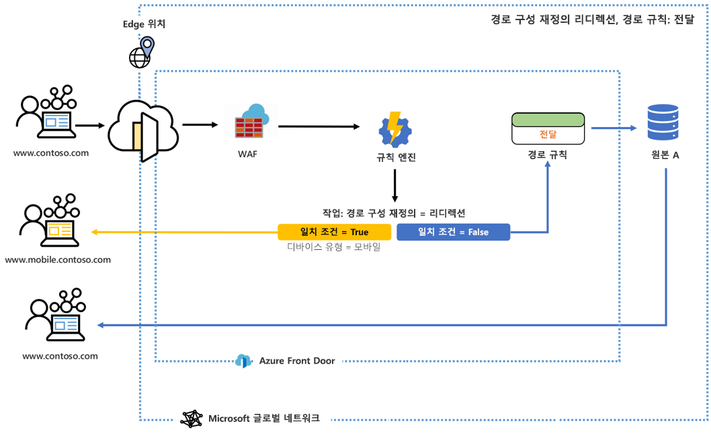

# Azure Front Door의 규칙 엔진은 무엇인가요? 

규칙 엔진을 사용하면 에지에서 HTTP 요청을 처리하는 방법을 사용자 지정하고 웹 애플리케이션의 작업을 보다 세밀하게 제어할 수 있습니다. Azure Front Door의 규칙 엔진은 다음을 포함한 여러 주요 기능으로 구성됩니다.

- 헤더 기반 라우팅 – 요청 헤더, 쿠키 및 쿼리 문자열 콘텐츠의 패턴을 기반으로 요청을 라우팅합니다.
- 매개 변수 기반 라우팅 – post 인수, 쿼리 문자열, 쿠키 및 요청 메서드를 포함한 일련의 일치 조건을 활용하여 HTTP 요청 매개 변수를 기반으로 요청을 라우팅합니다. 
- 경로 구성 재정의: 
    - 리디렉션 기능을 사용하여 301/302/307/308 리디렉션을 클라이언트에 반환하고 새 호스트 이름, 경로 및 프로토콜로 리디렉션합니다. 
    - 기존의 리디렉션을 수행하지 않고 전달 기능을 사용하여 요청 URL 경로를 다시 작성하고, 구성된 백 엔드 풀의 적절한 백 엔드에 요청을 전달합니다. 
    - 캐싱 구성을 사용자 지정하고 일치 조건에 따라 전달에서 캐싱으로 이어지는 경로를 동적으로 변경합니다. 

> [!IMPORTANT]
> 이 공개 미리 보기는 Service Level Agreement(서비스 수준 약정)없이 제공되므로 프로덕션 워크로드에 사용하지 말아야 합니다. 특정 기능은 지원되지 않을 수 있거나, 기능이 제한될 수 있거나 모든 Azure 위치에서 사용하지는 못할 수 있습니다. 자세한 내용은 [Microsoft Azure 미리 보기에 대한 보충 사용 약관](https://azure.microsoft.com/support/legal/preview-supplemental-terms/)을 참조하세요.
>

## Architecture 

규칙 엔진은 에지에서 요청을 처리합니다. 규칙 엔진 구성을 마치면 요청이 Front Door 엔드포인트에 도달할 때 WAF가 먼저 실행된 다음, 프런트 엔드/도메인에 연결된 규칙 엔진 구성이 실행됩니다. 규칙 엔진 구성이 실행되면 부모 회람 규칙이 이미 일치한다는 의미입니다. 규칙 엔진 구성 내의 각 규칙에 있는 모든 작업의 실행 여부는 해당 규칙 내 모든 일치 조건의 충족 여부에 따라 결정됩니다. 요청이 규칙 엔진 구성의 조건과 일치하지 않으면 기본 회람 규칙이 실행됩니다. 

예를 들어 아래 구성에서 규칙 엔진은 일치 조건이 충족되면 캐시 컨트롤의 최대 보존 기간을 변경하는 응답 헤더를 추가하도록 구성되었습니다. 

또 다른 예로 일치 조건인 디바이스 유형이 true이면 사용자를 사이트의 모바일 버전으로 보내도록 규칙 엔진이 구성되었습니다. 

두 예제에서 일치 조건이 하나도 충족되지 않으면 지정된 경로 규칙이 실행됩니다. 

## 용어 

AFD 규칙 엔진을 사용하여 각각 규칙 세트로 구성된 일련의 규칙 엔진 구성을 만들 수 있습니다. 다음은 규칙 엔진을 구성할 때 접하게 될 몇 가지 유용한 용어에 대한 설명입니다. 

- *규칙 엔진 구성*: 단일 경로 규칙에 적용되는 규칙 세트입니다. 각 구성은 규칙 5개로 제한됩니다. 10개까지 구성을 만들 수 있습니다. 
- *규칙 엔진 규칙*: 최대 10개의 일치 조건과 5개의 작업으로 구성된 규칙입니다.
- *일치 조건*: 들어오는 요청을 구문 분석하는 데 사용할 수 있는 수많은 일치 조건이 있습니다. 규칙 하나에 최대 10개의 일치 조건을 포함할 수 있습니다. 일치 조건은 **AND** 연산자를 사용하여 평가됩니다. 일치 조건의 전체 목록은 [여기](front-door-rules-engine-match-conditions.md)서 찾을 수 있습니다. 
- *작업*: 작업은 들어오는 요청의 처리 방법을 지시합니다. 현재 요청/응답 헤더 작업, 전달, 리디렉션 및 재작성을 모두 사용할 수 있습니다. 규칙 하나에 최대 5개의 작업을 포함할 수 있지만, 규칙 하나에 포함할 수 있는 경로 구성 재정의는 1개입니다.  작업 전체 목록은 [여기](front-door-rules-engine-actions.md)서 찾을 수 있습니다.

## 다음 단계

- 첫 번째 [규칙 엔진 구성](front-door-tutorial-rules-engine.md)을 설정하는 방법을 알아봅니다. 
- [Front Door를 만드는](quickstart-create-front-door.md) 방법을 알아봅니다.
- [Front Door의 작동 원리](front-door-routing-architecture.md)를 알아봅니다.
