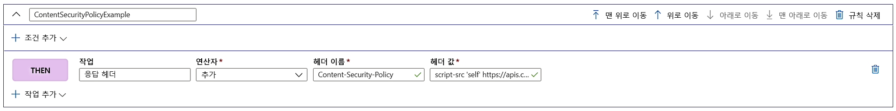

# 자습서: 규칙 엔진을 사용하여 보안 헤더 추가

이 자습서에서는 보안 헤더를 구현하여 HSTS(HTTP Strict-Transport-Security), X-XSS 보호, 콘텐츠 보안 정책 또는 X-Frame-Options와 같은 브라우저 기반 취약성을 방지하는 방법을 보여줍니다. 쿠키를 사용하여 보안 기반 특성을 정의할 수도 있습니다.

다음 예제에서는 규칙 엔진 구성이 연결된 경로에 정의된 경로와 일치하는 모든 들어오는 요청에 콘텐츠 보안 정책 헤더를 추가하는 방법을 보여 줍니다. 여기서는 신뢰할 수 있는 사이트, **https://apiphany.portal.azure-api.net** 의 스크립트만 허용하여 애플리케이션에서 실행합니다.

이 자습서에서는 다음 작업 방법을 알아봅니다.
> [!div class="checklist"]
> - 규칙 엔진 내에서 콘텐츠 보안 정책을 구성합니다.

## 사전 요구 사항

* 이 자습서의 단계를 완료하려면 먼저 Front Door를 만들어야 합니다. 자세한 내용은 [빠른 시작: Front Door 만들기](quickstart-create-front-door.md)를 참조하세요.
* 규칙 엔진 기능을 처음 사용하는 경우 [규칙 엔진 설정](front-door-tutorial-rules-engine.md) 방법을 참조하세요.

## Azure Portal에서 콘텐츠 보안 정책 헤더 추가

1. **추가**를 클릭하여 새 규칙을 추가합니다. 규칙 이름을 입력한 다음, **작업 추가** > **응답 헤더**를 클릭합니다.

1. 이 헤더를 이 경로에 들어오는 모든 요청에 대한 응답으로 추가하려면 연산자를 **추가**로 설정합니다.

1. 헤더 이름: **콘텐츠 보안 정책**을 추가하고 이 헤더에 허용되는 값을 정의합니다. 이 시나리오에서는 *"script-src 'self' https://apiphany.portal.azure-api.net."* 을 선택합니다.

1. 구성에 원하는 규칙을 모두 추가한 후에는 기본 경로로 이동하여 규칙 엔진 구성을 경로 규칙에 연결해야 합니다. 이 단계는 규칙이 작동하도록 설정하는 데 필요합니다. 

> [!NOTE]
> 이 시나리오에서는 [일치 조건](front-door-rules-engine-match-conditions.md)을 규칙에 추가하지 않았습니다. 경로 규칙에 정의된 경로와 일치하는 모든 들어오는 요청에는 이 규칙이 적용됩니다. 이러한 요청의 하위 집합에만 적용하려면 특정 **일치 조건**을 이 규칙에 추가해야 합니다.

## 리소스 정리

이전 단계에서 규칙 엔진을 사용하여 보안 헤더를 구성했습니다. 규칙을 더 이상 원하지 않는 경우 규칙 삭제를 클릭하여 제거할 수 있습니다.

:::image type="content" source="./media/front-door-rules-engine/rules-engine-delete-rule.png" alt-text="규칙 삭제":::

## 다음 단계

Front Door용 Web Application Firewall을 구성하는 방법을 알아보려면 다음 자습서를 계속 진행합니다.

> [!div class="nextstepaction"]
> [웹 애플리케이션 방화벽 및 Front Door](front-door-waf.md)
