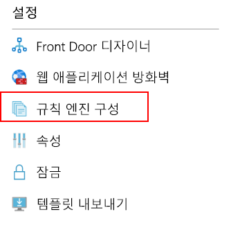
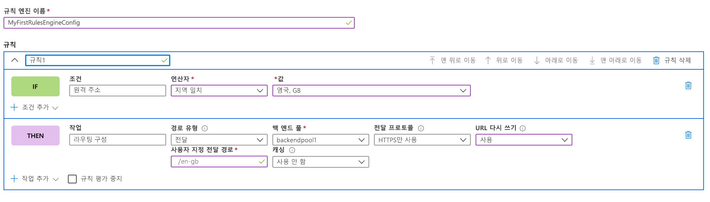
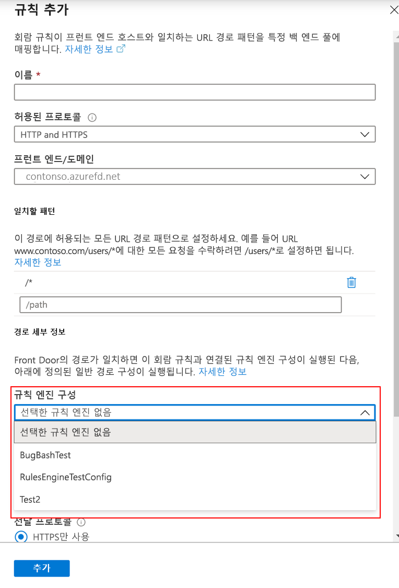

# <a name="configure-your-rules-engine"></a>규칙 엔진 구성 

> [!IMPORTANT]
> 이 공개 미리 보기는 Service Level Agreement(서비스 수준 약정)없이 제공되므로 프로덕션 워크로드에 사용하지 말아야 합니다. 특정 기능은 지원되지 않을 수 있거나, 기능이 제한될 수 있거나 모든 Azure 위치에서 사용하지는 못할 수 있습니다. 자세한 내용은 [Microsoft Azure 미리 보기에 대한 보충 사용 약관](https://azure.microsoft.com/support/legal/preview-supplemental-terms/)을 참조하세요.
>

## <a name="configure-rules-engine-in-azure-portal"></a>Azure Portal에서 규칙 엔진 구성 
1. 규칙 엔진 구성을 만들기 전에 [Front Door](quickstart-create-front-door.md)를 만듭니다.

2. Front Door 리소스 내에서 **설정**로 이동하여 **규칙 엔진 구성**을 선택합니다. **추가**를 클릭하고, 구성 이름을 지정하고, 첫 번째 규칙 엔진 구성 만들기를 시작합니다. 



3. **규칙 추가**를 클릭하여 첫 번째 규칙을 만듭니다. 그런 다음, **조건 추가** 또는 **작업 추가**를 클릭하여 규칙을 정의할 수 있습니다. 
    
    *참고:*
    - 규칙에서 조건 또는 작업을 삭제하려면 특정 조건 또는 작업의 오른쪽에 있는 휴지통을 사용합니다.
    - 들어오는 모든 트래픽에 적용되는 규칙을 만들려면 조건을 지정하지 마세요. 
    - 첫 번째 일치 조건이 충족될 때 규칙 평가를 중지하려면 **규칙 평가 중지**를 선택합니다. 



4. [위로 이동], [아래로 이동] 및 [맨 위로 이동] 단추를 사용하여 구성 내 규칙의 우선 순위를 결정합니다. 우선 순위는 오름차순, 즉, 맨 처음에 표시되는 규칙이 가장 중요한 규칙입니다. 

5. 규칙을 하나 이상 만들었으면 **저장**을 누릅니다. 그러면 규칙 엔진 구성이 만들어집니다. 

6. 구성을 하나 이상 만들었으면 규칙 엔진 구성을 경로 규칙에 연결합니다. 단일 구성을 여러 경로 규칙에 적용할 수 있지만, 경로 규칙에는 규칙 엔진 구성을 하나만 포함할 수 있습니다. 연결하려면 **Front Door 디자이너** > **경로 규칙**으로 이동합니다. 규칙 엔진 구성을 추가할 경로 규칙을 선택하고, **경로 세부 정보** > **규칙 엔진 구성**으로 이동하고, 연결할 구성을 선택합니다. 




## <a name="configure-rules-engine-in-azure-cli"></a>Azure CLI에서 규칙 엔진 구성 

1. 아직 [Azure CLI](https://docs.microsoft.com/cli/azure/install-azure-cli?view=azure-cli-latest)를 설치하지 않았다면 설치합니다. “front-door” 확장을 추가합니다(az extension add --name front-door). 그런 다음, 로그인하고 본인의 구독으로 전환합니다(az account set --subscription <name_or_Id>). 

2. 먼저 규칙 엔진을 만듭니다. 이 예제에서는 헤더 기반 작업과 일치 조건이 각각 하나씩 있는 규칙 하나를 보여줍니다. 

```azurecli-interactive
az network front-door rules-engine rule create -f {front_door} -g {resource_group} --rules-engine-name {rules_engine} --name {rule1} --priority 1 --action-type RequestHeader --header-action Overwrite --header-name Rewrite --header-value True --match-variable RequestFilenameExtension --operator Contains --match-values jpg png --transforms Lowercase
```

2.  모든 규칙을 나열합니다. 

```azurecli-interactive
az network front-door rules-engine rule list -f {front_door} -g {rg} --name {rules_engine}
```

3.  전달 경로 재정의 작업을 추가합니다. 

```azurecli-interactive
az network front-door rules-engine rule action add -f {front_door} -g {rg} --rules-engine-name {rules_engine} --name {rule1} --action-type ForwardRouteOverride --backend-pool {backend_pool_name} --caching Disabled
```

4.  규칙의 모든 작업을 나열합니다. 

```azurecli-interactive
az network front-door rules-engine rule action list -f {front_door} -g {rg} -r {rules_engine} --name {rule1}
```

5. 회람 규칙에 규칙 엔진 구성을 연결합니다.  

```azurecli-interactive
az network front-door routing-rule update -g {rg} -f {front_door} -n {routing_rule_name} --rules-engine {rules_engine}
```

6. 규칙 엔진의 연결을 해제합니다. 

```azurecli-interactive
az network front-door routing-rule update -g {rg} -f {front_door} -n {routing_rule_name} --remove rulesEngine # case sensitive word ‘rulesEngine’
```

자세한 내용은 [여기](https://docs.microsoft.com/cli/azure/ext/front-door/network/front-door/rules-engine?view=azure-cli-latest)서 AFD 규칙 엔진 명령 전체 목록을 참조하세요.   

## <a name="next-steps"></a>다음 단계

- [AFD 규칙 엔진](front-door-rules-engine.md)에 대해 자세히 알아봅니다. 
- [Front Door를 만드는](quickstart-create-front-door.md) 방법을 알아봅니다.
- [Front Door의 작동 원리](front-door-routing-architecture.md)를 알아봅니다.
- AFD 규칙 엔진 [CLI 참조](https://docs.microsoft.com/cli/azure/ext/front-door/network/front-door/rules-engine?view=azure-cli-latest)에서 자세한 내용을 알아봅니다. 
- AFD 규칙 엔진 [PowerShell 참조](https://docs.microsoft.com/powershell/module/az.frontdoor/?view=azps-3.8.0)에서 자세한 내용을 알아봅니다. 
