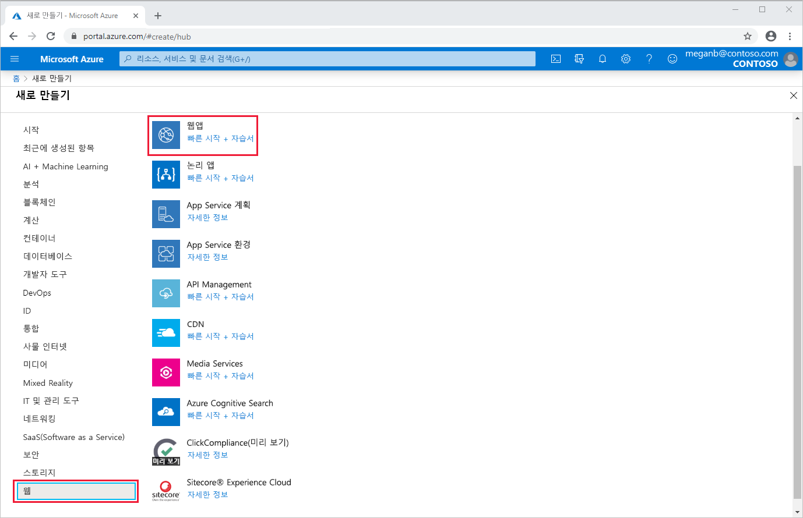
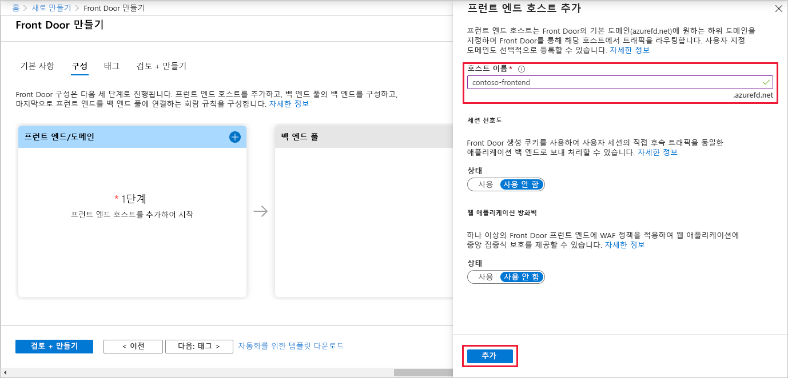
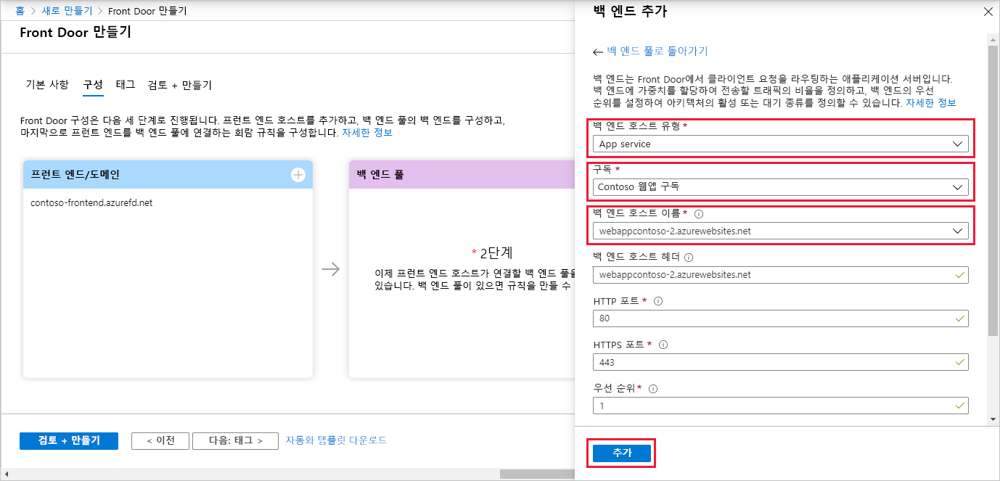
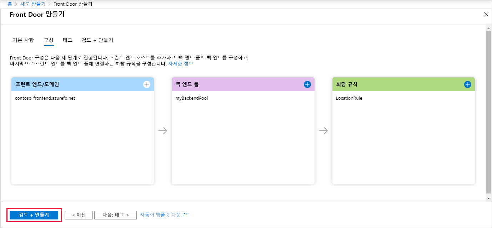
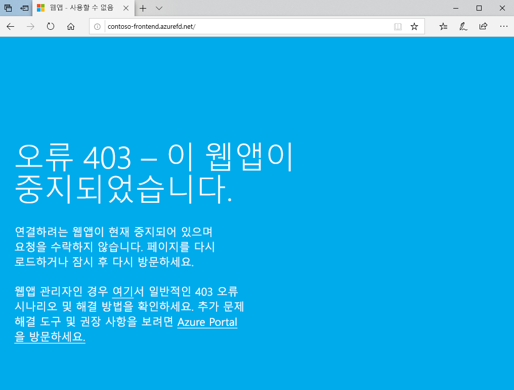

# 빠른 시작: 고가용성 글로벌 웹 애플리케이션에 대한 Front Door 만들기

Azure Portal을 사용하여 웹 애플리케이션에 대한 고가용성을 설정하여 Azure Front Door를 시작합니다.

이 빠른 시작에서 Azure Front Door는 서로 다른 Azure 지역에서 실행되는 웹 애플리케이션의 두 인스턴스를 풀링합니다. 가중치와 우선 순위가 동일한 백 엔드를 기반으로 하는 Front Door 구성을 만듭니다. 이 구성은 애플리케이션을 실행하는 가장 가까운 사이트로 트래픽을 보냅니다. Azure Front Door는 웹 애플리케이션을 지속적으로 모니터링합니다. 이 서비스는 가장 가까운 사이트를 사용할 수 없는 경우 자동 장애 조치를 사용 가능한 다음 사이트에 제공합니다.

## 사전 요구 사항

- 활성 구독이 있는 Azure 계정. [체험 계정을 만듭니다](https://azure.microsoft.com/free/?WT.mc_id=A261C142F).

## 웹앱의 두 인스턴스 만들기

이 빠른 시작에는 서로 다른 Azure 지역에서 실행되는 웹 애플리케이션의 두 인스턴스가 필요합니다. 두 웹 애플리케이션 인스턴스는 모두 *활성/활성* 모드로 실행되므로 두 인스턴스 중 하나에서 트래픽을 수행할 수 있습니다. 이 구성은 장애 조치로 작동하는 *활성/대기* 구성과 다릅니다.

웹앱이 아직 없는 경우 다음 단계를 사용하여 웹앱 예제를 설정합니다.

1. [https://portal.azure.com](https://portal.azure.com ) 에서 Azure Portal에 로그인합니다.

1. 홈 페이지 또는 Azure 메뉴에서 **리소스 만들기**를 선택합니다.

1. **웹** > **웹앱**을 차례로 선택합니다.

   

1. **웹앱**에서 사용할 **구독**을 선택합니다.

1. **리소스 그룹**에 대해 **새로 만들기**를 선택합니다. **이름**에 대해 *FrontDoorQS_rg1*을 입력하고, **확인**을 선택합니다.

1. **인스턴스 세부 정보** 아래에서 웹앱에 대한 고유한 **이름**을 입력합니다. 이 예에서는 *WebAppContoso-1*을 사용합니다.

1. **런타임 스택**을 선택합니다(이 예에서는 *.NET Core 2.1 (LTS)* ).

1. 지역(예: *미국 중부*)을 선택합니다.

1. **Windows 플랜**에 대해 **새로 만들기**를 선택합니다. **이름**에 대해 *myAppServicePlanCentralUS*를 입력하고, **확인**을 선택합니다.

1. **Sku 및 크기**가 **표준 S1 100 총 ACU, 1.75GB 메모리**인지 확인합니다.

1. **검토 + 만들기**를 선택하고, **요약**을 검토한 다음, **만들기**를 선택합니다. 배포가 완료되는 데 몇 분 정도 걸릴 수 있습니다.

   

배포가 완료되면 두 번째 웹앱을 만듭니다. 다음 값을 제외하고 동일한 값으로 동일한 절차를 사용합니다.

| 설정          | 값     |
| ---              | ---  |
| **리소스 그룹**   | **새로 만들기**를 선택하고, *FrontDoorQS_rg2*를 입력합니다. |
| **이름**             | 웹앱에 대한 고유 이름을 입력합니다(이 예에서는 *WebAppContoso-2*).  |
| **지역**           | 다른 지역(이 예에서는 *미국 중남부*) |
| **App Service 계획** > **Windows 플랜**         | **새로 만들기**를 선택하고, *myAppServicePlanSouthCentralUS*를 입력한 다음, **확인**을 선택합니다. |

## 애플리케이션에 대한 Front Door 만들기

두 웹앱 서버 간의 가장 짧은 대기 시간을 기준으로 사용자 트래픽을 보내도록 Azure Front Door를 구성합니다. 시작하려면 Azure Front Door에 대한 프런트 엔드 호스트를 추가합니다.

1. 홈 페이지 또는 Azure 메뉴에서 **리소스 만들기**를 선택합니다. **네트워킹** > **Front Door**를 차례로 선택합니다.

1. **Front Door 만들기**에서 **구독**을 선택합니다.

1. **리소스 그룹**에 대해 **새로 만들기**를 선택하고, *FrontDoorQS_rg0*을 입력한 다음, **확인**을 선택합니다.  기존 리소스 그룹을 대신 사용할 수 있습니다.

1. 리소스 그룹을 만든 경우 **리소스 그룹 위치**를 선택하고, **다음: 구성**을 선택합니다.

1. **프런트 엔드/도메인**에서 **+** 를 선택하여 **프런트 호스트 추가**를 엽니다.

1. **호스트 이름**에 대해 전역적으로 고유한 호스트 이름을 입력합니다. 이 예에서는 *contoso-frontend*를 사용합니다. **추가**를 선택합니다.

   

다음으로, 두 개의 웹앱이 포함된 백 엔드 풀을 만듭니다.

1. 여전히 **Front Door 만들기**의 **백 엔드 풀**에서 **+** 를 선택하여 **백 엔드 풀 추가**를 엽니다.

1. **이름**에 대해 *myBackendPool*을 입력합니다.

1. **백 엔드 추가**를 선택합니다. **백 엔드 호스트 유형**에 대해 *App Service*를 선택합니다.

1. 구독을 선택한 다음, **백 엔드 호스트 이름**에서 만든 첫 번째 웹앱을 선택합니다. 이 예에서는 웹앱이 *WebAppContoso-1*이었습니다. **추가**를 선택합니다.

1. **백 엔드 추가**를 다시 선택합니다. **백 엔드 호스트 유형**에 대해 *App Service*를 선택합니다.

1. 구독을 다시 선택하고, **백 엔드 호스트 이름**에서 만든 두 번째 웹앱을 선택합니다. **추가**를 선택합니다.

   

마지막으로, 회람 규칙을 추가합니다. 회람 규칙은 프런트 엔드 호스트를 백 엔드 풀에 매핑합니다. 규칙은 `contoso-frontend.azurefd.net`에 대한 요청을 **myBackendPool**에 전달합니다.

1. 여전히 **Front Door 만들기**의 **회람 규칙**에서 **+** 를 선택하여 회람 규칙을 구성합니다.

1. **규칙 추가**에서 **이름**에 대해 *LocationRule*을 입력합니다. 모든 기본값을 적용한 다음, **추가**를 선택하여 회람 규칙을 추가합니다.

   >[!WARNING]
   > 기본 경로(`\*`)가 연결된 회람 규칙이 Front Door의 각 프런트 엔드 호스트에 **있어야 합니다**. 즉, 모든 회람 규칙에서 하나 이상의 회람 규칙이 기본 경로(`\*`)에 정의된 각 프런트 엔드 호스트에 있어야 합니다. 이렇게 하지 않으면 최종 사용자 트래픽이 올바르게 라우팅되지 않을 수 있습니다.

1. **검토 + 만들기**를 선택한 다음, **만들기**를 선택합니다.

   

## 작동 중인 Azure Front Door 보기

Front Door를 만들면 구성이 전역적으로 배포되는 데 몇 분 정도 걸립니다. 완료되면 생성한 프런트 엔드 호스트에 액세스합니다. 브라우저에서 `contoso-frontend.azurefd.net`으로 이동합니다. 요청이 자동으로 백 엔드 풀에 지정된 서버에서 가장 가까운 서버로 라우팅됩니다.

이 빠른 시작에서 이러한 앱을 만든 경우 정보 페이지가 표시됩니다.

즉각적인 글로벌 장애 조치가 작동 중인지 테스트하려면 다음 단계를 수행합니다.

1. 위에서 설명한 대로 브라우저를 열고, 프런트 엔드 주소(`contoso-frontend.azurefd.net`)로 이동합니다.

1. Azure Portal에서 *앱 서비스*를 검색하여 선택합니다. 아래로 스크롤하여 웹앱 중 하나(이 예에서는 **WebAppContoso-1**)를 찾습니다.

1. 웹앱을 선택한 다음, **중지**, **예**를 차례로 선택하여 확인합니다.

1. 브라우저를 새로 고칩니다. 동일한 정보 페이지가 표시됩니다.

   >[!TIP]
   >이러한 작업에는 약간의 지연이 있습니다. 다시 새로 고쳐야 할 수도 있습니다.

1. 다른 웹앱도 찾아서 중지합니다.

1. 브라우저를 새로 고칩니다. 이번에는 오류 메시지가 표시됩니다.

   

## 리소스 정리

작업을 완료한 후에는 생성한 모든 항목을 제거할 수 있습니다. 리소스 그룹을 삭제하면 해당 콘텐츠도 삭제됩니다. 이 Front Door를 사용하지 않으려면 필요한 요금이 청구되지 않도록 리소스를 제거해야 합니다.

1. Azure Portal에서 **리소스 그룹**을 검색하여 선택하거나 Azure Portal 메뉴에서 **리소스 그룹**을 선택합니다.

1. 필터링하거나 아래로 스크롤하여 리소스 그룹(예: **FrontDoorQS_rg0**)을 찾습니다.

1. 리소스 그룹을 선택한 다음, **리소스 그룹 삭제**를 선택합니다.

   >[!WARNING]
   >이 작업은 되돌릴 수 없습니다.

1. 확인할 리소스 그룹 이름을 입력한 다음, **삭제**를 선택합니다.

다른 두 그룹에 대해 이 절차를 반복합니다.

## 다음 단계

사용자 지정 도메인을 Front Door에 추가하는 방법을 알아보려면 다음 문서로 계속 진행하세요.
> [!div class="nextstepaction"]
> [사용자 지정 도메인 추가](front-door-custom-domain.md)

트래픽 라우팅에 대해 자세히 알아보려면 [Front Door 라우팅 방법](front-door-routing-methods.md)을 참조하세요.
