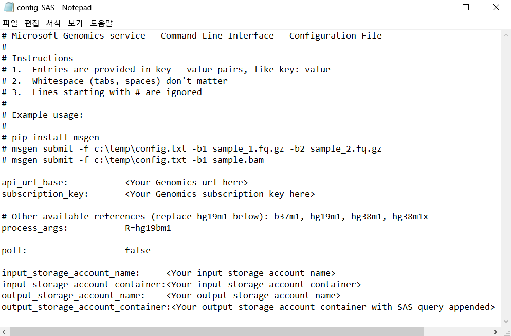

# <a name="submit-a-workflow-to-microsoft-genomics-using-a-sas-instead-of-a-storage-account-key"></a>저장소 계정 키 대신 SAS를 사용하여 Microsoft Genomics에 워크플로 제출 

이 문서에서는 워크플로를 포함 하는 config.txt 파일을 사용 하 여 Microsoft Genomics 서비스에 제출 하는 방법을 보여 줍니다 [공유 액세스 서명 (SAS)](https://docs.microsoft.com/azure/storage/common/storage-dotnet-shared-access-signature-part-1) 저장소 계정 키 대신 합니다. 이 기능은 config.txt 파일에 표시되는 저장소 계정 키를 포함하는 것에 대한 보안 문제가 있는 경우에 유용할 수 있습니다. 

이 문서에서는 `msgen` 클라이언트를 이미 설치하여 실행하고 있으며 Azure Storage를 사용하는 방법을 잘 알고 있다고 가정합니다. 제공된 된 샘플 데이터를 사용 하 여 워크플로 성공적으로 제출한 경우이 문서를 진행할 준비가 되었습니다. 

## <a name="what-is-a-sas"></a>SAS는 무엇인가요?
[SAS(공유 액세스 서명)](https://docs.microsoft.com/azure/storage/common/storage-dotnet-shared-access-signature-part-1)는 저장소 계정의 리소스에 대한 위임된 권한을 제공합니다. SAS로 계정 키를 공유하지 않고 저장소 계정의 리소스에 대한 액세스를 승인할 수 있습니다. 이는 애플리케이션에서 공유 액세스 서명을 사용하는 중요한 점입니다. SAS는 계정 키를 손상시키지 않고 스토리지 리소스를 공유할 수 있는 보안 방법입니다.

Microsoft Genomics에 제출된 SAS는 입력 및 출력 파일이 저장되는 Blob 또는 컨테이너에만 액세스를 위임하는 [서비스 SAS](https://docs.microsoft.com/rest/api/storageservices/Constructing-a-Service-SAS)이어야 합니다. 

서비스 수준 SAS(공유 액세스 서명) 토큰에 대한 URI는 SAS 토큰이 뒤에 오는 SAS에서 액세스를 위임하는 리소스에 대한 URI로 이루어져 있습니다. SAS 토큰은 리소스 지정, 액세스에 사용할 수 있는 권한, 서명이 유효한 시간 간격, 요청에서 생성할 수 있는 지원되는 IP 주소 또는 주소 범위, 요청이 만들어질 수 있는 지원되는 프로토콜, 요청과 연결된 선택적 액세스 정책 식별자 및 서명 자체뿐만 아니라 SAS를 인증하는 데 필요한 모든 정보를 포함하는 쿼리 문자열입니다. 

## <a name="sas-needed-for-submitting-a-workflow-to-the-microsoft-genomics-service"></a>Microsoft Genomics 서비스에 워크플로를 제출하는 데 필요한 SAS
Microsoft Genomics 서비스에 전송된 각 워크플로에 대해 두 개 이상의 SAS 토큰이 필요합니다(각 입력 파일에 대해 하나, 출력 컨테이너에 대해 하나).

입력 파일에 대한 SAS에는 다음과 같은 속성이 있어야 합니다.
1.  범위(계정, 컨테이너, Blob): Blob
2.  만료: 지금부터 48시간
3.  권한: 읽기

출력 컨테이너에 대한 SAS에는 다음과 같은 속성이 있어야 합니다.
1.  범위(계정, 컨테이너, Blob): 컨테이너
2.  만료: 지금부터 48시간
3.  권한: 읽기, 쓰기, 삭제


## <a name="create-a-sas-for-the-input-files-and-the-output-container"></a>입력 파일 및 출력 컨테이너에 대한 SAS 만들기
Azure Storage 탐색기를 사용하거나 프로그래밍 방식의 두 가지 방법으로 SAS 토큰을 만들 수 있습니다.  코드를 작성하는 경우 SAS를 직접 생성하거나 기본 설정 언어에서 Azure Storage SDK를 사용할 수 있습니다.


### <a name="set-up-create-a-sas-using-azure-storage-explorer"></a>설정: Azure Storage 탐색기를 사용하여 SAS 만들기

[Azure Storage 탐색기](https://azure.microsoft.com/features/storage-explorer/)는 Azure Storage에 저장한 리소스를 관리하는 도구입니다.  [여기](https://docs.microsoft.com/azure/vs-azure-tools-storage-manage-with-storage-explorer)에서 Azure Storage 탐색기를 사용하는 방법에 대해 자세히 알아볼 수 있습니다.

입력 파일에 대한 SAS는 특정 입력 파일(Blob)로 범위가 지정되어야 합니다. SAS 토큰을 만들려면 [이러한 지침](https://docs.microsoft.com/azure/storage/blobs/storage-quickstart-blobs-storage-explorer)에 따릅니다. SAS를 만들면 쿼리 문자열뿐만 아니라 쿼리 문자열 자체의 전체 URL이 제공되며 화면에서 복사할 수 있습니다.

 


### <a name="set-up-create-a-sas-programmatically"></a>설정: 프로그래밍 방식으로 SAS 만들기

Azure Storage SDK를 사용하여 SAS를 만들려면 [.NET](https://docs.microsoft.com/azure/storage/blobs/storage-dotnet-shared-access-signature-part-2#generate-a-shared-access-signature-uri-for-a-blob), [Python](https://docs.microsoft.com/azure/storage/blobs/storage-python-how-to-use-blob-storage) 및 [Node.js](https://docs.microsoft.com/azure/storage/blobs/storage-nodejs-how-to-use-blob-storage)를 포함하여 여러 언어에서 기존 설명서를 참조합니다. 

SDK 없이 SAS를 만들려면 SAS를 인증하는 데 필요한 모든 정보를 포함하여 SAS 쿼리 문자열을 직접 생성할 수 있습니다. 이러한 [지침](https://docs.microsoft.com/rest/api/storageservices/constructing-a-service-sas)은 SAS 쿼리 문자열의 구성 요소 및 이를 생성하는 방법을 자세히 설명합니다. 이러한 [지침](https://docs.microsoft.com/rest/api/storageservices/service-sas-examples)에 설명된 대로 Blob/컨테이너 인증 정보를 사용하여 HMAC를 생성하여 필요한 SAS 서명을 만듭니다.


## <a name="add-the-sas-to-the-configtxt-file"></a>config.txt 파일에 SAS 추가
SAS 쿼리 문자열을 사용하여 Microsoft Genomics 서비스를 통해 워크플로를 실행하려면 config.txt 파일을 편집하여 config.txt 파일에서 키를 제거합니다. 그런 다음, 표시된 것처럼 SAS 쿼리 문자열(`?`로 시작)을 출력 컨테이너 이름에 추가합니다. 



Microsoft Genomics Python 클라이언트를 사용하여 각 입력 Blob 이름에 해당하는 SAS 쿼리 문자열을 추가하는 다음 명령을 사용하여 워크플로를 제출합니다.

```python
msgen submit -f [full path to your config file] -b1 [name of your first paired end read file, SAS query string appended] -b2 [name of your second paired end read file, SAS query string appended]
```

### <a name="if-adding-the-input-file-names-to-the-configtxt-file"></a>입력 파일 이름을 config.txt 파일에 추가하는 경우
또는 쌍을 이루는 끝 읽기 파일의 이름은 표시된 것처럼 추가된 SAS 쿼리 토큰으로 config.txt 파일에 직접 추가할 수 있습니다.


이 경우 Microsoft Genomics Python 클라이언트를 사용하여 `-b1` 및 `-b2` 명령을 생략하는 다음 명령으로 워크플로를 제출합니다.

```python
msgen submit -f [full path to your config file] 
```

## <a name="next-steps"></a>다음 단계
이 문서에서는 계정 키 대신 SAS 토큰을 사용하여 `msgen` Python 클라이언트를 통해 Microsoft Genomics 서비스에 워크플로를 제출했습니다. Microsoft Genomics 서비스에서 사용할 수 있는 워크플로 제출 및 기타 명령에 대한 추가 정보는 [FAQ](frequently-asked-questions-genomics.md)를 참조하세요. 
