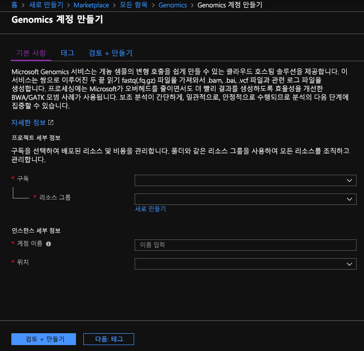
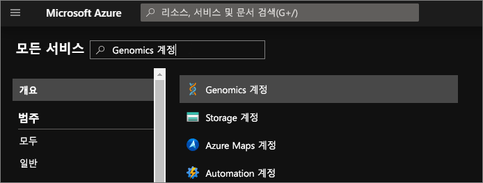
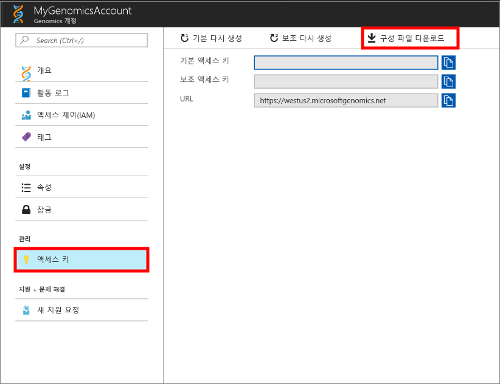

# <a name="quickstart-run-a-workflow-through-the-microsoft-genomics-service"></a>빠른 시작: Microsoft Genomics 서비스를 통해 워크플로 실행

Microsoft Genomics는 원시 읽기에서 시작하여 정렬된 읽기 및 변형 호출을 생성하여 신속하게 게놈을 처리할 수 있는 2차 분석을 위한 확장형 보안 서비스입니다. 몇 단계만 거치면 시작할 수 있습니다. 
1.  설정: Azure Portal을 통해 Microsoft Genomics 계정을 만들고 로컬 환경에 Microsoft Genomics Python 클라이언트를 설치합니다. 
2.  입력 데이터 업로드: Azure Portal을 통해 Microsoft Azure Storage 계정을 만들고 입력 파일을 업로드합니다. 입력 파일은 페어드 엔드 리드(paired-end reads)이어야 합니다(fastq 또는 bam 파일).
3.  실행: Microsoft Genomics 명령줄 인터페이스를 사용하여 Microsoft Genomics 서비스를 통해 워크플로를 실행합니다. 

Microsoft Genomics에 대한 자세한 내용은 [Microsoft Genomics란 무엇입니까?](overview-what-is-genomics.md)를 참조하세요.

## <a name="set-up-create-a-microsoft-genomics-account-in-the-azure-portal"></a>설정: Azure Portal에서 Microsoft Genomics 계정 만들기

Microsoft Genomics 계정을 만들려면 [Azure Portal](https://portal.azure.com/#create/Microsoft.Genomics)로 이동합니다. Azure 구독이 아직 없으면 Microsoft Genomics 계정을 만들기 전에 하나 만드세요. 




앞의 이미지와 같이 다음 정보로 Genomics 계정을 구성합니다. 

 |**설정**          |  **제안 값**  | **필드 설명** |
 |:-------------       |:-------------         |:----------            |
 |계정 이름         | MyGenomicsAccount     |고유한 계정 식별자를 선택합니다. 유효한 이름은 [이름 지정 규칙](https://docs.microsoft.com/azure/architecture/best-practices/naming-conventions)을 참조하세요. |
 |구독         | 구독 이름|귀하의 Azure 서비스에 대한 청구 단위입니다. 구독에 대한 자세한 내용은 [구독](https://account.azure.com/Subscriptions)을 참조하세요. |      
 |리소스 그룹       | MyResourceGroup       |  리소스 그룹을 사용하여 여러 Azure 리소스(저장소 계정, 게놈 계정 등)를 단일 그룹으로 그룹화하여 간단히 관리할 수 있습니다. 자세한 내용은 [리소스 그룹]을 참조하세요(https://docs.microsoft.com/azure/azure-resource-manager/resource-group-overview#resource-groups). 유효한 리소스 그룹 이름은 [이름 지정 규칙](https://docs.microsoft.com/azure/architecture/best-practices/naming-conventions)을 참조하세요. |
 |위치                   | 미국 서부 2                    |    미국 서부 2, 유럽 서부 및 동남 아시아에서 서비스를 사용할 수 있습니다. |


상단 메뉴 표시줄에 있는 알림을 클릭하여 배포 프로세스를 모니터링할 수 있습니다.


## <a name="set-up-install-the-microsoft-genomics-python-client"></a>설정: Microsoft Genomics Python 클라이언트 설치

사용자는 Python과 Microsoft Genomics Python 클라이언트를 모두 로컬 환경에 설치해야 합니다. 

### <a name="install-python"></a>Python 설치

Microsoft Genomics Python 클라이언트는 Python 2.7과 호환됩니다. 12 또는 2.7.xx 이상 버전; 2.7.15는 이 작성 시 최신 버전이며 2.7.14는 권장된 버전입니다. [여기](https://www.python.org/downloads/)에서 다운로드를 찾을 수 있습니다. 

참고: Python 3.x는 Python 2.7.xx와 호환되지 않습니다.  MSGen은 Python 2.7 응용 프로그램입니다. MSGen를 실행하는 경우 활성 Python 환경에서 Python 2.7.xx 버전을 사용하는지 확인합니다. Python 3.x 버전에서 MSGen 사용하려고 할 때 오류가 발생할 수 있습니다.


### <a name="install-the-microsoft-genomics-client"></a>Microsoft Genomics 클라이언트 설치

Python pip를 사용하여 Microsoft Genomics 클라이언트 `msgen`을 설치합니다. 다음 지침은 Python이 시스템 경로에 이미 있다고 가정합니다. pip 설치를 인식할 수 없는 문제가 발생하는 경우 Python 및 스크립트 하위 폴더를 시스템 경로에 추가해야 합니다.


```
pip install --upgrade --no-deps msgen
pip install msgen
```


`msgen`을 시스템 수준 바이너리로서 설치하고 시스템 수준 Python 패키지를 수정하지 않으려면 `pip`과 함께 `–-user` 플래그를 사용합니다.
패키지 기반 설치 또는 setup.py를 사용하면 필수 패키지가 모두 설치됩니다. 그렇지 않으면 msgen에 필요한 기본 패키지가 설치되며, 다음과 같습니다. 

 * [Azure-storage](https://pypi.python.org/pypi/azure-storage). 
 * [Requests](https://pypi.python.org/pypi/requests). 


`pip`, `easy_install`을 사용하거나 표준 `setup.py` 절차를 통해 이들 패키지를 설치할 수 있습니다. 


### <a name="test-the-microsoft-genomics-client"></a>Microsoft Genomics 클라이언트 테스트
Microsoft Genomics 클라이언트를 테스트하려면 Genomics 계정에서 구성 파일을 다운로드합니다. 왼쪽 상단에서 **모든 서비스**를 클릭하고, Genomics 계정을 필터링하고 선택하여 Genomics 계정으로 이동합니다.





방금 만든 Genomics 계정을 선택하고 **액세스 키**로 이동하여 구성 파일을 다운로드합니다.




Microsoft Genomics Python 클라이언트가 다음 명령으로 작동하는지 테스트합니다.


```
msgen list -f “<full path where you saved the config file>”
```

## <a name="create-a-microsoft-azure-storage-account"></a>Microsoft Azure Storage 계정 만들기 
Microsoft Genomics 서비스는 입력 파일이 Azure Storage 계정에 블록 Blob으로 저장될 것으로 예상합니다. 또한 출력 파일을 Azure Storage 계정의 사용자 지정 컨테이너에 블록 Blob으로 기록합니다. 입력 및 출력 파일은 서로 다른 Storage 계정에 있을 수 있습니다.
Azure Storage 계정에 이미 데이터가 있다면 Genomics 계정과 동일한 위치에 있는지 확인하면 됩니다. 그렇지 않으면 Genomics 서비스를 실행할 때 송신 비용이 발생합니다. Microsoft Azure Storage 계정이 아직 없는 경우 계정을 만들어 데이터를 업로드해야 합니다. Storage 계정은 무엇이며 어떤 서비스를 제공하는지 등 Azure Storage 계정에 대한 자세한 내용은 [여기](https://docs.microsoft.com/azure/storage/common/storage-create-storage-account)에서 확인할 수 있습니다. Microsoft Azure Storage 계정을 만들려면 [Azure Portal](https://portal.azure.com/#create/Microsoft.StorageAccount-ARM )로 이동합니다.  


앞의 이미지와 같이 다음 정보를 사용하여 Storage 계정을 구성합니다. 저장소 계정에 대한 대부분의 표준 옵션을 사용하되, 계정은 일반적인 용도가 아닌 Blob Storage 전용으로 지정합니다. Blob Storage 용량은 다운로드 및 업로드 시 2-5배 빨라질 수 있습니다. 


 |**설정**          |  **제안 값**  | **필드 설명** |
 |:-------------------------       |:-------------         |:----------            |
 |Name         | MyStorageAccount     |고유한 계정 식별자를 선택합니다. 유효한 이름은 [이름 지정 규칙](https://docs.microsoft.com/azure/architecture/best-practices/naming-conventions)을 참조하세요. |
 |배포 모델         | 리소스 관리자| 리소스 관리자는 권장되는 배포 모델입니다. 자세한 내용은 [리소스 관리자 배포 이해](https://docs.microsoft.com/azure/azure-resource-manager/resource-manager-deployment-model)를 참조하세요. |      
 |계정 종류       | Blob 저장소       |  Blob Storage는 다운로드 및 업로드 시 범용보다 2-5배 빨라질 수 있습니다. |
 |성능                  | Standard                   | 기본값은 표준입니다. 표준 및 프리미엄 저장소 계정에 대한 자세한 내용은 [Microsoft Azure Storage 소개 ](https://docs.microsoft.com/azure/storage/common/storage-introduction)를 참조하세요.    |
 |복제                  | 로컬 중복 저장소                  | 로컬 중복 저장소는 저장소 계정을 만든 지역의 데이터 센터 내에서 데이터를 복제합니다. 자세한 내용은 [ Azure Storage 복제 ](https://docs.microsoft.com/azure/storage/common/storage-redundancy)를 참조하세요.    |
 |보안 전송 필요                  | 사용 안 함                 | 기본적으로 이 옵션은 사용하지 않도록 설정됩니다. 데이터 전송 보안에 대한 자세한 내용은 [보안 전송 필요](https://docs.microsoft.com/azure/storage/common/storage-require-secure-transfer)를 참조하세요.    |
 |액세스 계층                  | 핫                   | 핫 액세스는 저장소 계정의 개체가 더 자주 액세스됨을 나타냅니다.    |
 |구독         | Azure 구독 |구독에 대한 자세한 내용은 [구독](https://account.azure.com/Subscriptions)을 참조하세요. |      
 |리소스 그룹       | MyResourceGroup       |  Genomics 계정과 동일한 리소스 그룹을 선택할 수 있습니다. 유효한 리소스 그룹 이름은 [이름 지정 규칙](https://docs.microsoft.com/azure/architecture/best-practices/naming-conventions)을 참조하세요. |
 |위치                  | 미국 서부 2                  | Genomics 계정의 위치와 동일한 위치를 사용하여 송신 비용을 낮추고 대기 시간을 줄입니다. Genomics 서비스는 미국 서부2, 미국 서부 2, 유럽 서부 및 동남 아시아에서 사용할 수 있습니다.    |
 |가상 네트워크                | 사용 안 함                   | 기본적으로 이 옵션은 사용하지 않도록 설정됩니다. 자세한 내용은 [Azure Virtual Network](https://docs.microsoft.com/azure/storage/common/storage-network-security)를 참조하세요.    |


그런 다음 만들기를 클릭하여 저장소 계정을 만듭니다. Genomics 계정 만들 때처럼 상단 메뉴 표시줄에서 알림을 클릭하여 배포 프로세스를 모니터링할 수 있습니다. 


## <a name="upload-input-data-to-your-storage-account"></a>저장소 계정에 입력 데이터 업로드

Microsoft Genomics 서비스는 페어드 엔드 리드를 입력 파일로 기대합니다. 자신의 데이터를 업로드하거나 공개적으로 사용 가능한 샘플 데이터를 사용하여 탐색할 수 있습니다. 공개적으로 사용 가능한 샘플 데이터를 사용하려면 여기에서 호스팅합니다.


[https://msgensampledata.blob.core.windows.net/small/chr21_1.fq.gz](https://msgensampledata.blob.core.windows.net/small/chr21_1.fq.gz)
[https://msgensampledata.blob.core.windows.net/small/chr21_2.fq.gz](https://msgensampledata.blob.core.windows.net/small/chr21_2.fq.gz)


저장소 계정 내에서 입력 데이터 용으로 하나의 Blob 컨테이너를 만들고 출력 데이터용으로 두 번째 Blob 컨테이너를 만들어야 합니다.  입력 데이터를 입력 Blob 컨테이너에 업로드합니다. [Microsoft Azure Storage 탐색기](https://azure.microsoft.com/features/storage-explorer/), [blobporter](https://github.com/Azure/blobporter) 또는 [ AzCopy](https://docs.microsoft.com/azure/storage/common/storage-use-azcopy?toc=%2fazure%2fstorage%2fblobs%2ftoc.json) 등 다양한 도구를 사용하여 이 작업을 수행할 수 있습니다. 


## <a name="run-a-workflow-through-the-microsoft-genomics-service-using-the-python-client"></a>Python 클라이언트를 사용하여 Microsoft Genomics 서비스를 통해 워크플로 실행 

Microsoft Genomics 서비스를 통해 워크플로를 실행하려면 config.txt 파일을 편집하여 데이터에 대한 입력 및 출력 저장소 컨테이너를 지정합니다.
Genomics 계정에서 다운로드한 config.txt 파일을 엽니다. 지정해야 하는 섹션은 구독 키와 아래에 있는 여섯 개의 항목, 저장 계정 이름, 입력 및 출력에 대한 키 및 컨테이너 이름입니다. 포털에서 저장소 계정의 **액세스 키**로 이동하거나 Azure Storage 탐색기에서 직접 이 정보를 찾을 수 있습니다.  


### <a name="submit-your-workflow-to-the-microsoft-genomics-service-the-microsoft-genomics-client"></a>워크플로를 Microsoft Genomics 서비스 Microsoft Genomics 클라이언트에 제출합니다.

Microsoft Genomics Python 클라이언트를 사용하여 다음 명령으로 워크플로를 제출합니다.


```python
msgen submit -f [full path to your config file] -b1 [name of your first paired end read] -b2 [name of your second paired end read]
```


다음 명령을 사용하여 워크플로의 상태를 볼 수 있습니다. 
```python
msgen list -f c:\temp\config.txt 
```


워크플로가 완료되면 사용자가 구성한 출력 컨테이너의 Azure Storage 계정에서 출력 파일을 볼 수 있습니다. 


## <a name="next-steps"></a>다음 단계
이 문서에서는 샘플 입력 데이터를 Azure Storage에 업로드했고 `msgen` Python 클라이언트를 통해 워크플로를 Microsoft Genomics 서비스에 제출했습니다. Microsoft Genomics 서비스에서 사용할 수 있는 기타 입력 파일 형식에 대한 자세한 내용은 다음 페이지를 참조하세요. [쌍으로 연결된 FASTQ](quickstart-input-pair-FASTQ.md) | [BAM](quickstart-input-BAM.md) | [여러 개의 FASTQ 또는 BAM](quickstart-input-multiple.md) [Azure 노트북 자습서](http://aka.ms/genomicsnotebook)를 사용하여 이 자습서를 탐색할 수도 있습니다.
