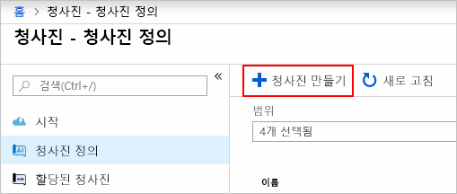
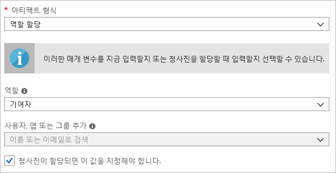
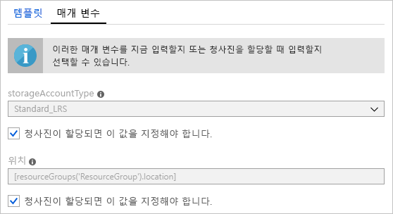
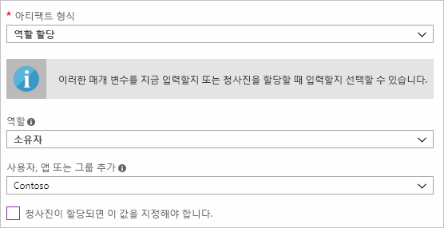
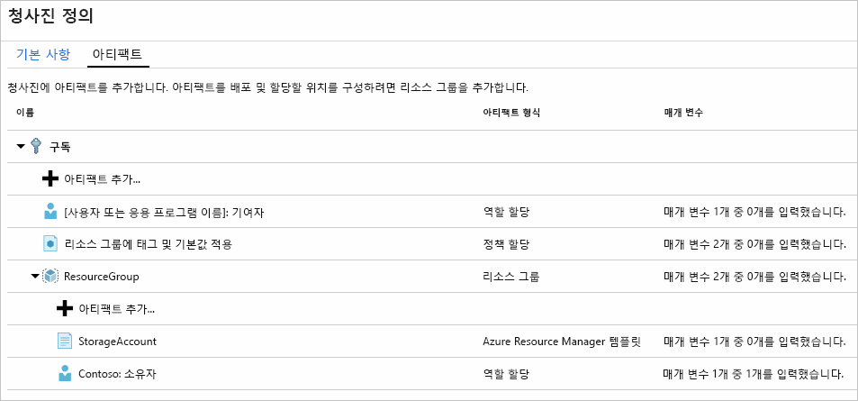
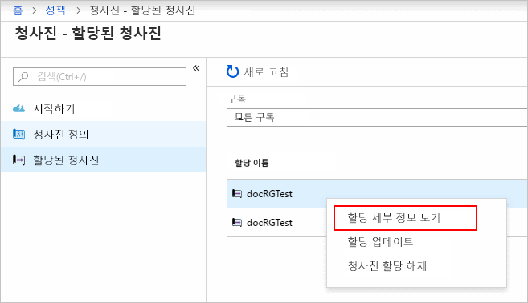

# <a name="define-and-assign-an-azure-blueprint-in-the-portal"></a>포털에서 Azure Blueprint 정의 및 할당

청사진을 만들고 할당하는 방법을 알면 공통 패턴 정의를 통해 Resource Manager 템플릿, 정책, 보안 등을 기반으로 재사용이 가능하고 신속하게 배포할 수 있는 구성을 개발할 수 있습니다. 이 자습서에서는 Azure Blueprint를 사용하여 조직 내에서 청사진을 작성, 게시 및 할당하는 것과 관련된 다음과 같은 일반적인 작업을 수행하는 방법을 알아봅니다.

> [!div class="checklist"]
> - 새 청사진을 만들고 지원되는 다양한 아티팩트 추가
> - 아직 **초안** 상태인 기존 청사진 변경
> - 청사진을 **게시**하여 할당할 준비가 되었다고 표시
> - 기존 구독에 청사진 할당
> - 할당된 청사진의 상태 및 진행률 확인
> - 구독에 할당된 청사진 제거

Azure 구독이 아직 없는 경우 시작하기 전에 [체험 계정](https://azure.microsoft.com/free)을 만듭니다.

## <a name="create-a-blueprint"></a>청사진 만들기

규정 준수를 위한 표준 패턴을 정의하는 첫 단계에서는 사용 가능한 리소스로 청사진을 작성합니다. 이 예제에서는 ‘MyBlueprint’라는 새 청사진을 만들어 구독용 역할 및 정책 할당을 구성하고, 새 리소스 그룹을 추가한 다음 새 리소스 그룹에서 Resource Manager 템플릿 및 역할 할당을 만듭니다.

1. **모든 서비스**를 클릭하고 왼쪽 창에서 **정책**을 검색하여 선택합니다. **정책** 페이지에서 **청사진**을 클릭합니다.

1. 왼쪽 페이지에서 **청사진 정의**를 선택하고 페이지 위쪽에 있는 **+ 청사진 만들기** 단추를 클릭합니다.

   - **시작** 페이지에서 **만들기**를 클릭하여 청사진을 만드는 페이지로 즉시 이동할 수도 있습니다.

   

1. 'MyBlueprint'와 같이 **청사진 이름**을 입력합니다. 청사진 이름은 숫자와 문자로 48자까지 입력할 수 있으며 공백이나 특수 문자는 포함할 수 없습니다. **청사진 설명**은 일단 비워 둡니다.  **정의 위치** 상자에서 오른쪽의 줄임표를 클릭하고 청사진을 저장할 [관리 그룹](../management-groups/overview.md)을 선택한 후에 **선택**을 클릭합니다.

   > [!NOTE]
   > 청사진 정의는 관리 그룹에만 저장할 수 있습니다. 첫 번째 관리 그룹을 만들려면 [여기의 단계](../management-groups/create.md)를 수행하세요.

1. **청사진 이름** 및 **정의 위치** 필드의 내용은 나중에 변경할 수 없으므로 정보가 올바른지 확인한 이후에 페이지 맨 아래의 **다음: 아티팩트** 또는 페이지 맨 위의 **아티팩트** 탭을 클릭합니다.

1. 구독에서 역할 할당을 추가합니다. **구독** 아래의 **+ 아티팩트 추가...** 행을 마우스 왼쪽 단추로 클릭하면 브라우저 오른쪽에 ‘아티팩트 추가’ 창이 열립니다. _아티팩트 형식_으로 ‘역할 할당’을 선택합니다. _역할_ 아래에서 '참가자'를 선택하고 **동적 매개 변수**를 나타내는 확인란이 있는 _사용자, 앱 또는 그룹 추가_ 필드는 비워 둡니다. **추가**를 클릭하여 이 아티팩트를 청사진에 추가합니다.

   

   > [!NOTE]
   > 대부분의 _아티팩트_는 매개 변수를 지원합니다. 청사진 생성 중에 값이 할당되는 매개 변수는 **정적 매개 변수**입니다. 청사진 할당 중에 할당되는 매개 변수는 **동적 매개 변수**입니다. 자세한 내용은 [청사진 매개 변수](./concepts/parameters.md)를 참조하세요.

1. 구독에서 정책 할당을 추가합니다. **구독** 바로 아래의 **+ 아티팩트 추가...** 행을 마우스 왼쪽 단추로 클릭합니다. _아티팩트 형식_으로 ‘정책 할당’을 선택합니다. _형식_을 '기본 제공'으로 변경하고 _검색_에 'tag'를 입력합니다. _검색_ 바깥쪽을 클릭하면 필터링이 수행됩니다. ‘리소스 그룹에 태그 및 기본값 적용’을 클릭하여 선택합니다. **추가**를 클릭하여 이 아티팩트를 청사진에 추가합니다.

1. 정책 할당 ‘리소스 그룹에 태그 및 기본값 적용’의 행을 클릭합니다. 청사진 정의의 일부분으로 아티팩트에 매개 변수를 제공하기 위한 창이 열립니다. 할당 중에 매개 변수를 설정하는 대신(**동적 매개 변수**), 이 창에서 해당 청사진을 기준으로 하여 모든 할당의 매개 변수를 설정할 수 있습니다(**정적 매개 변수**). 이 예제에서는 청사진 할당 중에 **동적 매개 변수**를 사용하므로 기본값을 그대로 유지하고 **취소**를 클릭합니다.

1. 구독에서 리소스 그룹을 추가합니다. **구독** 아래의 **+ 아티팩트 추가...** 행을 마우스 왼쪽 단추로 클릭합니다. _아티팩트 형식_으로 ‘리소스 그룹’을 선택합니다. _리소스 그룹 이름_ 및 _위치_ 필드는 비워 두되 각 속성의 확인란은 선택하여 해당 속성을 **동적 매개 변수**로 설정합니다. **추가**를 클릭하여 이 아티팩트를 청사진에 추가합니다.

1. 리소스 그룹 아래에 템플릿을 추가합니다. **+ 아티팩트 추가...** 를 마우스 왼쪽 단추로 클릭합니다. 행(**ResourceGroup** 항목 바로 아래에 있음)을 마우스 왼쪽 단추로 클릭합니다. _아티팩트 형식_으로 ‘Azure Resource Manager 템플릿’을 선택하고 _아티팩트 표시 이름_을 'StorageAccount'로 설정합니다. _설명_은 비워 둡니다. **템플릿** 탭의 편집기 상자에 다음 Resource Manager 템플릿을 붙여넣습니다. 템플릿을 붙여넣은 후 **매개 변수** 탭을 클릭합니다. 템플릿 매개 변수 **storageAccountType** 및 기본값 **Standard_LRS**가 자동으로 검색되어 입력되었으며 **동적 매개 변수**로 구성되었음을 확인할 수 있습니다. 확인란 선택을 취소합니다. Resource Manager 템플릿의 **allowedValues** 아래에 있는 값만 드롭다운에 포함되어 있음을 확인할 수 있습니다. 확인란을 선택하면 해당 항목이 다시 **동적 매개 변수**로 설정됩니다. **추가**를 클릭하여 이 아티팩트를 청사진에 추가합니다.

   > [!IMPORTANT]
   > 템플릿을 가져오는 경우에는 파일이 JSON으로만 되어 있으며 HTML은 포함하지 않는지 확인하세요. Github의 URL을 가리키는 경우에는 **RAW**를 클릭하여 GitHub에 표시하기 위해 HTML로 래핑된 파일이 아니라 순수 JSON 파일을 가져왔는지 확인해야 합니다. 가져온 템플릿이 순수 JSON이 아니면 오류가 발생합니다.

   ```json
   {
       "$schema": "https://schema.management.azure.com/schemas/2015-01-01/deploymentTemplate.json#",
       "contentVersion": "1.0.0.0",
       "parameters": {
           "storageAccountType": {
               "type": "string",
               "defaultValue": "Standard_LRS",
               "allowedValues": [
                   "Standard_LRS",
                   "Standard_GRS",
                   "Standard_ZRS",
                   "Premium_LRS"
               ],
               "metadata": {
                   "description": "Storage Account type"
               }
           }
       },
       "variables": {
           "storageAccountName": "[concat(uniquestring(resourceGroup().id), 'standardsa')]"
       },
       "resources": [{
           "type": "Microsoft.Storage/storageAccounts",
           "name": "[variables('storageAccountName')]",
           "apiVersion": "2016-01-01",
           "location": "[resourceGroup().location]",
           "sku": {
               "name": "[parameters('storageAccountType')]"
           },
           "kind": "Storage",
           "properties": {}
       }],
       "outputs": {
           "storageAccountName": {
               "type": "string",
               "value": "[variables('storageAccountName')]"
           }
       }
   }
   ```

   

1. 완성된 청사진은 다음과 같이 표시됩니다. 각 아티팩트의 _매개 변수_ 열 아래에는 '매개 변수 _y_개 중 _x_개를 입력했습니다.’가 표시됩니다. **동적 매개 변수**는 청사진의 각 할당 중 설정됩니다.

   

1. 계획한 아티팩트를 모두 추가했으므로 페이지 아래쪽의 **초안 저장**을 클릭합니다.

## <a name="edit-a-blueprint"></a>청사진 편집

[청사진 만들기](#create-a-blueprint)에서는 설명을 입력하지 않았으며 새 리소스 그룹에 역할 할당도 추가하지 않았습니다. 다음과 같은 단계를 수행하면 둘 다 해결할 수 있습니다.

1. 왼쪽 페이지에서 **청사진 정의**를 선택합니다.

1. 청사진 목록에서 이전에 만든 청사진을 마우스 오른쪽 단추로 클릭하고 **청사진 편집**을 선택합니다.

1. **청사진 설명**에 청사진과 해당 청사진을 구성하는 아티팩트에 대한 정보를 입력합니다.  여기서는 “이 청사진은 구독에서 태그 정책 및 역할 할당을 설정하고, ResourceGroup을 만들고, 해당 ResourceGroup에 리소스 템플릿 및 역할 할당을 배포합니다.”와 같은 설명을 입력합니다.

1. 페이지 맨 아래의 **다음: 아티팩트** 또는 페이지 맨 위의 **아티팩트** 탭을 클릭합니다.

1. 리소스 그룹 아래에 역할 할당을 추가합니다. **ResourceGroup** 항목 바로 아래의 **+ 아티팩트 추가...** 행을 마우스 왼쪽 단추로 클릭합니다. _아티팩트 형식_으로 ‘역할 할당’을 선택합니다. _역할_ 아래에서 '소유자'를 선택하고 _사용자, 앱 또는 그룹 추가_ 필드의 확인란 선택을 취소한 다음, 추가할 사용자, 앱 또는 그룹을 검색하여 선택합니다. 이 아티팩트는 이 청사진의 모든 할당에서 동일하게 설정되는 **정적 매개 변수**를 사용합니다. **추가**를 클릭하여 이 아티팩트를 청사진에 추가합니다.

   

1. 완성된 청사진은 다음과 같이 표시됩니다. 새로 추가한 역할 할당에 **매개 변수 1개 중 1개를 입력했습니다.** 가 표시됩니다. 이 메시지는 해당 항목이 **정적 매개 변수**라는 의미입니다.

   

1. 청사진이 업데이트되었으므로 **초안 저장**을 클릭합니다.

## <a name="publish-a-blueprint"></a>청사진 게시

계획한 아티팩트를 청사진에 모두 추가했으므로 이제 청사진을 게시합니다.
게시한 후에는 구독에 할당할 수 있습니다.

1. 왼쪽 페이지에서 **Blueprint 정의**를 선택합니다.

1. 청사진 목록에서 이전에 만든 청사진을 마우스 오른쪽 단추로 클릭하고 **청사진 게시**를 선택합니다.

1. 대화 상자가 열리면 **버전**을 'v1'과 같이 입력합니다. 버전은 숫자와 문자로 20자까지 입력할 수 있습니다. 원하는 경우 ‘첫 번째 게시’와 같은 **변경 메모**도 입력합니다.

1. 페이지 아래쪽의 **게시**를 클릭합니다.

## <a name="assign-a-blueprint"></a>청사진 할당

게시한 청사진은 구독에 할당할 수 있습니다. 작성한 청사진을 관리 그룹 계층 구조의 구독 중 하나에 할당합니다.

1. 왼쪽 페이지에서 **Blueprint 정의**를 선택합니다.

1. 청사진 목록에서 이전에 만든 청사진을 마우스 오른쪽 단추로 클릭하거나 줄임표를 마우스 왼쪽 단추로 클릭하고 **청사진 할당**을 선택합니다.

1. **청사진 할당** 페이지의 **구독** 드롭다운에서 이 청사진을 배포하려는 구독을 선택합니다.

   > [!NOTE]
   > 선택한 각 구독에 대해 할당이 생성되므로 선택한 나머지 구독을 강제로 변경하지 않고도 나중에 구독 할당 하나만 변경할 수 있습니다.

1. **할당된 이름**에 이 할당의 고유한 이름을 입력합니다.

1. **위치**에서 관리 ID를 생성할 지역을 선택합니다. Azure Blueprints는 이 관리 ID를 사용하여 할당된 청사진의 모든 아티팩트를 배포합니다. 자세히 알아보려면 [Azure 리소스의 관리 ID](../../active-directory/managed-identities-azure-resources/overview.md)를 참조하세요.

1. ‘v1’ 항목에서 **게시됨** 버전의 **Blueprint 정의 버전** 드롭다운은 기본값(가장 최근의 **게시됨** 버전)으로 유지합니다.

1. **잠금 할당**에서는 기본값인 **잠그지 않음**을 유지합니다. 자세한 내용은 [청사진 리소스 잠금](./concepts/resource-locking.md)을 참조하세요.

1. 구독 수준 역할 할당 **[사용자 그룹 또는 애플리케이션 이름]: 기여자**의 경우 사용자, 앱 또는 그룹을 검색하여 선택합니다.

1. 구독 수준 정책 할당에서는 **태그 이름**을 'CostCenter'로, **태그 값**을 'ContosoIT'로 설정합니다.

1. 'ResourceGroup'에서는 **이름**을 'StorageAccount'로 입력하고 **위치**로는 드롭다운 목록에서 ‘미국 동부 2’를 선택합니다.

   > [!NOTE]
   > 청사진 정의 중에 리소스 그룹 아래에 추가한 각 아티팩트는 함께 배포할 리소스 그룹이나 개체에 적합해야 합니다. 매개 변수를 사용하지 않거나 할당에서 정의할 매개 변수가 없는 아티팩트는 상황 정보 제공용으로만 나열됩니다.

1. Azure Resource Manager 템플릿 ‘StorageAccount’에서 **storageAccountType** 매개 변수에 대해 ‘Standard_GRS’를 선택합니다.

1. 페이지 아래쪽의 정보 상자 내용을 확인하고 **할당**을 클릭합니다.

## <a name="track-deployment-of-a-blueprint"></a>청사진 배포 추적

구독 하나 이상에 청사진을 할당하면 다음의 두 작업이 수행됩니다.

- 청사진이 할당된 구독별 **할당된 Blueprint** 페이지에 추가됩니다.
- 청사진으로 정의된 모든 아티팩트를 배포하는 프로세스가 시작됩니다.

청사진이 구독에 할당되었으므로 배포 진행률을 확인합니다.

1. 왼쪽 페이지에서 **할당된 Blueprint**를 선택합니다.

1. 청사진 목록에서 이전에 만든 청사진을 마우스 오른쪽 단추로 클릭하고 **할당 정보 보기**를 선택합니다.

   

1. **배포 정보** 페이지에서 모든 아티팩트가 정상적으로 배포되었으며 배포 중에 오류가 발생하지 않았는지 확인합니다. 오류가 발생한 경우 [청사진 문제 해결](./troubleshoot/general.md)에서 문제를 확인하는 단계를 참조하세요.

## <a name="unassign-a-blueprint"></a>청사진 할당 취소

더 이상 필요 없는 청사진 할당은 구독에서 제거합니다. 이 청사진은 패턴, 정책 및 디자인이 업데이트된 최신 청사진으로 대체되었을 수 있습니다. 청사진을 제거해도 해당 청사진의 일부분으로 할당된 아티팩트는 남아 있습니다. 청사진 할당을 제거하려면 다음 단계를 수행합니다.

1. 왼쪽 페이지에서 **할당된 청사진**을 선택합니다.

1. 청사진의 목록에서 할당을 해제할 청사진을 선택하고 페이지 위쪽의 **청사진 할당 해제** 단추를 클릭합니다.

1. 확인 메시지를 살펴본 다음 **확인**을 클릭합니다.

## <a name="delete-a-blueprint"></a>청사진 삭제

1. 왼쪽 페이지에서 **Blueprint 정의**를 선택합니다.

1. 삭제하려는 청사진을 마우스 오른쪽 단추로 클릭하고 **청사진 삭제**를 선택한 다음 확인 대화 상자에서 **예**를 클릭합니다.

> [!NOTE]
> 이 메서드에서 청사진을 삭제하면 선택한 청사진의 **게시된 버전**도 모두 삭제됩니다. 단일 버전을 삭제하려면 청사진을 열고 **게시된 버전** 탭을 클릭한 다음 삭제할 버전을 선택/클릭하고 **이 버전 삭제**를 클릭합니다. 할당을 포함하는 청사진은 해당 청사진 할당을 모두 삭제할 때까지는 삭제할 수 없습니다.

## <a name="next-steps"></a>다음 단계

- [청사진 수명 주기](./concepts/lifecycle.md)에 대해 알아보기
- [정적 및 동적 매개 변수](./concepts/parameters.md) 사용 방법 이해
- [청사진 시퀀싱 순서](./concepts/sequencing-order.md)를 사용자 지정하는 방법 알아보기
- [청사진 리소스 잠금](./concepts/resource-locking.md)을 활용하는 방법 알아보기
- [기존 할당을 업데이트](./how-to/update-existing-assignments.md)하는 방법 알아보기
- [일반 문제 해결 방법](./troubleshoot/general.md)을 통해 청사진 할당 중에 발생하는 문제 해결
