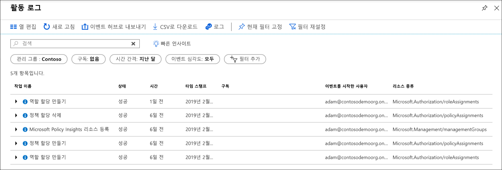

# <a name="manage-your-resources-with-management-groups"></a>관리 그룹으로 리소스 관리

조직에 구독이 많으면 구독에 대한 액세스, 정책 및 준수를 효율적으로 관리하는 방법이 필요할 수 있습니다. Azure 관리 그룹은 구독 상위 수준의 범위를 제공합니다. "관리 그룹"이라는 컨테이너에 구독을 구성하고 거버넌스 조건을 관리 그룹에 적용합니다. 관리 그룹에 속하는 모든 구독은 관리 그룹에 적용되는 조건을 자동으로 상속합니다.

관리 그룹은 어떤 형식의 구독을 사용하든 관계 없이 대규모의 엔터프라이즈급 관리를 제공합니다.  관리 그룹에 대해 자세히 알아보려면 [Azure 관리 그룹으로 리소스 구성](overview.md)을 참조하세요.

[!INCLUDE [GDPR-related guidance](../../../includes/gdpr-intro-sentence.md)]

[!INCLUDE [az-powershell-update](../../../includes/updated-for-az.md)]

## <a name="change-the-name-of-a-management-group"></a>관리 그룹의 이름 변경

포털, PowerShell 또는 Azure CLI를 사용하여 관리 그룹의 이름을 변경할 수 있습니다.

### <a name="change-the-name-in-the-portal"></a>포털에서 이름 변경

1. [Azure Portal](https://portal.azure.com)에 로그인합니다.

1. **모든 서비스** > **관리 그룹**을 선택합니다.

1. 이름을 바꾸려는 관리 그룹을 선택합니다.

1. 선택 **세부 정보**합니다.

1. 페이지 맨 위에서 **그룹 이름 바꾸기** 옵션을 선택합니다.

   

1. 메뉴가 열릴 때 표시하려는 새 이름을 입력합니다.

   

1. **저장**을 선택합니다.

### <a name="change-the-name-in-powershell"></a>PowerShell에서 이름 변경

표시 이름을 사용 하 여 업데이트할 **업데이트 AzManagementGroup**합니다. 예를 들어 변경 관리 하려면 그룹 표시 이름이 "Contoso IT"에서 "Contoso Group", 다음 명령을 실행 하면:

```azurepowershell-interactive
Update-AzManagementGroup -GroupName 'ContosoIt' -DisplayName 'Contoso Group'
```

### <a name="change-the-name-in-azure-cli"></a>Azure CLI에서 이름 변경

Azure CLI의 경우 update 명령을 사용합니다.

```azurecli-interactive
az account management-group update --name 'Contoso' --display-name 'Contoso Group'
```

## <a name="delete-a-management-group"></a>관리 그룹 삭제

관리 그룹을 삭제하려면 다음 요구 사항이 충족되어야 합니다.

1. 관리 그룹 아래에 자식 관리 그룹 또는 구독이 없습니다.

   - 구독을 관리 그룹 외부로 이동하려면 [다른 관리 그룹으로 구독 이동](#move-subscriptions-in-the-hierarchy)을 참조하세요.

   - 관리 그룹을 다른 관리 그룹으로 이동하려면 [계층에서 관리 그룹 이동](#move-management-groups-in-the-hierarchy)을 참조하세요.

1. 관리 그룹 ("Owner", "참가자" 또는 "관리 그룹 참가자")에 대 한 쓰기 권한이 해야합니다. 보유하고 있는 사용 권한을 보려면 관리 그룹을 선택하고 **IAM**을 선택합니다. RBAC 역할에 대해 자세히 알아보려면 [RBAC로 액세스 및 사용 권한 관리](../../role-based-access-control/overview.md)를 참조하세요.  

### <a name="delete-in-the-portal"></a>포털에서 삭제

1. [Azure Portal](https://portal.azure.com)에 로그인합니다.

1. **모든 서비스** > **관리 그룹**을 선택합니다.

1. 삭제하려는 관리 그룹을 선택합니다.

1. 선택 **세부 정보**합니다.

1. **삭제** 선택

    > [!TIP]
    > 아이콘이 사용되지 않도록 설정되면 아이콘 위로 마우스 선택기를 가져가면 이유가 표시됩니다.

   

1. 관리 그룹을 삭제할 것인지 확인하는 창이 열립니다.

   

1. **예**를 선택합니다.

### <a name="delete-in-powershell"></a>PowerShell에서 삭제

사용 된 **제거 AzManagementGroup** 관리 그룹을 삭제 하려면 PowerShell 내에서 명령을 합니다.

```azurepowershell-interactive
Remove-AzManagementGroup -GroupName 'Contoso'
```

### <a name="delete-in-azure-cli"></a>Azure CLI에서 삭제

Azure CLI에서 az account management-group delete 명령을 사용합니다.

```azurecli-interactive
az account management-group delete --name 'Contoso'
```

## <a name="view-management-groups"></a>관리 그룹 보기

직접 또는 상속된 RBAC 역할이 있는 모든 관리 그룹을 볼 수 있습니다.  

### <a name="view-in-the-portal"></a>포털에서 보기

1. [Azure Portal](https://portal.azure.com)에 로그인합니다.

1. **모든 서비스** > **관리 그룹**을 선택합니다.

1. 관리 그룹 계층 구조 페이지를 로드 합니다. 이 페이지 위치 이며 모든 관리 그룹을 탐색할 수 있습니다 구독에 액세스할 수 있습니다. 그룹 이름을 선택하면 계층에서 한 수준 아래로 이동합니다. 탐색은 파일 탐색기처럼 작동합니다.

1. 관리 그룹의 세부 정보를 보려면 관리 그룹의 제목 옆에 있는 **(세부 정보)** 링크를 선택합니다. 이 링크를 사용할 수 없으면 해당 관리 그룹을 볼 수 있는 권한이 없습니다.

   

### <a name="view-in-powershell"></a>PowerShell에서 보기

Get-AzManagementGroup 명령을 사용 하 여 모든 그룹을 검색 합니다.  참조 [Az.Resources](/powershell/module/az.resources/Get-AzManagementGroup) 모듈 관리의 전체 목록에 대 한 GET Powershell 명령을 그룹화 합니다.  

```azurepowershell-interactive
Get-AzManagementGroup
```

단일 관리 그룹의 정보를 보려면 -GroupName 매개 변수를 사용합니다.

```azurepowershell-interactive
Get-AzManagementGroup -GroupName 'Contoso'
```

사용 하 여 특정 관리 그룹 및 그 아래의 계층의 모든 수준으로 되돌리려면 **-확장** 하 고 **-Recurse** 매개 변수입니다.  

```azurepowershell-interactive
PS C:\> $response = Get-AzManagementGroup -GroupName TestGroupParent -Expand -Recurse
PS C:\> $response

Id                : /providers/Microsoft.Management/managementGroups/TestGroupParent
Type              : /providers/Microsoft.Management/managementGroups
Name              : TestGroupParent
TenantId          : 00000000-0000-0000-0000-000000000000
DisplayName       : TestGroupParent
UpdatedTime       : 2/1/2018 11:15:46 AM
UpdatedBy         : 00000000-0000-0000-0000-000000000000
ParentId          : /providers/Microsoft.Management/managementGroups/00000000-0000-0000-0000-000000000000
ParentName        : 00000000-0000-0000-0000-000000000000
ParentDisplayName : 00000000-0000-0000-0000-000000000000
Children          : {TestGroup1DisplayName, TestGroup2DisplayName}

PS C:\> $response.Children[0]

Type        : /managementGroup
Id          : /providers/Microsoft.Management/managementGroups/TestGroup1
Name        : TestGroup1
DisplayName : TestGroup1DisplayName
Children    : {TestRecurseChild}

PS C:\> $response.Children[0].Children[0]

Type        : /managementGroup
Id          : /providers/Microsoft.Management/managementGroups/TestRecurseChild
Name        : TestRecurseChild
DisplayName : TestRecurseChild
Children    :
```

### <a name="view-in-azure-cli"></a>Azure CLI에서 보기

모든 그룹을 검색하려면 list 명령을 사용합니다.  

```azurecli-interactive
az account management-group list
```

단일 관리 그룹의 정보를 보려면 show 명령을 사용합니다.

```azurecli-interactive
az account management-group show --name 'Contoso'
```

사용 하 여 특정 관리 그룹 및 그 아래의 계층의 모든 수준으로 되돌리려면 **-확장** 하 고 **-Recurse** 매개 변수입니다.

```azurecli-interactive
az account management-group show --name 'Contoso' -e -r
```

## <a name="move-subscriptions-in-the-hierarchy"></a>계층에서 구독 이동

관리 그룹을 만드는 한 가지 이유는 구독을 번들로 묶는 것입니다. 관리 그룹 및 구독만 다른 관리 그룹의 자식으로 만들 수 있습니다. 관리 그룹으로 이동되는 구독은 부모 관리 그룹에서 모든 사용자 액세스 및 정책을 상속합니다.

구독을 이동 하려면 다음 RBAC 사용 권한을 모두 true 여야 필요 합니다.

- 자식 구독에 대한 "소유자" 역할
- 대상 부모 관리 그룹에서 "소유자", "참가자" 또는 "관리 그룹 참가자" 역할.
- 기존 부모 관리 그룹에서 "소유자", "참가자" 또는 "관리 그룹 참가자" 역할.

이면 대상 또는 기존 부모 관리 그룹에 루트 관리 그룹 사용 권한 요구 사항을 적용 되지 않습니다. 루트 관리 그룹을 모든 새 관리 그룹 및 구독에 대 한 스폿 방문 기본값 이므로에 사용 권한 항목을 이동할 필요가 없습니다.

구독에 소유자 역할을 현재 관리 그룹에서 상속 하는 경우 이동 대상 제한 됩니다. 이동할 수 있습니다만 구독 다른 관리 그룹에 소유자 역할이 있는 경우. 이동할 수 없습니다 관리 그룹에 구독 소유권을 잃을 수 있으므로 참가자는 위치입니다. 직접 (관리 그룹에서 상속 안 함) 구독에 대 한 소유자 역할에 할당 하는 경우 이동할 수 있습니다이 관리 그룹에는 참가자의 경우.

어떤 사용 권한이 있는 Azure portal 선택 그룹 및 선택한 관리 보려는 **IAM**합니다. RBAC 역할에 대해 자세히 알아보려면 [RBAC로 액세스 및 사용 권한 관리](../../role-based-access-control/overview.md)를 참조하세요.

### <a name="move-subscriptions-in-the-portal"></a>포털에서 구독 이동

#### <a name="add-an-existing-subscription-to-a-management-group"></a>관리 그룹에 기존 구독 추가

1. [Azure Portal](https://portal.azure.com)에 로그인합니다.

1. **모든 서비스** > **관리 그룹**을 선택합니다.

1. 부모로 지정할 관리 그룹을 선택합니다.

1. 페이지 맨 위에서 **구독 추가**를 선택합니다.

1. 올바른 ID를 사용해서 목록의 구독을 선택합니다.

   

1. “저장”을 선택합니다.

#### <a name="remove-a-subscription-from-a-management-group"></a>관리 그룹에서 구독 제거

1. [Azure Portal](https://portal.azure.com)에 로그인합니다.

1. **모든 서비스** > **관리 그룹**을 선택합니다.

1. 현재 부모로 지정할 관리 그룹을 선택합니다.  

1. 이동하려는 목록의 구독에 대해 행 끝에 있는 줄임표를 선택합니다.

   

1. **이동**을 선택합니다.

1. 열리는 메뉴에서 **부모 관리 그룹**을 선택합니다.

   

1. **저장**을 선택합니다.

### <a name="move-subscriptions-in-powershell"></a>PowerShell에서 구독 이동

PowerShell에서 구독을 이동 하려면 새 AzManagementGroupSubscription 명령을 사용할 수 있습니다.  

```azurepowershell-interactive
New-AzManagementGroupSubscription -GroupName 'Contoso' -SubscriptionId '12345678-1234-1234-1234-123456789012'
```

간의 링크를 제거 하 고 구독 및 관리 그룹 제거 AzManagementGroupSubscription 명령을 사용 합니다.

```azurepowershell-interactive
Remove-AzManagementGroupSubscription -GroupName 'Contoso' -SubscriptionId '12345678-1234-1234-1234-123456789012'
```

### <a name="move-subscriptions-in-azure-cli"></a>Azure CLI에서 구독 이동

CLI에서 구독을 이동하려면 add 명령을 사용합니다.

```azurecli-interactive
az account management-group subscription add --name 'Contoso' --subscription '12345678-1234-1234-1234-123456789012'
```

관리 그룹에서 구독을 제거하려면 구독 제거 명령을 사용합니다.  

```azurecli-interactive
az account management-group subscription remove --name 'Contoso' --subscription '12345678-1234-1234-1234-123456789012'
```

## <a name="move-management-groups-in-the-hierarchy"></a>계층 구조에서 관리 그룹 이동  

부모 관리 그룹으로 이동 하면 해당 그룹 계층도 함께 이동 합니다. 관리 그룹 이동 내용은 해야 액세스가 [관리 그룹 액세스](index.md#management-group-access)합니다.

### <a name="move-management-groups-in-the-portal"></a>포털에서 관리 그룹 이동

1. [Azure Portal](https://portal.azure.com)에 로그인합니다.

1. **모든 서비스** > **관리 그룹**을 선택합니다.

1. 부모로 지정할 관리 그룹을 선택합니다.

1. 페이지 맨 위에서 **관리 그룹 추가**를 선택합니다.

1. 열리는 메뉴에서 새 관리 그룹을 만들지 또는 기존 관리 그룹을 사용할지를 선택합니다.

   - 새 관리 그룹을 선택하면 새 관리 그룹이 생성됩니다.
   - 기존 관리 그룹을 선택하면 이 관리 그룹으로 이동할 수 있는 모든 관리 그룹의 드롭다운이 표시됩니다.  

   

1. **저장**을 선택합니다.

### <a name="move-management-groups-in-powershell"></a>PowerShell에서 관리 그룹 이동

명령을 사용 하 여 업데이트 AzManagementGroup PowerShell에서 관리 그룹을 다른 그룹 아래로 이동 합니다.

```azurepowershell-interactive
$parentGroup = Get-AzManagementGroup -GroupName ContosoIT
Update-AzManagementGroup -GroupName 'Contoso' -ParentId $parentGroup.id
```  

### <a name="move-management-groups-in-azure-cli"></a>Azure CLI에서 관리 그룹 이동

Azure CLI에서 update 명령을 사용하여 관리 그룹을 이동합니다.

```azurecli-interactive
az account management-group update --name 'Contoso' --parent ContosoIT
```

## <a name="audit-management-groups-using-activity-logs"></a>활동 로그를 사용하여 관리 그룹 감사

관리 그룹은 [Azure 활동 로그](../../azure-monitor/platform/activity-logs-overview.md) 내에서 지원됩니다. 다른 Azure 리소스와 같은 중앙 위치에서 관리 그룹에 발생 하는 모든 이벤트를 쿼리할 수 있습니다.  예를 들어, 특정 관리 그룹에 이루어진 모든 역할 할당 또는 정책 할당 변경 내용을 볼 수 있습니다.



Azure Portal 외부에서 관리 그룹의 쿼리를 살펴보면 관리 그룹에 대한 대상 범위가 **"/providers/Microsoft.Management/managementGroups/{yourMgID}"** 와 같이 표시됩니다.

## <a name="referencing-management-groups-from-other-resource-providers"></a>다른 리소스 공급자에서 관리 그룹 참조

관리 그룹에서 다른 리소스 공급자의 동작을 참조할 때 다음 경로 범위로 사용 합니다. 이 경로 PowerShell, Azure CLI 및 REST Api를 사용 하는 경우에 사용 됩니다.  

>"/providers/Microsoft.Management/managementGroups/{yourMgID}"

이 경로 사용 하는 예제는 PowerShell에서 관리 그룹에 새 역할 할당을 할당 하는 경우

```azurepowershell-interactive
New-AzRoleAssignment -Scope "/providers/Microsoft.Management/managementGroups/Contoso"
```

동일한 범위 경로 관리 그룹에서 정책 정의 검색할 때 사용 됩니다.

```http
GET https://management.azure.com/providers/Microsoft.Management/managementgroups/MyManagementGroup/providers/Microsoft.Authorization/policyDefinitions/ResourceNaming?api-version=2018-05-01
```

## <a name="next-steps"></a>다음 단계

관리 그룹에 대해 자세히 알아보려면 다음 항목을 참조하세요.

- [관리 그룹을 만들어 Azure 리소스 구성](create.md)
- [관리 그룹을 변경, 삭제 또는 관리하는 방법](manage.md)
- [Azure PowerShell 리소스 모듈에서 관리 그룹 검토](/powershell/module/az.resources#resources)
- [REST API에서 관리 그룹 검토](/rest/api/resources/managementgroups)
- [Azure CLI에서 관리 그룹 검토](/cli/azure/account/management-group)