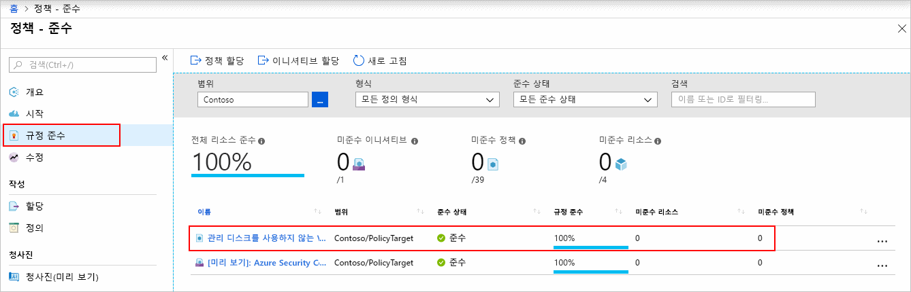
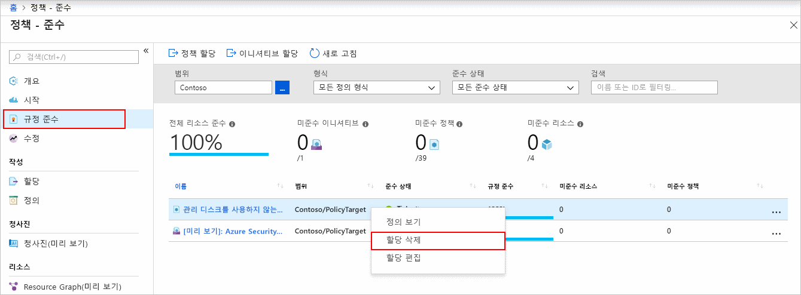

# 빠른 시작: Resource Manager 템플릿을 사용하여 비준수 리소스를 식별하는 정책 할당 만들기

Azure의 규정 준수를 이해하는 첫 번째 단계는 리소스 상태를 식별하는 것입니다.
이 빠른 시작에서는 관리 디스크를 사용하지 않는 가상 머신을 식별하는 정책 할당을 만드는 과정을 단계별로 안내합니다.

이 과정이 끝나면 관리 디스크를 사용하지 않는 가상 머신이 식별됩니다. 이 가상 머신은 정책 할당을 *비준수*합니다.

Azure 구독이 아직 없는 경우 시작하기 전에 [체험](https://azure.microsoft.com/free/) 계정을 만듭니다.

## 정책 할당 만들기

이 빠른 시작에서는 정책 할당을 만들고 관리 디스크를 사용하지 않는 VM 감사(*Audit VMs that do not use managed disks*)라는 기본 제공 정책 정의를 할당합니다. 사용 가능한 기본 제공 정책의 부분 목록은 [Azure Policy 샘플](./samples/index.md)을 참조하세요.

정책 할당은 여러 가지 방법으로 만들 수 있습니다. 이 빠른 시작에서는 [빠른 시작 템플릿](https://azure.microsoft.com/resources/templates/101-azurepolicy-assign-builtinpolicy-resourcegroup/)을 사용합니다.
다음은 템플릿의 복사본입니다.

[!code-json[policy-assignment](~/quickstart-templates/101-azurepolicy-assign-builtinpolicy-resourcegroup/azuredeploy.json)]

> [!NOTE]
> Azure Policy 서비스는 무료입니다. 자세한 내용은 [Azure Policy 개요](./overview.md)를 참조하세요.

1. 다음 이미지를 선택하고 Azure Portal에 로그인하여 템플릿을 엽니다.

   

1. 다음 값을 선택하거나 입력합니다.

   | Name | 값 |
   |------|-------|
   | 구독 | Azure 구독을 선택합니다. |
   | 리소스 그룹 | **새로 만들기**를 선택하고 이름을 지정한 다음, **확인**을 선택합니다. 스크린샷에서 리소스 그룹 이름은 *mypolicyquickstart\<MMDD 날짜>rg*입니다. |
   | 위치 | 지역을 선택합니다. 예: **미국 중부** |
   | 정책 할당 이름 | 정책 할당 이름을 지정합니다. 원하는 경우 정책 정의 표시 이름을 사용할 수 있습니다. 예: **관리 디스크를 사용하지 않는 VM 감사**. |
   | Rg 이름 | 정책을 할당할 리소스 그룹 이름을 지정합니다. 이 빠른 시작에서는 기본값인 **[resourceGroup().name]** 을 사용합니다. **[resourceGroup()](../../azure-resource-manager/resource-group-template-functions-resource.md#resourcegroup)** 은 리소스 그룹을 검색하는 템플릿 함수입니다. |
   | 정책 정의 ID | **/providers/Microsoft.Authorization/policyDefinitions/0a914e76-4921-4c19-b460-a2d36003525a**를 지정합니다. |
   | 위에 명시된 사용 약관에 동의함 | (선택) |

1. **구매**를 선택합니다.

몇 가지 추가 리소스:

- 더 많은 샘플 템플릿을 찾으려면, [Azure 빠른 시작 템플릿](https://azure.microsoft.com/resources/templates/?resourceType=Microsoft.Authorization&pageNumber=1&sort=Popular)을 참조하세요.
- 템플릿 참조를 보려면 [Azure 템플릿 참조](/azure/templates/microsoft.authorization/allversions)를 참조하세요.
- Resource Manager 템플릿을 개발하는 방법을 알아보려면 [Azure Resource Manager 설명서](/azure/azure-resource-manager/)를 참조하세요.
- 구독 수준 배포에 대해 알아보려면 [구독 수준에서 리소스 그룹 및 리소스 만들기](../../azure-resource-manager/deploy-to-subscription.md)를 참조하세요.

## 규정 비준수 리소스 식별

페이지 왼쪽에서 **준수**를 선택합니다. 그런 다음, 앞에서 만든 **관리 디스크를 사용하지 않는 감사 VM** 정책 할당을 찾습니다.

이 새로운 할당을 준수하지 않는 기존 리소스가 있는 경우 **비준수 리소스** 아래에 표시됩니다.

자세한 내용은 [규정 준수 작동 방식](./how-to/get-compliance-data.md#how-compliance-works)을 참조하세요.

## 리소스 정리

만든 할당을 제거하려면 다음 단계를 따르세요.

1. Azure Policy 페이지 왼쪽에서 **준수**(또는 **할당**)를 선택하고 앞에서 만든 **관리 디스크를 사용하지 않는 감사 VM** 정책 할당을 찾습니다.

1. **관리 디스크를 사용하지 않는 VM 감사** 정책 할당을 마우스 오른쪽 단추로 클릭하고 **할당 삭제**를 선택합니다.

   

## 다음 단계

이 빠른 시작에서는 범위에 기본 제공 정책 정의를 할당하고 규정 준수 보고서를 평가했습니다. 정책 정의는 범위 내 모든 리소스가 규정을 준수하는지 확인하고, 규정을 준수하지 않는 리소스를 파악합니다.

새 리소스가 규정을 준수하는지 확인하는 정책을 할당하는 방법을 알아보려면 다음 자습서를 계속 진행하세요.

> [!div class="nextstepaction"]
> [정책 만들기 및 관리](./tutorials/create-and-manage.md)
