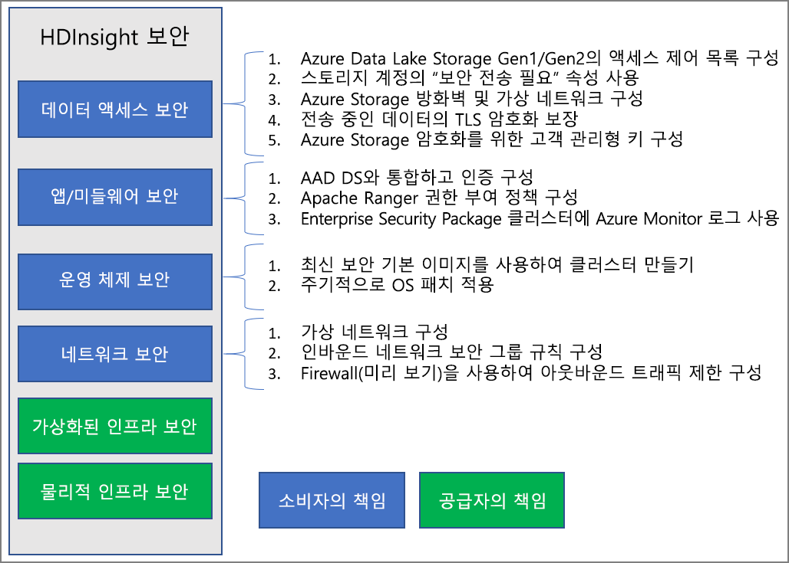

# Azure HDInsight의 엔터프라이즈 보안 개요

Azure HDInsight는 엔터프라이즈 보안 요구 사항을 처리할 수 있는 여러 가지 방법을 제공합니다. 이러한 솔루션의 대부분은 기본적으로 활성화되지 않습니다. 이러한 유연성을 통해 가장 중요한 보안 기능을 선택할 수 있으며 원하지 않는 기능의 비용을 지불하지 않도록 방지할 수 있습니다. 또한 이 유연성은 사용자의 설정 및 환경에 올바른 솔루션이 사용되도록 하는 것을 의미합니다.

이 문서에서는 보안 솔루션을 경계 보안, 인증, 권한 부여 및 암호화의 4가지 기존 보안 핵심 요소로 구분하여 보안 솔루션을 살펴봅니다.

또한 이 문서에서는 **Azure HDInsight ESP(Enterprise Security Package)** 를 소개합니다. 이 패키지는 HDInsight 클러스터에 대한 Active Directory 기반 인증, 다중 사용자 지원 및 역할 기반 액세스 제어를 제공합니다.

## 엔터프라이즈 보안 핵심 요소

엔터프라이즈 보안을 확인하는 한 가지 방법은 보안 솔루션을 제어 유형에 따라 4개의 주요 그룹으로 나누는 것입니다. 이러한 그룹은 보안 핵심 요소라고도 하며, 경계 보안, 인증, 권한 부여 및 암호화 유형입니다.

### 경계 보안

HDInsight의 경계 보안은 [가상 네트워크](../hdinsight-plan-virtual-network-deployment.md)를 통해 달성됩니다. 엔터프라이즈 관리자는 클러스터를 VNET(가상 네트워크) 내에 만들고, NSG(네트워크 보안 그룹)를 사용하여 VNET에 대한 액세스를 제한할 수 있습니다. 인바운드 NSG 규칙에 허용된 IP 주소만 HDInsight 클러스터와 통신할 수 있습니다. 이 구성은 경계 보안을 제공합니다.

VNET에 배포된 모든 클러스터에는 프라이빗 엔드포인트도 있습니다. 엔드포인트는 클러스터 게이트웨이에 대한 프라이빗 HTTP 액세스를 위해 VNET 내부의 개인 IP로 확인됩니다.

### 인증

HDInsight의 [Enterprise Security Package](apache-domain-joined-architecture.md)는 Active Directory 기반 인증, 다중 사용자 지원 및 역할 기반 액세스 제어를 제공합니다. Active Directory 통합은 [Azure Active Directory Domain Services](../../active-directory-domain-services/overview.md)를 사용하여 이루어집니다. 이러한 기능을 사용하면 Active Directory 도메인에 조인된 HDInsight 클러스터를 만들 수 있습니다. 그런 다음, 클러스터에 인증할 수 있는 엔터프라이즈의 직원 목록을 구성합니다.

이 설정을 통해 기업 직원은 해당 도메인 자격 증명을 사용하여 클러스터 노드에 로그인할 수 있습니다. 또한 해당 도메인 자격 증명을 사용하여 승인된 다른 엔드포인트로 인증할 수 있습니다. Apache Ambari Views, ODBC, JDBC, PowerShell 및 REST API와 같이 클러스터와 상호 작용합니다.

### 권한 부여

대부분의 기업이 따르는 모범 사례는 모든 직원이 모든 엔터프라이즈 리소스에 완전히 액세스할 수 있는 것은 아닙니다. 마찬가지로 관리자는 클러스터 리소스에 대한 역할 기반 액세스 제어 정책을 정의할 수 있습니다. 이 작업은 ESP 클러스터에서만 사용할 수 있습니다.

Hadoop 관리자는 RBAC(역할 기반 액세스 제어)를 구성할 수 있습니다. 구성에서는 Apache Ranger 플러그 인으로 Apache [Hive](apache-domain-joined-run-hive.md), [HBase](apache-domain-joined-run-hbase.md) 및 [Kafka](apache-domain-joined-run-kafka.md)를 보호합니다. RBAC 정책을 구성하면 권한을 조직의 역할과 연결할 수 있습니다. 이 추상화 계층을 사용하면 사용자가 자신의 업무를 수행하는 데 필요한 권한만 더 쉽게 부여받을 수 있습니다. 또한 Ranger를 사용하면 직원의 데이터 액세스와 액세스 제어 정책에 대한 모든 변경을 감사할 수 있습니다.

예를 들어, 관리자는 [Apache Ranger](https://ranger.apache.org/)를 구성하여 Hive에 대한 액세스 제어 정책을 설정할 수 있습니다. 이 기능은 행 수준 및 열 수준 필터링(데이터 마스킹)을 보장합니다. 그리고 권한이 없는 사용자의 중요한 데이터를 필터링합니다.

### 감사

무단 또는 실수로 실행된 리소스 액세스를 추적하려면 감사 클러스터 리소스 액세스가 필요합니다. 클러스터 리소스를 무단 액세스로부터 보호하는 것만큼 중요합니다.

관리자는 HDInsight 클러스터 리소스 및 데이터에 대한 모든 액세스를 확인하고 보고할 수 있습니다. 관리자는 액세스 제어 정책 변경 내용을 확인하고 보고할 수 있습니다.

Apache Ranger 및 Ambari 감사 로그와 ssh 액세스 로그에 액세스하려면 [Azure Monitor를 사용하도록 설정](../hdinsight-hadoop-oms-log-analytics-tutorial.md#cluster-auditing)하고 감사 레코드를 제공하는 테이블을 살펴봅니다.

### 암호화

조직 보안 및 준수 요구 사항을 충족하는 데는 데이터 보호가 중요합니다. 권한 없는 직원의 데이터 액세스를 제한하고 데이터를 암호화해야 합니다.

HDInsight는 플랫폼 관리형 키 및 [고객 관리형 키](../disk-encryption.md)를 모두 사용하여 미사용 데이터 암호화를 지원합니다. 전송 중인 데이터의 암호화는 TLS와 IPSec 둘 다로 처리됩니다. 자세한 내용은 [Azure HDInsight 전송 중 암호화](encryption-in-transit.md)를 참조하세요.

### 규정 준수

Azure 규정 준수 제품은 공식 인증을 비롯한 다양한 유형의 보증을 기반으로 합니다. 또한 증명, 유효성 검사 및 권한 부여. 독립적인 타사 감사 회사가 작성한 평가. Microsoft에서 생성한 계약 수정, 자체 평가 및 고객 지침 문서입니다. HDInsight 규정 준수 정보는 [Microsoft Trust Center](https://www.microsoft.com/trust-center) 및 [Microsoft Azure 규정 준수 개요](https://gallery.technet.microsoft.com/Overview-of-Azure-c1be3942)를 참조하세요.

## 공동 책임 모델

다음 이미지에는 각 시스템에서 사용할 수 있는 주요 시스템 보안 영역과 보안 솔루션이 요약되어 있습니다. 또한 고객 역할을 하는 보안 영역을 강조 표시합니다. 그리고 서비스 공급자인 HDInsight의 역할을 하는 영역입니다.

다음 표에는 각 유형의 보안 솔루션용 리소스에 대한 링크가 나와 있습니다.

| 보안 영역 | 사용 가능한 솔루션 | 책임 당사자 |
|---|---|---|
| 데이터 액세스 보안 | Azure Data Lake Storage Gen1 및 Gen2에 대한 [ACL(액세스 제어 목록)](../../storage/blobs/data-lake-storage-access-control.md) 구성  | Customer |
|  | 스토리지 계정에서 ["보안 전송 필요"](../../storage/common/storage-require-secure-transfer.md) 속성을 사용하도록 설정 | Customer |
|  | [Azure Storage 방화벽](../../storage/common/storage-network-security.md) 및 가상 네트워크 구성 | Customer |
|  | Cosmos DB 및 [Azure SQL DB](../../azure-sql/database/vnet-service-endpoint-rule-overview.md)에 대해 [Azure 가상 네트워크 서비스 엔드포인트](../../virtual-network/virtual-network-service-endpoints-overview.md) 구성 | Customer |
|  | 클러스터 내 통신에 TLS 및 IPSec을 사용하려면 [전송 중 암호화](./encryption-in-transit.md) 기능이 활성화되어 있는지 확인합니다. | Customer |
|  | Azure Storage 암호화용 [고객 관리형 키](../../storage/common/customer-managed-keys-configure-key-vault.md) 구성 | Customer |
|  | [고객 잠금 장치](../../security/fundamentals/customer-lockbox-overview.md)를 사용하여 Azure 지원을 통해 데이터에 대한 액세스 제어 | Customer |
| 애플리케이션 및 미들웨어 보안 | AAD-DS와 통합 및 [ESP 구성](apache-domain-joined-configure-using-azure-adds.md) 또는 [OAuth 인증용 HIB](identity-broker.md) 사용| Customer |
|  | Apache [Ranger 권한 부여](apache-domain-joined-run-hive.md) 정책 구성 | Customer |
|  | [Azure Monitor 로그](../hdinsight-hadoop-oms-log-analytics-tutorial.md) 사용 | Customer |
| 운영 체제 보안 | 최신의 보안 기본 이미지를 사용하여 클러스터 만들기 | Customer |
|  | 정기적인 간격에 따른 [OS 패치](../hdinsight-os-patching.md) 보장 | Customer |
|  | [VM에 대한 CMK 디스크 암호화](../disk-encryption.md) 확인 | Customer |
| 네트워크 보안 | [가상 네트워크](../hdinsight-plan-virtual-network-deployment.md) 구성 |
|  | [인바운드 NSG(네트워크 보안 그룹) 규칙](../control-network-traffic.md) 또는 [프라이빗 링크](../hdinsight-private-link.md) 구성 | Customer |
|  | 방화벽을 사용하여 [아웃바운드 트래픽 제한](../hdinsight-restrict-outbound-traffic.md) 구성 | Customer |
|  | 클러스터 노드 간 [전송 중 IPSec 암호화](encryption-in-transit.md) 구성 | Customer |
| 가상화된 인프라 | 해당 없음 | HDInsight(클라우드 공급자) |
| 물리적 인프라 보안 | 해당 없음 | HDInsight(클라우드 공급자) |

## 다음 단계

* [ESP가 포함된 HDInsight 클러스터 계획](apache-domain-joined-architecture.md)
* [ESP가 포함된 HDInsight 클러스터 구성](./apache-domain-joined-configure-using-azure-adds.md)
* [ESP가 포함된 HDInsight 클러스터 관리](apache-domain-joined-manage.md)