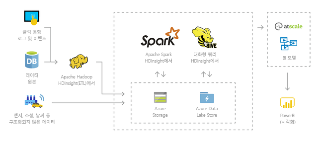
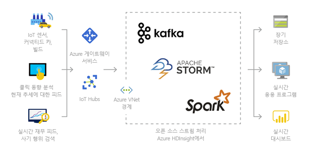
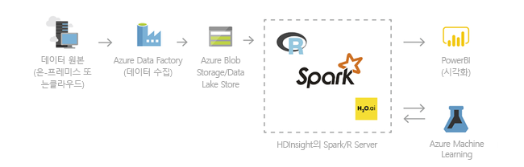
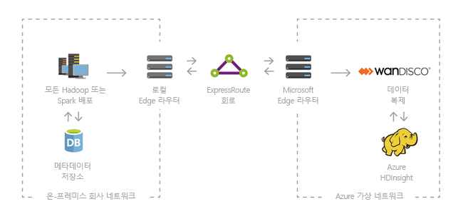

# Azure HDInsight 및 Apache Hadoop 기술 스택이란?

이 문서에서는 Azure HDInsight의 Apache Hadoop을 소개합니다. Azure HDInsight는 엔터프라이즈용 클라우드의 완전 관리형 전체 스펙트럼 오픈 소스 분석 서비스입니다. Hadoop, Apache Spark, Apache Hive, LLAP, Apache Kafka, Apache Storm, R 등과 같은 오픈 소스 프레임워크를 사용할 수 있습니다. 

## HDInsight 및 Hadoop 기술 스택이란?

[Apache Hadoop](https://hadoop.apache.org/)은 클러스터에서 빅 데이터 집합을 분산 처리하고 분석하기 위한 원래의 오픈 소스 프레임워크였습니다. Hadoop 기술 스택에는 Apache Hive, Apache HBase, Spark, Kafka 및 기타 등등 관련 소프트웨어 및 유틸리티가 포함되어 있습니다.

Azure HDInsight는 [HDP(Hortonworks Data Platform)](https://hortonworks.com/products/data-center/hdp/)의 Hadoop 구성 요소를 클라우드에 배포한 것입니다. Azure HDInsight는 대량 데이터를 쉽고 빠르며 비용 효율적으로 처리할 수 있도록 합니다. Hadoop, Spark, Hive, LLAP, Kafka, Storm, R 등과 같은 오픈 소스 프레임워크를 사용할 수 있습니다. 이러한 프레임워크를 사용하면 추출, 변환 및 로드(ETL), 데이터 웨어하우징, Machine Learning, IoT와 같은 광범위한 시나리오를 사용할 수 있습니다.

HDInsight에서 사용할 수 있는 Hadoop 기술 스택 구성 요소를 보려면 [HDInsight에서 사용할 수 있는 구성 요소 및 버전](../hdinsight-component-versioning.md)을 참조하세요. HDInsight의 Hadoop에 대한 자세한 내용은 [HDInsight에 대한 Azure 기능 페이지](https://azure.microsoft.com/services/hdinsight/)를 참조하세요.

## 빅 데이터란?

전에 없던 다양한 형식의 많은 양의 빅 데이터가 더 빠르게 수집되고 있습니다. 빅 데이터는 기록 데이터, 즉 저장된 데이터이거나 실시간 데이터, 즉 소스에서 스트리밍된 데이터일 수 있습니다. 빅 데이터에 대한 가장 일반적인 사용 사례에 대해 자세히 알아보려면 [HDInsight를 사용하는 시나리오](#scenarios-for-using-hdinsight)를 참조하세요.

## HDInsight의 Hadoop을 사용해야 하는 이유

이 섹션에서는 Azure HDInsight의 기능을 나열합니다.

|기능  |설명  |
|---------|---------|
|네이티브 클라우드     |     Azure HDInsight를 사용하면 Azure에서 [Hadoop](apache-hadoop-linux-tutorial-get-started.md), [Spark](../spark/apache-spark-jupyter-spark-sql.md), [대화형 쿼리(LLAP)](../interactive-query/apache-interactive-query-get-started.md), [Kafka](../kafka/apache-kafka-get-started.md), [Storm](../storm/apache-storm-tutorial-get-started-linux.md), [HBase](../hbase/apache-hbase-tutorial-get-started-linux.md) 및  [ML 서비스](../r-server/r-server-get-started.md)에 최적화된 클러스터를 만들 수 있습니다. 또한 HDInsight에서는 모든 프로덕션 워크로드에 엔드투엔드 SLA를 제공합니다.  |
|저렴한 비용 및 확장성     | HDInsight를 사용하면 워크로드의 [크기를 조정](../hdinsight-administer-use-portal-linux.md#scale-clusters) 할 수 있습니다.  [주문형 클러스터를 만들](../hdinsight-hadoop-create-linux-clusters-adf.md) 어서 비용을 줄이고 사용한 양만큼 요금을 지불하면 됩니다. 또한 작업을 운영하는 데이터 파이프라인을 작성할 수 있습니다. 분리된 계산 및 스토리지로 인해 성능 및 유연성이 향상됩니다. |
|보안 및 규정 준수    | HDInsight를 사용하면 [Azure Virtual Network](../hdinsight-extend-hadoop-virtual-network.md), [암호화](../hdinsight-hadoop-create-linux-clusters-with-secure-transfer-storage.md) 및 [Azure Active Directory](../domain-joined/apache-domain-joined-introduction.md)와 통합을 통해 엔터프라이즈 데이터 자산을 보호할 수 있습니다. HDInsight는 가장 널리 사용되는 업계 및 정부 [규격 표준](https://azure.microsoft.com/overview/trusted-cloud)을 충족합니다.        |
|모니터링    | Azure HDInsight는 [Azure Monitor 로그](../hdinsight-hadoop-oms-log-analytics-tutorial.md)와 통합하여 모든 클러스터를 모니터링할 수 있는 단일 인터페이스를 제공합니다.        |
|전 세계 이용 가능 여부 | HDInsight는 다른 모든 빅 데이터 분석 제품보다 많은  [지역](https://azure.microsoft.com/regions/services/) 에서 사용할 수 있습니다. Azure HDInsight는 주요 통치 지역에서 엔터프라이즈 요구 사항을 충족할 수 있도록 Azure Government, 중국 및 독일에서도 사용할 수 있습니다. |  
|생산성     |  Azure HDInsight를 사용하면 선호하는 개발 환경과 함께 Hadoop 및 Spark에 대한 풍부한 생산성 도구를 사용할 수 있습니다. 이러한 개발 환경에는 Scala, Python, R, Java 및 .NET 지원을 위한 [Visual Studio](apache-hadoop-visual-studio-tools-get-started.md), [VSCode](../hdinsight-for-vscode.md), [Eclipse](../spark/apache-spark-eclipse-tool-plugin.md) 및 [IntelliJ](../spark/apache-spark-intellij-tool-plugin.md)가 포함됩니다. 데이터 과학자는 [Jupyter](../spark/apache-spark-jupyter-notebook-kernels.md) 및 [Zeppelin](../spark/apache-spark-zeppelin-notebook.md)과 같은 널리 사용되는 Notebook을 사용하여 공동 작업할 수도 있습니다.    |
|확장성     |  [스크립트 작업](../hdinsight-hadoop-customize-cluster-linux.md)을 사용하는 구성 요소(Hue, Presto 등)를 설치하거나, [에지 노드를 추가](../hdinsight-apps-use-edge-node.md)하거나, [다른 빅 데이터 인증 애플리케이션과 통합](../hdinsight-apps-install-applications.md)하여 HDInsight 클러스터를 확장할 수 있습니다. HDInsight를 사용하면 [One-Click](https://azure.microsoft.com/services/hdinsight/partner-ecosystem/) 배포를 통해 가장 널리 사용되는 빅 데이터 솔루션과 원활히 통합할 수 있습니다.|

## HDInsight를 사용하는 시나리오

Azure HDInsight는 빅 데이터를 처리하는 다양한 시나리오에 사용할 수 있습니다. 기록 데이터(이미 수집되고 저장된 데이터) 또는 실시간 데이터(원본에서 직접 스트리밍된 데이터)일 수 있습니다. 이러한 데이터를 처리하는 시나리오는 다음과 같은 범주로 요약할 수 있습니다. 

### 일괄 처리(ETL)

ETL(추출, 변환 및 로드)은 구조화되지 않았거나 구조화된 데이터를 유형이 다른 데이터 원본에서 추출하는 프로세스입니다. 그런 다음 구조화된 형식으로 변환하고, 데이터 저장소로 로드합니다. 데이터 과학 또는 데이터 웨어하우징에 변환된 데이터를 사용할 수 있습니다.

### 데이터 웨어하우징

어떤 형식의 구조화되거나 구조화되지 않은 데이터에 대해 페타바이트 규모의 대화형 쿼리를 수행하는 데 HDInsight를 사용할 수 있습니다. 모델을 BI 도구에 연결하여 작성할 수도 있습니다. 자세한 내용은 [이 고객 스토리를 참고하세요](https://customers.microsoft.com/story/milliman). 

### IoT(사물 인터넷)

다양한 디바이스에서 실시간으로 수신된 스트리밍 데이터를 처리하는 데 HDInsight를 사용할 수 있습니다. 자세한 내용은 [Azure에서 HDInsight에서 Azure Managed Disks를 통한 Apache Kafka의 공개 미리 보기를 알려주는 이 블로그 게시물을 읽어 보세요](https://azure.microsoft.com/blog/announcing-public-preview-of-apache-kafka-on-hdinsight-with-azure-managed-disks/).

 

### 데이터 과학

HDInsight를 사용하여 데이터에서 중요한 통찰력을 추출하는 애플리케이션을 빌드할 수 있습니다. 비즈니스에 대한 향후 추세를 예측하는 데 우선적으로 Azure Machine Learning을 사용할 수도 있습니다. 자세한 내용은 [이 고객 스토리를 참고하세요](https://customers.microsoft.com/story/pros).

### 하이브리드

클라우드의 고급 분석 기능을 활용하기 위해 Azure로 기존 온-프레미스 빅 데이터 인프라를 확장하는 데 HDInsight를 사용할 수 있습니다.

## HDInsight의 클러스터 형식

HDInsight에는 구성 요소, 유틸리티 및 언어 추가와 같은 특정 클러스터 형식 및 클러스터 사용자 지정 기능이 포함됩니다. HDInsight는 다음 클러스터 형식을 제공합니다.

|클러스터 유형 | 설명 |
|---|---|
|[Apache Hadoop](https://wiki.apache.org/hadoop)|프레임워크는 병렬로 일괄 처리 데이터를 처리하고 분석하기 위해 HDFS, YARN 리소스 관리 및 간단한 MapReduce 프로그래밍 모델을 사용합니다.|
|[Apache Spark](https://spark.apache.org/)|메모리 내 처리를 지원하여 빅데이터 분석 애플리케이션의 성능을 향상하는 오픈 소스 병렬 처리 프레임워크입니다. [HDInsight의 Apache Spark란?](../spark/apache-spark-overview.md)을 참조하세요.|
|[Apache HBase](https://hbase.apache.org/)|구조화되지 않은/반구조화된 대량 데이터(잠재적으로 수십억 개의 행과 수십억 개의 열로 구성됨)에 대해 임의 액세스 및 강력한 일관성을 제공하는 Hadoop 기반의 NoSQL 데이터베이스입니다. [HDInsight의 HBase란?](../hbase/apache-hbase-overview.md)을 참조하세요.|
|[ML Services](https://docs.microsoft.com/machine-learning-server/rebranding-microsoft-r-server)|병렬 분산된 R 프로세스를 호스트하고 관리하기 위한 서버입니다. 데이터 과학자, 통계학자 및 R 프로그래머에게 HDInsight의 확장 가능한 분산형 분석 방법에 요청 시 액세스할 수 있도록 해줍니다. [HDInsight의 ML 서비스 개요](../r-server/r-server-overview.md)를 참조하세요.|
|[Apache Storm](https://storm.incubator.apache.org/)|대규모 데이터 스트림을 빠르게 처리하기 위한 분산형 실시간 계산 시스템입니다. HDInsight에서 관리 클러스터로 제공됩니다. [Storm 및 Hadoop을 사용하여 실시간 센서 데이터 분석](../storm/apache-storm-sensor-data-analysis.md)을 참조하세요.|
|[Apache 대화형 쿼리](https://cwiki.apache.org/confluence/display/Hive/LLAP)|대화형 및 더 빠른 Hive 쿼리에 대한 메모리 내 캐싱입니다. [HDInsight에서 대화형 쿼리 사용](../interactive-query/apache-interactive-query-get-started.md)을 참조하세요.|
|[Apache Kafka](https://kafka.apache.org/)|스트리밍 데이터 파이프라인 및 애플리케이션을 빌드하는 데 사용되는 오픈 소스 플랫폼입니다. 또한 Kafka는 고 데이터 스트림을 게시하고 구독할 수 있는 메시지 큐 기능을 제공합니다. [HDInsight에서 Apache Kafka에 대한 소개](../kafka/apache-kafka-introduction.md)를 참조하세요.|

## HDInsight의 오픈 소스 구성 요소

Azure HDInsight를 사용하면 Hadoop, Spark, Hive, LLAP, Kafka, Storm, HBase 및 R과 같은 오픈 소스 프레임워크를 사용하여 클러스터를 만들 수 있습니다. 이러한 클러스터는 기본적으로 [Apache Ambari](https://github.com/apache/ambari/blob/trunk/ambari-server/docs/api/v1/index.md), [Avro](https://avro.apache.org/docs/current/spec.html), [Apache Hive](https://hive.apache.org), [HCatalog](https://cwiki.apache.org/confluence/display/Hive/HCatalog/), [Apache Mahout](https://mahout.apache.org/), [Apache Hadoop MapReduce](https://wiki.apache.org/hadoop/MapReduce), [Apache Hadoop YARN](https://hadoop.apache.org/docs/current/hadoop-yarn/hadoop-yarn-site/YARN.html), [Apache Phoenix](https://phoenix.apache.org/), [Apache Pig](https://pig.apache.org/), [Apache Sqoop](https://sqoop.apache.org/), [Apache Tez](https://tez.apache.org/), [Apache Oozie](https://oozie.apache.org/), [Apache ZooKeeper](https://zookeeper.apache.org/)와 같은 클러스터에 포함된 다른 오픈 소스 구성 요소와 함께 제공됩니다.  

## HDInsight의 프로그래밍 언어

HDInsight 클러스터, 즉 Spark, HBase, Kafka, Hadoop 및 기타 클러스터는 다양한 프로그래밍 언어를 지원합니다. 일부 프로그래밍 언어는 기본적으로 설치되지 않습니다. 기본적으로 설치되지 않은 라이브러리, 모듈 또는 패키지의 경우 [스크립트 동작을 사용하여 구성 요소를 설치합니다](../hdinsight-hadoop-script-actions-linux.md).

|프로그래밍 언어  |정보  |
|---------|---------|
|기본 프로그래밍 언어 지원     | 기본적으로 HDInsight 클러스터는 다음을 지원합니다.<ul><li>Java</li><li>Python</li><li>.NET</li><li>Go</li></ul>  |
|Java 가상 머신(JVM) 언어     | Java 이외의 여러 언어는 JVM(Java Virtual Machine)에서 실행할 수 있습니다. 그러나 이러한 언어 중 일부를 실행하는 경우 클러스터에서 추가 구성 요소를 설치해야 할 수 있습니다. 이러한 JVM 기반 언어는 HDInsight 클러스터에서 지원됩니다. <ul><li>Clojure</li><li>Jython(Java용 Python)</li><li>스칼라</li></ul>     |
|Hadoop 관련 언어     | HDInsight 클러스터는 Hadoop 기술 스택에만 적용되는 다음 언어를 지원합니다. <ul><li>Pig 작업에 대한 Pig Latin</li><li>Hive 작업에 대한 HiveQL 및 SparkSQL</li></ul>        |

## HDInsight에 대한 개발 도구

IntelliJ, Eclipse, Visual Studio Code 및 Visual Studio를 포함하여 HDInsight 개발 도구를 사용하여 Azure와의 원활한 통합으로 HDInsight 데이터 쿼리 및 작업을 작성하고 제출할 수 있습니다.

* [IntelliJ용 Azure 도구 키트](https://docs.microsoft.com/azure/hdinsight/spark/apache-spark-intellij-tool-plugin)

* [Eclipse용 Azure 도구 키트](https://docs.microsoft.com/azure/hdinsight/spark/apache-spark-eclipse-tool-plugin)

* [VS Code용 Azure HDInsight 도구](https://docs.microsoft.com/azure/hdinsight/hdinsight-for-vscode?branch=pr-en-us-22999)

* [Visual Studio용 Azure Data Lake 도구](https://docs.microsoft.com/azure/hdinsight/hadoop/apache-hadoop-visual-studio-tools-get-started)

## HDInsight의 비즈니스 인텔리전스

익숙한 BI(비즈니스 인텔리전스) 도구는 파워 쿼리 추가 기능이나 Microsoft Hive ODBC Driver를 사용하여 HDInsight와 통합된 데이터를 검색, 분석 및 보고합니다.

* [Azure HDInsight와 함께 데이터 시각화 도구를 사용하는 Apache Spark BI](../spark/apache-spark-use-bi-tools.md)

* [Azure HDInsight에서 Microsoft Power BI를 사용하여 Apache Hive 데이터 시각화](apache-hadoop-connect-hive-power-bi.md)

* [Azure HDInsight에서 Power BI를 사용하여 대화형 쿼리 Hive 데이터 시각화](../interactive-query/apache-hadoop-connect-hive-power-bi-directquery.md)

* [파워 쿼리로 Apache Hadoop에 Excel 연결](apache-hadoop-connect-excel-power-query.md)(Windows 필요)

* [Microsoft Hive ODBC Driver로 Apache Hadoop에 Excel 연결](apache-hadoop-connect-excel-hive-odbc-driver.md)(Windows 필요)

* [HDInsight에서 SQL Server Analysis Services 사용](https://docs.microsoft.com/previous-versions/msp-n-p/dn749857(v=pandp.10))

* [HDInsight에서 SQL Server Reporting Services 사용](https://docs.microsoft.com/previous-versions/msp-n-p/dn749856(v=pandp.10))

## 다음 단계

이 문서에서는 Azure HDInsight란 무엇이며 이 제품이 Azure에서 Hadoop 및 기타 클러스터 형식을 제공하는 방법을 배웠습니다. HDInsight에서 Apache Hadoop 클러스터를 만드는 방법을 알아보려면 다음 문서를 계속 진행합니다.

> [!div class="nextstepaction"]
> [HDInsight에서 Apache Hadoop 클러스터 만들기](apache-hadoop-linux-create-cluster-get-started-portal.md)
