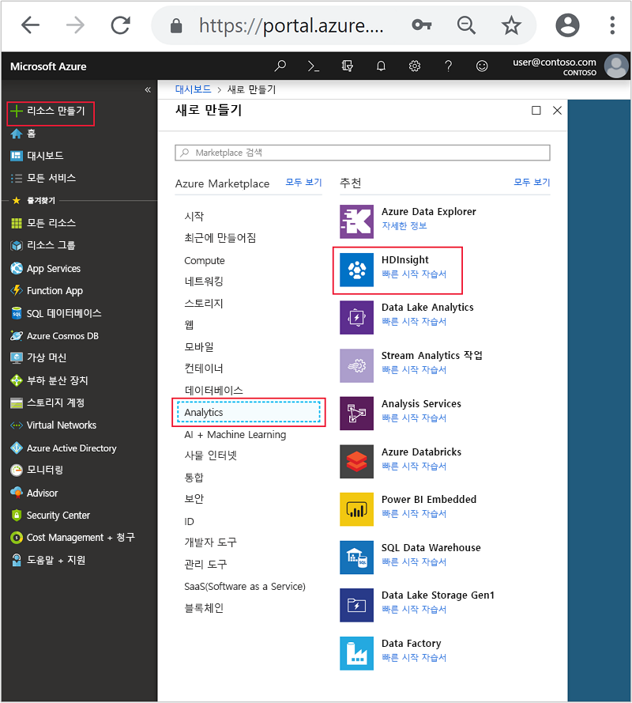
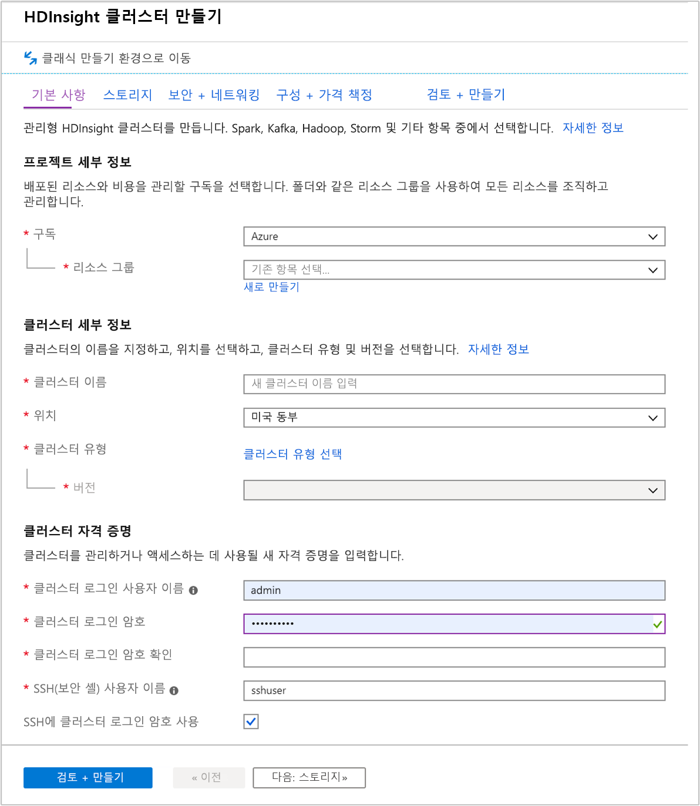
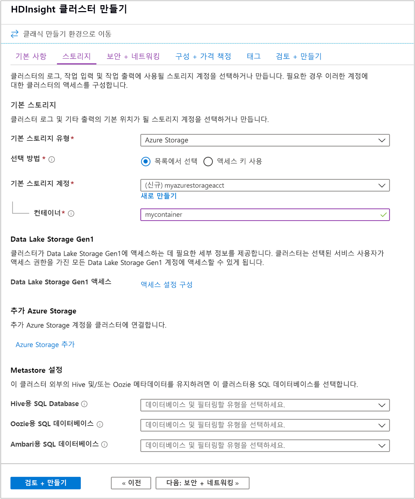
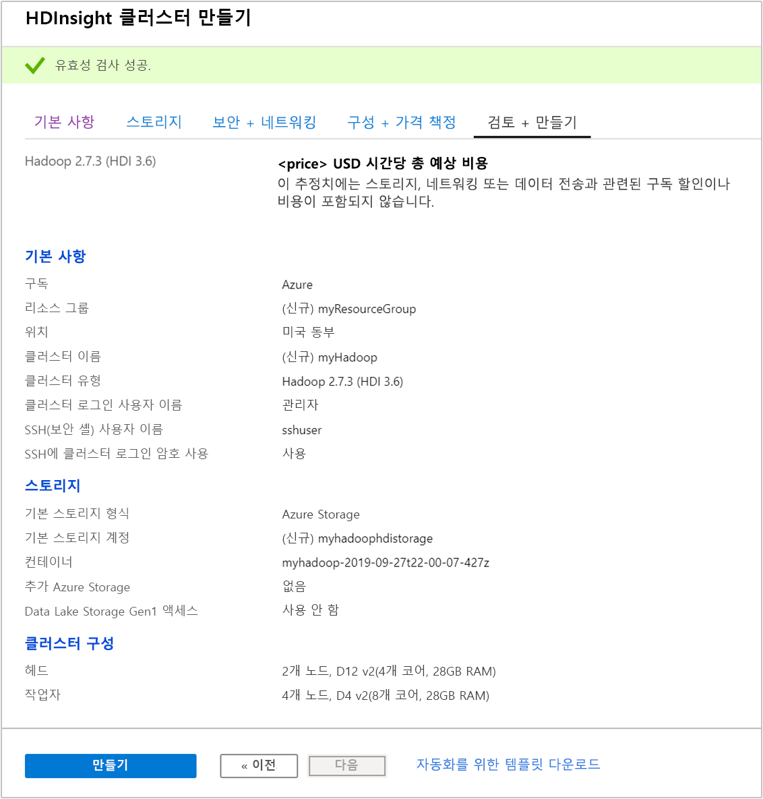
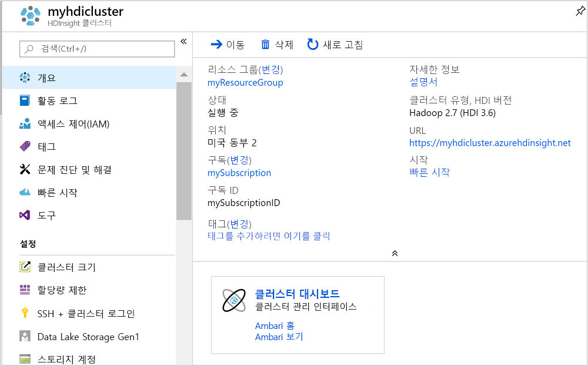
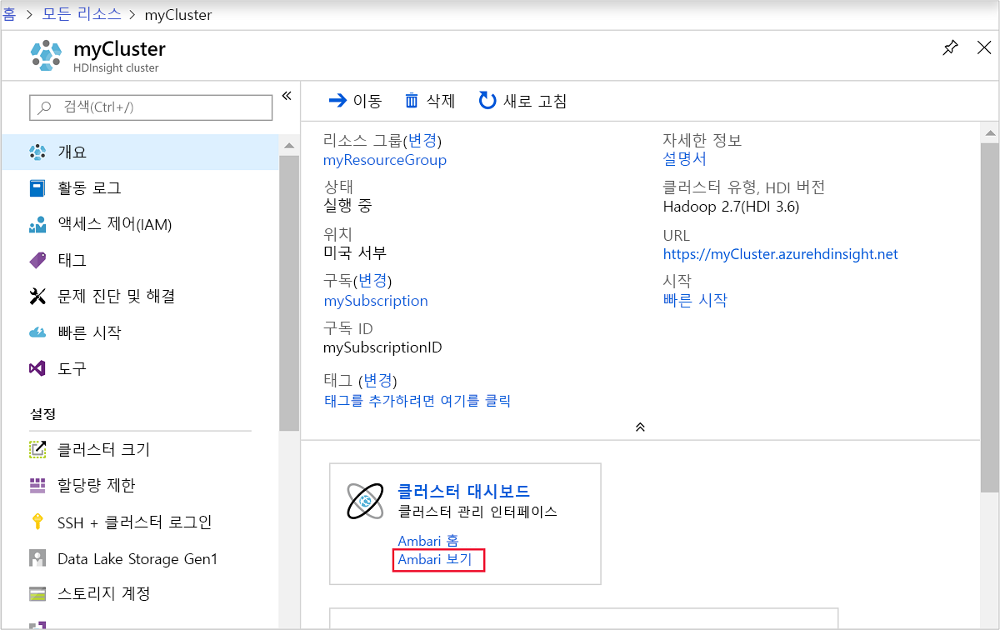
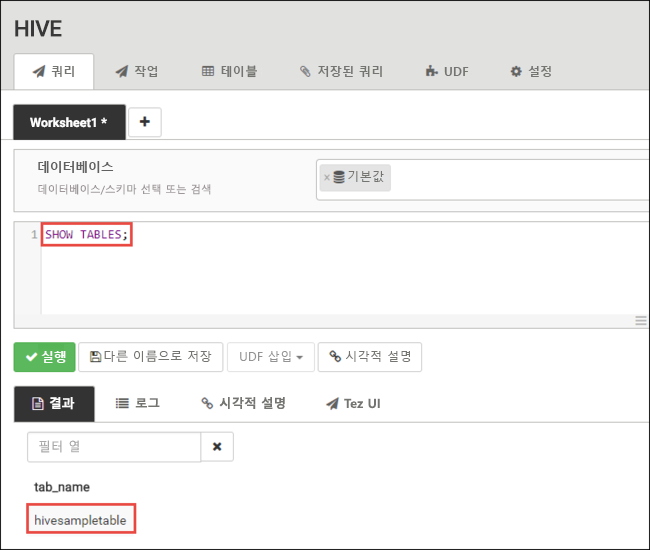
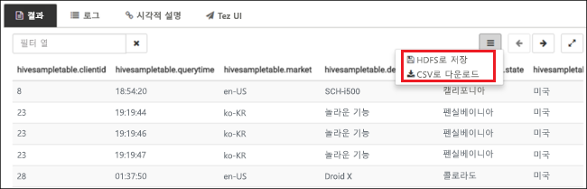
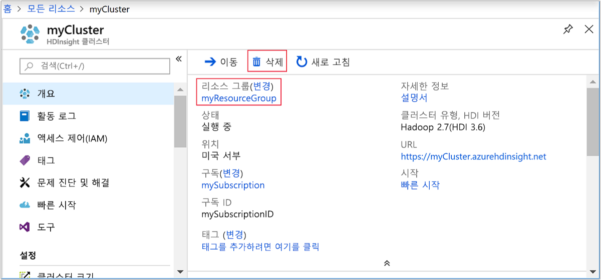

# <a name="quickstart-create-apache-hadoop-cluster-in-azure-hdinsight-using-azure-portal"></a>빠른 시작: Azure Portal을 사용하여 Azure HDInsight에서 Apache Hadoop 클러스터 만들기

이 문서에서는 Azure Portal을 사용하여 HDInsight에서 [Apache Hadoop](https://hadoop.apache.org/) 클러스터를 만든 다음, HDInsight에서 Apache Hive 작업을 실행하는 방법을 알아봅니다. Hadoop 작업의 대부분은 배치 작업입니다. 클러스터를 만들고 일부 작업을 실행한 다음 클러스터를 삭제합니다. 이 문서에서는 세 가지 작업을 모두 수행할 수 있습니다.

이 빠른 시작에서는 Azure Portal을 사용하여 HDInsight Hadoop 클러스터를 만듭니다. 또한 [Azure Resource Manager 템플릿](apache-hadoop-linux-tutorial-get-started.md)을 사용하여 클러스터를 만들 수 있습니다.

현재 HDInsight는 [일곱 가지 클러스터 형식](../hdinsight-overview.md#cluster-types-in-hdinsight)으로 제공됩니다. 각 클러스터 유형은 서로 다른 구성 요소 집합을 지원합니다. 모든 클러스터 형식은 Hive를 지원합니다. HDInsight에서 지원되는 구성 요소 목록은 [HDInsight에서 제공하는 Apache Hadoop 클러스터 버전의 새로운 기능](../hdinsight-component-versioning.md)을 참조하세요.  

Azure 구독이 아직 없는 경우 시작하기 전에 [체험](https://azure.microsoft.com/free/) 계정을 만듭니다.

## <a name="create-an-apache-hadoop-cluster"></a>Apache Hadoop 클러스터 만들기

이 섹션에서는 Azure Portal을 사용하여 HDInsight에서 Hadoop 클러스터를 만듭니다.

1. [Azure Portal](https://portal.azure.com)에 로그인합니다.

1. Azure Portal에서 **리소스 만들기** > **Analytics** > **HDInsight**로 이동합니다.

    

1. **기본 사항**에서 다음 값을 입력하거나 선택합니다.

    |속성  |Description  |
    |---------|---------|
    |Subscription    |  Azure 구독을 선택합니다. |
    |Resource group     | 리소스 그룹을 만들거나 기존 리소스 그룹을 선택합니다.  리소스 그룹은 Azure 구성 요소의 컨테이너입니다.  이 경우 리소스 그룹에는 HDInsight 클러스터 및 종속 Azure Storage 계정이 포함되어 있습니다. |
    |클러스터 이름   | Hadoop 클러스터에 사용할 이름을 입력합니다. HDInsight의 모든 클러스터는 동일한 DNS 네임스페이스를 공유하므로 이 이름은 고유해야 합니다. 이름은 문자, 숫자 및 하이픈을 포함하여 최대 59자로 구성할 수 있습니다. 이름의 첫 번째 및 마지막 문자에는 하이픈을 사용할 수 없습니다. |
    |위치    | 클러스터를 만들려는 Azure 위치를 선택합니다.  성능 향상을 위해 가까운 곳을 선택합니다. |
    |클러스터 유형| **클러스터 유형 선택**을 선택합니다. 그런 다음, 클러스터 유형으로 **Hadoop**을 선택합니다.|
    |버전|클러스터 유형에 대한 기본 버전이 지정됩니다. 다른 버전을 지정하려면 드롭다운 목록에서 선택합니다.|
    |클러스터 로그인 사용자 이름 및 암호    | 기본 로그인 이름은 **admin**입니다. 암호는 10자 이상이어야 하며, 숫자, 대문자, 소문자 및 영숫자가 아닌 문자(' " ` 문자 제외\)를 각각 하나 이상 포함해야 합니다. "Pass@word1"과 같은 일반적인 암호를 **제공하지 않았는지** 확인합니다.|
    |SSH(보안 셸) 사용자 이름 | 기본 사용자 이름은 **sshuser**입니다.  SSH 사용자 이름에 다른 이름을 입력할 수 있습니다. |
    |SSH에 클러스터 로그인 암호 사용| 클러스터 로그인 사용자에 대해 입력한 것과 동일한 암호를 SSH 사용자에 사용하려면 이 확인란을 선택합니다.|

    

    페이지 맨 아래에서 **다음: Storage >>** 를 선택하여 스토리지 설정으로 이동합니다.

1. **스토리지** 탭에서 다음 값을 입력합니다.

    |속성  |Description  |
    |---------|---------|
    |기본 스토리지 유형|기본값 **Azure Storage**를 사용합니다.|
    |선택 방법|기본값 **목록에서 선택**을 사용합니다.|
    |기본 스토리지 계정|드롭다운 목록을 사용하여 기존 스토리지 계정을 선택하거나 **새로 만들기**를 선택합니다. 새 계정을 만드는 경우 이름의 길이가 3~24자여야 하고, 숫자 및 소문자만 포함할 수 있습니다.|
    |컨테이너|자동으로 채워진 값을 사용합니다.|

    

    **검토 + 만들기** 탭을 선택합니다.

1. **검토 + 만들기** 탭의 이전 단계에서 선택한 값을 확인합니다.

    

1. **만들기**를 선택합니다. 클러스터를 만들려면 20분 정도가 걸립니다.

클러스터가 생성되면 Azure Portal에서 클러스터 개요 페이지가 나타납니다.



각 클러스터에는 [Azure Storage 계정](../hdinsight-hadoop-use-blob-storage.md) 또는 [Azure Data Lake 계정](../hdinsight-hadoop-use-data-lake-store.md) 종속성이 있습니다. 이 스토리지 계정을 기본 스토리지 계정이라고 합니다. HDInsight 클러스터와 해당 기본 스토리지 계정은 같은 Azure 지역에 있어야 합니다. 클러스터를 삭제해도 스토리지 계정은 삭제되지 않습니다.

> [!NOTE]  
> 기타 클러스터 생성 방법 및 이 빠른 시작에 사용된 속성에 대한 이해는 [HDInsight 클러스터 만들기](../hdinsight-hadoop-provision-linux-clusters.md)를 참조하세요.

## <a name="run-apache-hive-queries"></a>Apache Hive 쿼리 실행

[Apache Hive](hdinsight-use-hive.md) 는 HDInsight에서 사용되는 가장 인기 있는 구성 요소입니다. HDInsight에서 Hive 작업을 실행하는 방법은 여러 가지가 있습니다. 이 빠른 시작에서는 포털의 Ambari Hive 보기를 사용합니다. Hive 작업을 제출하는 다른 방법은 [HDInsight에서 Hive 사용](hdinsight-use-hive.md)을 참조하세요.

1. 이전 스크린샷에서 Ambari를 열려면 **클러스터 대시보드**를 선택합니다.  `https://ClusterName.azurehdinsight.net`으로 이동할 수도 있습니다. 여기서 `ClusterName`은 이전 섹션에서 만든 클러스터입니다.

    

2. 클러스터를 만들 때 지정한 Hadoop 사용자 이름 및 암호를 입력합니다. 기본 사용자 이름은 **admin**입니다.

3. 다음 스크린샷에 표시된 것처럼 **Hive 뷰** 를 엽니다.

    

4. **쿼리** 탭에서 다음 HiveQL 문을 워크시트에 붙여넣습니다.

    ```sql
    SHOW TABLES;
    ```

    

5. **실행**을 선택합니다. **쿼리** 탭 아래에 **결과** 탭이 나타나고 작업에 대한 정보가 표시됩니다. 

    쿼리가 완료되면 **쿼리** 탭에 작업 결과가 표시됩니다. **hivesampletable**이라는 테이블이 한 개 표시됩니다. 이 샘플 Hive 테이블은 모든 HDInsight 클러스터와 함께 제공됩니다.

    

6. 4단계 및 5단계를 반복하여 다음 쿼리를 실행합니다.

    ```sql
    SELECT * FROM hivesampletable;
    ```

7. 또한 쿼리 결과를 저장할 수 있습니다. 오른쪽의 메뉴 단추를 선택하고, 결과를 CSV 파일로 다운로드할 것인지 아니면 클러스터와 연결된 스토리지 계정에 저장할 것인지 지정합니다.

    

Hive 작업을 완료한 후에 [결과를 Azure SQL 데이터베이스 또는 SQL Server 데이터베이스로 내보내고](apache-hadoop-use-sqoop-mac-linux.md), [Excel을 사용하여 결과를 시각화](apache-hadoop-connect-excel-power-query.md)할 수도 있습니다. HDInsight에서 Hive를 사용하는 방법에 대한 자세한 내용은 [샘플 Apache log4j 파일 분석을 위해 HDInsight에서 Apache Hadoop과 함께 Apache Hive 및 HiveQL 사용](hdinsight-use-hive.md)을 참조하세요.

## <a name="clean-up-resources"></a>리소스 정리

빠른 시작을 완료한 후 클러스터를 삭제하는 것이 좋습니다. HDInsight를 사용하면 데이터가 Azure Storage에 저장되기 때문에 클러스터를 사용하지 않을 때 안전하게 삭제할 수 있습니다. HDInsight 클러스터를 사용하지 않는 기간에도 요금이 청구됩니다. 클러스터에 대한 요금이 스토리지에 대한 요금보다 몇 배 더 많기 때문에, 클러스터를 사용하지 않을 때는 삭제하는 것이 경제적인 면에서 더 합리적입니다.

> [!NOTE]  
> HDInsight에서 Hadoop을 사용하여 ETL 작업을 실행하는 방법을 알아보기 위해 다음 문서를 ‘즉시’ 진행하는 경우 클러스터가 실행되도록 유지할 수 있습니다.  자습서에서 Hadoop 클러스터를 다시 만들어야 하기 때문입니다. 그러나 다음 문서로 바로 진행하지 않는 경우 이제 클러스터를 삭제해야 합니다.

### <a name="to-delete-the-cluster-andor-the-default-storage-account"></a>클러스터와 기본 스토리지 계정을 모두 삭제하거나 또는 그 중에 하나를 삭제하려면

1. Azure Portal이 있는 브라우저 탭으로 돌아갑니다. 그러면 클러스터 개요 페이지가 표시됩니다. 클러스터는 삭제하지만 기본 스토리지 계정은 유지하려는 경우 **삭제**를 선택합니다.

    

2. 클러스터와 기본 스토리지 계정을 삭제하려는 경우 리소스 그룹 이름(이전 스크린샷에서 강조 표시됨)을 선택하여 리소스 그룹 페이지를 엽니다.

3. **리소스 그룹 삭제**를 선택하여 클러스터와 기본 스토리지 계정을 포함하는 리소스 그룹을 삭제합니다. 리소스 그룹을 삭제하면 스토리지 계정이 삭제됩니다. 스토리지 계정을 유지하려면 클러스터만 삭제하세요.

## <a name="next-steps"></a>다음 단계

이 빠른 시작에서는 Resource Manager 템플릿을 사용하여 Linux 기반 HDInsight 클러스터를 만들고, 기본 Hive 쿼리를 수행하는 방법을 알아보았습니다. 다음 문서에서는 HDInsight의 Hadoop을 사용하여 ETL(추출, 변환 및 로드) 작업을 수행하는 방법을 알아봅니다.

> [!div class="nextstepaction"]
> [HDInsight에서 대화형 쿼리를 사용하여 데이터 추출, 변환 및 로드](../interactive-query/interactive-query-tutorial-analyze-flight-data.md)
