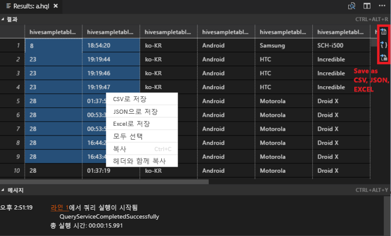
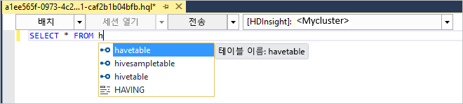
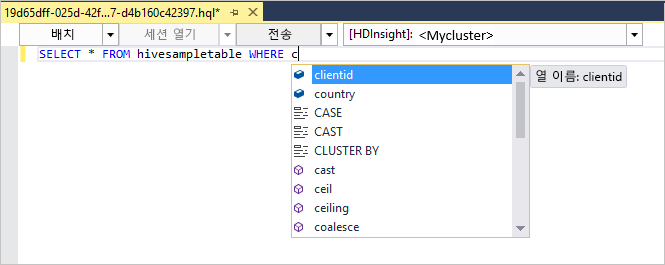
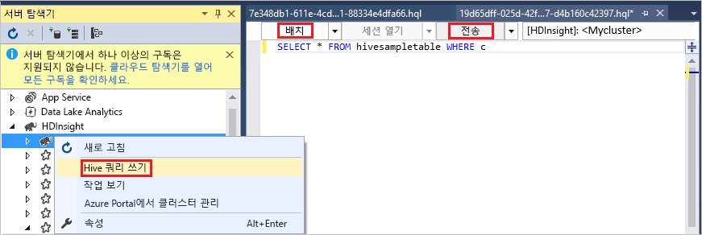
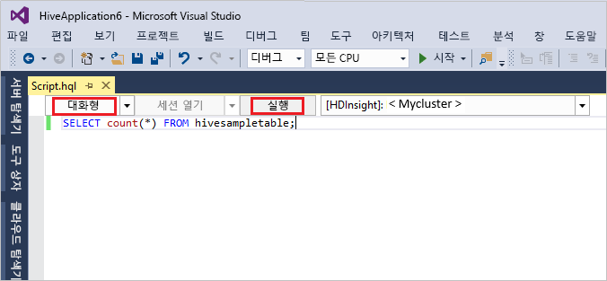
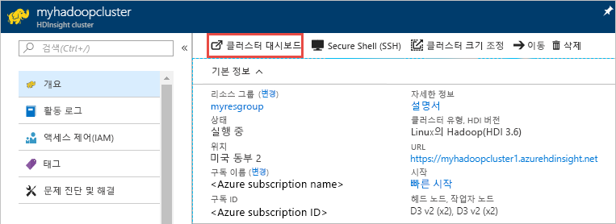
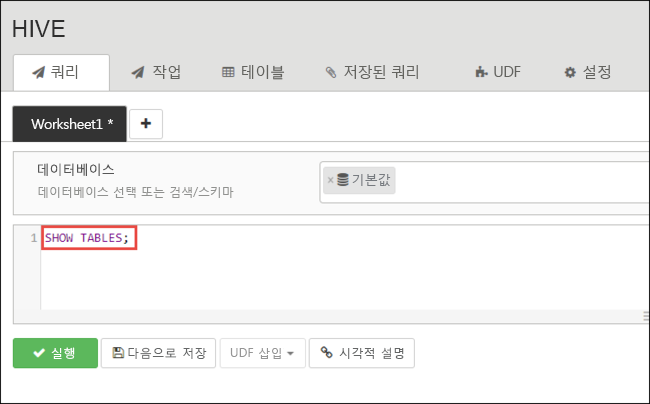
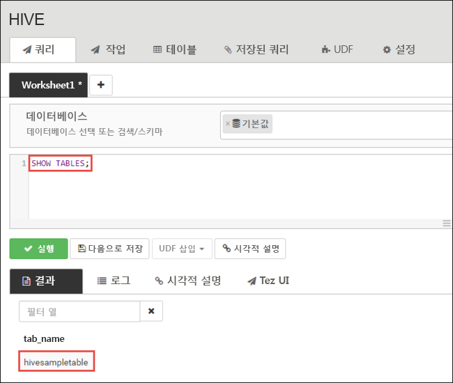
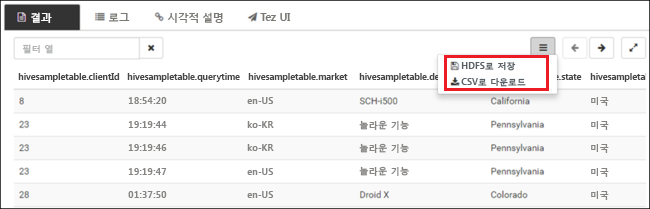

# <a name="quickstart-get-started-with-apache-hadoop-and-apache-hive-in-azure-hdinsight-using-resource-manager-template"></a>빠른 시작: Resource Manager 템플릿을 사용하여 Azure HDInsight에서 Apache Hadoop 및 Apache Hive 시작

이 문서에서는 Resource Manager 템플릿을 사용하여 HDInsight에서 [Apache Hadoop](https://hadoop.apache.org/) 클러스터를 만든 다음, HDInsight에서 Hive 작업을 실행하는 방법을 알아봅니다. Hadoop 작업의 대부분은 배치 작업입니다. 클러스터를 만들고 일부 작업을 실행한 다음 클러스터를 삭제합니다. 이 문서에서는 세 가지 작업을 모두 수행할 수 있습니다.

이 빠른 시작에서는 Resource Manager 템플릿을 사용하여 HDInsight Hadoop 클러스터를 만듭니다. 또한 [Azure Portal](apache-hadoop-linux-create-cluster-get-started-portal.md)을 사용하여 클러스터를 만들 수도 있습니다.  비슷한 템플릿은 [Azure 퀵 스타트 템플릿](https://azure.microsoft.com/resources/templates/?resourceType=Microsoft.Hdinsight&pageNumber=1&sort=Popular)에서 볼 수 있습니다. 템플릿 참조는 [여기](https://docs.microsoft.com/azure/templates/microsoft.hdinsight/allversions)서 찾을 수 있습니다.

현재 HDInsight는 [일곱 가지 클러스터 형식](./apache-hadoop-introduction.md#cluster-types-in-hdinsight)으로 제공됩니다. 각 클러스터 유형은 서로 다른 구성 요소 집합을 지원합니다. 모든 클러스터 형식은 Hive를 지원합니다. HDInsight에서 지원되는 구성 요소 목록은 [HDInsight에서 제공하는 Hadoop 클러스터 버전의 새로운 기능](../hdinsight-component-versioning.md)  

Azure 구독이 아직 없는 경우 시작하기 전에 [체험](https://azure.microsoft.com/free/) 계정을 만듭니다.

<a name="create-cluster"></a>
## <a name="create-a-hadoop-cluster"></a>Hadoop 클러스터 만들기

이 섹션에서는 Azure Resource Manager 템플릿을 사용하여 HDInsight에서 Hadoop 클러스터를 만듭니다. 이 문서를 따라하는 데 Resource Manager 템플릿 환경이 필요하지는 않습니다. 

1. 아래 **Azure에 배포** 단추를 클릭하여 Azure에 로그인하고 Azure Portal에서 Resource Manager 템플릿을 엽니다. 
   
    <a href="https://portal.azure.com/#create/Microsoft.Template/uri/https%3A%2F%2Fraw.githubusercontent.com%2FAzure%2Fazure-quickstart-templates%2Fmaster%2F101-hdinsight-linux-ssh-password%2Fazuredeploy.json" target="_blank"></a>

2. 다음 스크린샷에서 설명된 대로 값을 입력하거나 선택합니다.

    > [!NOTE]  
    > 사용자가 제공하는 값은 고유해야 하며 명명 지침을 따라야 합니다. 템플릿은 유효성 검사를 수행하지 않습니다. 사용자가 제공하는 값이 이미 사용 중이거나 지침을 준수하지 않는 경우 템플릿을 제출한 후 오류가 발생합니다.    
    
    

    다음 값을 입력하거나 선택합니다.
    
    |자산  |설명  |
    |---------|---------|
    |**구독**     |  Azure 구독을 선택합니다. |
    |**리소스 그룹**     | 리소스 그룹을 만들거나 기존 리소스 그룹을 선택합니다.  리소스 그룹은 Azure 구성 요소의 컨테이너입니다.  이 경우 리소스 그룹에는 HDInsight 클러스터 및 종속 Azure Storage 계정이 포함되어 있습니다. |
    |**위치**:     | 클러스터를 만들려는 Azure 위치를 선택합니다.  성능 향상을 위해 가까운 곳을 선택합니다. |
    |**클러스터 이름**     | Hadoop 클러스터에 사용할 이름을 입력합니다. HDInsight의 모든 클러스터는 동일한 DNS 네임스페이스를 공유하므로 이 이름은 고유해야 합니다. 이름은 소문자, 숫자 및 하이픈만 포함할 수 있으며 문자로 시작해야 합니다.  각 하이픈의 앞과 뒤에는 하이픈이 아닌 문자가 있어야 합니다.  또한 이름은 3~59자여야 합니다. |
    |**클러스터 유형**     | **hadoop**을 선택합니다. |
    |**클러스터 로그인 이름 및 암호**     | 기본 로그인 이름은 **admin**입니다. 암호는 10자 이상이어야 하며, 숫자, 대문자, 소문자 및 영숫자가 아닌 문자(' " ` 문자 제외\)를 각각 하나 이상 포함해야 합니다. "Pass@word1"과 같은 일반적인 암호를 **제공하지 않았는지** 확인합니다.|
    |**SSH 사용자 이름 및 암호**     | 기본 사용자 이름은 **sshuser**입니다.  SSH 사용자 이름은 바꿀 수 있습니다.  SSH 사용자 암호에는 클러스터 로그인 암호와 동일한 요구 사항이 적용됩니다.|
       
    일부 속성이 템플릿에 하드 코딩되었습니다.  템플릿에서 이러한 값을 구성할 수 있습니다. 이러한 속성에 대한 자세한 설명은 [HDInsight에서 Apache Hadoop 클러스터 만들기](../hdinsight-hadoop-provision-linux-clusters.md)를 참조하세요.

3. **위에 명시된 사용 약관에 동의함**을 선택한 다음, **구매**를 선택합니다. 배포가 진행 중이라는 알림이 표시됩니다.  클러스터를 만들려면 20분 정도가 걸립니다.

4. 클러스터가 만들어지면 **리소스 그룹으로 이동** 링크가 포함된 **배포 성공** 알림이 표시됩니다.  **리소스 그룹** 페이지에 새 HDInsight 클러스터와 해당 클러스터에 연결된 기본 스토리지가 나열됩니다. 각 클러스터에는 [Azure Storage 계정](../hdinsight-hadoop-use-blob-storage.md) 또는 [Azure Data Lake Storage 계정](../hdinsight-hadoop-use-data-lake-store.md) 종속성이 있습니다. 이 저장소 계정을 기본 저장소 계정이라고 합니다. HDInsight 클러스터와 해당 기본 스토리지 계정은 같은 Azure 지역에 있어야 합니다. 클러스터를 삭제해도 저장소 계정은 삭제되지 않습니다.

> [!NOTE]  
> 기타 클러스터 생성 방법 및 이 자습서에 사용된 속성에 대한 이해는 [HDInsight 클러스터 만들기](../hdinsight-hadoop-provision-linux-clusters.md)를 참조하세요.       


## <a name="use-vscode-to-run-hive-queries"></a>VSCode를 사용하여 Hive 쿼리 실행

VSCode에서 HDInsight Tools를 가져오는 방법은 [Azure HDInsight Tools for Visual Studio Code 사용](../hdinsight-for-vscode.md)을 참조하세요.

### <a name="submit-interactive-hive-queries"></a>대화형 Hive 쿼리 제출

HDInsight Tools for VSCode를 사용하면 HDInsight 대화형 쿼리 클러스터에 대화형 Hive 쿼리를 제출할 수 있습니다.

1. 새 작업 폴더 및 새 Hive 스크립트 파일을 만듭니다(아직 없는 경우).

2. Azure 계정에 연결한 다음 기본 클러스터를 구성합니다(아직 구성하지 않은 경우).

3. 다음 코드를 복사하여 Hive 파일에 붙여넣은 후 파일을 저장합니다.

    ```hiveql
    SELECT * FROM hivesampletable;
    ```
4. 스크립트 편집기를 마우스 오른쪽 단추로 클릭한 다음, **HDInsight: Hive Interactive**를 선택하여 쿼리를 제출합니다. 이 도구에서는 상황에 맞는 메뉴를 사용하여 전체 스크립트 파일 대신 코드 블록을 제출할 수도 있습니다. 잠시 후 다음과 같이 새 탭에 쿼리 결과가 표시됩니다.

   

    - **결과** 패널: 전체 결과를 CSV, JSON 또는 Excel 파일로 로컬 경로에 저장하거나 여러 줄을 선택할 수 있습니다.

    - **메시지** 패널: **줄** 번호를 선택하면 실행 중인 스크립트의 첫 번째 줄로 이동합니다.

[Apache Hive 일괄 작업 실행](#submit-hive-batch-scripts)에 비해 대화형 쿼리 실행이 훨씬 더 빠릅니다.

### <a name="submit-hive-batch-scripts"></a>Hive 배치 스크립트 제출

1. 새 작업 폴더 및 새 Hive 스크립트 파일을 만듭니다(아직 없는 경우).

2. Azure 계정에 연결한 다음 기본 클러스터를 구성합니다(아직 구성하지 않은 경우).

3. 다음 코드를 복사하여 Hive 파일에 붙여넣은 후 파일을 저장합니다.

    ```hiveql
    SELECT * FROM hivesampletable;
    ```
4. 스크립트 편집기를 마우스 오른쪽 단추로 클릭한 다음, **HDInsight: Hive Batch**를 선택하여 Hive 작업을 제출합니다. 

5. 제출하려는 클러스터를 선택합니다.  

    Hive 작업을 제출하면 제출 성공 정보 및 jobid가 **출력** 패널에 표시됩니다. Hive 작업은 **웹 브라우저**도 열어 실시간 작업 로그 및 상태를 표시합니다.

   

[대화형 Apache Hive 쿼리 제출](#submit-interactive-hive-queries)이 일괄 작업 제출보다 훨씬 더 빠릅니다.

## <a name="use-visualstudio-to-run-hive-queries"></a>VisualStudio를 사용하여 Hive 쿼리 실행

Visual Studio에서 HDInsight Tools를 가져오는 방법은 [Data Lake Tools for Visual Studio 사용](./apache-hadoop-visual-studio-tools-get-started.md)을 참조하세요.

### <a name="run-hive-queries"></a>Hive 쿼리 실행

Hive 쿼리를 만들고 실행하기 위한 두 가지 옵션이 있습니다.

* 임시 쿼리 만들기
* Hive 애플리케이션 만들기

임시 쿼리를 만들고 실행하려면:

1. **서버 탐색기**에서 **Azure** > **HDInsight 클러스터**를 차례로 선택합니다.

2. 쿼리를 실행하려는 클러스터를 마우스 오른쪽 단추로 클릭한 다음, **Hive 쿼리 작성**을 선택합니다.  

3. Hive 쿼리를 입력합니다. 

    Hive 편집기는 IntelliSense를 지원합니다. Data Lake Tools for Visual Studio는 Hive 스크립트를 편집할 때 원격 메타데이터 로드를 지원합니다. 예를 들어 **SELECT * FROM**을 입력하면 IntelliSense에서 제안된 테이블 이름을 모두 나열합니다. 테이블 이름이 지정되면 IntelliSense에서 열 이름을 나열합니다. 이 도구는 대부분의 Hive DML 문, 하위 쿼리 및 기본 제공 UDF를 지원합니다.
   
    
   
    
   
   > [!NOTE]  
   > IntelliSense는 HDInsight 도구 모음에서 선택한 클러스터의 메타데이터만 제안합니다.
   > 
   
4. **제출** 또는 **제출(고급)** 을 선택합니다. 
   
    

   고급 제출 옵션을 선택하는 경우 스크립트에 대한 **작업 이름**, **인수**, **추가 구성** 및 **상태 디렉터리**를 구성합니다.

    

   대화형 Hive 쿼리 실행

   * 아래쪽 화살표를 클릭하여 **대화형**을 선택합니다. 
   
   * **실행**을 클릭합니다.

   

Hive 솔루션을 만들고 실행하려면,

1. **파일** 메뉴에서 **새로 만들기**, **프로젝트**를 차례로 선택합니다.
2. 왼쪽 창에서 **HDInsight**를 선택합니다. 가운데 창에서 **Hive 애플리케이션**을 선택합니다. 속성을 입력한 다음, **확인**을 선택합니다.
   
    
3. **솔루션 탐색기**에서 **Script.hql**을 두 번 클릭하여 이 스크립트를 엽니다.
4. Hive 쿼리를 입력하고 제출합니다. (위의 3단계 및 4단계 참조)  


## <a name="run-hive-queries"></a>Hive 쿼리 실행

[Apache Hive](hdinsight-use-hive.md) 는 HDInsight에서 사용되는 가장 인기 있는 구성 요소입니다. HDInsight에서 Hive 작업을 실행하는 방법은 여러 가지가 있습니다. 이 자습서에서는 포털에서 Ambari Hive 뷰를 사용합니다. Hive 작업을 제출하는 다른 방법은 [HDInsight에서 Apache Hive 사용](hdinsight-use-hive.md)을 참조하세요.

1. Ambari를 열려면 **클러스터 대시보드** 타일에서 **Ambari 보기**를 선택합니다.  **https://&lt;ClusterName&gt;.azurehdinsight.net**으로 이동할 수도 있습니다. 여기서 &lt;ClusterName&gt;은 이전 섹션에서 만든 클러스터입니다.

    

2. 클러스터를 만들 때 지정한 Hadoop 사용자 이름 및 암호를 입력합니다. 기본 사용자 이름은 **admin**입니다.

3. 다음 스크린샷과 같이**Hive View 2.0**을 선택합니다.
   
    

4. **쿼리** 탭에서 다음 HiveQL 문을 워크시트에 붙여넣습니다.
   
        SHOW TABLES;

    
   
   > [!NOTE]  
   > Hive에서 세미콜론이 필요합니다.       


5. **실행**을 선택합니다. **쿼리** 탭 아래에 **결과** 탭이 나타나고 작업에 대한 정보가 표시됩니다. 
   
    쿼리가 완료되면 **쿼리** 탭에 작업 결과가 표시됩니다. **hivesampletable**이라는 테이블이 한 개 표시됩니다. 이 샘플 Hive 테이블은 모든 HDInsight 클러스터와 함께 제공됩니다.
   
    

6. 4단계 및 5단계를 반복하여 다음 쿼리를 실행합니다.
   
        SELECT * FROM hivesampletable;
   
7. 또한 쿼리 결과를 저장할 수 있습니다. 오른쪽의 메뉴 단추를 선택하고, 결과를 CSV 파일로 다운로드할 것인지 아니면 클러스터와 연결된 저장소 계정에 저장할 것인지 지정합니다.

    

Hive 작업을 완료한 후에 [결과를 Azure SQL Database 또는 SQL Server 데이터베이스로 내보내고](apache-hadoop-use-sqoop-mac-linux.md), [Excel을 사용하여 결과를 시각화](apache-hadoop-connect-excel-power-query.md)할 수도 있습니다. HDInsight에서 Hive를 사용하는 방법에 대한 자세한 내용은 [샘플 Apache log4j 파일 분석을 위해 HDInsight에서 Apache Hadoop과 함께 Apache Hive 및 HiveQL 사용](hdinsight-use-hive.md)을 참조하세요.

## <a name="troubleshoot"></a>문제 해결

HDInsight 클러스터를 만드는 동안 문제가 발생할 경우 [액세스 제어 요구 사항](../hdinsight-hadoop-create-linux-clusters-portal.md)을 참조하세요.

## <a name="clean-up-resources"></a>리소스 정리
이 문서를 완료한 후에 클러스터를 삭제할 수 있습니다. HDInsight를 사용하면 데이터가 Azure Storage에 저장되기 때문에 클러스터를 사용하지 않을 때 안전하게 삭제할 수 있습니다. HDInsight 클러스터를 사용하지 않는 기간에도 요금이 청구됩니다. 클러스터에 대한 요금이 저장소에 대한 요금보다 몇 배 더 많기 때문에, 클러스터를 사용하지 않을 때는 삭제하는 것이 경제적인 면에서 더 합리적입니다. 

> [!NOTE]  
> HDInsight에서 Hadoop을 사용하여 ETL 작업을 실행하는 방법을 알아보기 위해 다음 자습서를 *즉시* 진행하는 경우 클러스터가 실행되도록 유지할 수 있습니다. 자습서에서 Hadoop 클러스터를 다시 만들어야 하기 때문입니다. 그러나 다음 자습서로 바로 진행하지 않는 경우 이제 클러스터를 삭제해야 합니다.

**클러스터 및/또는 기본 저장소 계정을 삭제하려면**

1. Azure Portal이 있는 브라우저 탭으로 돌아갑니다. 그러면 클러스터 개요 페이지가 표시됩니다. 클러스터는 삭제하지만 기본 저장소 계정은 유지하려는 경우 **삭제**를 선택합니다.

    

2. 클러스터와 기본 저장소 계정을 삭제하려는 경우 리소스 그룹 이름(이전 스크린샷에서 강조 표시됨)을 선택하여 리소스 그룹 페이지를 엽니다.

3. **리소스 그룹 삭제**를 선택하여 클러스터와 기본 저장소 계정을 포함하는 리소스 그룹을 삭제합니다. 리소스 그룹을 삭제하면 저장소 계정이 삭제됩니다. 저장소 계정을 유지하려면 클러스터만 삭제하세요.

## <a name="next-steps"></a>다음 단계
이 문서에서는 Resource Manager 템플릿을 사용하여 Linux 기반 HDInsight 클러스터를 만들고, 기본 Hive 쿼리를 수행하는 방법을 알아보았습니다. 다음 문서에서는 HDInsight의 Hadoop을 사용하여 ETL(추출, 변환 및 로드) 작업을 수행하는 방법을 알아봅니다.

> [!div class="nextstepaction"]
>[HDInsight에서 Apache Hive를 사용하여 데이터 추출, 변환 및 로드](../hdinsight-analyze-flight-delay-data-linux.md)

자신의 데이터로 작업을 시작할 준비가 된 상태에서 HDInsight에서 데이터를 저장하는 방법과 HDInsight로 데이터를 가져오는 방법에 대해 더 알아보려면 다음 문서를 참조하세요.

* HDInsight에서 Azure Storage를 사용하는 방법에 대한 자세한 내용은 [HDInsight에서 Azure Storage 사용](../hdinsight-hadoop-use-blob-storage.md)을 참조하세요.
* Data Lake Storage를 사용하여 HDInsight 클러스터를 만드는 방법에 대한 자세한 내용은 [빠른 시작: HDInsight에서 클러스터 설정](../../storage/data-lake-storage/quickstart-create-connect-hdi-cluster.md)을 참조하세요.
* 데이터를 HDInsight로 업로드하는 방법에 대한 정보는 [HDInsight에 데이터 업로드](../hdinsight-upload-data.md)를 참조하세요.
* [Azure HDInsight 클러스터에 Azure Data Lake Storage Gen2 사용](../hdinsight-hadoop-use-data-lake-storage-gen2.md)

HDInsight를 사용하여 데이터를 분석하는 방법에 대한 자세한 내용은 다음 문서를 참조하세요.

* Visual Studio에서 Hive 쿼리를 수행하는 방법을 비롯하여 HDInsight로 Hive를 사용하는 데 대한 자세한 내용은 [HDInsight에서 Apache Hive 사용](hdinsight-use-hive.md)을 참조하세요.
* 데이터를 변환하는 데 사용되는 언어인 Pig에 대해 알아보려면 [HDInsight에서 Apache Pig 사용](hdinsight-use-pig.md)을 참조하세요.
* Hadoop에서 데이터를 처리하는 프로그램을 작성하는 방법인 MapReduce에 대해 알아보려면 [HDInsight로 MapReduce 사용](hdinsight-use-mapreduce.md)을 참조하세요.
* Visual Studio에 HDInsight Tools를 사용하여 HDInsight의 데이터를 분석하는 방법에 대해 알아보려면 [HDInsight용 Visual Studio Hadoop 도구를 사용하여 시작](apache-hadoop-visual-studio-tools-get-started.md)을 참조하세요.
* HDInsight Tools for VSCode를 사용하여 HDInsight의 데이터를 분석하는 방법에 대해 알아보려면 [Azure HDInsight Tools for Visual Studio Code 사용](../hdinsight-for-vscode.md)을 참조하세요.


HDInsight 클러스터를 만들거나 관리하는 방법에 대해 자세히 알아보려면 다음 문서를 참조하세요.

* Linux 기반 HDInsight 클러스터 관리에 대해 알아보려면 [Apache Ambari를 사용하여 HDInsight 클러스터 관리](../hdinsight-hadoop-manage-ambari.md)를 참조하세요.
* HDInsight 클러스터를 만들 때 선택하는 옵션에 대해 자세히 알아보려면 [사용자 지정 옵션을 사용하여 Linux에 HDInsight 만들기](../hdinsight-hadoop-provision-linux-clusters.md)를 참조하세요.

Azure Resource Manager 템플릿을 사용하여 HDInsight 클러스터를 만드는 방법에 대한 자세한 내용은 다음 항목을 참조하세요.

* [Azure 빠른 시작 템플릿](https://azure.microsoft.com/resources/templates/?resourceType=Microsoft.Hdinsight&pageNumber=1&sort=Popular)
* [Azure 템플릿 참조](https://docs.microsoft.com/azure/templates/microsoft.hdinsight/allversions)

[1]: ../HDInsight/apache-hadoop-visual-studio-tools-get-started.md

[hdinsight-provision]: hdinsight-provision-linux-clusters.md
[hdinsight-upload-data]: hdinsight-upload-data.md
[hdinsight-use-hive]: hdinsight-use-hive.md
[hdinsight-use-pig]: hdinsight-use-pig.md
