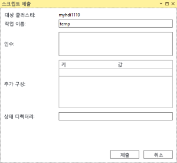
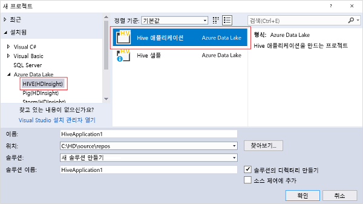

# Data Lake Tools for Visual Studio를 사용하여 Azure HDInsight에 연결 및 Apache Hive 쿼리 실행

사용 방법 알아보기 [Microsoft Azure Data Lake 및 Stream Analytics Tools for Visual Studio](https://www.microsoft.com/download/details.aspx?id=49504) (라고도 Apache Hadoop에 연결할 Data Lake Tools)에서 클러스터 [Azure HDInsight](../hdinsight-hadoop-introduction.md) 고 Hive 쿼리를 제출 합니다.  

HDInsight 사용에 대한 자세한 내용은 [HDInsight 소개](../hdinsight-hadoop-introduction.md) 및 [HDInsight 시작](apache-hadoop-linux-tutorial-get-started.md)을 참조하세요.  

Apache Storm 클러스터에 연결하는 방법에 대한 자세한 내용은 [Visual Studio를 사용하여 HDInsight의 Apache Storm에 대한 C# 토폴로지 개발](../storm/apache-storm-develop-csharp-visual-studio-topology.md)을 참조하세요.

Data Lake Tools for Visual Studio를 사용하여 Azure Data Lake Analytics 및 HDInsight에 액세스할 수 있습니다. Data Lake Tools에 대한 자세한 내용은 [Data Lake Tools for Visual Studio를 사용하여 U-SQL 스크립트 개발](../../data-lake-analytics/data-lake-analytics-data-lake-tools-get-started.md)을 참조하세요.

## 필수 조건

이 자습서를 완료하고 Data Lake Tools for Visual Studio를 사용하려면 다음 항목이 필요합니다.

* Azure HDInsight 클러스터를 만듭니다. HDInsight 클러스터를 만들려면 [Azure HDInsight에서 Apache Hadoop 사용 시작](apache-hadoop-linux-tutorial-get-started.md)을 참조하세요. 대화형 Apache Hive 쿼리를 실행하려면 [HDInsight 대화형 쿼리](../interactive-query/apache-interactive-query-get-started.md) 클러스터가 필요합니다.  

* [Visual Studio](https://visualstudio.microsoft.com/downloads/) (2013 이상).  합니다 [Visual Studio Community edition](https://visualstudio.microsoft.com/vs/community/) 은 무료입니다.  도 참조 하세요 [Visual Studio 2017 설치](https://docs.microsoft.com/visualstudio/install/install-visual-studio)합니다.

  > [!IMPORTANT]  
  > Data Lake Tools는 더 이상 Visual Studio 2013에 대 한 지원 됩니다. 

## Visual Studio용 Data Lake 도구 설치  

* Visual Studio 2017  
  설치 하는 동안 적어도 포함 되도록 워크 로드 **Azure 개발** 하거나 **데이터 저장 및 처리**합니다.  

  기존 설치의 경우 메뉴 모음에서 이동에 대 한 **도구가** > **도구 및 기능 가져오기...**  를 Visual Studio 설치 관리자를 엽니다.  선택한 다음 최소 워크 로드 **Azure 개발** 하거나 **데이터 저장 및 처리**합니다.

  

* Visual Studio 2013 및 2015  
  [Data Lake Tools 다운로드](https://www.microsoft.com/download/details.aspx?id=49504)합니다. Visual Studio 버전과 일치하는 Data Lake Tools 버전을 선택하세요.  

> [!NOTE]  
> 현재 Data Lake Tools for Visual Studio 영어 버전만 사용할 수 있습니다.

## Data Lake Tools for Visual Studio 업데이트  

1. Visual Studio를 엽니다.

2. 메뉴 모음에서로 이동 **도구가** > **확장 및 업데이트 하는 중...** .

3. **확장 및 업데이트** 창에서 확장 **업데이트** 왼쪽입니다.

4. 업데이트를 사용할 수 있으면 **Azure Data Lake 및 Stream 분석 도구** 주 창에 표시 됩니다.  **업데이트**를 선택합니다.

> [!NOTE]  
> Data Lake Tools 버전 2.3.0.0 이상만 사용하여 대화형 쿼리 클러스터에 연결하고 대화형 Hive 쿼리를 실행할 수 있습니다.

## Azure 구독에 연결
Data Lake Tools for Visual Studio를 사용하여 HDInsight 클러스터에 연결하고, 몇 가지 기본 관리 작업을 수행하고, Hive 쿼리를 실행할 수 있습니다.

> [!NOTE]  
> 일반 Hadoop 클러스터에 연결하는 방법에 대한 자세한 내용은 [Visual Studio를 사용하여 Hive 쿼리 작성 및 제출](https://blogs.msdn.com/b/xiaoyong/archive/2015/05/04/how-to-write-and-submit-hive-queries-using-visual-studio.aspx)을 참조하세요.

Azure 구독에 연결하려면,

1. Visual Studio를 엽니다.

2. 메뉴 모음에서로 이동 **뷰** > **서버 탐색기**합니다.

3. 서버 탐색기에서 마우스 오른쪽 단추로 클릭 **Azure**, 선택 **Microsoft Azure 구독에 연결 하는 중...** , 로그인 프로세스를 완료 합니다.

4. 서버 탐색기에서 기존 HDInsight 클러스터 목록이 표시 됩니다. 클러스터가 없는 경우 Azure Portal, Azure PowerShell 또는 HDInsight SDK를 사용하여 클러스터를 만들 수 있습니다. 자세한 내용은 [HDInsight 클러스터 만들기](../hdinsight-hadoop-provision-linux-clusters.md)를 참조하세요.

   

5. HDInsight 클러스터를 확장합니다. **Hive 데이터베이스**, 기본 저장소 계정, 연결된 저장소 계정 및 **Hadoop 서비스 로그**가 표시됩니다. 엔터티를 더 확장할 수 있습니다.

Azure 구독에 연결한 후에 다음 작업을 수행할 수 있습니다.

Visual Studio에서 Azure Portal에 연결하려면,

1. 서버 탐색기에서로 이동 **Azure** > **HDInsight** 클러스터를 선택 합니다.

2. HDInsight 클러스터를 마우스 오른쪽 단추로 클릭 **Azure portal에서 클러스터 관리**합니다.

질문 하 Visual Studio에서 피드백을 제공 합니다.

1. 서버 탐색기에서로 이동 **Azure** > **HDInsight**합니다.

2. 마우스 오른쪽 단추로 클릭 **HDInsight** 중 하나를 선택 하 고 **MSDN 포럼** 궁금한 사항을 문의할 또는 **피드백** 의견을 보내주세요.

## 연결된 리소스 탐색
서버 탐색기에서 기본 저장소 계정 및 연결된 저장소 계정을 확인할 수 있습니다. 기본 저장소 계정을 확장한 경우 저장소 계정의 컨테이너를 확인할 수 있습니다. 기본 저장소 계정과 기본 컨테이너가 표시되어 있습니다. 컨테이너를 마우스 오른쪽 단추로 클릭하여 컨테이너 콘텐츠를 확인합니다.

컨테이너를 연 후에 다음 단추를 사용하여 Blob을 업로드, 삭제 및 다운로드할 수 있습니다.

## 대화형 Apache Hive 쿼리 실행
[Apache Hive](https://hive.apache.org)는 Hadoop을 기반으로 하는 데이터 웨어하우스 인프라입니다. Hive는 데이터 요약, 쿼리 및 분석에 사용됩니다. Data Lake Tools for Visual Studio를 사용하여 Visual Studio에서 Hive 쿼리를 실행할 수 있습니다. Hive에 대한 자세한 내용은 [HDInsight에서 Apache Hive 사용](hdinsight-use-hive.md)을 참조하세요.

[대화형 쿼리](../interactive-query/apache-interactive-query-get-started.md)는 Apache Hive 2.1에서 [LLAP의 Hive](https://cwiki.apache.org/confluence/display/Hive/LLAP)를 사용합니다. 대화형 쿼리는 저장된 대규모 데이터 세트에 대해 복잡한 데이터 웨어하우스 스타일의 쿼리에 대화형 기능을 제공합니다. 대화형 쿼리에서 Hive 쿼리를 실행하면 기존의 Hive 일괄 처리 작업에 비해 훨씬 빠릅니다. 자세한 내용은 Apache Hive 일괄 작업 실행을 참조 하세요.

> [!NOTE]  
> [HDInsight 대화형 쿼리](../interactive-query/apache-interactive-query-get-started.md) 클러스터에 연결하는 경우에만 대화형 Hive 쿼리를 실행할 수 있습니다.

또한 Data Lake Tools for Visual Studio를 사용하여 Hive 작업에 대해 자세히 확인할 수도 있습니다. Data Lake Tools for Visual Studio는 특정 Hive 작업에 대한 YARN 로그를 수집하고 표시합니다.

서버 탐색기에서로 이동 **Azure** > **HDInsight** 클러스터를 선택 합니다.  이 섹션에서는 수행 하려면 서버 탐색기의 시작 지점 됩니다.

### 보기 hivesampletable
모든 HDInsight 클러스터에 이라는 기본 샘플 Hive 테이블이 `hivesampletable`합니다.  

클러스터에서로 이동 **Hive 데이터베이스** > **기본값** > **hivesampletable**합니다.

* 보려는 `hivesampletable` 스키마:  
확장 **hivesampletable**합니다.

* 보려는 `hivesampletable` 데이터:  
마우스 오른쪽 단추로 클릭 **hivesampletable**, 선택한 **상위 100 개 행 보기**합니다.  이는 Hive ODBC 드라이버를 사용하여 다음 Hive 쿼리를 실행하는 것과 동일합니다.

   `SELECT * FROM hivesampletable LIMIT 100`

  행 개수를 사용자 지정할 수 있습니다.

  

### Hive 테이블 만들기
Hive 테이블을 만들려면 GUI를 사용하거나 Hive 쿼리를 사용할 수 있습니다. Hive 쿼리 사용에 대한 자세한 내용은 [Apache Hive 쿼리 실행](#run.queries)을 참조하세요.

1. 클러스터에서로 이동 **Hive 데이터베이스** > **기본**입니다.

2. 마우스 오른쪽 단추로 클릭 **기본**, 선택한 **Create Table**합니다.

3. 필요에 따라 테이블을 구성 합니다.  

4. **테이블 만들기**를 선택하여 새 Hive 테이블을 만들기 위한 작업을 제출합니다.

    

### 만들기 및 Hive 쿼리 실행
Hive 쿼리를 만들고 실행하기 위한 두 가지 옵션이 있습니다.

* 임시 쿼리 만들기
* Hive 애플리케이션 만들기

만들고 임시 쿼리를 실행 합니다.

1. 선택한 쿼리를 실행 하려는 클러스터를 마우스 오른쪽 단추로 클릭 **Hive 쿼리 작성**합니다.  

2. Hive 쿼리를 입력합니다.  

    Hive 편집기는 IntelliSense를 지원합니다. Data Lake Tools for Visual Studio는 Hive 스크립트를 편집할 때 원격 메타데이터 로드를 지원합니다. 예를 들어 입력 `SELECT * FROM`, IntelliSense 제안 된 테이블 이름을 모두 나열 합니다. 테이블 이름이 지정되면 IntelliSense에서 열 이름을 나열합니다. 이 도구는 대부분의 Hive DML 문, 하위 쿼리 및 기본 제공 UDF를 지원합니다.

    

    

   > [!NOTE]  
   > IntelliSense는 HDInsight 도구 모음에서 선택한 클러스터의 메타데이터만 제안합니다.

3. 실행 모드를 선택 합니다.

    * **대화형**  

      확인 **Interactive** 을 선택 하 고 선택한 **Execute**합니다.

        

    * **Batch**  

      확인 **일괄 처리** 을 선택 하 고 선택한 **제출**합니다.  고급 제출 옵션을 선택 하면 구성 **작업 이름**를 **인수**합니다 **추가 구성을**, 및 **상태 디렉터리**스크립트에 대 한 합니다.

        

      

      > [!NOTE]  
      > 대화형 쿼리 클러스터에 대 한 일괄 처리 되지 제출할 수 있습니다.  대화형 모드를 사용 해야 합니다.

Hive 솔루션을 만들고 실행하려면,

1. 메뉴 모음에서로 이동 **파일** > **새로 만들기** > **프로젝트...** .

2. 왼쪽된 창에서로 이동 **설치 됨** > **Azure Data Lake** > **HIVE (HDInsight)** 합니다.  

3. 가운데 창에서 **Hive 애플리케이션**을 선택합니다. 속성을 입력한 다음, **확인**을 선택합니다.

    

4. **솔루션 탐색기**에서 **Script.hql**을 두 번 클릭하여 이 스크립트를 엽니다.

### 작업 요약 보기 및 출력

요약 작업 간에 약간 달라 집니다 **일괄 처리** 하 고 **대화형** 모드입니다.

사용 된 **새로 고침** 단추에 작업 상태가 변경 될 때까지 상태를 업데이트 하려면 **완료**.  

* 작업 세부 정보에 대 한 **일괄 처리** 모드를 보려면 아래쪽의 링크를 선택 **작업 쿼리에서**를 **작업 출력**를 **작업 로그**, 또는 **Yarn 로그**합니다.

* 작업 세부 정보에 대 한 **Interactive** 모드, 참조 탭 **출력** 하 고 **HiveServer2 출력**합니다.

  

### 작업 그래프 보기

현재 작업 그래프를 실행 엔진으로 Tez를 사용 하는 Hive 작업에만 표시 됩니다.  Tez를 사용하도록 설정하는 방법에 대한 자세한 내용은 [HDInsight에서 Apache Hive 사용](hdinsight-use-hive.md)을 참조하세요.  도 참조 하세요 [Map Reduce 대신 사용 하 여 Apache Tez](../hdinsight-hadoop-optimize-hive-query.md#use-apache-tez-instead-of-map-reduce)합니다.  

꼭짓점 내의 모든 연산자를 보려면 작업 그래프의 꼭짓점을 두 번 클릭합니다. 또한 특정 연산자를 가리켜서 연산자에 대한 자세한 정보를 볼 수도 있습니다.

작업 그래프 시작 된 Tez 응용 프로그램이 없는 경우 Tez 실행 엔진으로 지정 하는 경우에 나타날 수 없습니다.  이 작업에 DML 문이 없습니다. 또는 Tez 응용 프로그램을 시작 하지 않고도 DML 문은 반환할 수 있습니다 때문에 발생할 수 있습니다. 예를 들어 `SELECT * FROM table1` Tez 응용 프로그램을 시작 하지 것입니다.

### 태스크 실행 세부 정보

작업 그래프에서 선택할 수 있습니다 **태스크 실행 세부 정보** 가져오려는 구조화 되 고 Hive 작업에 대 한 정보를 시각화 합니다. 또한 더 많은 작업 세부 정보도 얻을 수 있습니다. 성능 문제가 발생하면 보기를 사용하여 문제에 대한 자세한 정보를 얻을 수 있습니다. 예를 들어 각 작업의 작동 방식 및 각 작업에 대한 자세한 정보(데이터 읽기/쓰기, 일정/시작/종료 시간 등)를 얻을 수 있습니다. 이 정보를 사용하여 시각화된 정보에 따라 작업 구성 또는 시스템 아키텍처를 튜닝합니다.

### Hive 작업 보기
Hive 작업에 대한 작업 쿼리, 작업 출력, 작업 로그 및 Yarn 로그를 볼 수 있습니다.

최신 릴리스의 도구에서는 YARN 로그를 수집하고 표시하여 Hive 작업에 대한 자세한 정보를 확인할 수 있습니다. Yarn 로그는 성능 문제를 조사하는 데 도움이 됩니다. HDInsight에서 YARN 로그를 수집하는 방법에 대한 자세한 내용은 [프로그래밍 방식으로 HDInsight 애플리케이션 로그에 액세스](../hdinsight-hadoop-access-yarn-app-logs-linux.md)를 참조하세요.

Hive 작업을 보려면,

1. HDInsight 클러스터를 마우스 오른쪽 단추로 클릭 **작업 보기**합니다. 클러스터에서 실행한 Hive 작업 목록이 표시됩니다.  

2. 작업을 선택합니다. **Hive 작업 요약** 창에서 다음 중 하나를 선택합니다.
   - **작업 쿼리**
   - **작업 출력**
   - **작업 로그**  
   - **Yarn 로그**

     

## Apache Pig 스크립트 실행

1. 메뉴 모음에서로 이동 **파일** > **새로 만들기** > **프로젝트...** .

2. 왼쪽된 창에서로 이동 **설치 됨** > **Azure Data Lake** > **Pig (HDInsight)** 합니다.  

3. 가운데 창에서 선택 **Pig 응용 프로그램**합니다. 속성을 입력한 다음, **확인**을 선택합니다.

4. **솔루션 탐색기**를 두 번 클릭 **Script.pig** 스크립트를 엽니다.

## 사용자 의견 및 알려진 문제
* null 값으로 시작되는 결과가 표시되지 않는 문제는 해결되었습니다. 이 문제로 인해 차단되는 경우 지원 팀에 문의하세요.
* Visual Studio에서 만드는 HQL 스크립트는 사용자의 로컬 지역 설정에 따라 인코딩됩니다. 클러스터에 스크립트를 이진 파일로 업로드하면 스크립트가 제대로 실행되지 않습니다.

## 다음 단계
이 문서에서는 Data Lake Tools for Visual Studio 패키지를 사용하여 Visual Studio에서 HDInsight 클러스터에 연결하는 방법을 알아보았습니다. 또한 Hive 쿼리를 실행하는 방법도 알아보았습니다. 자세한 내용은 다음 문서를 참조하세요.

* [Visual Studio 용 Data Lake tools를 사용 하 여 Apache Hive 쿼리를 실행 합니다.](apache-hadoop-use-hive-visual-studio.md)
* [HDInsight에서 Hadoop Hive 사용](hdinsight-use-hive.md)
* [HDInsight에서 Apache Hadoop 사용 시작](apache-hadoop-linux-tutorial-get-started.md)
* [HDInsight에서 Apache Hadoop 작업 제출](submit-apache-hadoop-jobs-programmatically.md)
* [HDInsight에서 Apache Hadoop으로 Twitter 데이터 분석](../hdinsight-analyze-twitter-data-linux.md)

