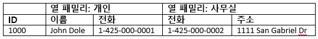

# <a name="quickstart-query-apache-hbase-in-azure-hdinsight-with-hbase-shell"></a>빠른 시작: Azure HDInsight에서 HBase 셸을 사용하여 Apache HBase 쿼리

이 빠른 시작에서는 Apache HBase 셸을 사용하여 HBase 테이블을 만들고 데이터를 삽입한 다음, 테이블을 쿼리하는 방법을 알아봅니다.

Azure 구독이 아직 없는 경우 시작하기 전에 [체험 계정](https://azure.microsoft.com/free/?WT.mc_id=A261C142F)을 만듭니다.

## <a name="prerequisites"></a>필수 조건

* Apache HBase 클러스터 [클러스터 만들기](../hadoop/apache-hadoop-linux-tutorial-get-started.md#create-cluster)를 참조하여 HDInsight 클러스터를 만듭니다.  **HBase** 클러스터 유형을 선택해야 합니다.

* SSH 클라이언트. 자세한 내용은 [SSH를 사용하여 HDInsight(Apache Hadoop)에 연결](../hdinsight-hadoop-linux-use-ssh-unix.md)을 참조하세요.

## <a name="create-a-table-and-manipulate-data"></a>테이블을 만든 후 데이터 조작

대부분의 사람들의 경우, 데이터는 테이블 형식으로 나타납니다.


[Cloud BigTable](https://cloud.google.com/bigtable/)의 구현인 HBase에서는 동일한 데이터가 다음과 같이 표시됩니다.



SSH를 사용하여 HBase 클러스터를 연결한 다음, Apache HBase 셸을 사용하여 HBase 테이블을 만들고 데이터를 삽입하고 데이터를 쿼리할 수 있습니다.

1. `ssh` 명령을 사용하여 HBase 클러스터에 연결합니다. `CLUSTERNAME`을 클러스터의 이름으로 대체하여 아래 명령을 편집한 다음, 다음 명령을 입력합니다.

    ```cmd
    ssh sshuser@CLUSTERNAME-ssh.azurehdinsight.net
    ```

2. `hbase shell` 명령을 사용하여 HBase 대화형 셸을 시작합니다. SSH 연결에서 다음 명령을 입력합니다.

    ```bash
    hbase shell
    ```

3. `create` 명령을 사용하여 두 열 패밀리가 있는 HBase 테이블을 만듭니다. 다음 명령을 입력합니다.

    ```hbase
    create 'Contacts', 'Personal', 'Office'
    ```

4. `list` 명령을 사용하여 HBase에 모든 테이블을 나열합니다. 다음 명령을 입력합니다.

    ```hbase
    list
    ```

5. `put` 명령을 사용하여 특정 테이블의 지정된 행에서 지정된 열에 값을 삽입합니다. 다음 명령을 입력합니다.

    ```hbase
    put 'Contacts', '1000', 'Personal:Name', 'John Dole'
    put 'Contacts', '1000', 'Personal:Phone', '1-425-000-0001'
    put 'Contacts', '1000', 'Office:Phone', '1-425-000-0002'
    put 'Contacts', '1000', 'Office:Address', '1111 San Gabriel Dr.'
    ```

6. `scan` 명령을 사용하여 `Contacts` 테이블 데이터를 검사하고 반환합니다. 다음 명령을 입력합니다.

    ```hbase
    scan 'Contacts'
    ```

7. `get` 명령을 사용하여 행의 콘텐츠를 페치합니다. 다음 명령을 입력합니다.

    ```hbase
    get 'Contacts', '1000'
    ```

    행이 하나만 있기 때문에 `scan` 명령을 사용하면 동일한 결과가 표시됩니다.

8. `delete` 명령을 사용하여 테이블에서 셀 값을 삭제합니다. 다음 명령을 입력합니다.

    ```hbase
    delete 'Contacts', '1000', 'Office:Address'
    ```

9. `disable` 명령을 사용하여 테이블을 사용하지 않도록 설정합니다. 다음 명령을 입력합니다.

    ```hbase
    disable 'Contacts'
    ```

10. `drop` 명령을 사용하여 HBase에서 테이블을 삭제합니다. 다음 명령을 입력합니다.

    ```hbase
    drop 'Contacts'
    ```

11. `exit` 명령을 사용하여 HBase 대화형 셸을 중지합니다. 다음 명령을 입력합니다.

    ```hbase
    exit
    ```

HBase 테이블 스키마에 대한 자세한 내용은 [Apache HBase 스키마 디자인 소개](http://0b4af6cdc2f0c5998459-c0245c5c937c5dedcca3f1764ecc9b2f.r43.cf2.rackcdn.com/9353-login1210_khurana.pdf)를 참조하세요. HBase 명령에 대한 자세한 내용은 [Apache HBase 참조 가이드](https://hbase.apache.org/book.html#quickstart)를 참조하세요.

## <a name="clean-up-resources"></a>리소스 정리

빠른 시작을 완료한 후 클러스터를 삭제하는 것이 좋습니다. HDInsight를 사용하면 데이터가 Azure Storage에 저장되기 때문에 클러스터를 사용하지 않을 때 안전하게 삭제할 수 있습니다. HDInsight 클러스터를 사용하지 않는 기간에도 요금이 청구됩니다. 클러스터에 대한 요금이 저장소에 대한 요금보다 몇 배 더 많기 때문에, 클러스터를 사용하지 않을 때는 삭제하는 것이 경제적인 면에서 더 합리적입니다.

클러스터를 삭제하려면 [브라우저, PowerShell 또는 Azure CLI를 사용하여 HDInsight 클러스터 삭제](../hdinsight-delete-cluster.md)를 참조하세요.

## <a name="next-steps"></a>다음 단계

이 빠른 시작에서는 Apache HBase 셸을 사용하여 HBase 테이블을 만들고 데이터를 삽입한 다음, 테이블을 쿼리하는 방법을 알아봅니다. HBase에 저장된 데이터에 대해 자세히 알아보려면 다음 문서에 Apache Spark를 사용하여 쿼리를 실행하는 방법이 나와 있습니다.

> [!div class="nextstepaction"]
> [Apache Spark를 사용하여 Apache HBase 데이터 읽기 및 쓰기](../hdinsight-using-spark-query-hbase.md)