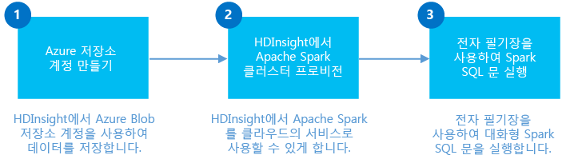

<properties
	pageTitle="HDInsight Linux에서 Spark 클러스터 만들기 및 Jupyter에서 Spark SQL을 사용하여 대화형 분석 | Microsoft Azure"
	description="HDInsight에서 Apache Spark 클러스터를 신속하게 만든 후 Jupyter 노트북에서 Spark SQL을 사용하여 대화형 쿼리를 실행하는 방법에 대한 단계별 지침입니다."
	services="hdinsight"
	documentationCenter=""
	authors="nitinme"
	manager="jhubbard"
	editor="cgronlun"
	tags="azure-portal"/>

<tags
	ms.service="hdinsight"
	ms.workload="big-data"
	ms.tgt_pltfrm="na"
	ms.devlang="na"
	ms.topic="get-started-article"
	ms.date="07/25/2016"
	ms.author="nitinme"/>

# 시작: HDInsight Linux에서 Apache Spark 클러스터 만들기 및 Spark SQL을 사용하여 대화형 쿼리 실행

HDInsight에서 Apache Spark 클러스터를 만든 다음 [Jupyter](https://jupyter.org) 노트북을 사용하여 Spark 클러스터에서 Spark SQL 대화형 쿼리를 실행하는 방법을 알아봅니다.

   

[AZURE.INCLUDE [delete-cluster-warning](../../includes/hdinsight-delete-cluster-warning.md)]

**필수 조건:**

- **Azure 구독**. 이 자습서를 시작하기 전에 Azure 구독이 있어야 합니다. [Azure 무료 평가판](https://azure.microsoft.com/documentation/videos/get-azure-free-trial-for-testing-hadoop-in-hdinsight/)을 참조하세요.

- **SSH(보안 셸) 클라이언트**: Linux, Unix 및 OS X 시스템은 `ssh` 명령을 통해 SSH 클라이언트를 제공합니다. Windows 시스템의 경우 [PuTTY](http://www.chiark.greenend.org.uk/~sgtatham/putty/download.html)를 사용하는 것이 좋습니다.
    
- **SSH(보안 셸) 키**(선택 사항): 암호 또는 공개 키를 사용하여 클러스터에 연결할 때 사용되는 SSH 계정을 보호할 수 있습니다. 암호를 사용하면 신속하게 시작하고 클러스터를 신속하게 만들고 일부 테스트 작업을 실행하려면 이 옵션을 사용해야 합니다. 키를 사용하는 방법이 더 안전하지만 추가 설치를 필요로 합니다. 프로덕션 클러스터를 만들 때 이 방법을 사용하려 할 수 있습니다. 이 문서에서는 암호 접근 방식을 사용합니다. HDInsight로 SSH 키를 생성하고 사용하는 방법에 대한 지침은 다음 문서를 참조하세요.

	-  Linux 컴퓨터 - [Linux, Unix 또는 OS X에서 Linux 기반 HDInsight(Hadoop)와 SSH 사용](hdinsight-hadoop-linux-use-ssh-unix.md)
    
	-  Windows 컴퓨터 - [Windows에서 Linux 기반 HDInsight(Hadoop)와 SSH 사용](hdinsight-hadoop-linux-use-ssh-windows.md)

>[AZURE.NOTE] 이 문서에서는 ARM 템플릿을 사용하여 [클러스터 저장소로 Azure 저장소 Blob](hdinsight-hadoop-use-blob-storage.md)을 사용하는 Spark 클러스터를 만듭니다. 기본 저장소로 Azure 저장소 Blob 외에도 추가 저장소로 [Azure Data Lake 저장소](../data-lake-store/data-lake-store-overview.md)를 사용하는 Spark 클러스터를 만들 수도 있습니다. 자세한 내용은 [Data Lake 저장소가 있는 HDInsight 클러스터 만들기](../data-lake-store/data-lake-store-hdinsight-hadoop-use-portal.md)를 참조하세요.

## Spark 클러스터 만들기

이 섹션에서는 Azure ARM 템플릿을 사용하여 HDInsight 버전 3.4 클러스터(Spark 버전 1.6.1)를 만듭니다. HDInsight 버전 및 해당 SLA에 대한 내용은 [HDInsight 구성 요소 버전 관리](hdinsight-component-versioning.md)를 참조하세요. 클러스터를 만드는 다른 방법은 [HDInsight 클러스터 만들기](hdinsight-hadoop-provision-linux-clusters.md)를 참조하세요.

1. Azure 포털에서 ARM 템플릿을 열려면 다음 이미지를 클릭합니다.

    
    
    ARM 템플릿은 공용 BLOB 컨테이너에 있습니다. *https://hditutorialdata.blob.core.windows.net/armtemplates/create-linux-based-spark-cluster-in-hdinsight.json*.
   
2. 매개 변수 블레이드에서 다음을 입력합니다.

    - **ClusterName**: 만들려는 Hadoop 클러스터의 이름을 입력합니다.
    - **클러스터 로그인 이름 및 암호**: 기본 로그인 이름은 admin입니다.
    - **SSH 사용자 이름 및 암호**.
    
    이러한 값을 기록해 두십시오. 이 정보는 자습서의 뒷부분에서 필요합니다.

    > [AZURE.NOTE] SSH는 명령줄을 사용하여 HDInsight 클러스터에 원격으로 액세스하는 데 사용됩니다. 여기에 사용되는 사용자 이름 및 암호는 SSH 통해 클러스터에 연결할 때 사용됩니다. 또한 모든 HDInsight 클러스터 노드에 대해 사용자 계정을 생성하므로 SSH 사용자 이름은 고유해야 합니다. 다음은 클러스터에서 서비스에 의해 사용하도록 예약된 계정 이름 중 일부이며 SSH 사용자 이름으로 사용할 수 없습니다.
    >
    > root, hdiuser, storm, hbase, ubuntu, zookeeper, hdfs, yarn, mapred, hbase, hive, oozie, falcon, sqoop, admin, tez, hcat, hdinsight-zookeeper.

	> HDInsight에서 SSH를 사용하는 방법에 대한 자세한 내용은 다음 문서를 참조하세요.

	> * [Linux, Unix 또는 OS X의 HDInsight에서 Linux 기반 Hadoop과 SSH 사용](hdinsight-hadoop-linux-use-ssh-unix.md)
	> * [Windows의 HDInsight에서 Linux 기반 Hadoop과 SSH 사용](hdinsight-hadoop-linux-use-ssh-windows.md)

    
3\.**확인**을 클릭하여 매개 변수를 저장합니다.

4\.**사용자 지정 배포** 블레이드에서 **리소스 그룹** 드롭다운 상자를 클릭한 후 **새로 만들기**를 클릭하여 새 리소스 그룹을 만듭니다. 리소스 그룹은 클러스터, 종속 저장소 계정 및 기타 연결된 리소스를 그룹화하는 컨테이너입니다.

5\.**약관**을 클릭한 다음 **만들기**를 클릭합니다.

6\.**만들기**를 클릭합니다. 템플릿 배포에 배포 제출 중이라는 제목의 새 타일이 표시됩니다. 클러스터 및 SQL 데이터베이스를 만들려면 20분 정도가 걸립니다.

## Jupyter Notebook을 사용하여 Spark SQL 쿼리 실행

이 섹션에서는 Jupyter Notebook을 사용하여 Spark 클러스터에 대해 Spark SQL 쿼리를 실행합니다. HDInsight Spark 클러스터는 Jupyter 노트북에 사용할 수 있는 두 개의 커널을 제공합니다. 다음과 같습니다.

* **PySpark**(Python에서 작성한 응용 프로그램용)
* **Spark**(Scala에서 작성한 응용 프로그램용)

이 문서에서는 PySpark 커널을 사용합니다. PySpark 커널을 사용하는 이점에 대한 세부 정보는 [Spark HDInsight 클러스터와 함께 Jupyter 노트북에서 사용 가능한 커널](hdinsight-apache-spark-jupyter-notebook-kernels.md#why-should-i-use-the-new-kernels) 문서를 참조하세요. PySpark 커널을 사용할 경우의 주요 이점은 다음과 같습니다.

* Spark 및 Hive에 대한 컨텍스트를 설정할 필요가 없습니다. 자동으로 설정됩니다.
* `%%sql`과 같은 셀 매직을 사용하여 이전 코드 조각 없이 직접 SQL 또는 Hive 쿼리를 실행할 수 있습니다.
* SQL 또는 Hive 쿼리의 출력은 자동으로 시각화됩니다.

### PySpark 커널을 사용하여 Jupyter Notebook 만들기 

1. [Azure 포털](https://portal.azure.com/)의 시작 보드에서 Spark 클러스터에 대한 타일을 클릭합니다(시작 보드에 고정한 경우). **모두 찾아보기** > **HDInsight 클러스터**에서 클러스터로 이동할 수도 있습니다.

2. Spark 클러스터 블레이드에서 **빠른 연결**을 클릭한 다음 **클러스터 대시보드** 블레이드에서 **Jupyter Notebook**을 클릭합니다. 메시지가 표시되면 클러스터에 대한 관리자 자격 증명을 입력합니다.

	> [AZURE.NOTE] 또한 브라우저에서 다음 URL을 열어 클러스터에 대한 Jupyter Notebook에 접근할 수 있습니다. __CLUSTERNAME__을 클러스터의 이름으로 바꿉니다.
	>
	> `https://CLUSTERNAME.azurehdinsight.net/jupyter`

2. 새 Notebook을 만듭니다. **새로 만들기**를 클릭한 다음 **PySpark**를 클릭합니다.

	

3. 새 노트북이 만들어지고 Untitled.pynb 이름으로 열립니다. 맨 위에서 노트북 이름을 클릭하고 식별하기 쉬운 이름을 입력합니다.

	

4. PySpark 커널을 사용하여 노트북을 만들었기 때문에 컨텍스트를 명시적으로 만들 필요가 없습니다. 첫 번째 코드 셀을 실행하면 Spark 및 Hive 컨텍스트가 자동으로 만들어집니다. 이 시나리오에 필요한 형식을 가져와 시작할 수 있습니다. 이렇게 하려면 셀에 다음 코드 조각을 붙여 넣고 **SHIFT + ENTER**를 누릅니다.

		from pyspark.sql.types import *
		
	Jupyter에서 작업을 실행할 때마다, 웹 브라우저 창 제목에 Notebook 제목과 함께 **(사용 중)** 상태가 표시됩니다. 또한 오른쪽 위 모서리에 있는 **PySpark** 텍스트 옆에 단색 원이 표시됩니다. 작업이 완료되면 속이 빈 원으로 변경됩니다.

	 

4. 샘플 데이터를 임시 테이블에 로드합니다. HDInsight에서 Spark 클러스터를 만들면 샘플 데이터 파일인 **hvac.csv**가 **\\HdiSamples\\HdiSamples\\SensorSampleData\\hvac** 아래 연결된 저장소 계정에 복사됩니다.

	빈 셀에서 다음 코드 예제를 붙여넣고 **SHIFT + ENTER**를 누릅니다. 이 코드 예제는 **hvac**라는 임시 테이블에 데이터로 등록됩니다.

		# Load the data
		hvacText = sc.textFile("wasbs:///HdiSamples/HdiSamples/SensorSampleData/hvac/HVAC.csv")
		
		# Create the schema
		hvacSchema = StructType([StructField("date", StringType(), False),StructField("time", StringType(), False),StructField("targettemp", IntegerType(), False),StructField("actualtemp", IntegerType(), False),StructField("buildingID", StringType(), False)])
		
		# Parse the data in hvacText
		hvac = hvacText.map(lambda s: s.split(",")).filter(lambda s: s[0] != "Date").map(lambda s:(str(s[0]), str(s[1]), int(s[2]), int(s[3]), str(s[6]) ))
		
		# Create a data frame
		hvacdf = sqlContext.createDataFrame(hvac,hvacSchema)
		
		# Register the data fram as a table to run queries against
		hvacdf.registerTempTable("hvac")

5. PySpark 커널을 사용하기 때문에 이제 `%%sql` 매직을 사용하여 방금 만든 임시 테이블 **hvac**에서 SQL 쿼리를 직접 실행할 수 있습니다. `%%sql` 매직 및 기타 PySpark 커널에서 사용 가능한 매직에 대한 자세한 내용은 [Spark HDInsight 클러스터와 함께 Jupyter Notebook에서 사용 가능한 커널](hdinsight-apache-spark-jupyter-notebook-kernels.md#why-should-i-use-the-new-kernels)을 참조하세요.
		
		%%sql
		SELECT buildingID, (targettemp - actualtemp) AS temp_diff, date FROM hvac WHERE date = "6/1/13"

5. 작업이 성공적으로 완료되면 기본적으로 다음 테이블 형식의 출력이 표시됩니다.

 	

	다른 시각화로 결과를 볼 수도 있습니다. 예를 들어 동일한 출력에 대한 영역 그래프는 다음과 같습니다.

	

6. 응용 프로그램 실행을 완료한 후 리소스를 해제하도록 노트북을 종료해야 합니다. 이렇게 하기 위해 Notebook의 **파일** 메뉴에서 **Close and Halt**를 클릭합니다. 그러면 Notebook이 종료되고 닫힙니다.

##클러스터 삭제

[AZURE.INCLUDE [delete-cluster-warning](../../includes/hdinsight-delete-cluster-warning.md)]

## 참고 항목

* [개요: Azure HDInsight에서 Apache Spark](hdinsight-apache-spark-overview.md)

### 시나리오

* [BI와 Spark: BI 도구와 함께 HDInsight에서 Spark를 사용하여 대화형 데이터 분석 수행](hdinsight-apache-spark-use-bi-tools.md)

* [기계 학습과 Spark: HVAC 데이터를 사용하여 건물 온도를 분석하는 데 HDInsight의 Spark 사용](hdinsight-apache-spark-ipython-notebook-machine-learning.md)

* [기계 학습과 Spark: 음식 검사 결과를 예측하는 데 HDInsight의 Spark 사용](hdinsight-apache-spark-machine-learning-mllib-ipython.md)

* [Spark 스트리밍: HDInsight에서 Spark를 사용하여 실시간 스트리밍 응용 프로그램 빌드](hdinsight-apache-spark-eventhub-streaming.md)

* [HDInsight의 Spark를 사용하여 웹 사이트 로그 분석](hdinsight-apache-spark-custom-library-website-log-analysis.md)

* [HDInsight에서 Spark를 사용하는 Application Insight 원격 분석 데이터 분석](hdinsight-spark-analyze-application-insight-logs.md)

### 응용 프로그램 만들기 및 실행

* [Scala를 사용하여 독립 실행형 응용 프로그램 만들기](hdinsight-apache-spark-create-standalone-application.md)

* [Livy를 사용하여 Spark 클러스터에서 원격으로 작업 실행](hdinsight-apache-spark-livy-rest-interface.md)

### 도구 및 확장

* [IntelliJ IDEA용 HDInsight 도구 플러그 인을 사용하여 Spark Scala 응용 프로그램 만들기 및 제출](hdinsight-apache-spark-intellij-tool-plugin.md)

* [IntelliJ IDEA용 HDInsight 도구 플러그 인을 사용하여 Spark 응용 프로그램을 원격으로 디버그](hdinsight-apache-spark-intellij-tool-plugin-debug-jobs-remotely.md)

* [HDInsight에서 Spark 클러스터와 함께 Zeppelin Notebook 사용](hdinsight-apache-spark-use-zeppelin-notebook.md)

* [HDInsight의 Spark 클러스터에서 Jupyter Notebook에 사용할 수 있는 커널](hdinsight-apache-spark-jupyter-notebook-kernels.md)

* [Jupyter 노트북에서 외부 패키지 사용](hdinsight-apache-spark-jupyter-notebook-use-external-packages.md)

* [컴퓨터에 Jupyter를 설치하고 HDInsight Spark 클러스터에 연결](hdinsight-apache-spark-jupyter-notebook-install-locally.md)

### 리소스 관리

* [Azure HDInsight에서 Apache Spark 클러스터에 대한 리소스 관리](hdinsight-apache-spark-resource-manager.md)

* [HDInsight의 Apache Spark 클러스터에서 실행되는 작업 추적 및 디버그](hdinsight-apache-spark-job-debugging.md)

[hdinsight-versions]: hdinsight-component-versioning.md
[hdinsight-upload-data]: hdinsight-upload-data.md
[hdinsight-storage]: hdinsight-hadoop-use-blob-storage.md

[azure-purchase-options]: http://azure.microsoft.com/pricing/purchase-options/
[azure-member-offers]: http://azure.microsoft.com/pricing/member-offers/
[azure-free-trial]: http://azure.microsoft.com/pricing/free-trial/
[azure-management-portal]: https://manage.windowsazure.com/
[azure-create-storageaccount]: storage-create-storage-account.md

<!---HONumber=AcomDC_0914_2016-->