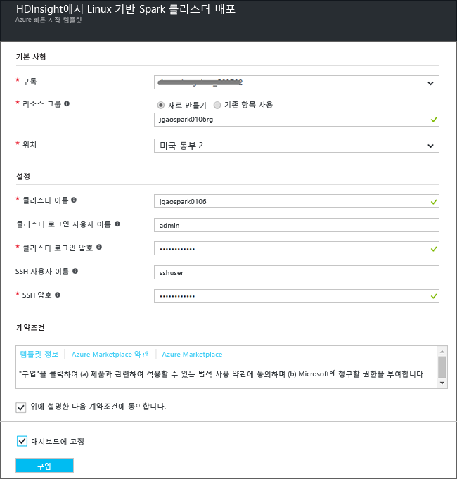

# 시작: Azure HDInsight에서 Apache Spark 클러스터 만들기 및 Spark SQL을 사용하여 대화형 쿼리 실행

HDInsight에서 [Apache Spark](hdinsight-apache-spark-overview.md) 클러스터를 만든 다음 [Jupyter](https://jupyter.org) 노트북을 사용하여 Spark 클러스터에서 Spark SQL 대화형 쿼리를 실행하는 방법을 알아봅니다.

   

## 필수 조건
* **Azure 구독**. 이 자습서를 시작하기 전에 Azure 구독이 있어야 합니다. [지금 무료 Azure 계정 만들기](https://azure.microsoft.com/free)를 참조하세요.

## Spark 클러스터 만들기
이 섹션에서는 [Azure Resource Manager 템플릿](https://azure.microsoft.com/resources/templates/101-hdinsight-spark-linux/)을 사용하여 HDInsight에서 Spark 클러스터를 만듭니다. 클러스터를 만드는 다른 방법은 [HDInsight 클러스터 만들기](hdinsight-hadoop-provision-linux-clusters.md)를 참조하세요.

1. Azure 포털에서 템플릿을 열려면 다음 이미지를 클릭합니다.         

    

2. 다음 값을 입력합니다.

    

    * **구독**: 이 클러스터에 대해 Azure 구독을 선택합니다.
    * **리소스 그룹**: 리소스 그룹을 만들거나 기존 리소스 그룹을 선택합니다. 리소스 그룹은 프로젝트에 대한 Azure 리소스를 관리하는 데 사용됩니다.
    * **위치**: 리소스 그룹의 위치를 선택합니다.  이 위치는 기본 클러스터 저장소 및 HDInsight 클러스터에도 사용됩니다.
    * **ClusterName**: 만들려는 Hadoop 클러스터의 이름을 입력합니다.
    * **Spark 버전**: 클러스터에 설치할 Spark 버전을 선택합니다.
    * **클러스터 로그인 이름 및 암호**: 기본 로그인 이름은 admin입니다.
    * **SSH 사용자 이름 및 암호**.

   이러한 값을 기록해 둡니다.  이 정보는 자습서의 뒷부분에서 필요합니다.

3. **위에 명시된 사용 약관에 동의함**을 선택하고 **대시보드에 고정**을 선택한 다음 **구매**를 클릭합니다. 템플릿 배포에 배포 제출 중이라는 제목의 새 타일이 표시됩니다. 클러스터를 만드는 데 약 20분이 걸립니다.

> [!NOTE]
> 이 문서에서는 [클러스터 저장소로 Azure 저장소 Blob](hdinsight-hadoop-use-blob-storage.md)을 사용하는 Spark 클러스터를 만듭니다. 기본 저장소로 Azure Storage Blob 외에도 추가 저장소로 [Azure Data Lake Store](../data-lake-store/data-lake-store-overview.md)를 사용하는 Spark 클러스터를 만들 수도 있습니다. 자세한 내용은 [Data Lake 저장소가 있는 HDInsight 클러스터 만들기](../data-lake-store/data-lake-store-hdinsight-hadoop-use-portal.md)를 참조하세요.
>
>

## Spark SQL 쿼리 실행

이 섹션에서는 Jupyter Notebook을 사용하여 Spark 클러스터에 대해 Spark SQL 쿼리를 실행합니다. HDInsight Spark 클러스터는 Jupyter Notebook에 사용할 수 있는 세 개의 커널을 제공합니다. 다음과 같습니다.

* **PySpark** (Python에서 작성한 응용 프로그램용)
* **PySpark3** (Python3에서 작성한 응용 프로그램용)
* **Spark** (Scala에서 작성한 응용 프로그램용)

이 문서에서는 **PySpark** 커널을 사용합니다. 커널에 대한 자세한 내용은 [HDInsight에서 Apache Spark 클러스터와 함께 Jupyter Notebook 커널 사용](hdinsight-apache-spark-jupyter-notebook-kernels.md)을 참조하세요. PySpark 커널을 사용할 경우의 주요 이점은 다음과 같습니다.

* Spark 및 Hive에 대한 컨텍스트가 자동으로 설정됩니다.
* `%%sql`과 같은 셀 매직을 사용하여 이전 코드 조각 없이 직접 SQL 또는 Hive 쿼리를 실행합니다.
* SQL 또는 Hive 쿼리의 출력은 자동으로 시각화됩니다.

### PySpark 커널을 사용하여 Jupyter Notebook 만들기

1. [Azure 포털](https://portal.azure.com/)을 엽니다.

2. 클러스터를 대시보드에 고정하도록 선택한 경우 대시보드에서 클러스터 타일을 클릭하여 클러스터 블레이드를 시작합니다.

    클러스터를 대시보드에 고정하지 않은 경우 왼쪽 창에서 **HDInsight 클러스터**를 클릭한 후 만든 클러스터를 클릭합니다.

3. **빠른 링크**에서 **클러스터 대시보드**를 클릭한 다음 **Jupyter Notebook**을 클릭합니다. 메시지가 표시되면 클러스터에 대한 관리자 자격 증명을 입력합니다.

   

   > [!NOTE]
   > 또한 브라우저에서 다음 URL을 열어 클러스터에 대한 Jupyter Notebook에 접근할 수 있습니다. **CLUSTERNAME** 을 클러스터의 이름으로 바꿉니다.
   >
   > `https://CLUSTERNAME.azurehdinsight.net/jupyter`
   >
   >
3. Notebook을 만듭니다. **새로 만들기**를 클릭한 다음 **PySpark**를 클릭합니다.

   

   새 노트북이 만들어지고 Untitled(Untitled.pynb) 이름으로 열립니다.

4. 맨 위에서 노트북 이름을 클릭하고 원하는 경우 식별하기 쉬운 이름을 입력합니다.

    

5. 빈 셀에 다음 코드를 붙여 넣은 다음 **SHIFT + ENTER**를 눌러 코드를 실행합니다. 코드는 이 시나리오에 필요한 형식을 가져옵니다.

        from pyspark.sql.types import *

    PySpark 커널을 사용하여 노트북을 만들었기 때문에 컨텍스트를 명시적으로 만들 필요가 없습니다. 첫 번째 코드 셀을 실행하면 Spark 및 Hive 컨텍스트가 자동으로 만들어집니다.

    

    Jupyter에서 작업을 실행할 때마다, 웹 브라우저 창 제목에 Notebook 제목과 함께 **(사용 중)** 상태가 표시됩니다. 또한 오른쪽 위 모서리에 있는 **PySpark** 텍스트 옆에 단색 원이 표시됩니다. 작업이 완료되면 속이 빈 원으로 변경됩니다.

6. 다음 코드를 실행하여 임시 테이블(**hvac**)로 샘플 데이터 집합을 등록합니다.

        # Load the data
        hvacText = sc.textFile("wasbs:///HdiSamples/HdiSamples/SensorSampleData/hvac/HVAC.csv")
        
        # Create the schema
        hvacSchema = StructType([StructField("date", StringType(), False),StructField("time", StringType(), False),StructField("targettemp", IntegerType(), False),StructField("actualtemp", IntegerType(), False),StructField("buildingID", StringType(), False)])
        
        # Parse the data in hvacText
        hvac = hvacText.map(lambda s: s.split(",")).filter(lambda s: s[0] != "Date").map(lambda s:(str(s[0]), str(s[1]), int(s[2]), int(s[3]), str(s[6]) ))
        
        # Create a data frame
        hvacdf = sqlContext.createDataFrame(hvac,hvacSchema)
        
        # Register the data fram as a table to run queries against
        hvacdf.registerTempTable("hvac")

    HDInsight의 Spark 클러스터는 **\HdiSamples\HdiSamples\SensorSampleData\hvac** 아래에서 샘플 데이터 파일 **hvac.csv**와 함께 제공됩니다.

7. 데이터를 쿼리하려면 다음 코드를 실행합니다.

        %%sql
        SELECT buildingID, (targettemp - actualtemp) AS temp_diff, date FROM hvac WHERE date = \"6/1/13\"

   PySpark 커널을 사용하기 때문에 이제 `%%sql` 매직을 사용하여 만든 임시 테이블 **hvac**에서 SQL 쿼리를 직접 실행할 수 있습니다. `%%sql` 매직 및 기타 PySpark 커널에서 사용 가능한 매직에 대한 자세한 내용은 [Spark HDInsight 클러스터와 함께 Jupyter Notebook에서 사용 가능한 커널](hdinsight-apache-spark-jupyter-notebook-kernels.md#choose-between-the-kernels)을 참조하세요.

   다음과 같은 테이블 형식 출력이 기본적으로 표시됩니다.

     

    다른 시각화로 결과를 볼 수도 있습니다. 예를 들어 동일한 출력에 대한 영역 그래프는 다음과 같습니다.

    

9. 응용 프로그램 실행을 완료한 후 클러스터 리소스를 해제하도록 Notebook을 종료합니다. 이렇게 하기 위해 Notebook의 **파일** 메뉴에서 **닫기 및 중지**를 클릭합니다.

## 문제 해결

HDInsight 클러스터로 작업하는 동안 발생할 수 있는 몇 가지 일반적인 문제는 다음과 같습니다.

### 액세스 제어 요구 사항
[!INCLUDE [access-control](../../includes/hdinsight-access-control-requirements.md)]

## 클러스터 삭제
[!INCLUDE [delete-cluster-warning](../../includes/hdinsight-delete-cluster-warning.md)]

## 참고 항목
* [개요: Azure HDInsight에서 Apache Spark](hdinsight-apache-spark-overview.md)

### 시나리오
* [BI와 Spark: BI 도구와 함께 HDInsight에서 Spark를 사용하여 대화형 데이터 분석 수행](hdinsight-apache-spark-use-bi-tools.md)
* [기계 학습과 Spark: HVAC 데이터를 사용하여 건물 온도를 분석하는 데 HDInsight의 Spark 사용](hdinsight-apache-spark-ipython-notebook-machine-learning.md)
* [기계 학습과 Spark: 음식 검사 결과를 예측하는 데 HDInsight의 Spark 사용](hdinsight-apache-spark-machine-learning-mllib-ipython.md)
* [Spark 스트리밍: HDInsight에서 Spark를 사용하여 실시간 스트리밍 응용 프로그램 빌드](hdinsight-apache-spark-eventhub-streaming.md)
* [HDInsight의 Spark를 사용하여 웹 사이트 로그 분석](hdinsight-apache-spark-custom-library-website-log-analysis.md)
* [HDInsight에서 Spark를 사용하는 Application Insight 원격 분석 데이터 분석](hdinsight-spark-analyze-application-insight-logs.md)

### 응용 프로그램 만들기 및 실행
* [Scala를 사용하여 독립 실행형 응용 프로그램 만들기](hdinsight-apache-spark-create-standalone-application.md)
* [Livy를 사용하여 Spark 클러스터에서 원격으로 작업 실행](hdinsight-apache-spark-livy-rest-interface.md)

### 도구 및 확장
* [IntelliJ IDEA용 HDInsight 도구 플러그 인을 사용하여 Spark Scala 응용 프로그램 만들기 및 제출](hdinsight-apache-spark-intellij-tool-plugin.md)
* [IntelliJ IDEA용 HDInsight 도구 플러그 인을 사용하여 Spark 응용 프로그램을 원격으로 디버그](hdinsight-apache-spark-intellij-tool-plugin-debug-jobs-remotely.md)
* [HDInsight에서 Spark 클러스터와 함께 Zeppelin Notebook 사용](hdinsight-apache-spark-use-zeppelin-notebook.md)
* [HDInsight의 Spark 클러스터에서 Jupyter Notebook에 사용할 수 있는 커널](hdinsight-apache-spark-jupyter-notebook-kernels.md)
* [Jupyter 노트북에서 외부 패키지 사용](hdinsight-apache-spark-jupyter-notebook-use-external-packages.md)
* [컴퓨터에 Jupyter를 설치하고 HDInsight Spark 클러스터에 연결](hdinsight-apache-spark-jupyter-notebook-install-locally.md)

### 리소스 관리
* [Azure HDInsight에서 Apache Spark 클러스터에 대한 리소스 관리](hdinsight-apache-spark-resource-manager.md)
* [HDInsight의 Apache Spark 클러스터에서 실행되는 작업 추적 및 디버그](hdinsight-apache-spark-job-debugging.md)

[hdinsight-versions]: hdinsight-component-versioning.md
[hdinsight-upload-data]: hdinsight-upload-data.md
[hdinsight-storage]: hdinsight-hadoop-use-blob-storage.md

[azure-purchase-options]: http://azure.microsoft.com/pricing/purchase-options/
[azure-member-offers]: http://azure.microsoft.com/pricing/member-offers/
[azure-free-trial]: http://azure.microsoft.com/pricing/free-trial/
[azure-management-portal]: https://manage.windowsazure.com/
[azure-create-storageaccount]: storage-create-storage-account.md

