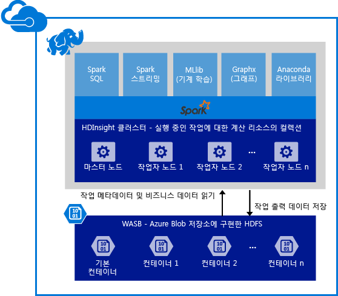

# 개요: HDInsight의 Apache Spark

<a href="http://spark.apache.org/" target="_blank">Apache Spark</a>는 메모리 내 처리를 지원하여 빅데이터 분석 응용 프로그램의 성능을 향상하는 오픈 소스 병렬 처리 프레임워크입니다. 속도, 간편한 사용 및 정교한 분석을 위해 Spark 처리 엔진이 빌드되었습니다. Spark는 메모리 내 계산 기능을 지원하여 기계 학습 및 그래프 계산의 반복 알고리즘에 적합합니다. 또한 Spark는 Azure Storage(WASB)와 호환되므로 Azure에 저장된 기존 데이터를 Spark를 통해 쉽게 처리할 수 있습니다.

HDInsight에서 Spark 클러스터를 만들 때는 설치 및 구성된 Spark로 Azure 계산 리소스를 만듭니다. HDInsight에서 Spark 클러스터를 약 10분만에 만들 수 있습니다. 처리되는 데이터는 Azure Storage에 저장됩니다. [HDInsight에서 Azure Storage 사용][hdinsight-storage]을 참조하세요.

**Azure HDInsight에서 Apache Spark를 시작하나요?** [빠른 시작: HDInsight에서 Spark 클러스터 만들기 및 Jupyter를 사용하여 샘플 응용 프로그램 실행](hdinsight-apache-spark-jupyter-spark-sql.md)을 참조하세요.

> [!NOTE]
> 현재 릴리스의 알려진 문제 및 제한 목록은 [Azure HDInsight에서 알려진 Apache Spark 문제](hdinsight-apache-spark-known-issues.md)를 참조하세요.
> 
> 

## Azure HDInsight에서 Spark를 사용하는 이유
Azure HDInsight는 완전히 관리되는 Spark 서비스를 제공합니다. HDInsight에서 Spark를 사용하는 이점은 다음과 같습니다.

| 기능 | 설명 |
| --- | --- |
| 클러스터 만들기 편의성 |Azure 관리 포털, Azure PowerShell 또는 HDInsight .NET SDK를 사용하여 몇 분만에 HDInsight에서 새 Spark 클러스터를 만들 수 있습니다. [HDInsight에서 Spark 클러스터 시작](hdinsight-apache-spark-jupyter-spark-sql.md) |
| 사용 편의성 |HDInsight 클러스터의 Spark에는 미리 구성된 Jupyter Notebook이 포함되어 있으며 대화형 데이터 처리 및 시각화에 사용할 수 있습니다. Jupyter Notebook에 대한 URL은 https://CLUSTERNAME.azurehdinsight.net/jupyter입니다. **CLUSTERNAME**을 Spark HDInsight 클러스터의 이름으로 바꿉니다. |
| REST API |HDInsight의 Spark에는 실행 중인 작업을 원격으로 제출 및 모니터링하는 REST-API 기반 Spark 작업 서버, [Livy](https://github.com/cloudera/hue/tree/master/apps/spark/java#welcome-to-livy-the-rest-spark-server)가 포함되어 있습니다. |
| Azure Data Lake 저장소에 대한 지원 |HDInsight 3.5 클러스터만으로 기본 저장소뿐만 아니라 추가 저장소로 Azure Data Lake Store를 사용하도록 HDInsight에서 Spark를 구성할 수 있습니다. Data Lake 저장소에 대한 자세한 내용은 [Azure Data Lake 저장소 개요](../data-lake-store/data-lake-store-overview.md)를 참조하세요. |
| Azure 서비스와의 통합 |HDInsight에서 Spark는 Azure 이벤트 허브에 대한 커넥터와 함께 제공됩니다. 고객은 [Kafka](http://kafka.apache.org/)외에, 이미 Spark에서 제공하는 이벤트 허브를 사용하여 스트리밍 응용 프로그램을 빌드할 수 있습니다. |
| R 서버에 대한 지원 |Spark 클러스터와 약속된 속도로 분산된 R 계산을 실행하도록 HDInsight Spark 클러스터에서 R 서버를 설정할 수 있습니다. 자세한 내용은 [HDInsight에서 R 서버 사용 시작](hdinsight-hadoop-r-server-get-started.md)을 참조하세요. |
| IntelliJ IDEA와의 통합 |IntelliJ용 HDInsight 플러그 인을 사용하여 응용 프로그램을 만들고 HDInsight Spark 클러스터에 제출할 수 있습니다. 자세한 내용은 [IntelliJ IDEA용 HDInsight 도구 플러그 인을 사용하여 HDInsight Spark Linux 클러스터용 Spark Scala 응용 프로그램 만들기](hdinsight-apache-spark-intellij-tool-plugin.md)를 참조하세요. |
| 동시 쿼리 |HDInsight에서 Spark는 동시 쿼리를 지원합니다. 이를 통해 한 사용자의 여러 개 쿼리 또는 여러 사용자 및 응용 프로그램의 여러 개 쿼리에서 동일한 클러스터 리소스를 공유할 수 있습니다. |
| SSD에서 캐시 |클러스터 노드에 연결된 메모리 또는 SSD에서 데이터를 캐시하도록 선택할 수 있습니다. 메모리에서 캐시하면 최고의 쿼리 성능을 제공하지만 리소스가 많이 들 수 있습니다. SSD에서 캐시하면 메모리에서 전체 데이터 집합에 맞게 필요한 크기의 클러스터를 만들 필요 없이 쿼리 성능 향상을 위한 훌륭한 옵션을 제공합니다. |
| BI 도구와의 통합 |HDInsight에서 Spark는 데이터 분석을 위해 [Power BI](http://www.powerbi.com/) 및 [Tableau](http://www.tableau.com/products/desktop)와 같은 BI 도구에 커넥터를 제공합니다. |
| 미리 로드된 Anaconda 라이브러리 |HDInsight에서 Spark 클러스터는 미리 설치된 Anaconda 라이브러리와 함께 제공됩니다. [Anaconda](http://docs.continuum.io/anaconda/) 는 기계 학습, 데이터 분석, 시각화 등을 위해 약 200개의 라이브러리를 제공합니다. |
| 확장성 |만드는 동안 클러스터의 노드 수를 지정할 수 있지만 작업과 일치하도록 클러스터를 확장하거나 축소할 수도 있습니다. 모든 HDInsight 클러스터를 통해 클러스터의 노드 수를 변경할 수 있습니다. 또한 Spark 클러스터는 모든 데이터가 Azure Storage에 저장되므로 데이터 손실 없이 삭제될 수 있습니다. |
| 24/7 지원 |HDInsight에서 Spark는 엔터프라이즈 수준 24/7 지원 및 가동 시간 99.9%의 SLA와 함께 제공됩니다. |

## HDInsight에서 Spark에 대한 사용 사례
HDInsight에서 Apache Spark는 다음과 같은 주요 시나리오를 사용할 수 있습니다.

### 대화형 데이터 분석 및 BI
[자습서 살펴보기](hdinsight-apache-spark-use-bi-tools.md)

HDInsight에서 Apache Spark는 Azure Blob에 데이터를 저장합니다. 비즈니스 전문가 및 주요 의사 결정권자는 해당 데이터에 대한 보고서를 분석 및 작성하고 Microsoft Power BI를 사용하여 분석된 데이터에서 대화형 보고서를 작성합니다. 분석자는 Azure 저장소에 구조화되지 않은/반 구조화된 데이터부터 시작하여 Notebook을 사용하여 데이터에 대한 스키마를 정의하고 Microsoft Power BI를 사용하여 데이터 모델을 작성할 수 있습니다. 또한 HDInsight에서 Spark는 데이터 분석자, 비즈니스 전문가 및 주요 의사 결정권자를 위한 이상적인 플랫폼을 만드는 Tableau, Qlikview 및 SAP Lumira와 같은 타사 BI 도구를 지원합니다.

### 반복적인 기계 학습
[자습서 살펴보기: HVAC 데이터를 사용하여 건물 온도 예측](hdinsight-apache-spark-ipython-notebook-machine-learning.md)

[자습서 살펴보기: 음식 검사 결과 예측](hdinsight-apache-spark-machine-learning-mllib-ipython.md)

Apache Spark는 [MLlib](http://spark.apache.org/mllib/), 즉 Spark를 기반으로 빌드된 기계 학습 라이브러리와 함께 제공됩니다. 또한 이외에도 HDInsight에서 Spark는 다양한 기계 학습용 패키지와 함께 Anaconda, Python 배포를 포함합니다. Jupyter 노트북에 대한 기본 제공 지원으로 결합하고 기계 학습 응용 프로그램을 만들기 위한 최고의 환경을 제공합니다.  

### 스트리밍 및 실시간 데이터 분석
[자습서 살펴보기](hdinsight-apache-spark-eventhub-streaming.md)

실시간 데이터 분석은 실제 스트리밍 솔루션을 빌드하기 위해 되는 대로 데이터를 처리하여 시간 감소에서 데이터 통찰력에 이르기까지 시나리오에 사용됩니다. HDInsight에서 Spark는 실시간 분석 솔루션을 빌드하기 위한 풍부한 지원을 제공합니다. Spark가 이미 커넥터를 가지고 Kafka, Flume, Twitter, ZeroMQ 또는 TCP 소켓 같은 여러 소스에서 데이터를 수집하는 동안 HDInsight에서 Spark는 Azure 이벤트 허브에서 데이터 수집을 위한 최상의 지원을 추가합니다. 이벤트 허브는 Azure에서 가장 널리 사용되는 큐 서비스입니다. 이벤트 허브에 기본적으로 지원이 되는 경우 HDInsight에서 Spark는 실시간으로 분석 파이프라인을 빌드하기에 이상적인 플랫폼입니다.

## Spark 클러스터의 일부로 포함된 구성 요소
HDInsight에서 Spark에는 기본적으로 클러스터에서 사용할 수 있는 다음과 같은 구성 요소가 포함되어 있습니다.

* [Spark Core](https://spark.apache.org/docs/1.5.1/). Spark Core, Spark SQL, Spark 스트리밍 API, GraphX 및 MLlib가 포함됩니다.
* [Anaconda](http://docs.continuum.io/anaconda/)
* [Livy](https://github.com/cloudera/hue/tree/master/apps/spark/java#welcome-to-livy-the-rest-spark-server)
* [Jupyter Notebook](https://jupyter.org)
* [Zeppelin Notebook](http://zeppelin-project.org/)

또한 HDInsight에서 Spark는 Microsoft Power BI 및 Tableau와 같은 BI 도구에서 HDInsight의 Spark 클러스터에 대한 연결로 [ODBC 드라이버](http://go.microsoft.com/fwlink/?LinkId=616229) 를 제공합니다.

## 시작 단계
HDInsight Linux에서 Spark 클러스터를 만드는 작업부터 시작합니다. [빠른 시작: HDInsight Linux에서 Spark 클러스터 만들기 및 Jupyter를 사용하여 샘플 응용 프로그램 실행](hdinsight-apache-spark-jupyter-spark-sql.md).을 참조하세요. 

## 다음 단계
### 시나리오
* [BI와 Spark: BI 도구와 함께 HDInsight에서 Spark를 사용하여 대화형 데이터 분석 수행](hdinsight-apache-spark-use-bi-tools.md)
* [기계 학습과 Spark: HVAC 데이터를 사용하여 건물 온도를 분석하는 데 HDInsight의 Spark 사용](hdinsight-apache-spark-ipython-notebook-machine-learning.md)
* [기계 학습과 Spark: 음식 검사 결과를 예측하는 데 HDInsight의 Spark 사용](hdinsight-apache-spark-machine-learning-mllib-ipython.md)
* [Spark 스트리밍: HDInsight에서 Spark를 사용하여 실시간 스트리밍 응용 프로그램 빌드](hdinsight-apache-spark-eventhub-streaming.md)
* [HDInsight의 Spark를 사용하여 웹 사이트 로그 분석](hdinsight-apache-spark-custom-library-website-log-analysis.md)

### 응용 프로그램 만들기 및 실행
* [Scala를 사용하여 독립 실행형 응용 프로그램 만들기](hdinsight-apache-spark-create-standalone-application.md)
* [Livy를 사용하여 Spark 클러스터에서 원격으로 작업 실행](hdinsight-apache-spark-livy-rest-interface.md)

### 도구 및 확장
* [IntelliJ IDEA용 HDInsight 도구 플러그 인을 사용하여 Spark Scala 응용 프로그램 만들기 및 제출](hdinsight-apache-spark-intellij-tool-plugin.md)
* [IntelliJ IDEA용 HDInsight 도구 플러그 인을 사용하여 Spark 응용 프로그램을 원격으로 디버그](hdinsight-apache-spark-intellij-tool-plugin-debug-jobs-remotely.md)
* [HDInsight에서 Spark 클러스터와 함께 Zeppelin Notebook 사용](hdinsight-apache-spark-use-zeppelin-notebook.md)
* [HDInsight의 Spark 클러스터에서 Jupyter Notebook에 사용할 수 있는 커널](hdinsight-apache-spark-jupyter-notebook-kernels.md)
* [Jupyter 노트북에서 외부 패키지 사용](hdinsight-apache-spark-jupyter-notebook-use-external-packages.md)
* [컴퓨터에 Jupyter를 설치하고 HDInsight Spark 클러스터에 연결](hdinsight-apache-spark-jupyter-notebook-install-locally.md)

### 리소스 관리
* [Azure HDInsight에서 Apache Spark 클러스터에 대한 리소스 관리](hdinsight-apache-spark-resource-manager.md)
* [HDInsight의 Apache Spark 클러스터에서 실행되는 작업 추적 및 디버그](hdinsight-apache-spark-job-debugging.md)

[hdinsight-storage]: hdinsight-hadoop-use-blob-storage.md

