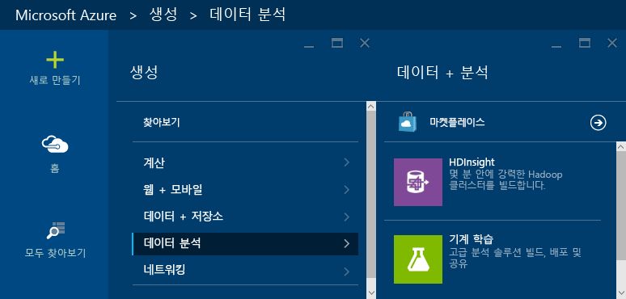
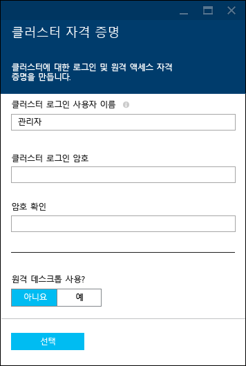
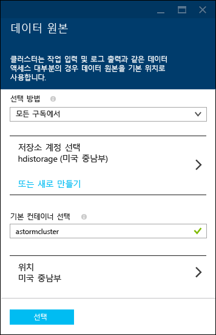
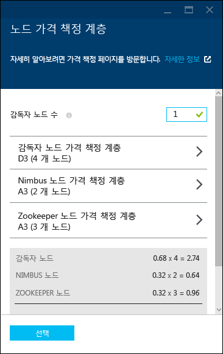
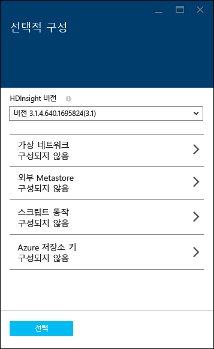
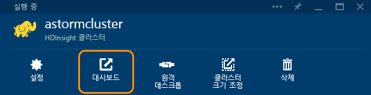
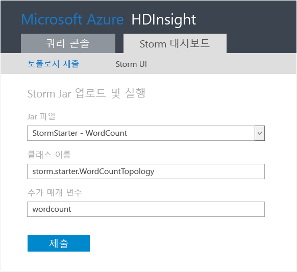
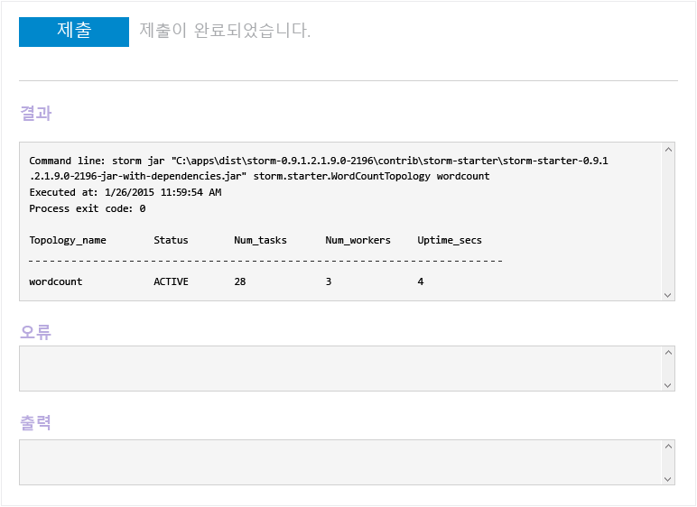
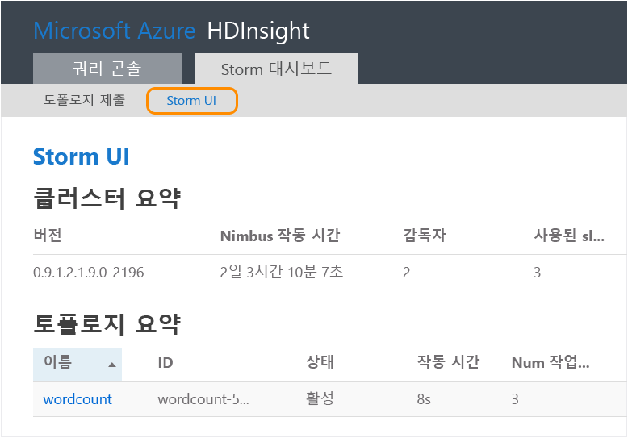
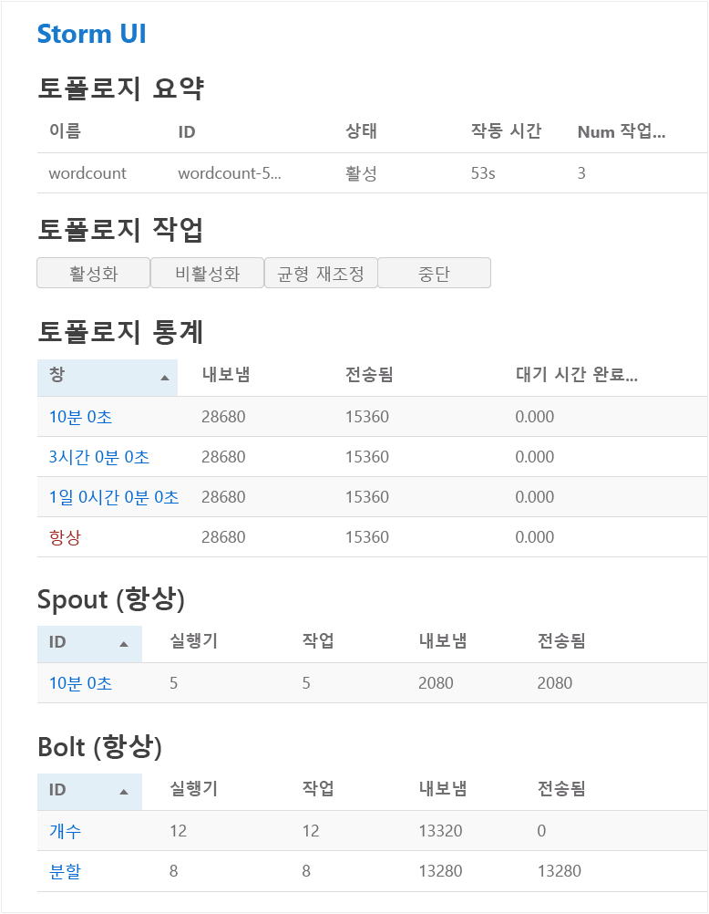

<properties
	pageTitle="Apache Storm 자습서: 스톰 시작 | Microsoft Azure"
	description="HDInsight에서 Storm Starter 샘플을 실행하여 Apache Storm을 사용한 빅 데이터 분석을 시작합니다. Storm을 사용하여 실시간으로 데이터를 처리하는 방법을 알아봅니다."
	keywords="apache storm, apache storm 자습서, 빅 데이터 분석, storm 시작"
	services="hdinsight"
	documentationCenter=""
	authors="Blackmist"
	manager="jhubbard"
	editor="cgronlun"
	tags="azure-portal"/>

<tags
   ms.service="hdinsight"
   ms.devlang="java"
   ms.topic="article"
   ms.tgt_pltfrm="na"
   ms.workload="big-data"
   ms.date="09/07/2016"
   ms.author="larryfr"/>

# Apache Storm 자습서: Storm Starter 샘플을 사용하여 HDInsight에서 빅 데이터 분석 시작

Apache Storm은 데이터 스트림 처리용 확장 가능한 분산형 실시간 계산 시스템입니다. Microsoft Azure HDInsight의 Storm을 사용하여 실시간 빅 데이터 분석을 수행하는 클라우드 기반 Storm 클러스터를 만들 수 있습니다.

> [AZURE.NOTE] 이 문서의 단계는 Windows 기반 HDInsight 클러스터를 만듭니다. HDInsight 클러스터에서 Linux 기반 Storm을 만드는 단계에 대해서는 [Apache Storm 자습서: HDInsight에서 데이터 분석을 사용하여 Storm Starter 샘플 시작](hdinsight-apache-storm-tutorial-get-started-linux.md)을 참조하세요.

## 시작하기 전에

[AZURE.INCLUDE [delete-cluster-warning](../../includes/hdinsight-delete-cluster-warning.md)]

이 Apache Storm 자습서를 성공적으로 완료하려면 다음 항목이 필요합니다.

- **Azure 구독**. [Azure 무료 평가판](https://azure.microsoft.com/documentation/videos/get-azure-free-trial-for-testing-hadoop-in-hdinsight/)을 참조하세요.

## Storm 클러스터 만들기

HDInsight의 Storm에서는 Azure Blob 저장소를 사용하여 클러스터에 제출된 토폴로지 및 로그 파일을 저장합니다. 다음 단계를 사용하여 클러스터에서 사용할 Azure 저장소 계정을 만들 수 있습니다.

1. [Azure 포털][preview-portal]에 로그인합니다.

2. **새로 만들기**를 선택하고 __데이터 분석__, __HDInsight__를 차례로 선택합니다.

	

3. __클러스터 이름__을 입력합니다. 클러스터 이름을 사용할 수 있는 경우 __클러스터 이름__ 옆에 녹색 확인 표시가 나타납니다.

4. 둘 이상의 구독이 있는 경우 __구독__ 항목을 선택하여 클러스터에 사용할 Azure 구독을 선택합니다.

5.  __클러스터 유형 선택__을 사용하여 __Storm__ 클러스터를 선택합니다. __운영 체제__로 Windows를 선택합니다. __클러스터 계층__으로 표준을 선택합니다. 마지막으로 선택 단추를 사용하여 이러한 변경 내용을 저장합니다.

	

5. __리소스 그룹__의 경우 드롭다운 목록을 사용하여 기존 리소스 그룹 목록을 표시할 항목을 선택한 다음, 클러스터를 만들 리소스 그룹을 선택할 수 있습니다. 또는 __새로 만들기__를 선택한 다음 새 리소스 그룹의 이름을 입력할 수 있습니다. 새 그룹 이름을 사용할 수 있는지 여부를 나타내는 녹색 확인 표시가 나타납니다.

6. __자격 증명__을 선택한 다음 __클러스터 로그인 사용자 이름__ 및 __클러스터 로그인 암호__를 입력합니다. 마지막으로 __선택__을 사용하여 자격 증명을 설정합니다. 이 문서에서는 원격 데스크톱을 사용하지 않으므로 사용 안함으로 둡니다.

	

6. __데이터 원본__의 경우 항목을 선택하여 기존 데이터 원본을 선택하거나 새로 만듭니다.

	

	현재 HDInsight 클러스터의 데이터 원본으로 Azure 저장소 계정을 선택할 수 있습니다. 다음을 사용하여 __데이터 원본__ 블레이드의 항목을 이해합니다.

	- __선택 방법__: 구독의 저장소 계정을 찾을 수 있도록 하려면 이 항목을 __모든 구독에서__로 설정합니다. 기존 저장소 계정의 __저장소 이름__ 및 __선택키__를 입력하려면 __선택키__로 설정합니다.

	- __새로 만들기__: 새 저장소 계정을 만들려면 사용합니다. 저장소 계정의 이름을 입력할 때 나타나는 필드를 사용합니다. 이름을 사용할 수 있는 경우 녹색 확인 표시가 나타납니다.

	- __기본 컨테이너 선택__: 클러스터에 사용할 기본 컨테이너의 이름을 입력하려면 이 항목을 사용합니다. 여기에 아무 이름이나 입력할 수 있지만, 컨테이너가 이 특정 클러스터에 사용됨을 쉽게 인식할 수 있도록 클러스터와 같은 이름을 사용하는 것이 좋습니다.

	- __위치__: 저장소 계정이 있거나 저장소 계정을 만들 지리적 하위 지역입니다.

		> [AZURE.IMPORTANT] 기본 데이터 원본의 위치를 선택하면 HDInsight 클러스터의 위치도 설정됩니다. 클러스터와 기본 데이터 원본은 같은 지역에 있어야 합니다.

	- __선택__: 데이터 원본 구성을 저장하려면 이 항목을 사용합니다.

7. __노드 가격 책정 계층__을 선택하여 이 클러스터에 대해 만들어질 노드에 대한 정보를 표시합니다. 기본적으로 작업자 노드 수는 __4__로 설정됩니다. 이 자습서에서는 충분하고 클러스터의 비용이 감소하므로 이 항목을 __1__로 설정합니다. 클러스터의 예상 비용이 이 블레이드의 맨 아래에 표시됩니다.

	

	__선택__을 사용하여 __노드 가격 책정 계층__ 정보를 저장합니다.

8. __선택적 구성__을 선택합니다. 이 블레이드를 사용하면 클러스터 버전을 선택할 수 있을 뿐만 아니라 __가상 네트워크__에 가입하는 등 기타 선택적 설정을 구성할 수 있습니다.

	

9. __시작 보드에 고정__이 선택되어 있는지 확인한 다음 __만들기__를 선택합니다. 그러면 클러스터가 만들어지고 Azure 포털의 시작 보드에 클러스터 타일이 추가됩니다. 아이콘이 클러스터를 프로비전 중임을 나타내고 프로비전이 완료되면 변경되어 HDInsight 아이콘을 표시합니다.

	| 프로비전 중 | 프로비전 완료 |
	| ------------------ | --------------------- |
	|  |  |

	> [AZURE.NOTE] 클러스터를 만드는데 약간의 시간이 걸리며, 일반적으로 약 15분이 소요됩니다. 시작 보드에 있는 타일 또는 페이지 왼쪽에 있는 __알림__ 항목을 사용하여 프로비전 프로세스를 확인하세요.

## HDInsight에서 Storm Starter 샘플 실행

이 Apache Storm 자습서에서는 GitHub의 Storm Starter 샘플을 사용한 빅 데이터 분석을 소개합니다.

각 HDInsight Storm 클러스터에는 클러스터에서 Storm 토폴로지를 업로드 및 실행하는 데 사용할 수 있는 Storm 대시보드가 제공됩니다. 또한 각 클러스터에는 Storm 대시보드에서 직접 실행할 수 있는 샘플 토폴로지가 제공됩니다.

### 대시보드에 연결

대시보드는 **https://&lt;clustername>.azurehdinsight.net//**(여기서 **clustername**은 클러스터의 이름)에 있습니다. 또한 시작 보드에서 클러스터를 선택하고 블레이드 맨 위에서 __대시보드__ 링크를 선택하여 대시보드에 대한 링크를 찾을 수 있습니다.

> [AZURE.NOTE] 대시보드를 연결할 때 사용자 이름 및 암호를 입력하라는 메시지가 표시됩니다. 이는 관리자 이름(**admin**) 및 클러스터를 만들 때 사용한 암호입니다.

Storm 대시보드가 로드되면 **토폴로지 제출** 양식이 표시됩니다.

**토폴로지 제출** 양식은 Storm 토폴로지가 포함된 .jar 파일을 업로드 및 실행하는 데 사용됩니다. 여기에는 클러스터와 함께 제공된 몇 가지 기본 샘플도 포함되어 있습니다.

### GitHub의 Storm Starter 프로젝트에서 단어 개수 샘플 실행

클러스터와 함께 제공된 샘플에는 여러 변형의 단어 계산 토폴로지가 포함되어 있습니다. 이러한 샘플에는 문장을 임의로 내보내는 **spout**와 각 문장을 개별 단어로 나눈 다음 각 단어가 발생한 횟수를 계산하는 **bolt**가 있습니다. 이러한 샘플은 Apache Storm의 일부인 [Storm Starter 샘플](https://github.com/apache/storm/tree/master/examples/storm-starter)에서 제공됩니다.

Storm Starter 샘플을 실행하려면 다음 단계를 수행합니다.

1. **Jar 파일** 드롭다운에서 **StormStarter - WordCount**를 선택합니다. 그러면 이 샘플의 매개 변수로 **클래스 이름** 및 **추가 매개 변수** 필드가 채워집니다.

	

	* **클래스 이름** - 토폴로지를 제출하는 .jar 파일의 클래스입니다.
	* **추가 매개 변수** - 토폴로지에 필요한 모든 매개 변수입니다. 이 예제에서는 이 필드를 사용하여 제출된 토폴로지의 이름을 제공합니다.

2. **Submit**를 클릭합니다. 잠시 후 **결과** 필드에 작업을 제출하는 데 사용된 명령 및 해당 명령의 결과가 표시됩니다. **오류** 필드에는 토폴로지 제출 시 발생한 모든 오류가 표시됩니다.

	

	> [AZURE.NOTE] 결과가 토폴로지가 완료되었음을 나타내지 않습니다. **Storm 토폴로지는 시작된 후 사용자가 중지할 때까지 실행됩니다.** 단어 개수 토폴로지는 임의의 문장을 생성하며 중지할 때까지 각 단어가 나오는 횟수를 계산합니다.

### 토폴로지 모니터링

Storm UI를 사용하여 토폴로지를 모니터링할 수 있습니다.

1. Storm 대시보드의 위쪽에서 **Storm UI**를 선택합니다. 실행 중인 모든 토폴로지 및 클러스터에 대한 요약 정보가 표시됩니다.

	

	위 페이지에서는 토폴로지가 활성화된 시간과 작업자, 실행자 및 사용 중인 작업 수를 볼 수 있습니다.

	> [AZURE.NOTE] **이름** 열에는 앞에서 **추가 매개 변수** 필드를 통해 제공한 이름이 포함되어 있습니다.

4. **토폴로지 요약** 아래의 **이름** 열에서 **wordcount** 항목을 선택합니다. 그러면 토폴로지에 대한 자세한 정보가 표시됩니다.

	

	이 페이지에서는 다음 정보를 제공합니다.

	* **토폴로지 통계** - 기간으로 구성된 토폴로지 성능에 대한 기본 정보입니다.

		> [AZURE.NOTE] 특정 기간을 선택하면 페이지의 다른 섹션에 표시되는 정보에 대한 기간이 변경됩니다.

	* **Spout** - 각 Spout에서 반환된 마지막 오류를 포함하여 Spout에 대한 기본 정보입니다.

	* **Bolt** - Bolt에 대한 기본 정보입니다.

	* **토폴로지 구성** - 토폴로지 구성에 대한 자세한 정보입니다.

	이 페이지에서는 토폴로지에 대해 수행할 수 있는 작업도 제공합니다.

	* **활성화** - 비활성화된 토폴로지 처리를 다시 시작합니다.

	* **비활성화** - 실행 중인 토폴로지를 일시 중지합니다.

	* **균형 다시 맞추기** - 토폴로지의 병렬 처리를 조정합니다. 클러스터에서 노드 수를 변경한 후 실행 중인 토폴로지의 균형을 다시 맞추어야 합니다. 이렇게 하면 토폴로지가 병렬 처리를 조정하여 클러스터에서 증가/감소한 노드 수를 보충할 수 있습니다. 자세한 내용은 [Storm 토폴로지의 병렬 처리 이해](http://storm.apache.org/documentation/Understanding-the-parallelism-of-a-Storm-topology.html)를 참조하세요.

	* **중단** - 지정된 시간 제한 후 Storm 토폴로지를 종료합니다.

5. 이 페이지의 **Spout** 또는 **Bolt** 섹션에서 항목을 선택합니다. 그러면 선택한 구성 요소에 대한 정보가 표시됩니다.

	

	이 페이지에는 다음 정보가 표시됩니다.

	* **Spout/Bolt 통계** - 기간으로 구성된 구성 요소 성능에 대한 기본 정보입니다.

		> [AZURE.NOTE] 특정 기간을 선택하면 페이지의 다른 섹션에 표시되는 정보에 대한 기간이 변경됩니다.

	* **입력 통계**(Bolt에만 해당) - Bolt에서 사용되는 데이터를 생성하는 구성 요소에 대한 정보입니다.

	* **출력 통계** - 이 Bolt에서 내보낸 데이터에 대한 정보입니다.

	* **실행자** - 이 구성 요소의 인스턴스에 대한 정보입니다.

	* **오류** - 이 구성 요소에 의해 생성된 오류입니다.

5. Spout 또는 Bolt에 대한 세부 정보를 볼 때 구성 요소의 특정 인스턴스에 대한 세부 정보를 확인하려면 **실행자** 섹션의 **포트** 열에서 항목을 선택합니다.

		2015-01-27 14:18:02 b.s.d.task [INFO] Emitting: split default ["with"]
		2015-01-27 14:18:02 b.s.d.task [INFO] Emitting: split default ["nature"]
		2015-01-27 14:18:02 b.s.d.executor [INFO] Processing received message source: split:21, stream: default, id: {}, [snow]
		2015-01-27 14:18:02 b.s.d.task [INFO] Emitting: count default [snow, 747293]
		2015-01-27 14:18:02 b.s.d.executor [INFO] Processing received message source: split:21, stream: default, id: {}, [white]
		2015-01-27 14:18:02 b.s.d.task [INFO] Emitting: count default [white, 747293]
		2015-01-27 14:18:02 b.s.d.executor [INFO] Processing received message source: split:21, stream: default, id: {}, [seven]
		2015-01-27 14:18:02 b.s.d.task [INFO] Emitting: count default [seven, 1493957]

	이 데이터에서 **seven**이라는 단어가 1493957번 발생했음을 알 수 있습니다. 이는 이 토폴로지가 시작된 이후에 발생한 횟수입니다.

### 토폴로지 중지

단어 개수 토폴로지에 대한 **토폴로지 요약** 페이지로 돌아가 **토폴로지 동작** 섹션에서 **중단**을 선택합니다. 메시지가 표시되면 토폴로지를 중지하기 전에 대기할 시간(초)으로 10을 입력합니다. 시간 제한이 지난 후에는 대시보드의 **Storm UI** 섹션을 방문한 경우 토폴로지가 더 이상 표시되지 않습니다.

##클러스터 삭제

[AZURE.INCLUDE [delete-cluster-warning](../../includes/hdinsight-delete-cluster-warning.md)]

## 요약

이 Apache Storm 자습서에서는 Storm Starter를 사용하여 HDInsight의 Storm 클러스터를 만드는 방법 및 Storm 대시보드를 사용하여 Storm 토폴로지를 배포, 모니터링 및 관리하는 방법에 대해 알아보았습니다.

## 다음 단계

* **Visual Studio용 HDInsight 도구** - HDInsight 도구를 사용하면 Visual Studio에서 위에 설명된 Storm 대시보드와 유사한 Storm 토폴로지를 제출, 모니터링 및 관리할 수 있습니다. 또한 HDInsight 도구는 C# Storm 토폴로지를 만드는 기능을 제공하며, 클러스터에서 배포 및 실행할 수 있는 샘플 토폴로지를 포함합니다.

	자세한 내용은 [Visual Studio용 HDInsight 도구 사용 시작](hdinsight-hadoop-visual-studio-tools-get-started.md)을 참조하세요.

* **샘플 파일** - HDInsight Storm 클러스터의 **%STORM\_HOME%\\contrib** 디렉터리에서는 여러 예제가 제공됩니다. 각 예제는 다음 항목을 포함합니다.

	* 소스 코드 - storm-starter-0.9.1.2.1.5.0-2057-sources.jar 등

	* Java 문서 - storm-starter-0.9.1.2.1.5.0-2057-javadoc.jar 등

	* 예제 - storm-starter-0.9.1.2.1.5.0-2057-jar-with-dependencies.jar 등

	'jar' 명령을 사용하여 소스 코드 또는 Java 문서를 추출합니다. 예를 들어 'jar -xvf storm-starter-0.9.1.2.1.5.0.2057-javadoc.jar' 등을 사용할 수 있습니다.

	> [AZURE.NOTE] Java 문서는 웹 페이지로 구성됩니다. 추출 후에는 브라우저를 사용하여 **index.html** 파일을 확인합니다.

	이러한 샘플에 액세스하려면 HDInsight의 Storm 클러스터에 대한 원격 데스크톱을 사용하도록 설정한 다음 **%STORM\_HOME%\\contrib**에서 파일을 복사해야 합니다.

* 다음 문서에는 HDInsight의 Storm에서 사용할 수 있는 다른 예제의 목록이 들어 있습니다.

	* [HDInsight의 Storm에 대한 예제 토폴로지](hdinsight-storm-example-topology.md)

[apachestorm]: https://storm.incubator.apache.org
[stormdocs]: http://storm.incubator.apache.org/documentation/Documentation.html
[stormstarter]: https://github.com/apache/storm/tree/master/examples/storm-starter
[stormjavadocs]: https://storm.incubator.apache.org/apidocs/
[azureportal]: https://manage.windowsazure.com/
[hdinsight-provision]: hdinsight-provision-clusters.md
[preview-portal]: https://portal.azure.com/

<!---HONumber=AcomDC_0914_2016-->