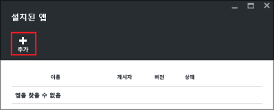

# Azure HDInsight에 타사 Hadoop 응용 프로그램 설치

이 문서에서는 Azure HDInsight에 이미 게시된 타사 Hadoop 응용 프로그램을 설치하는 방법에 대해 알아봅니다. 사용자 고유의 응용 프로그램을 설치하는 방법에 대한 지침은 [사용자 지정 HDInsight 응용 프로그램 설치](hdinsight-apps-install-custom-applications.md)를 참조하세요.

HDInsight 응용 프로그램은 Linux 기반 HDInsight 클러스터에 사용자가 설치할 수 있는 응용 프로그램입니다. Microsoft, ISV(독립 소프트웨어 공급 업체) 또는 사용자가 직접 이러한 응용 프로그램을 개발할 수 있습니다.  

현재 네 개의 게시된 응용 프로그램이 있습니다.

* **HDInsight의 DATAIKU DDS**: Dataiku DSS(데이터 과학 스튜디오)는 데이터 전문가(데이터 과학자, 비즈니스 분석가, 개발자...)가 원시 데이터를 영향력이 강한 비즈니스 예측으로 변환하는 매우 특정한 서비스를 프로토타입, 빌드 및 배포하도록 허용하는 소프트웨어입니다.
* **Datameer**: [Datameer](http://www.datameer.com/documentation/display/DAS50/Home?ls=Partners&lsd=Microsoft&c=Partners&cd=Microsoft) 에서는 분석가에게 빅 데이터의 결과를 검색, 분석 및 시각화하는 대화형 방법을 제공합니다. 새 관계를 검색하고 필요한 답변을 신속하게 가져오도록 쉽게 추가 데이터 원본을 끌어옵니다.
* **HDnsight용 Streamsets Data Collector**는 모든 기능을 갖춘 IDE(통합 개발 환경)로서 이를 통해 사용자 지정 코드를 작성할 필요 없이 스트림을 맞추고 데이터를 일괄 처리하는 수집 파이프라인 간에 디자인, 테스트, 배포 및 관리하고 다양한 스트림 내 변환을 수행할 수 있습니다. 
* **HDInsight용 Cask CDAP 3.5**는 데이터 응용 프로그램 및 Data Lake에 대한 프로덕션 시간을 80%까지 줄일 수 있는 첫 번째 빅 데이터용 통합 플랫폼을 제공합니다. 이 응용 프로그램은 표준 HBase 3.4 클러스터만을 지원합니다.

이 문서에서 제공하는 지침은 Azure Portal을 사용합니다. 또한 포털에서 Azure Resource Manager 템플릿을 내보내거나 공급 업체에서 Resource Manager 템플릿의 복사본을 가져오고 Azure PowerShell 및 Azure CLI를 사용하여 템플릿을 배포할 수 있습니다.  [Resource Manager 템플릿을 사용하여 HDInsight의 Linux 기반 Hadoop 클러스터 만들기](hdinsight-hadoop-create-linux-clusters-arm-templates.md)를 참조하세요.

## 필수 조건
기존 HDInsight 클러스터에 HDInsight 응용 프로그램을 설치하려면 HDInsight 클러스터가 있어야 합니다. HDInsight 클러스터를 만들려면 [클러스터 만들기](hdinsight-hadoop-linux-tutorial-get-started.md#create-cluster)를 참조하세요. HDInsight 클러스터를 만들 경우 HDInsight 응용 프로그램도 설치할 수 있습니다.

## 기존 클러스터에 응용 프로그램 설치
다음 절차에서는 기존 HDInsight 클러스터에 HDInsight 응용 프로그램을 설치하는 방법을 보여 줍니다.

**HDInsight 응용 프로그램을 설치하려면**

1. [Azure 포털](https://portal.azure.com)에 로그인합니다.
2. 왼쪽 메뉴에서 **HDInsight 클러스터** 를 클릭합니다.  표시되지 않으면 **더 많은 서비스**를 클릭한 다음 **HDInsight 클러스터**를 클릭합니다.
3. HDInsight 클러스터를 클릭합니다.  HDInsight 클러스터가 없는 경우 만듭니다.  see [클러스터 만들기](hdinsight-hadoop-linux-tutorial-get-started.md#create-cluster)를 참조하세요.
4. **구성** 범주에서 **응용 프로그램**을 클릭합니다. 설치된 응용 프로그램이 있는 경우 목록이 표시됩니다. 응용 프로그램을 찾을 수 없다면 이는 이 버전의 HDInsight 클러스터에 대한 응용 프로그램이 없다는 의미입니다.
   
    
5. 블레이드 메뉴에서 **추가** 를 클릭합니다. 
   
    
   
    기존 HDInsight 응용 프로그램 목록이 표시됩니다.
   
    
6. 응용 프로그램 중 하나를 클릭하고 약관에 동의한 다음 **선택**을 클릭합니다.

포털 알림에서 설치 상태를 확인할 수 있습니다(포털 맨 위에 있는 종 모양 아이콘 클릭). 응용 프로그램이 설치되면 설치된 앱 블레이드에 표시됩니다.

## 클러스터 생성 중에 응용 프로그램 설치
클러스터를 만들 때 HDInsight 응용 프로그램을 설치하는 옵션이 있습니다. 클러스터가 만들어지고 실행 상태가 되면 프로세스 중에 HDInsight 응용 프로그램이 설치됩니다. 다음 절차에서는 클러스터를 만들 때 HDInsight 응용 프로그램을 설치하는 방법을 보여 줍니다.

**HDInsight 응용 프로그램을 설치하려면**

1. [Azure Portal](https://portal.azure.com)에 로그인합니다.
2. **새로 만들기**, **데이터 + 분석** 및 **HDInsight**를 차례로 클릭합니다.
3. **클러스터 이름**입력: 이 이름은 전역적으로 고유해야 합니다.
4. **구독** 을 클릭하여 이 클러스터에 사용할 Azure 구독을 선택합니다.
5. **클러스터 유형 선택**을 클릭한 후 다음을 선택합니다.
   
   * **클러스터 유형**: 어떤 유형을 선택할지 잘 모르는 경우 **Hadoop**을 선택합니다. 가장 인기 있는 클러스터 유형입니다.
   * **운영 체제**: **Linux**를 선택합니다.
   * **버전**: 어떤 버전을 선택할지 잘 모르는 경우 기본 버전을 사용합니다. 자세한 내용은 [HDInsight 클러스터 버전](hdinsight-component-versioning.md)을 참조하세요.
   * **클러스터 계층**: Azure HDInsight는 빅 데이터 클라우드 제품을 표준 계층 및 프리미엄 계층의 두 범주로 제공합니다. 자세한 내용은 [클러스터 계층](hdinsight-hadoop-provision-linux-clusters.md#cluster-tiers)을 참조하세요.
6. **응용 프로그램**, 게시된 응용 프로그램 중 하나, **선택**을 차례로 클릭합니다.
7. **자격 증명** 을 클릭한 다음 관리자의 암호를 입력합니다. 또한 **SSH 사용자 이름**과 **암호** 또는 **공개 키**(SSH 사용자를 인증하는 데 사용됨) 중 하나를 입력해야 합니다. 공개 키를 사용하는 것이 권장 방식입니다. 아래쪽의 **선택** 을 클릭하여 자격 증명 구성을 저장합니다.
8. **데이터 원본**을 클릭하고 클러스터에 대한 기본 저장소 계정으로 사용할 기존 저장소 계정을 선택하거나 새 저장소 계정을 만듭니다.
9. **리소스 그룹**을 클릭하여 기존 리소스 그룹을 선택하거나 **새로 만들기**를 클릭하여 새 리소스 그룹을 만듭니다.
10. **새 HDInsight 클러스터** 블레이드에서 **시작 보드에 고정**이 선택되어 있는지 확인한 다음 **만들기**를 클릭합니다. 

## 설치된 HDInsight 앱 및 속성 나열
포털에서는 클러스터에 설치된 HDInsight 응용 프로그램의 목록과 설치된 응용 프로그램 각각의 속성을 보여 줍니다.

**HDInsight 응용 프로그램을 나열하고 속성을 표시하려면**

1. [Azure 포털](https://portal.azure.com)에 로그인합니다.
2. 왼쪽 메뉴에서 **HDInsight 클러스터** 를 클릭합니다.  표시되지 않으면 **찾아보기**를 클릭한 다음 **HDInsight 클러스터**를 클릭합니다.
3. HDInsight 클러스터를 클릭합니다.
4. **설정** 블레이드에서 **일반** 범주에 있는 **응용 프로그램**을 클릭합니다. 설치된 앱 블레이드에서는 설치된 모든 응용 프로그램을 나열합니다. 
   
    
5. 속성을 표시하려면 설치된 응용 프로그램 중 하나를 클릭합니다. 속성 블레이드에서는 다음을 나열합니다.
   
   * 앱 이름: 응용 프로그램 이름입니다.
   * 상태: 응용 프로그램 상태입니다. 
   * 웹 페이지: 에지 노드에 배포한 웹 응용 프로그램이 있는 경우 해당하는 URL입니다. 자격 증명은 클러스터에 대해 구성한 HTTP 사용자 자격 증명과 동일합니다.
   * HTTP 끝점: 자격 증명은 클러스터에 대해 구성한 HTTP 사용자 자격 증명과 동일합니다. 
   * SSH 끝점: SSH를 사용하여 에지 노드에 연결할 수 있습니다. SSH 자격 증명은 클러스터에 대해 구성한 SSH 사용자 자격 증명과 동일합니다. 자세한 내용은 [HDInsight와 함께 SSH 사용](hdinsight-hadoop-linux-use-ssh-unix.md)을 참조하세요.
6. 응용 프로그램을 삭제하려면 응용 프로그램을 마우스 오른쪽 단추로 클릭하고 상황에 맞는 메뉴에서 **삭제** 를 클릭합니다.

## 에지 노드에 연결
HTTP 및 SSH를 사용하여 에지 노드에 연결할 수 있습니다. 끝점 정보는 [포털](#list-installed-hdinsight-apps-and-properties)에서 찾을 수 있습니다. 자세한 내용은 [HDInsight와 함께 SSH 사용](hdinsight-hadoop-linux-use-ssh-unix.md)을 참조하세요.

HTTP 끝점 자격 증명은 HDInsight 클러스터에 대해 구성한 HTTP 사용자 자격 증명입니다. SSH 끝점 자격 증명은 HDInsight 클러스터에 대해 구성한 SSH 자격 증명입니다.

## 문제 해결
[설치 문제 해결](hdinsight-apps-install-custom-applications.md#troubleshoot-the-installation)을 참조하세요.

## 다음 단계
* [사용자 지정 HDInsight 응용 프로그램 설치](hdinsight-apps-install-custom-applications.md): HDInsight로 게시 취소된 HDInsight 응용 프로그램을 배포하는 방법을 알아봅니다.
* [HDInsight 응용 프로그램 게시](hdinsight-apps-publish-applications.md): 사용자 지정 HDInsight 응용 프로그램을 Azure Marketplace에 게시하는 방법을 알아봅니다.
* [MSDN: HDInsight 응용 프로그램 설치](https://msdn.microsoft.com/library/mt706515.aspx): HDInsight 응용 프로그램을 정의하는 방법을 알아봅니다.
* [스크립트 작업을 사용하여 Linux 기반 HDInsight 클러스터 사용자 지정](hdinsight-hadoop-customize-cluster-linux.md): 스크립트 작업을 사용하여 추가 응용 프로그램을 설치하는 방법을 알아봅니다.
* [Resource Manager 템플릿을 사용하여 HDInsight의 Linux 기반 Hadoop 클러스터 만들기](hdinsight-hadoop-create-linux-clusters-arm-templates.md): Azure Resource Manager 템플릿을 호출하여 HDInsight 클러스터를 만드는 방법을 알아봅니다.
* [HDInsight에서 비어 있는 에지 노드 사용](hdinsight-apps-use-edge-node.md): HDInsight 클러스터에 액세스, HDInsight 응용 프로그램 테스트 및 HDInsight 응용 프로그램 호스팅하는 데 비어 있는 에지 노드를 사용하는 방법을 알아봅니다.

