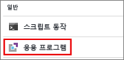
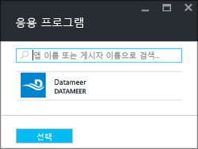
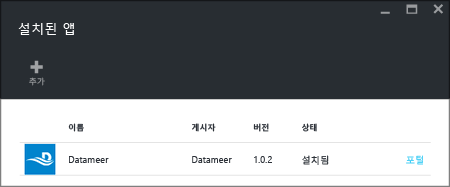

# Azure HDInsight에 타사 Apache Hadoop 애플리케이션 설치

Azure HDInsight에 타사 [Apache Hadoop](https://hadoop.apache.org/) 애플리케이션을 설치하는 방법을 알아봅니다. 사용자 고유의 애플리케이션을 설치하는 방법에 대한 지침은 [사용자 지정 HDInsight 애플리케이션 설치](hdinsight-apps-install-custom-applications.md)를 참조하세요.

HDInsight 애플리케이션은 HDInsight 클러스터에 사용자가 설치할 수 있는 애플리케이션입니다. Microsoft, ISV(독립 소프트웨어 공급 업체) 또는 사용자가 직접 이러한 애플리케이션을 개발할 수 있습니다.  

다음 목록에서는 게시된 애플리케이션을 보여 줍니다.

|애플리케이션 |클러스터 유형 | 설명 |
|---|---|---|
|AtScale 인텔리전스 플랫폼 |Hadoop은 |AtScale 쿼리에 수십억 이미, 소유 익숙하고 즐겨 사용 – Microsoft Excel, Powerbi, Tableau 소프트웨어에서 qlikview까지에서 BI 도구를 사용 하 여 대화형으로 데이터의 행 수를 확장 OLAP 서버로, HDInsight 클러스터를 설정 합니다. |
|CDAP 4.2 HDInsight에 대 한 4.3 |HBase |CDAP는 셀프 서비스 데이터를 제공 하는 Hadoop 및을 사용 하면 IT에 대 한 시간 값을 가속화 하는 빅 데이터에 대 한 첫 번째 통합 플랫폼입니다. 오픈 소스 확장 가능 하며 CDAP 혁신 장벽을 제거 합니다. Requirements: 4 개의 영역 노드를 최소 D3 v2 합니다. |
|Datameer |Hadoop은 |Datameer의 셀프 서비스 확장성이 뛰어난 플랫폼 준비에 대 한 탐색 및 분석용 데이터 관리에 복잡 한 다중 원본 데이터는 엔터프라이즈급 규모에서 빠르고 스마트 하 게 정보를 제공 하는 중요 한 업무용으로 적합 정보로 전환 가속화 합니다. |
|HDInsight의 Dataiku DSS |Hadoop, Spark |Dataiku DSS를 사용 하면 데이터 과학자와 데이터 분석가 엔터프라이즈 데이터 과학 플랫폼에서 공동 작업을 수행할 디자인 하 고 새 데이터 제품 및 서비스를 보다 효율적으로 실행 원시 데이터를 영향력이 강한 예측으로 설정 합니다. |
|WANdisco Fusion HDI 앱-2.12.3, 2.12.1 2.11.2 |Hadoop, Spark,HBase,Storm,Kafka |데이터 분산된 환경에서 일관성을 유지 하는 것은 대규모 데이터 작업 문제입니다. WANdisco Fusion 엔터프라이즈급 소프트웨어 플랫폼을 모든 환경에서 구조화 되지 않은 데이터 일관성을 사용 하 여이 문제를 해결 합니다. |
|HDInsight에 대 한 H2O SparklingWater |Spark |H2O Sparkling Water는 다음과 같은 분산된 알고리즘을 지원합니다. GLM, 원시 Bayes, 분산 임의 포리스트, 그라데이션 승격 컴퓨터, Deep Neural Networks, 심층 학습에서 k-means PCA, 낮은 순위 모델 일반화, 이상 탐지, Autoencoders 합니다. |
|Striim HDInsight에 실시간 데이터 통합 |Hadoop, HBase, Storm, Spark, Kafka |Striim (발음된 "스트림")는--종단 간 데이터 통합 + 인텔리전스 플랫폼 스트리밍, 연속 수집, 처리 및 서로 다른 데이터 스트림 분석을 사용 하도록 설정 됩니다. |
|HDInsight에 대 한 Jumbune |Hadoop, Spark |높은 수준에서 Jumbune 1 씩 엔터프라이즈를 지원합니다. MapReduce 및 Spark 엔진에 Hive에서 Java, Scala 워크 로드 성능 기반 Tez를 가속화 합니다. 2. 자동 관리 Hadoop 클러스터를 모니터링, 3입니다. 분산된 파일 시스템에서 데이터 품질 관리를 설정 합니다. |
|Kyligence Enterprise |Hadoop,HBase,Spark |Kyligence Enterprise을 Apache Kylin에서 제공 하는, 빅 데이터 BI을 사용 하도록 설정 합니다. Hadoop에서 enterprise OLAP 엔진으로 Kyligence Enterprise를 사용 하면 산업 표준 데이터 웨어하우스 및 BI 방법론을 사용 하 여 Hadoop에서 BI를 설계 하는 비즈니스 분석가가 있습니다. |
|KNIME Spark Executor 용 Spark 작업 서버 |Spark |KNIME Spark Executor 용 Spark 작업 서버는 KNIME Analytics Platform을 HDInsight 클러스터에 연결 됩니다. |
|Azure HDInsight, 별 Presto v0.213-e ()에서 Presto 것임 |Hadoop은 |Presto 빠르고 확장성 있는 분산 된 SQL 쿼리 엔진이입니다. 스토리지 및 계산을 분리하기 위해 설계된 Presto는 Azure Data Lake Storage, Azure Blob Storage, SQL 및 NoSQL 데이터베이스와 기타 데이터 원본의 데이터를 쿼리하는 데 이상적입니다. |
|클라우드 HDInsight 용 StreamSets 데이터 수집기 |Hadoop,HBase,Spark,Kafka |StreamSets 데이터 수집기는 데이터를 실시간으로 스트리밍하는 간단 하 고 강력한 엔진. 데이터 스트림에서 데이터를 경로 및 프로세스 데이터 수집기를 사용 합니다. 30 일 평가판 라이선스로 제공 됩니다. |
|[Trifacta Wrangler Enterprise](https://www.trifacta.com/) |Hadoop, Spark,HBase |HDInsight에 대 한 Trifacta Wrangler Enterprise 기업 전체의 데이터에 대 한 모든 규모의 데이터 랭 글 링을 지원 합니다. Trifacta Azure에서 실행 하는 비용에 Trifacta 구독 비용 및 가상 컴퓨터에 대 한 Azure 인프라 비용의 조합입니다. |
|Unifi 데이터 플랫폼 3.1 |Hadoop, HBase, Storm, Spark |Unifi 데이터 플랫폼은을 원활 하 게 통합된 도구 제품군 인 셀프 서비스 데이터 궁극적인 목표는 비즈니스 사용자 데이터 문제를 해결 하는 드라이브 증분 수익, 비용 또는 운영 복잡성을 줄이고 하도록 설계 되었습니다. |
|Unraveldata APM |Spark |HDInsight Spark 클러스터에 대 한 데이터 앱 하기가 너무 어려운 합니다. |
|워터 라인 데이터 카탈로그 |Spark |워터 라인 카탈로그 정리 하며 비즈니스 용어를 사용 하 여 자동 태그 데이터를 AI를 사용 하 여 데이터를 제어 합니다. Waterline의 비즈니스에 익숙한 카탈로그는 셀프 서비스 분석, 규정 준수 및 거버넌스, IT 관리 이니셔티브에 중요한 성공 구성 요소입니다. |

이 문서에서 제공하는 지침은 Azure Portal을 사용합니다. 또한 포털에서 Azure Resource Manager 템플릿을 내보내거나 공급 업체에서 Resource Manager 템플릿의 복사본을 가져오고 Azure PowerShell 및 Azure 클래식 CLI를 사용하여 템플릿을 배포할 수 있습니다.  [Resource Manager 템플릿을 사용하여 HDInsight에서 Apache Hadoop 클러스터 만들기](hdinsight-hadoop-create-linux-clusters-arm-templates.md)를 참조하세요.

## 필수 조건
기존 HDInsight 클러스터에 HDInsight 애플리케이션을 설치하려면 HDInsight 클러스터가 있어야 합니다. HDInsight 클러스터를 만들려면 [클러스터 만들기](hadoop/apache-hadoop-linux-tutorial-get-started.md#create-cluster)를 참조하세요. HDInsight 클러스터를 만들 경우 HDInsight 애플리케이션도 설치할 수 있습니다.

## 기존 클러스터에 애플리케이션 설치
다음 절차에서는 기존 HDInsight 클러스터에 HDInsight 애플리케이션을 설치하는 방법을 보여 줍니다.

**HDInsight 애플리케이션 설치**

1. [Azure Portal](https://portal.azure.com)에 로그인합니다.
2. 왼쪽된 메뉴에서로 이동 **모든 서비스** > **Analytics** > **HDInsight 클러스터**합니다.
3. 목록에서 HDInsight 클러스터를 선택 합니다.  HDInsight 클러스터가 없는 경우 만듭니다.  see [클러스터 만들기](hadoop/apache-hadoop-linux-tutorial-get-started.md#create-cluster)를 참조하세요.
4. 아래는 **설정을** 범주를 선택한 **응용 프로그램**합니다. 주 창에 설치 된 응용 프로그램의 목록을 볼 수 있습니다. 
   
    
5. 선택 **+ 추가** 합니다. 사용 가능한 응용 프로그램의 목록을 볼 수 있습니다.  하는 경우 **+ 추가** 가 회색으로 의미는이 버전의 HDInsight 클러스터에 대 한 응용 프로그램이 없습니다.
   
    
6. 사용 가능한 응용 프로그램 중 하나를 선택 하 고 약관에 동의 하 고 지침을 따릅니다.

(포털 맨 위에 있는 종 모양 아이콘을 선택 하는 경우) 포털 알림에서 설치 상태를 볼 수 있습니다. 애플리케이션이 설치되면 설치된 앱 목록에 표시됩니다.

## 클러스터 생성 중에 애플리케이션 설치
클러스터를 만들 때 HDInsight 애플리케이션을 설치하는 옵션이 있습니다. 클러스터가 만들어지고 실행 상태가 되면 프로세스 중에 HDInsight 애플리케이션이 설치됩니다. Azure portal을 사용 하 여 클러스터를 만드는 동안 응용 프로그램을 설치 하려면 사용 합니다 **사용자 지정** 기본값 대신 옵션 **빠른 생성** 옵션입니다.

## 설치된 HDInsight 앱 및 속성 나열
포털에서는 클러스터에 설치된 HDInsight 애플리케이션의 목록과 설치된 애플리케이션 각각의 속성을 보여 줍니다.

**HDInsight 애플리케이션 나열 및 속성 표시**

1. [Azure Portal](https://portal.azure.com)에 로그인합니다.
2. 왼쪽된 메뉴에서로 이동 **모든 서비스** > **Analytics** > **HDInsight 클러스터**합니다.
3. 목록에서 HDInsight 클러스터를 선택 합니다.
4. 아래는 **설정을** 범주를 선택한 **응용 프로그램**합니다. 주 창에 설치 된 응용 프로그램의 목록을 볼 수 있습니다. 
   
    
5. 속성을 표시 하려면 설치 된 응용 프로그램 중 하나를 선택 합니다. 속성 목록:

    |자산 | 설명 |
    |---|---|
    |앱 이름 |애플리케이션 이름입니다. |
    |상태 |응용 프로그램 상태입니다. |
    |웹 페이지 |에지 노드에 배포한 웹 애플리케이션의 URL입니다. 자격 증명은 클러스터에 대해 구성한 HTTP 사용자 자격 증명과 동일합니다. |
    |SSH 엔드포인트 |SSH를 사용하여 에지 노드에 연결할 수 있습니다. SSH 자격 증명은 클러스터에 대해 구성한 SSH 사용자 자격 증명과 동일합니다. 자세한 내용은 [HDInsight와 함께 SSH 사용](hdinsight-hadoop-linux-use-ssh-unix.md)을 참조하세요. |
    |설명 | 응용 프로그램 설명입니다. |

6. 애플리케이션을 삭제하려면 애플리케이션을 마우스 오른쪽 단추로 클릭한 다음, 상황에 맞는 메뉴에서 **삭제**를 클릭합니다.

## 에지 노드에 연결
HTTP 및 SSH를 사용하여 에지 노드에 연결할 수 있습니다. 엔드포인트 정보는 [포털](#list-installed-hdinsight-apps-and-properties)에서 찾을 수 있습니다. 자세한 내용은 [HDInsight와 함께 SSH 사용](hdinsight-hadoop-linux-use-ssh-unix.md)을 참조하세요.

HTTP 엔드포인트 자격 증명은 HDInsight 클러스터에 대해 구성한 HTTP 사용자 자격 증명입니다. SSH 엔드포인트 자격 증명은 HDInsight 클러스터에 대해 구성한 SSH 자격 증명입니다.

## 문제 해결
[설치 문제 해결](hdinsight-apps-install-custom-applications.md#troubleshoot-the-installation)을 참조하세요.

## 다음 단계
* [사용자 지정 HDInsight 애플리케이션 설치](hdinsight-apps-install-custom-applications.md): HDInsight로 게시 취소된 HDInsight 애플리케이션을 배포하는 방법을 알아봅니다.
* [HDInsight 애플리케이션 게시](hdinsight-apps-publish-applications.md): 사용자 지정 HDInsight 애플리케이션을 Azure Marketplace에 게시하는 방법을 알아봅니다.
* [MSDN: HDInsight 애플리케이션 설치](https://msdn.microsoft.com/library/mt706515.aspx): HDInsight 애플리케이션을 정의하는 방법을 알아봅니다.
* [스크립트 작업을 사용하여 Linux 기반 HDInsight 클러스터 사용자 지정](hdinsight-hadoop-customize-cluster-linux.md): 스크립트 작업을 사용하여 추가 애플리케이션을 설치하는 방법을 알아봅니다.
* [Resource Manager 템플릿을 사용하여 HDInsight에서 Linux 기반 Apache Hadoop 클러스터 만들기](hdinsight-hadoop-create-linux-clusters-arm-templates.md): Azure Resource Manager 템플릿을 호출하여 HDInsight 클러스터를 만드는 방법을 알아봅니다.
* [HDInsight에서 비어 있는 에지 노드 사용](hdinsight-apps-use-edge-node.md): HDInsight 클러스터에 액세스, HDInsight 애플리케이션 테스트 및 HDInsight 애플리케이션 호스팅하는 데 비어 있는 에지 노드를 사용하는 방법을 알아봅니다.

