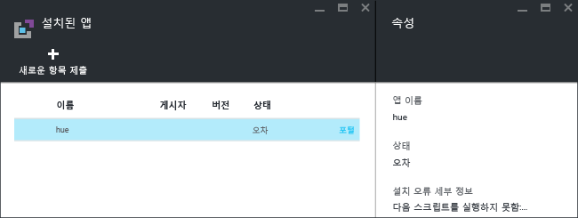
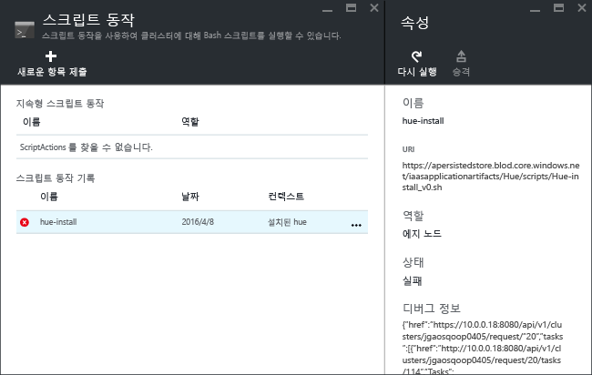

# Azure HDInsight에 사용자 지정 Apache Hadoop 애플리케이션 설치

이 문서에서는 Azure Portal에 게시되지 않은 [Apache Hadoop](https://hadoop.apache.org/) 애플리케이션을 Azure HDInsight에 설치하는 방법에 대해 알아봅니다. 이 문서에서 설치할 애플리케이션은 [Hue](https://gethue.com/)입니다.

HDInsight 애플리케이션은 Linux 기반 HDInsight 클러스터에 사용자가 설치할 수 있는 애플리케이션입니다.  Microsoft, ISV(독립 소프트웨어 공급 업체) 또는 사용자가 직접 이러한 애플리케이션을 개발할 수 있습니다.  

다른 관련 문서:

* [HDInsight 애플리케이션 설치](hdinsight-apps-install-applications.md): 클러스터에 HDInsight 애플리케이션을 설치하는 방법을 알아봅니다.
* [HDInsight 애플리케이션 게시](hdinsight-apps-publish-applications.md): 사용자 지정 HDInsight 애플리케이션을 Azure Marketplace에 게시하는 방법을 알아봅니다.
* [MSDN: HDInsight 애플리케이션 설치](https://msdn.microsoft.com/library/mt706515.aspx): HDInsight 애플리케이션을 정의하는 방법을 알아봅니다.

## 필수 조건
기존 HDInsight 클러스터에 HDInsight 애플리케이션을 설치하려면 HDInsight 클러스터가 있어야 합니다. HDInsight 클러스터를 만들려면 [클러스터 만들기](hadoop/apache-hadoop-linux-tutorial-get-started.md#create-cluster)를 참조하세요. HDInsight 클러스터를 만들 경우 HDInsight 애플리케이션도 설치할 수 있습니다.

## HDInsight 애플리케이션 설치
이렇게 만든 클러스터 또는 기존 HDInsight 클러스터에 HDInsight 애플리케이션을 설치할 수 있습니다. Azure Resource Manager 템플릿 정의는 [MSDN: HDInsight 애플리케이션 설치](https://msdn.microsoft.com/library/mt706515.aspx)를 참조하세요.

이 애플리케이션(Hue)을 배포하기 위해 필요한 파일은 다음과 같습니다.

* [azuredeploy.json](https://github.com/hdinsight/Iaas-Applications/blob/master/Hue/azuredeploy.json): HDInsight 애플리케이션을 설치하기 위한 Azure Resource Manager 템플릿 Azure Resource Manager 템플릿을 직접 개발하려면 [MSDN: HDInsight 애플리케이션 설치](https://msdn.microsoft.com/library/mt706515.aspx)를 참조하세요.
* [hue-install_v0.sh](https://github.com/hdinsight/Iaas-Applications/blob/master/Hue/scripts/Hue-install_v0.sh): 에지 노드를 구성하기 위해 Resource Manager 템플릿에 의해 호출되는 스크립트 작업
* [hue-binaries.tgz](https://hdiconfigactions.blob.core.windows.net/linuxhueconfigactionv01/hue-binaries-14-04.tgz): hui-install_v0.sh에서 호출되는 색상 이진 파일
* [hue-binaries-14-04.tgz](https://hdiconfigactions.blob.core.windows.net/linuxhueconfigactionv01/hue-binaries-14-04.tgz): hui-install_v0.sh에서 호출되는 색상 이진 파일
* [webwasb-tomcat.tar.gz](https://hdiconfigactions.blob.core.windows.net/linuxhueconfigactionv01/webwasb-tomcat.tar.gz): hui-install_v0.sh에서 호출되는 샘플 웹 애플리케이션(Tomcat)

**기존 HDInsight 클러스터에 Hue를 설치하려면**

1. Azure에 로그인하여 Azure Portal에서 Azure Resource Manager 템플릿을 열려면 다음 이미지를 클릭합니다.

    

    이 단추는 Azure 포털에서 Resource Manager 템플릿을 엽니다.  Resource Manager 템플릿의 위치는 [https://github.com/hdinsight/Iaas-Applications/tree/master/Hue](https://github.com/hdinsight/Iaas-Applications/tree/master/Hue)입니다.  이 Resource Manager 템플릿을 작성하는 방법을 알아보려면 [MSDN: HDInsight 애플리케이션 설치](https://msdn.microsoft.com/library/mt706515.aspx)를 참조하세요.
2. **매개 변수** 블레이드에서 다음을 입력합니다.

   * **ClusterName**: 애플리케이션을 설치하려는 클러스터의 이름입니다. 이 클러스터는 기존 클러스터여야 합니다.
3. **확인** 을 클릭하여 매개 변수를 저장합니다.
4. **사용자 지정 배포** 블레이드에서 **리소스 그룹**을 입력합니다.  리소스 그룹은 클러스터, 종속 저장소 계정 및 기타 리소스를 그룹화하는 컨테이너입니다. 클러스터와 동일한 리소스 그룹을 사용해야 합니다.
5. **약관**을 클릭한 다음 **만들기**를 클릭합니다.
6. **대시보드에 고정** 확인란이 선택되었는지 확인한 다음 **만들기**를 클릭합니다. 포털 대시보드 및 포털 알림에 고정된 타일에서 설치 상태를 확인할 수 있습니다(포털 맨 위에 있는 종 모양 아이콘 클릭).  애플리케이션을 설치하는 데 약 10분이 걸립니다.

**클러스터를 만드는 동안 Hue를 설치하려면**

1. Azure에 로그인하여 Azure Portal에서 Azure Resource Manager 템플릿을 열려면 다음 이미지를 클릭합니다.

    

    이 단추는 Azure 포털에서 Resource Manager 템플릿을 엽니다.  Resource Manager 템플릿의 위치는 [https://hditutorialdata.blob.core.windows.net/hdinsightapps/create-linux-based-hadoop-cluster-in-hdinsight.json](https://hditutorialdata.blob.core.windows.net/hdinsightapps/create-linux-based-hadoop-cluster-in-hdinsight.json)입니다.  이 Resource Manager 템플릿을 작성하는 방법을 알아보려면 [MSDN: HDInsight 애플리케이션 설치](https://msdn.microsoft.com/library/mt706515.aspx)를 참조하세요.
2. 지시를 따라서 클러스터를 만들고 Hue를 설치합니다. HDInsight 클러스터를 만드는 방법에 대한 자세한 내용은 [HDInsight에서 Linux 기반 Hadoop 클러스터 만들기](hdinsight-hadoop-provision-linux-clusters.md)를 참조하세요.

Azure Portal 외에도 [Azure PowerShell](hdinsight-hadoop-create-linux-clusters-arm-templates.md#deploy-using-powershell) 및 [Azure 클래식 CLI](hdinsight-hadoop-create-linux-clusters-arm-templates.md#deploy-using-azure-cli)를 사용하여 Resource Manager 템플릿을 호출할 수도 있습니다.

## 설치 유효성 검사
Azure 포털에서 애플리케이션 상태를 확인하여 애플리케이션 설치를 확인할 수 있습니다. 또한 예상 대로 나타난 HTTP 엔드포인트 및 웹 페이지가 존재하는 경우 확인할 수도 있습니다.

**Hue 포털을 열려면**

1. [Azure Portal](https://portal.azure.com)에 로그인합니다.
2. 왼쪽 메뉴에서 **HDInsight 클러스터** 를 클릭합니다.  표시되지 않으면 **찾아보기**를 클릭한 다음 **HDInsight 클러스터**를 클릭합니다.
3. 애플리케이션을 설치한 클러스터를 클릭합니다.
4. **설정** 블레이드에서 **일반** 범주에 있는 **애플리케이션**을 클릭합니다. **설치된 앱** 블레이드에 나열된 **Hue**가 표시됩니다.
5. 목록에서 **Hue** 를 클릭하여 속성을 나열합니다.  
6. 웹 페이지 링크를 클릭하여 웹 사이트의 유효성을 검사합니다. 브라우저에서 HTTP 엔드포인트를 열어 Hue 웹 UI의 유효성을 검사하고 SSH를 사용하여 SSH 엔드포인트를 엽니다. 자세한 내용은 [HDInsight와 함께 SSH 사용](hdinsight-hadoop-linux-use-ssh-unix.md)을 참조하세요.

## 설치 문제 해결
포털 알림에서 애플리케이션 설치 상태를 확인할 수 있습니다(포털 맨 위에 있는 종 모양 아이콘 클릭).

애플리케이션 설치에 실패한 경우 3곳에서 오류 메시지 및 디버그 정보를 확인할 수 있습니다.

* HDInsight 애플리케이션: 일반 오류 정보입니다.

    포털에서 클러스터를 열고 설정 블레이드에서 애플리케이션을 클릭합니다.

    
* HDInsight 스크립트 작업: HDInsight 애플리케이션의 오류 메시지가 스크립트 작업 실패를 나타내는 경우 스크립트 오류에 대한 자세한 내용이 스크립트 작업 창에 표시됩니다.

    설정 블레이드에서 스크립트 작업을 클릭합니다. 스크립트 작업 기록에 오류 메시지가 표시됩니다.

    
* Ambari 웹 UI: 설치 스크립트가 오류의 원인인 경우 Ambari 웹 UI를 사용하여 설치 스크립트에 대한 전체 로그를 확인합니다.

    자세한 내용은 [문제 해결](hdinsight-hadoop-customize-cluster-linux.md#troubleshooting)을 참조하세요.

## HDInsight 애플리케이션 제거
HDInsight 애플리케이션을 삭제하는 방법에는 여러 가지가 있습니다.

### 포털 사용
**포털을 사용하여 애플리케이션을 제거하려면**

1. [Azure Portal](https://portal.azure.com)에 로그인합니다.
2. 왼쪽 메뉴에서 **HDInsight 클러스터** 를 클릭합니다.  표시되지 않으면 **찾아보기**를 클릭한 다음 **HDInsight 클러스터**를 클릭합니다.
3. 애플리케이션을 설치한 클러스터를 클릭합니다.
4. **설정** 블레이드에서 **일반** 범주에 있는 **애플리케이션**을 클릭합니다. 설치된 애플리케이션 목록이 표시됩니다. 이 자습서에서는 **설치된 앱** 블레이드에 나열된 **Hue**가 표시됩니다.
5. 제거할 애플리케이션을 마우스 오른쪽 단추로 클릭한 다음, **삭제**를 클릭합니다.
6. **예** 를 클릭하여 확인합니다.

포털에서 클러스터를 삭제하거나 애플리케이션을 포함하는 리소스 그룹을 삭제할 수도 있습니다.

### Azure PowerShell 사용
Azure PowerShell을 사용하여 클러스터 또는 리소스 그룹을 삭제할 수 있습니다. [Azure PowerShell을 사용하여 클러스터 삭제](hdinsight-administer-use-powershell.md#delete-clusters)를 참조하세요.

### Azure 클래식 CLI 사용
Azure 클래식 CLI를 사용하여 클러스터 또는 리소스 그룹을 삭제할 수 있습니다. [Azure 클래식 CLI를 사용하여 클러스터 삭제](hdinsight-administer-use-command-line.md#delete-clusters)를 참조하세요.

## 다음 단계
* [MSDN: HDInsight 애플리케이션 설치](https://msdn.microsoft.com/library/mt706515.aspx): HDInsight 애플리케이션을 배포하기 위해 Resource Manager 템플릿을 개발하는 방법을 알아봅니다.
* [HDInsight 애플리케이션 설치](hdinsight-apps-install-applications.md): 클러스터에 HDInsight 애플리케이션을 설치하는 방법을 알아봅니다.
* [HDInsight 애플리케이션 게시](hdinsight-apps-publish-applications.md): 사용자 지정 HDInsight 애플리케이션을 Azure Marketplace에 게시하는 방법을 알아봅니다.
* [스크립트 작업을 사용하여 Linux 기반 HDInsight 클러스터 사용자 지정](hdinsight-hadoop-customize-cluster-linux.md): 스크립트 작업을 사용하여 추가 애플리케이션을 설치하는 방법을 알아봅니다.
* [Resource Manager 템플릿을 사용하여 HDInsight에서 Linux 기반 Apache Hadoop 클러스터 만들기](hdinsight-hadoop-create-linux-clusters-arm-templates.md): Azure Resource Manager 템플릿을 호출하여 HDInsight 클러스터를 만드는 방법을 알아봅니다.
* [HDInsight에서 비어 있는 에지 노드 사용](hdinsight-apps-use-edge-node.md): HDInsight 클러스터에 액세스, HDInsight 애플리케이션 테스트 및 HDInsight 애플리케이션 호스팅하는 데 비어 있는 에지 노드를 사용하는 방법을 알아봅니다.
