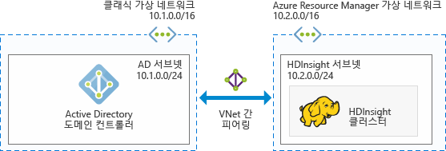
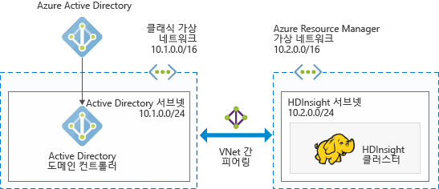
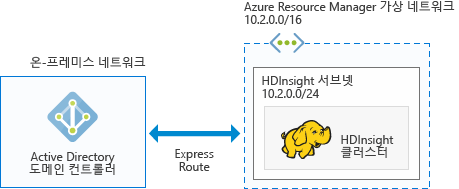

# HDInsight에서 Azure 도메인에 가입된 Hadoop 클러스터 계획

기존 Hadoop은 단일 사용자 클러스터입니다. 대량 데이터 워크로드를 구축하는 작은 응용 프로그램 팀이 있는 대부분의 회사에 적합합니다. Hadoop이 인기를 끌면서 대부분의 기업이 클러스터를 IT 팀에서 관리하고 여러 응용 프로그램 팀이 클러스터를 공유하는 모델로 이동하고 있습니다. 따라서 다중 사용자 클러스터가 관련된 기능은 Azure HDInsight에서 가장 많이 요청되는 기능입니다.

고유한 다중 사용자 인증 및 권한 부여를 구축하는 대신 HDInsight는 가장 인기 있는 ID 공급자 - Azure AD(Azure Active Directory)에 의존합니다. Azure AD의 강력한 보안 기능은 HDInsight의 다중 사용자 인증을 관리하는 데 사용될 수 있습니다. HDInsight를 Azure AD와 통합하면 Azure AD 자격 증명을 사용하여 클러스터와 통신할 수 있습니다. HDInsight는 HDInsight에서 실행 중인 모든 서비스(Ambari, Hive 서버, Ranger, Spark thrift 서버 등)가 인증된 사용자에 대해 원활하게 작동하도록 로컬 Hadoop 사용자에게 Azure AD 사용자를 매핑합니다.

## HDInsight를 Azure AD와 통합

Azure AD와 HDInsight를 통합하여 HDInsight 클러스터 노드가 Azure AD 도메인에 가입됩니다. HDInsight는 클러스터에서 실행 중인 Hadoop 서비스에 대한 서비스 주체를 만들고 Azure AD의 지정된 OU(조직 구성 단위) 내에 배치합니다. 또한 HDInsight는 도메인에 가입되어 있는 노드의 IP 주소에 대해 Azure AD 도메인에 역방향 DNS 매핑을 만듭니다.

이러한 설정은 여러 아키텍처를 사용하여 적용할 수 있습니다. 다음 아키텍처에서 선택할 수 있습니다.

**Azure IaaS에서 실행되는 Azure AD와 통합된 HDInsight**

HDInsight를 Azure AD와 통합하기 위한 가장 간단한 아키텍처입니다. Azure AD 도메인 컨트롤러는 Azure에서 하나(또는 여러 개)의 VM(가상 컴퓨터)에서 실행됩니다. 이러한 VM은 일반적으로 가상 네트워크 내에 있습니다. HDInsight 클러스터에 대한 다른 가상 네트워크를 설정합니다. HDInsight가 Azure AD에 대한 시야를 갖도록 하려면 [VNet 간 피어링](../virtual-network/virtual-networks-create-vnetpeering-arm-portal.md)을 사용하여 이러한 가상 네트워크를 피어링해야 합니다.

> [!NOTE]
> 이 아키텍처에서 HDInsight 클러스터와 함께 Azure Data Lake Store를 사용할 수 없습니다.

Azure AD에 대한 필수 조건:

* [조직 구성 단위](../active-directory-domain-services/active-directory-ds-admin-guide-create-ou.md)를 만들어야 하며 여기에 HDInsight 클러스터 VM 및 클러스터에 사용되는 서비스 주체를 배치해야 합니다.
* [LDAPs(Lightweight Directory Access Protocols)](../active-directory-domain-services/active-directory-ds-admin-guide-configure-secure-ldap.md)가 Azure AD와의 통신을 위해 설정되어야 합니다. LDAPS를 설정하는 데 사용된 인증서는 자체 서명된 인증서가 아닌 실제 인증서여야 합니다.
* HDInsight 서브넷의 IP 주소 범위에 대한 도메인에 역방향 DNS 영역을 만들어야 합니다(예: 이전 그림의 10.2.0.0/24).
* 서비스 계정 또는 사용자 계정이 필요합니다. 이 계정을 사용하여 HDInsight 클러스터를 만듭니다. 이 계정에는 다음 사용 권한이 있어야 합니다.

    - 조직 구성 단위 내에 서비스 주체 개체 및 컴퓨터 개체를 만들 수 있는 권한
    - 역방향 DNS 프록시 규칙을 만들 수 있는 권한
    - 컴퓨터를 Active Directory 도메인에 가입할 수 있는 권한

**클라우드 전용 Azure AD와 통합된 HDInsight**

클라우드 전용 Azure AD의 경우 HDInsight가 Azure AD와 통합될 수 있도록 도메인 컨트롤러를 구성합니다. 이 작업은 [Azure Active Directory 도메인 장치](../active-directory-domain-services/active-directory-ds-overview.md)(Azure AD DS)를 사용하여 수행됩니다. Azure AD DS는 클라우드에서 도메인 컨트롤러 컴퓨터를 만들고 이에 대한 IP 주소를 제공합니다. 고가용성을 위해 두 개의 도메인 컨트롤러를 만듭니다.

현재 Azure AD DS는 클래식 가상 네트워크에만 존재합니다. Azure 클래식 포털을 사용해야만 액세스할 수 있습니다. HDInsight 가상 네트워크는 VNet 간 피어링을 사용하여 클래식 가상 네트워크와 피어링되어야 하는 Azure Portal에 존재합니다.

> [!NOTE]
> 클래식 가상 네트워크와 Azure Resource Manager 가상 네트워크 간에 피어링을 수행하려면 두 가상 네트워크가 동일한 지역 내에 있어야 하고 동일한 Azure 구독 하에 있어야 합니다.

Azure AD에 대한 필수 조건:

* [조직 구성 단위](../active-directory-domain-services/active-directory-ds-admin-guide-create-ou.md)를 만들어야 하며 여기에 HDInsight 클러스터 VM 및 클러스터에 사용되는 서비스 주체를 배치해야 합니다.
* [LDAPS](../active-directory-domain-services/active-directory-ds-admin-guide-configure-secure-ldap.md)는 Azure AD DS를 구성할 때 설정되어야 합니다. LDAPS를 설정하는 데 사용된 인증서는 자체 서명된 인증서가 아닌 실제 인증서여야 합니다.
* HDInsight 서브넷의 IP 주소 범위에 대한 도메인에 역방향 DNS 영역을 만들어야 합니다(예: 이전 그림의 10.2.0.0/24).
* [암호 해시](../active-directory-domain-services/active-directory-ds-getting-started-password-sync.md)는 Azure AD에서 Azure AD DS로 동기화되어야 합니다.
* 서비스 계정 또는 사용자 계정이 필요합니다. 이 계정을 사용하여 HDInsight 클러스터를 만듭니다. 이 계정에는 다음 사용 권한이 있어야 합니다.

    - 조직 구성 단위 내에 서비스 주체 개체 및 컴퓨터 개체를 만들 수 있는 권한
    - 역방향 DNS 프록시 규칙을 만들 수 있는 권한
    - 컴퓨터를 Azure AD 도메인에 가입할 수 있는 권한

**VPN을 통해 온-프레미스 Active Directory와 통합된 HDInsight**

이 아키텍처는 Azure IaaS에서 실행되는 Azure AD와 통합된 HDInsight와 유사합니다. 유일한 차이점은 Azure AD가 온-프레미스에 있고 Azure AD에 대한 HDInsight의 시야가 [Azure에서 온-프레미스 네트워크로 VPN 연결](../expressroute/expressroute-introduction.md)을 통한다는 점입니다.

> [!NOTE]
> 이 아키텍처에서 HDInsight 클러스터와 함께 Azure Data Lake Store를 사용할 수 없습니다.

Azure AD에 대한 필수 조건:

* [조직 구성 단위](../active-directory-domain-services/active-directory-ds-admin-guide-create-ou.md)를 만들어야 하며 여기에 HDInsight 클러스터 VM 및 클러스터에 사용되는 서비스 주체를 배치해야 합니다.
* [LDAPS](../active-directory-domain-services/active-directory-ds-admin-guide-configure-secure-ldap.md)가 Azure AD와의 통신을 위해 설정되어야 합니다. LDAPS를 설정하는 데 사용된 인증서는 자체 서명된 인증서가 아닌 실제 인증서여야 합니다.
* HDInsight 서브넷의 IP 주소 범위에 대한 도메인에 역방향 DNS 영역을 만들어야 합니다(예: 이전 그림의 10.2.0.0/24).
* 서비스 계정 또는 사용자 계정이 필요합니다. 이 계정을 사용하여 HDInsight 클러스터를 만듭니다. 이 계정에는 다음 사용 권한이 있어야 합니다.

    - 조직 구성 단위 내에 서비스 주체 개체 및 컴퓨터 개체를 만들 수 있는 권한
    - 역방향 DNS 프록시 규칙을 만들 수 있는 권한
    - 컴퓨터를 Azure AD 도메인에 가입할 수 있는 권한

**Azure AD와 동기화된 온-프레미스 Active Directory와 통합된 HDInsight**

이 아키텍처는 클라우드 전용 Azure AD와 통합된 HDInsight와 유사합니다. 유일한 차이점은 온-프레미스 Active Directory가 Azure AD에 동기화된다는 점입니다. HDInsight가 Azure AD와 통합될 수 있도록 클라우드에 도메인 컨트롤러를 구성합니다. 이것은 [Azure Active Directory Domain Services](../active-directory-domain-services/active-directory-ds-overview.md)를 사용하여 적용됩니다. Azure AD DS는 클라우드에 도메인 컨트롤러 컴퓨터를 만들고 이에 대한 IP 주소를 제공합니다. 고가용성을 위해 두 개의 도메인 컨트롤러를 만듭니다.

현재 Azure AD DS는 클래식 가상 네트워크에만 존재합니다. Azure 클래식 포털을 사용해야만 액세스할 수 있습니다. HDInsight 가상 네트워크는 VNet 간 피어링을 사용하여 클래식 가상 네트워크와 피어링되어야 하는 Azure Portal에 존재합니다.

> [!NOTE]
> 클래식 가상 네트워크와 Azure Resource Manager 가상 네트워크 간에 피어링을 수행하려면 두 가상 네트워크가 동일한 지역 내에 있어야 하고 동일한 Azure 구독 하에 있어야 합니다.

Azure AD에 대한 필수 조건:

* [조직 구성 단위](../active-directory-domain-services/active-directory-ds-admin-guide-create-ou.md)를 만들어야 하며 여기에 HDInsight 클러스터 VM 및 클러스터에 사용되는 서비스 주체를 배치해야 합니다.
* [LDAPS](../active-directory-domain-services/active-directory-ds-admin-guide-configure-secure-ldap.md)는 Azure AD DS를 구성할 때 설정되어야 합니다. LDAPS를 설정하는 데 사용된 인증서는 자체 서명된 인증서가 아닌 실제 인증서여야 합니다.
* HDInsight 서브넷의 IP 주소 범위에 대한 도메인에 역방향 DNS 영역을 만들어야 합니다(예: 이전 그림의 10.2.0.0/24).
* [암호 해시](../active-directory-domain-services/active-directory-ds-getting-started-password-sync.md)는 Azure AD에서 Azure AD DS로 동기화되어야 합니다.
* 서비스 계정 또는 사용자 계정이 필요합니다. 이 계정을 사용하여 HDInsight 클러스터를 만듭니다. 이 계정에는 다음 사용 권한이 있어야 합니다.

    - 조직 구성 단위 내에 서비스 주체 개체 및 컴퓨터 개체를 만들 수 있는 권한
    - 역방향 DNS 프록시 규칙을 만들 수 있는 권한
    - 컴퓨터를 Active Directory 도메인에 가입할 수 있는 권한

**기본이 아닌 Azure AD와 통합된 HDInsight(테스트 및 개발용으로만 권장됨)**

이 아키텍처는 클라우드 전용 Azure AD와 통합된 HDInsight와 유사합니다. 대부분의 회사에서 Azure AD에 대한 관리자 액세스는 특정 개인에게만 제한됩니다. 따라서 개념 증명을 수행하거나 도메인에 가입된 클러스터를 만들려고 시도하려는 경우 관리자가 Azure AD에 필수 조건을 구성하기를 기다리는 대신 구독에 Azure AD 인스턴스를 만드는 것이 유용할 수 있습니다. 이것은 사용자가 만든 Azure AD 인스턴스이므로 Azure AD에 대해 Azure AD DS를 구성할 수 모든 권한을 갖습니다.

Azure AD DS는 클라우드에서 도메인 컨트롤러 컴퓨터를 만들고 이에 대한 IP 주소를 제공합니다. 고가용성을 위해 두 개의 도메인 컨트롤러를 만듭니다.

Azure AD DS는 클래식 가상 네트워크에만 존재하므로 Azure 클래식 포털에 대한 액세스가 필요하고 Azure AD DS 구성을 위해 클래식 가상 네트워크를 만들어야 합니다. HDInsight 가상 네트워크는 VNet 간 피어링을 사용하여 클래식 가상 네트워크와 피어링되어야 하는 Azure Portal에 존재합니다.

> [!NOTE]
> 클래식 및 Azure Resource Manager 가상 네트워크 간에 피어링을 수행하려면 두 가상 네트워크가 동일한 지역 내에 있어야 하고 동일한 Azure 구독 하에 있어야 합니다.

Azure AD에 대한 필수 조건:

* [조직 구성 단위](../active-directory-domain-services/active-directory-ds-admin-guide-create-ou.md)를 만들어야 하며 여기에 HDInsight 클러스터 VM 및 클러스터에 사용되는 서비스 주체를 배치해야 합니다.
* [LDAPS](../active-directory-domain-services/active-directory-ds-admin-guide-configure-secure-ldap.md)는 Azure AD DS를 구성할 때 설정되어야 합니다. LDAPS를 구성하도록 [자체 서명된 인증서](../active-directory-domain-services/active-directory-ds-admin-guide-configure-secure-ldap.md)를 만들 수 있습니다. 그러나 자체 서명된 인증서를 사용하려면 <a href="mailto:hdipreview@microsoft.com">hdipreview@microsoft.com</a>에서 예외를 요청해야 합니다.
* HDInsight 서브넷의 IP 주소 범위에 대한 도메인에 역방향 DNS 영역을 만들어야 합니다(예: 이전 그림의 10.2.0.0/24).
* [암호 해시](../active-directory-domain-services/active-directory-ds-getting-started-password-sync.md)는 Azure AD에서 Azure AD DS로 동기화되어야 합니다.
* 서비스 계정 또는 사용자 계정이 필요합니다. 이 계정을 사용하여 HDInsight 클러스터를 만듭니다. 이 계정에는 다음 사용 권한이 있어야 합니다.

    - 조직 구성 단위 내에 서비스 주체 개체 및 컴퓨터 개체를 만들 수 있는 권한
    - 역방향 DNS 프록시 규칙을 만들 수 있는 권한
    - 컴퓨터를 Azure Active Directory 도메인에 가입할 수 있는 권한

## 다음 단계
* 도메인에 가입된 HDInsight 클러스터를 구성하려면 [도메인에 가입된 HDInsight 클러스터 구성](hdinsight-domain-joined-configure.md)을 참조하세요.
* 도메인에 가입된 HDInsight 클러스터를 관리하려면 [도메인에 가입된 HDInsight 클러스터 관리](hdinsight-domain-joined-manage.md)를 참조하세요.
* Hive 정책을 구성하고 Hive 쿼리를 실행하려면 [도메인에 가입된 HDInsight 클러스터에 대한 Hive 정책 구성](hdinsight-domain-joined-run-hive.md)을 참조하세요.
* 도메인에 가입된 HDInsight 클러스터에서 SSH를 사용하여 Hive 쿼리를 실행하려면 [HDInsight와 함께 SSH 사용](hdinsight-hadoop-linux-use-ssh-unix.md)을 참조하세요.

