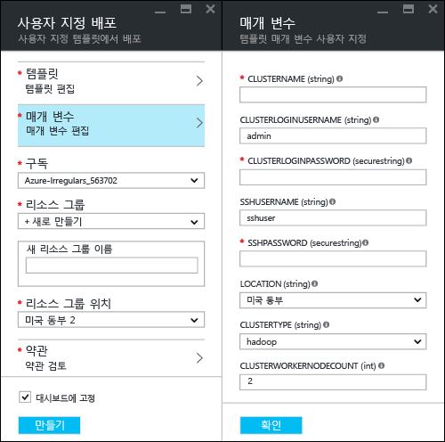
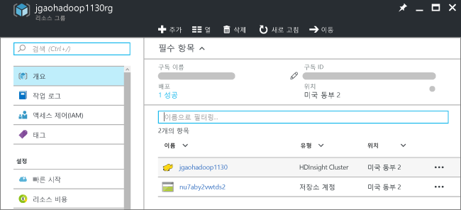
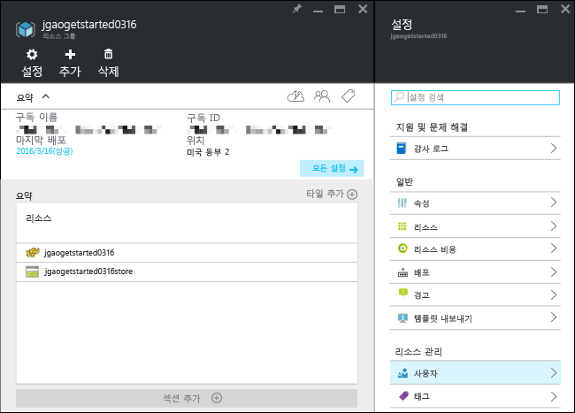
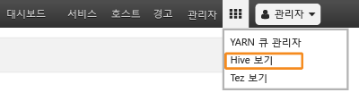

# Hadoop 자습서: HDInsight에서 Hadoop 사용 시작

HDInsight에서 [Hadoop](http://hadoop.apache.org/) 클러스터를 만들고, HDInsight에서 Hive 작업을 실행하는 방법을 알아봅니다. [Apache Hive](https://hive.apache.org/) 는 Hadoop 에코시스템에서 가장 인기 있는 구성 요소입니다. 현재 HDInsight는 [Hadoop](hdinsight-hadoop-introduction.md), [Spark](hdinsight-apache-spark-overview.md), [HBase](hdinsight-hbase-overview.md), [Storm](hdinsight-storm-overview.md), [대화형 Hive(미리 보기)](hdinsight-hadoop-use-interactive-hive.md) 및 [R server](hdinsight-hadoop-r-server-overview.md)와 같은 6가지 유형의 클러스터가 제공됩니다.  각 클러스터 유형은 서로 다른 구성 요소 집합을 지원합니다. 6가지 클러스터 유형 모두 Hive를 지원합니다. HDInsight에서 지원되는 구성 요소 목록은 [HDInsight에서 제공하는 Hadoop 클러스터 버전의 새로운 기능](hdinsight-component-versioning.md)  

[!INCLUDE [delete-cluster-warning](../../includes/hdinsight-delete-cluster-warning.md)]
## 필수 조건
이 자습서를 시작하기 전에 다음이 있어야 합니다.

* **Azure 구독**: 1개월 무료 평가판 계정을 만들려면 [azure.microsoft.com/free](https://azure.microsoft.com/free)로 이동합니다.

### 액세스 제어 요구 사항
[!INCLUDE [access-control](../../includes/hdinsight-access-control-requirements.md)]

## 클러스터 만들기

Hadoop 작업의 대부분은 배치 작업입니다. 클러스터를 만들고 일부 작업을 실행한 다음 클러스터를 삭제합니다. 이 섹션에서는 [Azure Resource Manager 템플릿](../azure-resource-manager/resource-group-template-deploy.md)을 사용하여 HDInsight에서 Hadoop 클러스터를 만듭니다. Resource Manager 템플릿은 완전히 사용자 지정할 수 있으므로 HDInsight와 같은 Azure 리소스를 쉽게 만들 수 있습니다. 이 자습서를 따라 하는 데 Resource Manager 템플릿 환경이 필요하지는 않습니다. 기타 클러스터 생성 방법 및 이 자습서에 사용된 속성에 대한 이해는 [HDInsight 클러스터 만들기](hdinsight-hadoop-provision-linux-clusters.md)를 참조하세요. 페이지 상단에서 선택기를 사용하여 클러스터 만들기 옵션을 선택합니다.

이 자습서에서 사용된 Resource Manager 템플릿은 [GitHub](https://azure.microsoft.com/resources/templates/101-hdinsight-linux-ssh-password/)에 있습니다. 

1. Azure에 로그인하여 Azure Portal에서 Azure Resource Manager 템플릿을 열려면 다음 이미지를 클릭합니다. 
   
    
2. 다음 값을 입력하거나 선택합니다.
   
    을 클릭합니다.
   
    * **구독**: Azure 구독을 선택합니다.
    * **리소스 그룹**: 새 리소스 그룹을 만들거나 기존 리소스 그룹을 선택합니다.  리소스 그룹은 Azure 구성 요소의 컨테이너입니다.  이 경우 리소스 그룹에는 HDInsight 클러스터 및 종속 Azure Storage 계정이 포함되어 있습니다. 
    * **위치**: 클러스터를 만들려는 Azure 위치를 선택합니다.  성능 향상을 위해 가까운 곳을 선택합니다. 
    * **클러스터 유형**: 이 자습서에서는 **hadoop**을 선택합니다.
    * **클러스터 이름**: Hadoop 클러스터의 이름을 입력합니다.
    * **클러스터 로그인 이름 및 암호**: 기본 로그인 이름은 **admin**입니다.
    * **SSH 사용자 이름 및 암호**: 기본 사용자 이름은 **sshuser**입니다.  이름은 변경할 수 있습니다. 
     
    일부 속성이 템플릿에 하드 코딩되었습니다.  템플릿에서 이러한 값을 구성할 수 있습니다.

    * **위치**: 클러스터 및 종속 저장소 계정의 위치는 리소스 그룹과 동일한 위치를 사용합니다.
    * **클러스터 버전**: 3.5
    * **OS 유형**: Linux
    * **작업자 노드 수**: 2

     각 클러스터에는 Azure Storage 계정 종속성이 있습니다. 이 저장소 계정을 일반적으로 기본 저장소 계정이라고 합니다. HDInsight 클러스터와 해당 기본 저장소 계정은 같은 Azure 지역에 있어야 합니다. 클러스터를 삭제해도 저장소 계정은 삭제되지 않습니다. 
     
     이러한 속성에 대한 자세한 설명은 [HDInsight에서 Hadoop 클러스터 만들기](hdinsight-hadoop-provision-linux-clusters.md)를 참조하세요.

3. **위에 명시된 사용 약관에 동의함** 및 **대시보드에 고정**을 선택한 다음 **구매**를 클릭합니다. 포털 대시보드에 **템플릿 배포 배포 중**이라는 제목의 새 타일이 표시됩니다. 클러스터를 만들려면 20분 정도가 걸립니다. 클러스터가 생성되면 타일의 캡션이 지정한 리소스 그룹 이름으로 변경됩니다. 포털의 새 블레이드에서 리소스 그룹이 자동으로 열립니다. 클러스터와 기본 저장소 목록을 모두 확인할 수 있습니다.
   
    을 클릭합니다.

4. 클러스터 이름을 클릭하여 새 블레이드에서 클러스터를 엽니다.

   

## Hive 쿼리 실행
[Apache Hive](hdinsight-use-hive.md) 는 HDInsight에서 사용되는 가장 인기 있는 구성 요소입니다. HDInsight에서 Hive 작업을 실행하는 방법은 여러 가지가 있습니다. 이 자습서에서는 포털에서 Ambari Hive 뷰를 사용하여 일부 Hive 작업을 실행합니다. Hive 작업을 제출하는 다른 방법은 [HDInsight에서 Hive 사용](hdinsight-use-hive.md)을 참조하세요.

1. 이전 스크린샷에서 **클러스터 대시보드**, **HDInsight 클러스터 대시보드**를 차례로 클릭합니다.  **https://&lt;ClusterName>.azurehdinsight.net**으로 이동할 수도 있습니다. 여기서 &lt;ClusterName>은 이전 섹션에서 Ambari를 열기 위해 만든 클러스터입니다.
2. 이전 섹션에서 지정한 Hadoop 사용자 이름 및 암호를 입력합니다. 기본 사용자 이름은 **admin**입니다.
3. 다음 스크린샷에 표시된 것처럼 **Hive 뷰** 를 엽니다.
   
    등 4가지 유형의 클러스터가 제공됩니다.
4. 페이지의 **쿼리 편집기** 섹션에서 다음 HiveQL 문을 워크시트에 붙여넣습니다.
   
        SHOW TABLES;
   
   > [!NOTE]
   > Hive에서 세미콜론이 필요합니다.       
   > 
   > 
5. **실행**을 클릭합니다. 쿼리 편집기 아래에 **쿼리 프로세스 결과** 섹션이 나타나고 작업에 대한 정보가 표시될 것입니다. 
   
    쿼리가 완료되면 **쿼리 프로세스 결과** 섹션에 작업 결과가 표시됩니다. **hivesampletable**이라는 테이블이 한 개 표시됩니다. 이 샘플 Hive 테이블은 모든 HDInsight 클러스터와 함께 제공됩니다.
   
    등 4가지 유형의 클러스터가 제공됩니다.
6. 4단계 및 5단계를 반복하여 다음 쿼리를 실행합니다.
   
        SELECT * FROM hivesampletable;
   
   > [!TIP]
   > **쿼리 프로세스 결과** 섹션의 왼쪽 상단에 **결과 저장** 드롭다운이 있습니다. 이 드롭다운을 사용하여 결과를 다운로드하거나 HDInsight 저장소에 CSV 파일로 저장할 수 있습니다.
   > 
   > 
7. **기록** 을 클릭하여 작업 목록을 가져올 수 있습니다.

Hive 작업을 완료한 후에 [결과를 Azure SQL Database 또는 SQL Server 데이터베이스로 내보내고](hdinsight-use-sqoop-mac-linux.md), [Excel을 사용하여 결과를 시각화](hdinsight-connect-excel-power-query.md)할 수도 있습니다. HDInsight에서 Hive를 사용하는 방법에 대한 자세한 내용은 [샘플 Apache log4j 파일 분석을 위해 HDInsight에서 Hadoop와 함께 Hive 및 HiveQL 사용](hdinsight-use-hive.md)을 참조하세요.

## 자습서 정리
이 자습서를 완료한 후에 클러스터를 삭제할 수 있습니다. HDInsight를 사용하면 데이터가 Azure 저장소에 저장되기 때문에 클러스터를 사용하지 않을 때 안전하게 삭제할 수 있습니다. HDInsight 클러스터를 사용하지 않는 기간에도 요금이 청구됩니다. 클러스터에 대한 요금이 저장소에 대한 요금보다 몇 배 더 많기 때문에, 클러스터를 사용하지 않을 때는 삭제하는 것이 경제적인 면에서 더 합리적입니다. 

> [!NOTE]
> [Azure Data Factory](hdinsight-hadoop-create-linux-clusters-adf.md)를 사용하여 주문형 HDInsight 클러스터를 만들고, 클러스터를 자동으로 삭제하도록 TimeToLive 설정을 구성할 수 있습니다. 
> 
> 

**클러스터 및/또는 기본 저장소 계정을 삭제하려면**

1. [Azure 포털](https://portal.azure.com)에 로그인합니다.
2. 포털 대시보드에서, 이름이 클러스터를 만들 때 사용한 리소스 그룹 이름인 타일을 클릭합니다.
3. 리소스 블레이드에서 **삭제**를 클릭하여 클러스터 및 기본 저장소 계정이 포함된 리소스 그룹을 삭제하거나 **리소스** 타일에서 클러스터 이름을 클릭한 다음 클러스터 블레이드에서 **삭제**를 클릭합니다. 리소스 그룹을 삭제하면 저장소 계정이 삭제됩니다. 저장소 계정을 유지하려면 클러스터만 삭제하세요.

## 다음 단계
이 자습서에서는 Resource Manager 템플릿을 사용하여 Linux 기반 HDInsight 클러스터를 만들고, 기본 Hive 쿼리를 수행하는 방법을 알아보았습니다.

HDInsight를 사용해서 데이터를 분석하는 데 대한 자세한 내용은 다음을 참조하세요.

* Visual Studio에서 Hive 쿼리를 수행 하는 방법을 비롯하여 HDInsight로 Hive를 사용하는 데 대한 자세한 내용은 [HDInsight로 Hive 사용][hdinsight-use-hive]을 참조하세요.
* 데이터를 변환하는 데 사용되는 언어인 Pig에 대해 알아보려면 [HDInsight로 Pig 사용][hdinsight-use-pig]을 참조하세요.
* Hadoop에서 데이터를 처리하는 프로그램을 작성하는 방법인 MapReduce에 대해 알아보려면 [HDInsight로 MapReduce 사용][hdinsight-use-mapreduce]을 참조하세요.
* Visual Studio에 HDInsight Tools를 사용하여 HDInsight의 데이터를 분석하는 방법에 대해 알아보려면 [HDInsight용 Visual Studio Hadoop 도구를 사용하여 시작](hdinsight-hadoop-visual-studio-tools-get-started.md)을 참조하세요.

사용자 고유의 데이터로 작업을 시작하고 HDInsight이 데이터를 저장하는 방법과 HDInsight로 데이터를 가져오는 방법에 대해 더 알아보려면 다음을 참조하세요.

* HDInsight에서 Azure Storage를 사용하는 방법에 대한 자세한 내용은 [HDInsight에서 Azure Storage 사용](hdinsight-hadoop-use-blob-storage.md)을 참조하세요.
* 데이터를 HDInsight로 업로드하는 방법에 대한 정보는 [HDInsight에 데이터 업로드][hdinsight-upload-data]를 참조하십시오.

HDInsight 클러스터를 만들거나 관리하는 방법에 대해 자세히 알아보려면 다음을 참조하세요.

* Linux 기반 HDInsight 클러스터 관리에 대해 알아보려면 [Ambari를 사용하여 HDInsight 클러스터 관리](hdinsight-hadoop-manage-ambari.md)를 참조하세요.
* HDInsight 클러스터를 만들 때 선택하는 옵션에 대해 자세히 알아보려면 [사용자 지정 옵션을 사용하여 Linux에 HDInsight 만들기](hdinsight-hadoop-provision-linux-clusters.md)를 참조하세요.
* Linux 및 Hadoop를 사용하는 것이 익숙하지만 HDInsight에서 Hadoop에 대한 구체적인 정보를 알아보려면 [Linux에서 HDInsight로 작업](hdinsight-hadoop-linux-information.md)을 참조하세요. 다음과 같은 정보를 제공합니다.
  
  * 클러스터에서 호스트되는 서비스(예: Ambari 및 WebHCat)의 URL
  * 로컬 파일 시스템의 Hadoop 파일 및 예제의 위치
  * 기본 데이터 저장소로 HDFS 대신 Azure 저장소(WASB) 사용

[1]: ../HDInsight/hdinsight-hadoop-visual-studio-tools-get-started.md

[hdinsight-provision]: hdinsight-provision-linux-clusters.md
[hdinsight-upload-data]: hdinsight-upload-data.md
[hdinsight-use-mapreduce]: hdinsight-use-mapreduce.md
[hdinsight-use-hive]: hdinsight-use-hive.md
[hdinsight-use-pig]: hdinsight-use-pig.md

