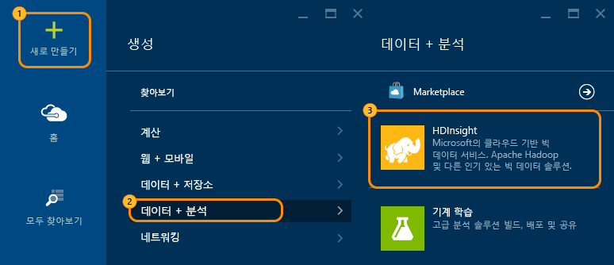
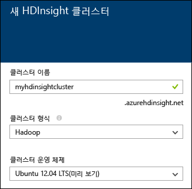
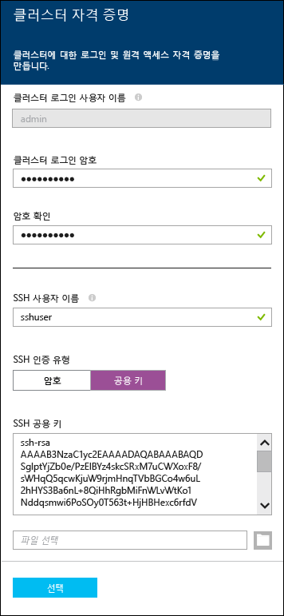
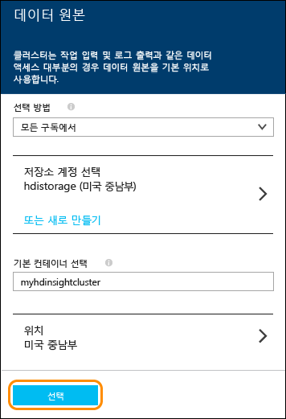
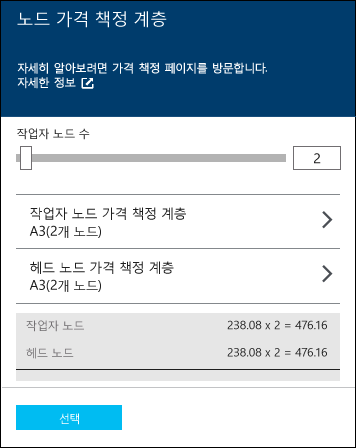

<properties
   	pageTitle="Linux 자습서: Hadoop 및 Hive로 시작 | Microsoft Azure"
   	description="HDInsight에서 Hadoop을 사용하여 시작하려면 이 Linux 자습서를 수행합니다. Linux 클러스터를 프로비전하고 Hive를 사용하여 데이터를 쿼리하는 방법에 알아봅니다."
   	services="hdinsight"
   	documentationCenter=""
   	authors="nitinme"
   	manager="paulettm"
   	editor="cgronlun"
	tags="azure-portal"/>

<tags
   	ms.service="hdinsight"
   	ms.devlang="na"
   	ms.topic="hero-article"
   	ms.tgt_pltfrm="na"
   	ms.workload="big-data"
   	ms.date="08/07/2015"
   	ms.author="nitinme"/>

# Hadoop 자습서: Linux의 HDInsight에서 Hive와 Hadoop 사용 시작(미리 보기)

> [AZURE.SELECTOR]
- [Windows](hdinsight-hadoop-tutorial-get-started-windows.md)
- [Linux](hdinsight-hadoop-linux-tutorial-get-started.md)

이 Hadoop 자습서는 Linux에서 Hadoop 클러스터를 프로비전하고 Hive 쿼리를 실행하는 방법을 표시하여 Linux의 Azure HDInsight에서 신속하게 시작할 수 있도록 합니다.

> [AZURE.NOTE]Hadoop과 빅 데이터를 처음 사용하는 경우 <a href="http://go.microsoft.com/fwlink/?LinkId=510084" target="_blank">Apache Hadoop</a>, <a href="http://go.microsoft.com/fwlink/?LinkId=510086" target="_blank">MapReduce</a>, <a href="http://go.microsoft.com/fwlink/?LinkId=510087" target="_blank">HDFS(Hadoop Distributed File System)</a> 및 <a href="http://go.microsoft.com/fwlink/?LinkId=510085" target="_blank">Hive</a> 용어에 대해 자세히 알아볼 수 있습니다. HDInsight를 통해 Azure에서 Hadoop을 사용하도록 설정하는 방법을 이해하려면 [HDInsight의 Hadoop 소개](hdinsight-hadoop-introduction.md)(영문)를 참조하세요.

## 이 자습서의 목표 

구조화되지 않은 대량의 데이터 집합이 있고 쿼리를 실행하여 의미 있는 일부 정보를 추출하려고 한다면 해당 방법은 다음과 같습니다.

   

## 필수 조건

이 Hadoop용 Linux 자습서를 시작하기 전에 다음이 있어야 합니다.

- **Azure 구독**. [Azure 무료 평가판](http://azure.microsoft.com/documentation/videos/get-azure-free-trial-for-testing-hadoop-in-hdinsight/)을 참조하세요.
- **SSH(보안 셸) 키**. 암호 대신 키가 있는 SSH를 사용하여 Linux 클러스터에 원격으로 연결하려는 경우 키를 사용하는 방법이 더 안전하므로 권장됩니다. SSH 키를 생성하는 방법에 대한 지침은 다음 문서를 참조하세요.
	-  Linux 컴퓨터 - [Linux, Unix 또는 OS X에서 Linux 기반 HDInsight(Hadoop)와 SSH 사용](hdinsight-hadoop-linux-use-ssh-unix.md)
	-  Windows 컴퓨터 - [Windows에서 Linux 기반 HDInsight(Hadoop)와 SSH 사용](hdinsight-hadoop-linux-use-ssh-windows.md)

**예상 완료 시간:** 30분

## Linux에서 HDInsight 클러스터 프로비전

클러스터를 프로비전할 때는 Hadoop과 관련 응용 프로그램을 포함하는 Azure 계산 리소스를 프로비전합니다. 이 섹션에서는 HDInsight 버전 3.2 클러스터를 프로비전합니다. 다른 버전용 Hadoop 클러스터를 만들 수도 있습니다. 지침에 대해서는 [사용자 지정 옵션을 사용하여 HDInsight 클러스터 프로비전][hdinsight-provision]을 참조하세요. HDInsight 버전 및 해당 SLA에 대한 내용은 [HDInsight 구성 요소 버전 관리](hdinsight-component-versioning.md)를 참조하세요.

>[AZURE.NOTE]Windows Server 운영 체제를 실행하는 Hadoop 클러스터를 만들 수도 있습니다. 자세한 내용은 [Windows에서 HDInsight 시작](hdinsight-hadoop-tutorial-get-started-windows.md)을 참조하세요.

**HDInsight 클러스터를 프로비전하려면**

1. [Azure 미리 보기 포털](https://ms.portal.azure.com/)에 로그인합니다.
2. **새로 만들기**, **데이터 분석** 및 **HDInsight**를 차례로 클릭합니다.

    

3. **클러스터 이름**을 입력하고 **클러스터 유형**으로 **Hadoop**을 선택하고 **클러스터 운영 체제** 드롭다운에서 **Ubuntu**를 선택합니다. 클러스터 이름을 사용할 수 있는 경우 클러스터 이름 옆에 녹색 확인 표시가 나타납니다.

	

4. 둘 이상의 구독이 있는 경우 **구독** 항목을 클릭하여 클러스터에 사용할 Azure 구독을 선택합니다.

5. **리소스 그룹**을 클릭하여 기존 리소스 그룹 목록을 표시한 다음 클러스터를 만들 리소스 그룹을 선택합니다. 또는 **새로 만들기**를 클릭한 다음 새 리소스 그룹의 이름을 입력할 수 있습니다. 새 그룹 이름을 사용할 수 있는지 여부를 나타내는 녹색 확인 표시가 나타납니다.

	> [AZURE.NOTE]사용할 수 있는 경우 이 항목은 기존 리소스 그룹 중 하나로 기본 설정됩니다.

6. **자격 증명**을 클릭한 다음 관리 사용자의 암호를 입력합니다. **SSH 사용자 이름**과 **암호** 또는 **공개 키**(SSH 사용자를 인증하는 데 사용됨)도 입력해야 합니다. 공개 키를 사용하는 것이 권장 방식입니다. 아래쪽의 **선택**을 클릭하여 자격 증명 구성을 저장합니다.

	

    > [AZURE.NOTE]SSH는 명령줄을 사용하여 HDInsight 클러스터에 원격으로 액세스하는 데 사용됩니다. 사용자 이름 및 암호 또는 여기에 사용되는 공용 키는 SSH 통해 클러스터에 연결할 때 사용됩니다. 또한 모든 HDInsight 클러스터 노드에 대해 사용자 계정을 생성하므로 SSH 사용자 이름은 고유해야 합니다. 다음은 클러스터에서 서비스에 의해 사용하도록 예약된 계정 이름 중 일부이며 SSH 사용자 이름으로 사용할 수 없습니다.
    >
    > root, hdiuser, storm, hbase, ubuntu, zookeeper, hdfs, yarn, mapred, hbase, hive, oozie, falcon, sqoop, admin, tez, hcat, hdinsight-zookeeper.

	HDInsight에서 SSH를 사용하는 방법에 대한 자세한 내용은 다음 문서 중 하나를 참조하세요.

	* [Linux, Unix 또는 OS X의 HDInsight에서 Linux 기반 Hadoop과 SSH 사용](hdinsight-hadoop-linux-use-ssh-unix.md)
	* [Windows의 HDInsight에서 Linux 기반 Hadoop과 SSH 사용](hdinsight-hadoop-linux-use-ssh-windows.md)

7. **데이터 원본**을 클릭하여 클러스터의 기존 데이터 원본을 선택하거나 새로 만듭니다. HDInsight의 Hadoop 클러스터를 프로비전할 때 Azure 저장소 계정을 지정합니다. Hadoop 분산 파일 시스템(HDFS)의 경우처럼 해당 계정의 특정 Blob 저장소 컨테이너는 기본 파일 시스템으로 지정됩니다. HDInsight 클러스터는 기본적으로 사용자가 지정한 저장소 계정과 동일한 데이터 센터에 프로비전됩니다. 자세한 내용은 [HDInsight에서 Azure Blob 저장소 사용](hdinsight-use-blob-storage.md)을 참조하세요.

	

	현재 HDInsight 클러스터의 데이터 원본으로 Azure 저장소 계정을 선택할 수 있습니다. 다음을 사용하여 **데이터 원본** 블레이드의 항목을 이해합니다.

	- **선택 방법**: 모든 구독에서 저장소 계정을 찾을 수 있도록 하려면 이 항목을 **모든 구독에서**로 설정합니다. 기존 저장소 계정의 **저장소 이름** 및 **액세스 키**를 입력하려면 이 항목을 **액세스 키**로 설정합니다.

	- **저장소 계정 선택/새로 만들기**: 클러스터와 연결할 기존 저장소 계정을 찾아 선택하려면 **저장소 계정 선택**을 클릭합니다. 또는 새 저장소 계정을 만들려면 **새로 만들기**를 클릭합니다. 저장소 계정의 이름을 입력할 때 나타나는 필드를 사용합니다. 이름을 사용할 수 있는 경우 녹색 확인 표시가 나타납니다.

	- **기본 컨테이너 선택**: 클러스터에 사용할 기본 컨테이너의 이름을 입력하려면 이 항목을 사용합니다. 여기에 아무 이름이나 입력할 수 있지만, 컨테이너가 이 특정 클러스터에 사용됨을 쉽게 인식할 수 있도록 클러스터와 같은 이름을 사용하는 것이 좋습니다.

	- **위치**: 저장소 계정이 있거나 저장소 계정을 만들 지역입니다.

		> [AZURE.IMPORTANT]기본 데이터 원본의 위치를 선택하면 HDInsight 클러스터의 위치도 설정됩니다. 클러스터와 기본 데이터 원본은 같은 지역에 있어야 합니다.

	**선택**을 클릭하여 데이터 원본 구성을 저장합니다.

8. **노드 가격 책정 계층**을 클릭하여 이 클러스터에 대해 만들어질 노드에 대한 정보를 표시합니다. 클러스터에 필요한 작업자 노드 수를 설정합니다. 클러스터의 예상 비용이 블레이드 내에 표시됩니다.

	

	**선택**을 클릭하여 노드 가격 책정 구성을 저장합니다.

9. **새 HDInsight 클러스터** 블레이드에서 **시작 보드에 고정**이 선택되어 있는지 확인한 다음 **만들기**를 클릭합니다. 그러면 클러스터가 만들어지고 Azure 포털의 시작 보드에 클러스터 타일이 추가됩니다. 아이콘이 클러스터를 프로비전 중임을 나타내고 프로비전이 완료되면 변경되어 HDInsight 아이콘을 표시합니다.

프로비전 중|프로비전 완료
------------------|---------------------
	|

> [AZURE.NOTE]클러스터를 만드는데 약간의 시간이 걸리며, 일반적으로 약 15분이 소요됩니다. 시작 보드에 있는 타일 또는 페이지 왼쪽에 있는 **알림** 항목을 사용하여 프로비전 프로세스를 확인하세요.

프로비전이 완료되면 시작 보드에서 클러스터 타일을 클릭하여 클러스터 블레이드를 시작합니다.

## 클러스터에서 Hive 작업 제출
HDInsight Linux 클러스터를 프로비전했으므로 다음 단계는 Hive 작업을 실행하여 HDInsight 클러스터와 함께 제공되는 샘플 데이터(sample.log)를 쿼리하는 것입니다. 샘플 데이터에는 추적, 경고, 정보, 오류 등의 로그 정보가 포함되어 있습니다. 이 데이터를 쿼리하여 특정 심각도의 모든 오류 로그를 검색할 수 있습니다. HDInsight Linux 클러스터에서 Hive 쿼리를 실행하려면 다음 단계를 수행해야 합니다.

- Linux 클러스터에 연결합니다.
- Hive 작업 실행

### 클러스터에 연결하려면

Linux 컴퓨터 또는 Windows 기반 컴퓨터(SSH 사용)에서 Linux의 HDInsight 클러스터에 연결할 수 있습니다.

**Linux 컴퓨터에 연결하려면**

1. 터미널을 열고 다음 명령을 실행합니다.

		ssh <username>@<clustername>-ssh.azurehdinsight.net

	빠른 생성 옵션을 사용하여 클러스터를 프로비전하기 때문에 기본 SSH 사용자 이름은 **hdiuser**입니다. 따라서 명령은 다음과 같아야 합니다.

		ssh hdiuser@myhdinsightcluster-ssh.azurehdinsight.net

2. 메시지가 표시되면 클러스트를 프로비전할 때 제공되는 암호를 입력합니다. 성공적으로 연결되면 프로프트가 다음과 같이 변경됩니다.

		hdiuser@headnode-0:~$

**Windows 기반 컴퓨터에서 연결하려면**

1. Windows 기반 클라이언트용 <a href="http://www.chiark.greenend.org.uk/~sgtatham/putty/download.html" target="_blank">PuTTY</a>를 다운로드합니다.

2. PuTTY를 엽니다. **Category**에서 **Session**을 클릭합니다. **Basic options for your PuTTY session** 화면에서 **Host Name (or IP address)** 필드에 HDInsight 서버의 SSH 주소를 입력합니다. SSH 주소는 클러스터 이름과 그 뒤의 **-ssh.azurehdinsight.net**으로 구성됩니다. 예를 들면 **myhdinsightcluster-ssh.azurehdinsight.net**과 같습니다.

	

3. 나중에 사용하기 위해 연결 정보를 저장하려면 **Saved Sessions** 아래에 이 연결의 이름을 입력한 후 **Save**를 클릭합니다. 연결이 저장 세션의 목록에 추가됩니다.

4. **Open**을 클릭하여 클러스터에 연결합니다. 사용자 이름을 묻는 메시지가 표시되면 **hdiuser**를 입력합니다. 암호에는 클러스터를 프로비전하는 동안 지정한 암호를 입력합니다. 성공적으로 연결되면 프로프트가 다음과 같이 변경됩니다.

		hdiuser@headnode-0:~$

### Hive 작업을 실행하려면

SSH를 통해 클러스터에 연결한 후에는 다음 명령을 사용하여 Hive 쿼리를 실행합니다.

1. 프롬프트에서 다음 명령을 사용하여 Hive CLI(명령줄 인터페이스)를 시작합니다.

		hive

2. CLI에서 다음 문을 입력하여 클러스터에서 이미 사용할 수 있는 샘플 데이터로 **log4jLogs**라는 새 테이블을 만듭니다.

		DROP TABLE log4jLogs;
		CREATE EXTERNAL TABLE log4jLogs(t1 string, t2 string, t3 string, t4 string, t5 string, t6 string, t7 string)
		ROW FORMAT DELIMITED FIELDS TERMINATED BY ' '
		STORED AS TEXTFILE LOCATION 'wasb:///example/data/';
		SELECT t4 AS sev, COUNT(*) AS cnt FROM log4jLogs WHERE t4 = '[ERROR]' GROUP BY t4;

	이러한 문은 다음 작업을 수행합니다.

	- **DROP TABLE** - 테이블이 이미 있는 경우 테이블과 데이터 파일을 삭제합니다.
	- **CREATE EXTERNAL TABLE** - Hive에서 새 “외부” 테이블을 만듭니다. 외부 테이블은 Hive에 테이블 정의만 저장하고, 데이터는 원래 위치에 남아 있습니다.
	- **ROW FORMAT** - 데이터의 형식 지정 방식을 Hive에 알립니다. 이 경우, 각 로그의 필드는 공백으로 구분됩니다.
	- **STORED AS TEXTFILE LOCATION** - 데이터가 저장된 위치(example/data 디렉터리) 및 텍스트로 저장되었음을 Hive에 알립니다.
	- **SELECT** - t4 열에 ERROR 값이 포함된 모든 행의 수를 선택합니다.

	>[AZURE.NOTE]자동화된 데이터 업로드 프로세스와 같은 외부 원본이나 또 다른 MapReduce 작업을 통해 기본 데이터를 업데이트해야 하지만 Hive 쿼리에서 항상 최신 데이터를 사용하려고 할 경우 외부 테이블을 사용해야 합니다. 외부 테이블을 삭제하면 데이터는 삭제되지 *않고* 테이블 정의만 삭제됩니다.

	다음 출력이 반환됩니다.

		Query ID = hdiuser_20150116000202_cceb9c6b-4356-4931-b9a7-2c373ebba493
		Total jobs = 1
		Launching Job 1 out of 1
		Number of reduce tasks not specified. Estimated from input data size: 1
		In order to change the average load for a reducer (in bytes):
		  set hive.exec.reducers.bytes.per.reducer=<number>
		In order to limit the maximum number of reducers:
		  set hive.exec.reducers.max=<number>
		In order to set a constant number of reducers:
		  set mapreduce.job.reduces=<number>
		Starting Job = job_1421200049012_0006, Tracking URL = <URL>:8088/proxy/application_1421200049012_0006/
		Kill Command = /usr/hdp/2.2.1.0-2165/hadoop/bin/hadoop job  -kill job_1421200049012_0006
		Hadoop job information for Stage-1: number of mappers: 1; number of reducers: 1
		2015-01-16 00:02:40,823 Stage-1 map = 0%,  reduce = 0%
		2015-01-16 00:02:55,488 Stage-1 map = 100%,  reduce = 0%, Cumulative CPU 3.32 sec
		2015-01-16 00:03:05,298 Stage-1 map = 100%,  reduce = 100%, Cumulative CPU 5.62 sec
		MapReduce Total cumulative CPU time: 5 seconds 620 msec
		Ended Job = job_1421200049012_0006
		MapReduce Jobs Launched:
		Stage-Stage-1: Map: 1  Reduce: 1   Cumulative CPU: 5.62 sec   HDFS Read: 0 HDFS Write: 0 SUCCESS
		Total MapReduce CPU Time Spent: 5 seconds 620 msec
		OK
		[ERROR]    3
		Time taken: 60.991 seconds, Fetched: 1 row(s)

	이 값이 포함된 3개 행이 있으므로 출력은 **[ERROR] 3**을 포함합니다.

3. 다음 문을 사용하여 **errorLogs**라는 새 테이블을 만듭니다.

		CREATE TABLE IF NOT EXISTS errorLogs (t1 string, t2 string, t3 string, t4 string, t5 string, t6 string, t7 string) STORED AS ORC;
		INSERT OVERWRITE TABLE errorLogs SELECT t1, t2, t3, t4, t5, t6, t7 FROM log4jLogs WHERE t4 = '[ERROR]';

	이러한 문은 다음 작업을 수행합니다.

	- **CREATE TABLE IF NOT EXISTS** - 테이블이 아직 없는 경우 테이블을 만듭니다. **EXTERNAL** 키워드가 사용되지 않으면 Hive 데이터 웨어하우스에 저장되고 Hive에서 완전히 관리되는 내부 테이블입니다. 외부 테이블과 달리 내부 테이블을 삭제하면 기본 데이터도 삭제됩니다.
	- **STORED AS ORC** - 데이터를 ORC(Optimized Row Columnar) 형식으로 저장합니다. Hive 데이터를 저장하기 위한 고도로 최적화되고 효율적인 형식입니다.
	- **덮어쓰기 삽입... SELECT** - [ERROR]가 포함된 **log4jLogs** 테이블에서 행을 선택하고 데이터를 **errorLogs** 테이블에 삽입합니다.

4. t4 열에 ERROR가 포함된 행만 **errorLogs** 테이블에 저장되었는지 확인하려면 다음 문을 사용하여 **errorLogs**의 모든 행을 반환합니다.

		SELECT * from errorLogs;

	다음 출력이 콘솔에 표시됩니다.

		2012-02-03	18:35:34	SampleClass0	[ERROR]	 incorrect		id
		2012-02-03	18:55:54	SampleClass1	[ERROR]	 incorrect		id
		2012-02-03	19:25:27	SampleClass4	[ERROR]	 incorrect		id
		Time taken: 0.987 seconds, Fetched: 3 row(s)

	반환된 데이터는 모두 해당 [ERROR] 로그에 해당합니다.

## 다음 단계
이 Linux 자습서에서는 HDInsight를 사용하여 Linux에서 Hadoop 클러스터를 프로비전하는 방법과 SSH를 사용하여 Hive 쿼리를 실행하는 방법을 배웠습니다. 자세한 내용은 다음 문서를 참조하세요.

- [Ambari를 사용하여 HDInsight 클러스터 관리](hdinsight-hadoop-manage-ambari.md): Linux 기반 HDInsight 클러스터에서는 Hadoop 서비스의 관리 및 모니터링에 Ambari를 사용합니다. Ambari 웹 UI는 https://CLUSTERNAME.azurehdinsight.net의 각 클러스터에서 사용할 수 있습니다.

	> [AZURE.IMPORTANT]인터넷을 통해 Ambari 웹의 많은 섹션에 직접 액세스할 수 있지만, 리소스 관리자 또는 작업 기록과 같은 Hadoop 서비스의 웹 UI에는 SSH 터널을 사용해야 합니다. HDInsight에서 SSH 터널을 사용하는 방법에 대한 자세한 내용은 다음 문서를 참조하세요.
	>
	> * [Linux, Unix 또는 OS X의 HDInsight에서 Linux 기반 Hadoop과 SSH 사용](hdinsight-hadoop-linux-use-ssh-unix.md#tunnel)
	> * [Windows의 HDInsight에서 Linux 기반 Hadoop과 SSH 사용](hdinsight-hadoop-linux-use-ssh-windows.md#tunnel)

- [사용자 지정 옵션을 사용하여 Linux에서 HDInsight 프로비전](hdinsight-hadoop-provision-linux-clusters.md): HDInsight 클러스터를 프로비전하는 방법에 대한 자세한 내용을 알아봅니다.

- [Linux에서 HDInsight 작업](hdinsight-hadoop-linux-information.md): 이미 Linux 플랫폼의 Hadoop에 대해 잘 알고 있는 경우 이 문서는 다음과 같은 Azure 관련 정보에 대한 지침을 제공합니다.

	* 클러스터에서 호스트되는 서비스(예: Ambari 및 WebHCat)의 URL
	* 로컬 파일 시스템의 Hadoop 파일 및 예제의 위치
	* 기본 데이터 저장소로 HDFS 대신 Azure 저장소(WASB) 사용

- Hive에 대한 자세한 내용을 확인하거나 Pig 및 MapReduce에 대해 알아보려면 다음을 참조하세요.

	- [HDInsight와 함께 MapReduce 사용][hdinsight-use-mapreduce]
	- [HDInsight에서 Hive 사용][hdinsight-use-hive]
	- [HDInsight에서 Pig 사용][hdinsight-use-pig]

- HDInsight 클러스터에 사용되는 Azure 저장소의 작업 방법에 대한 자세한 내용은 다음을 참조하세요.

	- [HDInsight에서 Azure Blob 저장소 사용](../hdinsight-use-blob-storage.md)
	- [HDInsight에 데이터 업로드][hdinsight-upload-data]

[1]: ../HDInsight/hdinsight-hadoop-visual-studio-tools-get-started.md

[hdinsight-provision]: hdinsight-provision-clusters.md
[hdinsight-admin-powershell]: hdinsight-administer-use-powershell.md
[hdinsight-upload-data]: hdinsight-upload-data.md
[hdinsight-use-mapreduce]: hdinsight-use-mapreduce.md
[hdinsight-use-hive]: hdinsight-use-hive.md
[hdinsight-use-pig]: hdinsight-use-pig.md

[powershell-download]: http://go.microsoft.com/fwlink/p/?linkid=320376&clcid=0x409
[powershell-install-configure]: ../install-configure-powershell.md
[powershell-open]: ../install-configure-powershell.md#Install

[img-hdi-dashboard]: ./media/hdinsight-hadoop-tutorial-get-started-windows/HDI.dashboard.png
[img-hdi-dashboard-query-select]: ./media/hdinsight-hadoop-tutorial-get-started-windows/HDI.dashboard.query.select.png
[img-hdi-dashboard-query-select-result]: ./media/hdinsight-hadoop-tutorial-get-started-windows/HDI.dashboard.query.select.result.png
[img-hdi-dashboard-query-select-result-output]: ./media/hdinsight-hadoop-tutorial-get-started-windows/HDI.dashboard.query.select.result.output.png
[img-hdi-dashboard-query-browse-output]: ./media/hdinsight-hadoop-tutorial-get-started-windows/HDI.dashboard.query.browse.output.png
[image-hdi-clusterstatus]: ./media/hdinsight-hadoop-tutorial-get-started-windows/HDI.ClusterStatus.png
[image-hdi-gettingstarted-powerquery-importdata]: ./media/hdinsight-hadoop-tutorial-get-started-windows/HDI.GettingStarted.PowerQuery.ImportData.png
[image-hdi-gettingstarted-powerquery-importdata2]: ./media/hdinsight-hadoop-tutorial-get-started-windows/HDI.GettingStarted.PowerQuery.ImportData2.png

<!---HONumber=Sept15_HO3-->