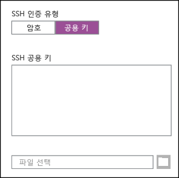
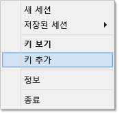

# Windows에서 PuTTY의 HDInsight(Hadoop)와 함께 SSH 사용

> [!div class="op_single_selector"]
> * [PuTTY(Windows)](hdinsight-hadoop-linux-use-ssh-windows.md)
> * [SSH(Windows, Linux, Unix, OS X)](hdinsight-hadoop-linux-use-ssh-unix.md)

[SSH(보안 셸)](https://en.wikipedia.org/wiki/Secure_Shell) 를 통해 명령줄 인터페이스를 사용하여 Linux 기반 HDInsight 클러스터에 대한 작업을 원격으로 수행할 수 있습니다. 이 문서에서는 PuTTY SSH 클라이언트를 사용하여 Windows 기반 클라이언트에서 HDInsight에 연결하는 방법을 설명합니다.

> [!NOTE]
> 이 문서의 단계에서는 PuTTY SSH 클라이언트가 있는 Windows 기반 시스템을 사용한다고 가정합니다. `ssh` 명령을 제공하는 Linux, Unix, OS X 또는 Windows 시스템을 사용할 경우 [Linux, Unix 또는 OS X에서 HDInsight의 Linux 기반 Hadoop과 SSH 사용](hdinsight-hadoop-linux-use-ssh-unix.md)을 참조하세요.

## 필수 조건

* Windows 기반 클라이언트용 **PuTTY** 및 **PuTTYGen**입니다. 이러한 유틸리티는 [http://www.chiark.greenend.org.uk/~sgtatham/putty/download.html](http://www.chiark.greenend.org.uk/~sgtatham/putty/download.html)에서 다운로드할 수 있습니다.
* HTML5를 지원하는 최신 웹 브라우저

## SSH 정의

SSH는 원격 서버에서 로그인 및 원격으로 실행하는 명령 유틸리티입니다. Linux 기반 HDInsight와 함께 SSH는 클러스터 헤드 노드에 대한 암호화된 연결을 설정하고 명령에서 입력하는 데 사용하는 명령줄을 제공합니다. 명령은 서버에서 직접 실행됩니다.

지금까지는 Windows에서 SSH 클라이언트를 제공하지 않았습니다.  PuTTY는 Windows에 설치할 수 있는 그래픽 SSH 클라이언트입니다.

### SSH 사용자 이름

SSH 사용자 이름은 HDInsight 클러스터에 인증하는데 사용하는 이름입니다. 클러스터를 만드는 동안 SSH 사용자 이름을 지정하는 경우 해당 사용자는 클러스터의 모든 노드에 대해 만들어집니다. 클러스터를 만든 후 해당 사용자 이름을 사용하여 HDInsight 클러스터 헤드 노드에 연결할 수 있습니다. 그러면 헤드 노드에서 개별 작업자 노드에 연결할 수 있습니다.

### SSH 암호 또는 공개 키

SSH 사용자는 인증에 암호 또는 공개 키를 사용할 수 있습니다. 암호는 구성한 텍스트 스트링인 반면 공용 키는 고유하게 사용자를 식별하기 위해 생성된 암호화 키 쌍의 일부입니다.

키는 암호보다 안전하지만 키를 생성하기 위해 추가 단계가 필요하며 키가 포함된 파일을 안전한 위치에 유지 관리해야 합니다. 키 파일에 대한 액세스를 얻으면 계정에 대한 액세스를 얻게 됩니다. 또는 키 파일이 손실되면 계정에 로그인할 수 없게 됩니다.

키 쌍은 공개 키(HDInsight 서버에 전송됨)와 개인 키(클라이언트 컴퓨터에 있음)로 구성됩니다. SSH를 사용하여 HDInsight 서버에 연결하는 경우 SSH 클라이언트는 서버를 인증하기 위해 컴퓨터의 개인 키를 사용합니다.

## SSH 키 만들기

클러스터와 SSH 키를 사용하려는 경우에 다음 정보를 사용합니다. 암호를 사용하려는 경우 이 섹션을 건너뛸 수 있습니다.

1. PuTTYGen을 엽니다.

2. **생성할 키의 유형**에서 **SSH-2 RSA**를 선택하고 **생성**을 클릭합니다.
   
    

3. 막대를 채울 때까지 진행률 표시줄 아래 영역에서 마우스를 이동합니다. 마우스를 이동하면 키를 생성하는 데 사용되는 임의의 데이터를 생성합니다.
   
    
   
    키가 한 번 생성되면 공용 키가 표시됩니다.

4. 추가 보안을 위해 **키 암호** 필드에서 암호를 입력한 다음 **암호 확인** 필드에 동일한 값을 입력할 수 있습니다.
   
    
   
   > [!NOTE]
   > 키에 대한 보안 암호를 사용하는 것이 좋습니다. 하지만 전달 구를 잊어버린 경우에는 복구할 수 있는 방법이 없으므로 주의해야 합니다.

5. **개인 키 저장**을 클릭하여 **.ppk** 파일에 키를 저장합니다. 이 키는 Linux 기반 HDInsight 클러스터에 인증하는 데 사용됩니다.
   
   > [!NOTE]
   > Linux 기반 HDInsight 클러스터에 액세스하는 데 사용하기 때문에 이 키를 안전한 위치에 저장해야 합니다.

6. **공용 키 저장**을 클릭하여 **.txt** 파일로 키를 저장합니다. 이 옵션을 사용하면 추가 Linux 기반 HDInsight 클러스터를 만들 때 공개 키를 나중에 다시 사용할 수 있습니다.
   
   > [!NOTE]
   > 공개 키는 PuTTYGen의 상단에도 표시됩니다. Azure 포털을 사용하여 클러스터를 만들 때 이 필드를 마우스 오른쪽 단추로 클릭하고 값을 복사한 다음 양식에 붙여 넣을 수 있습니다.

## Linux 기반 HDInsight 클러스터 만들기

Linux 기반 HDInsight 클러스터를 만들 때 이전에 생성한 공개 키를 제공해야 합니다. Windows 기반 클라이언트에서는 두 가지의 Linux 기반 HDInsight 클러스터를 만들 수 있습니다.

* **Azure 포털** - 웹 기반 포털을 사용하여 클러스터를 만듭니다.

* **Mac, Linux 및 Windows용 Azure CLI** - 명령줄 명령을 사용하여 클러스터를 만듭니다.

이러한 각 메서드에는 공개 키가 필요합니다. Linux 기반 HDInsight 클러스터를 만드는 방법에 대한 자세한 내용은 [Linux 기반 HDInsight 클러스터 프로비전](hdinsight-hadoop-provision-linux-clusters.md)을 참조하세요.

### Azure 포털

[Azure Portal][preview-portal]을 사용하여 Linux 기반 HDInsight 클러스터를 만드는 경우 **SSH 사용자 이름**을 입력하고 **암호** 또는 **SSH 공개 키**를 선택하여 입력해야 합니다.

**SSH 공개 키**를 선택하는 경우 PuttyGen의 **OpenSSH authorized\_keys 파일에 붙여 넣기 위한 공개 키** 필드에 표시되는 공개 키를 **SSH 공개 키** 필드에 붙여 넣거나 **파일 선택**을 선택하여 공개 키가 포함된 파일을 찾아 선택할 수 있습니다.

이렇게 하면 지정된 사용자에 대한 로그인이 생성되고 암호 인증 또는 SSH 키 인증을 사용하면 됩니다.

### Mac, Linux 및 Windows용 Azure 명령줄 인터페이스

[Mac, Linux 및 Windows용 Azure CLI](../cli-install-nodejs.md)를 사용하여 `azure hdinsight cluster create` 명령을 통해 새 클러스터를 만들 수 있습니다.

이 명령 사용에 대한 자세한 내용은 [사용자 지정 옵션을 사용하여 HDInsight에서 Hadoop Linux 클러스터 프로비전](hdinsight-hadoop-provision-linux-clusters.md)을 참조하세요.

## Linux 기반 HDInsight 클러스터에 연결

1. PuTTY를 엽니다.
   
    
2. 사용자 계정을 생성할 때 SSH 키를 제공한 경우 다음 단계를 수행하여 클러스터에 인증할 때 사용하려는 개인 키를 선택해야 합니다.
   
    **Category**에서 **Connection**, **SSH**를 차례로 확장하고 **Auth**를 선택합니다. 마지막으로 **Browse** 를 클릭하고 개인 키가 포함된 .ppk 파일을 선택합니다.
   
    

3. **범주**에서 **세션**을 선택합니다. **PuTTY 세션의 기본 옵션** 화면에서 **호스트 이름(또는 IP 주소)** 필드에 HDInsight 서버의 SSH 주소를 입력합니다. 클러스터에 연결할 때 두 개의 SSH 주소를 사용할 수 있습니다.

    

    * **헤드 노드 주소**: 클러스터의 헤드 노드를 연결하려면 클러스터 이름을 사용한 다음 **-ssh.azurehdinsight.net**을 사용합니다. 예를 들면 **mycluster-ssh.azurehdinsight.net**과 같습니다.
   
    * **에지 노드 주소**: HDInsight 클러스터에서 R 서버에 연결하는 경우 **RServer.CLUSTERNAME.ssh.azurehdinsight.net** 주소를 사용하여 R 서버 에지 노드에 연결할 수 있습니다. 여기서 CLUSTERNAME은 클러스터의 이름입니다. 예를 들어 **RServer.mycluster.ssh.azurehdinsight.net**입니다.
     

4. 나중에 사용하기 위해 연결 정보를 저장하려면 **저장된 세션**에 이 연결의 이름을 입력한 후 **저장**을 클릭합니다. 연결이 저장 세션의 목록에 추가됩니다.
5. **Open** 을 클릭하여 클러스터에 연결합니다.
   
   > [!NOTE]
   > 처음으로 클러스터에 연결한 경우 보안 경고를 받게 됩니다. 이것은 정상입니다. 서버의 RSA2 키를 계속 캐시하려면 **예** 를 선택합니다.

6. 메시지가 표시되면 클러스터를 생성할 때 입력한 사용자를 입력합니다. 사용자에 대한 암호를 제공한 경우 사용자를 입력하라는 메시지도 나타납니다.

> [!NOTE]
> 위의 단계에서는 HDInsight 클러스터의 기본 헤드 노드에 연결하는 포트 22를 사용 중이라고 가정합니다. 23 포트를 사용하는 경우, 보조 헤드 노드에 연결됩니다. 헤드 노드에 대한 자세한 내용은 [HDInsight에서 Hadoop 클러스터의 가용성 및 안정성](hdinsight-high-availability-linux.md)을 참조하세요.

### 작업자 노드에 연결

작업자 노드는 Azure 데이터 센터 외부에서 직접 액세스할 수 없으며, SSH를 통해 클러스터 헤드 노드에서 액세스할 수 있습니다.

사용자 계정을 만들 때 SSH 키를 제공한 경우 작업자 노드에 연결하려면 다음 단계를 수행하여 클러스터에 인증할 때 개인 키를 사용해야 합니다.

1. [http://www.chiark.greenend.org.uk/~sgtatham/putty/download.html](http://www.chiark.greenend.org.uk/~sgtatham/putty/download.html)에서 Pageant를 설치합니다. 이 유틸리티는 PuTTY의 SSH 키를 캐시하는 데 사용됩니다.

2. Pageant를 실행합니다. 상태 트레이의 아이콘이 최소화됩니다. 아이콘을 마우스 오른쪽 단추로 클릭하고 **키 추가**를 선택합니다.
   
    

3. 찾아보기 대화 상자가 나타나면 키가 포함된 .ppk 파일을 선택하고 **열기**를 클릭합니다. 그러면 Pageant에 키가 추가되어 클러스터에 연결할 때 PuTTY에 제공됩니다.
   
   > [!IMPORTANT]
   > SSH 키를 사용하여 계정의 보안을 유지하는 경우에는 이전 단계를 완료해야 작업자 노드에 연결할 수 있습니다.

4. PuTTY를 엽니다.

5. SSH 키를 사용하여 인증하는 경우 **범주** 섹션에서 **연결**, **SSH**를 차례로 확장하고 **인증**을 선택합니다.
   
    **인증 매개 변수** 섹션에서 **에이전트 전달 허용**을 사용하도록 설정합니다. 그러면 작업자 노드에 연결할 때 PuTTY에서 클러스터 헤드 노드에 대한 연결을 통해 인증서 인증을 자동으로 전달할 수 있습니다.
   
    

6. 앞에서 설명한 대로 클러스터에 연결합니다. 인증에 SSH 키를 사용하는 경우에는 키를 선택할 필요가 없습니다. Pageant에 추가된 SSH 키가 클러스터를 인증하는 데 사용됩니다.

7. 연결이 설정되면 다음을 사용하여 클러스터의 노드 목록을 검색합니다. *ADMINPASSWORD* 를 클러스터 관리 계정의 암호로 바꿉니다. *CLUSTERNAME* 을 클러스터의 이름으로 바꿉니다.
   
        curl --user admin:ADMINPASSWORD https://CLUSTERNAME.azurehdinsight.net/api/v1/hosts
   
    `host_name`을 포함하여 클러스터의 노드에 대한 정보가 JSON 형식으로 반환되며, 여기에는 각 노드의 FQDN(정규화된 도메인 이름)이 포함됩니다. 다음은 **curl** 명령에서 반환되는 `host_name` 항목의 예입니다.
   
        "host_name" : "workernode0.workernode-0-e2f35e63355b4f15a31c460b6d4e1230.j1.internal.cloudapp.net"

8. 연결하려는 작업자 노드 목록을 가져왔으면 PuTTY 세션에서 다음 명령을 사용하여 작업자 노드에 대한 연결을 엽니다.
   
        ssh USERNAME@FQDN
   
    *USERNAME*을 SSH 사용자 이름으로, *FQDN*을 작업자 노드의 FQDN으로 바꿉니다. 예: `workernode0.workernode-0-e2f35e63355b4f15a31c460b6d4e1230.j1.internal.cloudapp.net`
    
    > [!NOTE]
    > 암호를 사용하여 SSH 세션을 인증하는 경우 암호를 입력하라는 메시지가 다시 표시됩니다. SSH 키를 사용하는 경우에는 아무 메시지 없이 연결이 완료됩니다.

9. 세션이 설정되면 작업자 노드에 연결되었음을 나타내도록 PuTTY 세션에 대한 프롬프트가 `username@hn#-clustername`에서 `username@wn#-clustername`로 변경됩니다. 이 시점부터 실행하는 모든 명령은 작업자 노드에서 실행됩니다.

10. 작업자 노드에 대한 작업 수행을 마쳤으면 `exit` 명령을 사용하여 작업자 노드의 세션을 닫습니다. 그러면 `username@hn#-clustername` 프롬프트가 반환됩니다.

## 계정 추가

클러스터에 계정에 더 추가해야 하는 경우 다음 단계를 수행합니다.

1. 이전에 설명된 것처럼 새로운 사용자 계정에 대한 새로운 공개 키 및 개인 키를 생성합니다.

2. SSH 세션에서 클러스터로 다음 명령을 사용하여 새 사용자를 추가합니다.
   
        sudo adduser --disabled-password <username>
   
    이렇게 하면 새 사용자 계정이 생성되지만 암호 인증이 비활성화됩니다.

3. 다음 명령을 사용하여 키를 보유하는 파일 및 디렉터리를 만듭니다.
   
        sudo mkdir -p /home/<username>/.ssh
        sudo touch /home/<username>/.ssh/authorized_keys
        sudo nano /home/<username>/.ssh/authorized_keys

4. Nano 편집기를 열면 새로운 사용자 계정에 대한 공개 키 콘텐츠를 복사하고 붙여 넣습니다. 마지막으로 **Ctrl-X** 를 사용하여 파일을 저장하고 편집기를 종료합니다.
   
    

5. 새 사용자 계정에 .ssh 폴더 및 내용의 소유권을 변경하려면 다음 명령을 사용합니다.
   
        sudo chown -hR <username>:<username> /home/<username>/.ssh

6. 이제 새 사용자 계정 및 개인 키를 사용하여 서버에 인증할 수 있습니다.

## SSH 터널링

SSH는 웹 요청과 같은 로컬 요청을 HDInsight 클러스터에 터널링하는 데 사용할 수 있습니다. HDInsight 클러스터 헤드 노드에서 발생하는 경우 요청이 요청된 리소스에 라우팅됩니다.

> [!IMPORTANT]
> SSH 터널은 일부 Hadoop 서비스의 웹 UI에 액세스하기 위한 요구 사항입니다. 예를 들어 작업 기록 UI와 리소스 관리자 UI는 둘 다 SSH 터널을 사용해서만 액세스할 수 있습니다.

SSH 터널의 생성 및 사용에 대한 자세한 내용은 [SSH 터널링을 사용하여 Ambari 웹 UI, ResourceManager, JobHistory, NameNode, Oozie 및 기타 웹 UI에 액세스](hdinsight-linux-ambari-ssh-tunnel.md)를 참조하세요.

## 다음 단계

이제 SSH 키를 사용하여 인증하는 방법을 배웠으므로 HDInsight에서 Hadoop과 MapReduce를 함께 사용하는 방법에 알아봅니다.

* [HDInsight에서 Hive 사용](hdinsight-use-hive.md)
* [HDInsight에서 Pig 사용](hdinsight-use-pig.md)
* [HDInsight에서 MapReduce 작업 사용](hdinsight-use-mapreduce.md)

[preview-portal]: https://portal.azure.com/

