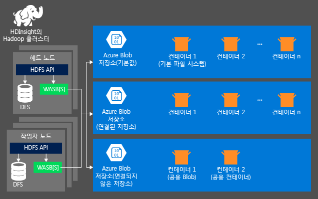

# <a name="use-azure-storage-with-azure-hdinsight-clusters"></a>Azure HDInsight 클러스터에서 Azure Storage 사용

HDInsight 클러스터에서 데이터를 분석 하려면 사용자 데이터를 저장할 수 중 하나에 [Azure Storage](../storage/common/storage-introduction.md)를 [Azure Data Lake 저장소 Gen 1](../data-lake-store/data-lake-store-overview.md)/[Azure Data Lake 저장소 Gen 2](../storage/blobs/data-lake-storage-introduction.md), 또는 조합 합니다. 이러한 저장소 옵션을 사용 하 여 사용자 데이터 손실 없이 계산에 사용 되는 HDInsight 클러스터를 안전 하 게 삭제할 수 있습니다.

Apache Hadoop은 기본 파일 시스템의 개념을 지원합니다. 기본 파일 시스템은 기본 체계와 권한을 의미합니다. 상대 경로를 확인하기 위해 사용할 수 있습니다. HDInsight 클러스터를 만드는 과정에서 Azure Storage에서나 HDInsight 3.6을 통해 Blob 컨테이너를 기본 파일 시스템으로 지정하거나, 몇 가지 예외를 제외하고 Azure Storage 또는 Azure Data Lake Storage Gen 1/Azure Data Lake Storage Gen 2 중 하나를 기본 파일 시스템으로 선택할 수 있습니다. 기본 및 연결된 스토리지로 Data Lake Storage Gen1을 사용하는 지원 가능성은 [HDInsight 클러스터에 대한 가용성](./hdinsight-hadoop-use-data-lake-store.md#availability-for-hdinsight-clusters)을 참조하세요.

이 문서에서는 Azure Storage가 HDInsight 클러스터에서 작동하는 방식에 대해 알아봅니다. Data Lake Storage Gen 1이 HDInsight 클러스터에서 작동하는 방식에 대해 알아보려면 [Azure HDInsight 클러스터에서 Azure Data Lake Storage 사용](hdinsight-hadoop-use-data-lake-store.md)을 참조하세요. HDInsight 클러스터를 만드는 방법에 대한 자세한 내용은 [HDInsight에서 Apache Hadoop 클러스터 만들기](hdinsight-hadoop-provision-linux-clusters.md)를 참조하세요.

Azure Storage는 HDInsight와 매끄럽게 통합되는 강력한 범용 스토리지 솔루션입니다. HDInsight는 Azure Storage의 Blob 컨테이너를 클러스터의 기본 파일 시스템으로 사용합니다. HDFS(Hadoop Distributed File System) 인터페이스를 통해 HDInsight의 전체 구성 요소 집합을 Blob로 저장된 구조적 또는 비구조적 데이터에 대해 직접 작동할 수 있습니다.

> [!WARNING]  
> 저장소 계정 종류 **는 blob Storage** HDInsight 클러스터에 대 한 보조 저장소로만 사용할 수 있습니다.

| 저장소 계정 종류 | 지원되는 서비스 | 지원되는 성능 계층 | 지원되는 액세스 계층 |
|----------------------|--------------------|-----------------------------|------------------------|
| StorageV2(범용 v2)  | Blob     | Standard                    | 핫, 쿨, 보관\*   |
| 저장소 (범용 v1)   | Blob     | Standard                    | N/A                    |
| BlobStorage                    | Blob     | Standard                    | 핫, 쿨, 보관\*   |

기본 Blob 컨테이너는 비즈니스 데이터를 저장하는 데 사용하지 않는 것이 좋습니다. 저장소 비용을 줄이기 위해 사용한 후에는 매번 기본 Blob 컨테이너를 삭제하는 것이 좋습니다. 기본 컨테이너에는 애플리케이션 및 시스템 로그가 포함되어 있습니다. 컨테이너를 삭제하기 전에 이러한 로그를 검색해야 합니다.

여러 클러스터에 대해 하나의 Blob 컨테이너를 기본 파일 시스템으로 공유하는 것은 지원되지 않습니다.

> [!NOTE]  
> 보관 액세스 계층은 몇 시간씩 검색이 대기되는 오프라인 계층으로, HDInsight용으로는 권장되지 않습니다. 자세한 내용은 [보관 액세스 계층](../storage/blobs/storage-blob-storage-tiers.md#archive-access-tier)을 참조하세요.

사용 하 여 저장소 계정을 보호 하려는 경우는 **방화벽 및 virtual network** 에 대 한 제한 **네트워크를 선택한**, 예외를 사용 하도록 설정 해야 **허용 Microsoft 신뢰할 수 있는 서비스 하는 중...**  HDInsight 저장소 계정에 액세스할 수 있도록 합니다.

## <a name="hdinsight-storage-architecture"></a>HDInsight 저장소 아키텍처
다음 다이어그램은 Azure Storage 사용의 HDInsight 스토리지 아키텍처의 추상 보기를 제공합니다.



HDInsight는 계산 노드에 로컬로 연결된 분산 파일 시스템에 대한 액세스를 제공합니다. 정규화된 URI를 사용하여 이 파일 시스템에 액세스할 수 있습니다. 예를 들면 다음과 같습니다.

    hdfs://<namenodehost>/<path>

또한 HDInsight를 통해 Azure Storage에 저장된 데이터에 액세스할 수 있습니다. 구문은 다음과 같습니다.

    wasb://<containername>@<accountname>.blob.core.windows.net/<path>

다음은 HDInsight 클러스터와 Azure Storage 계정을 사용하는 경우 고려 사항입니다.

* **클러스터에 연결된 스토리지 계정의 컨테이너**: 계정 이름과 키는 만들기 중 클러스터와 연결되므로 사용자는 이러한 컨테이너의 Blob에 대한 모든 권한을 보유합니다.

* **클러스터에 연결되지 않은 스토리지 계정의 공용 컨테이너 또는 공용 Blob:** 컨테이너의 Blob에 대한 읽기 전용 권한을 가집니다.
  
> [!NOTE]  
> 공용 컨테이너를 사용하면 해당 컨테이너에서 사용할 수 있는 모든 Blob 목록 및 컨테이너 메타데이터를 가져올 수 있습니다. 공용 Blob을 사용하면 정확한 URL을 아는 경우에만 Blob에 액세스할 수 있습니다. 자세한 내용은 [컨테이너 및 Blob에 대한 액세스 관리](../storage/blobs/storage-manage-access-to-resources.md)를 참조하세요.

* **클러스터에 연결되지 않은 스토리지 계정의 개인 컨테이너:** WebHCat 작업을 제출할 때 스토리지 계정을 정의하지 않는 경우 컨테이너의 Blob에 액세스할 수 없습니다. 이것은 문서 뒷부분에 설명되어 있습니다.

만들기 프로세스 및 해당 키에 정의 된 저장소 계정에 저장 됩니다 `%HADOOP_HOME%/conf/core-site.xml` 클러스터 노드에서 합니다. HDInsight의 기본 동작은 core-site.xml 파일에 정의된 저장소 계정을 사용하는 것입니다. [Apache Ambari](./hdinsight-hadoop-manage-ambari.md)를 사용하여 이 설정을 수정할 수 있습니다.

Apache Hive, MapReduce, Apache Hadoop 스트리밍 및 Apache Pig를 비롯한 여러 WebHCat 작업은 스토리지 계정 및 메타데이터 설명을 포함할 수 있습니다. (현재 메타데이터가 아닌 저장소 계정이 있는 Pig에서 작동합니다.) 자세한 내용은 [대체 Storage 계정 및 Metastore와 HDInsight 클러스터 사용](https://social.technet.microsoft.com/wiki/contents/articles/23256.using-an-hdinsight-cluster-with-alternate-storage-accounts-and-metastores.aspx)을 참조하세요.

구조적 및 비구조적 데이터에 대한 Blob을 사용할 수 있습니다. Blob 컨테이너는 키/값 쌍으로 데이터를 저장하며, 디렉터리 계층 구조는 없습니다. 그러나 파일이 디렉터리 구조 내에 저장된 것처럼 보이도록 키 이름에 슬래쉬 문자(/)를 사용할 수 있습니다. 예를 들어 Blob의 키 이름을 *input/log1.txt*로 지정할 수 있습니다. 실제로 *input* 디렉터리는 없지만 키 이름에 슬래쉬 문자가 있으므로 파일 경로처럼 보입니다.

## <a id="benefits"></a>Azure Storage의 이점
계산 클러스터 및 저장소 리소스 공동 배치 되지 암시적된 성능 비용 계산 클러스터는 고속 네트워크 환경은 효율적으로 Azure 지역 내의 저장소 계정 리소스 근처에 만드는 방식으로 완화 되는 Azure storage 내 데이터에 액세스 하는 노드를 계산 합니다.

HDFS 대신 Azure Storage에 데이터를 저장할 경우 몇 가지 이점이 있습니다:

* **데이터 다시 사용 및 공유:** HDFS의 데이터는 컴퓨팅 클러스터 내에 있습니다. 컴퓨팅 클러스터에 액세스할 수 있는 애플리케이션만 HDFS API를 통해 데이터를 사용할 수 있습니다. HDFS Api를 통해 또는 Azure storage의 데이터에에서 액세스할 수 있습니다 합니다 [Blob Storage REST Api](https://docs.microsoft.com/rest/api/storageservices/Blob-Service-REST-API)합니다. 따라서 데이터의 생성과 소비에 더 많은 애플리케이션(기타 HDInsight 클러스터 포함)과 도구를 사용할 수 있습니다.

* **데이터 보관:** Azure 스토리지에 데이터를 저장하면 사용자 데이터를 손실하지 않고 계산에 사용되는 HDInsight 클러스터를 안전하게 삭제할 수 있습니다.

* **데이터 스토리지 비용:** 데이터를 장기간 저장하는 경우 DFS에 저장하는 것이 Azure 스토리지에 저장하는 것보다 비용이 많이 드는데, 이는 컴퓨팅 클러스터의 비용이 Azure 스토리지의 비용보다 비싸기 때문입니다. 또한 컴퓨팅 클러스터를 생성할 때마다 데이터를 다시 로드할 필요가 없기 때문에 데이터 로드 비용도 절약됩니다.

* **탄력적인 규모 확장:** HDFS는 확장된 파일 시스템을 제공하지만, 크기 조정은 클러스터에 대해 만드는 노드의 수에 따라 결정됩니다. 규모를 변경하는 것이 Azure Storage에서 자동으로 수행되는 탄력적인 확장 기능에 의존하는 것보다 더 복잡한 프로세스가 될 수 있습니다.

* **지역에서 복제:** Azure Storage를 지역에서 복제할 수 있습니다. 이 경우 지리적 복구와 데이터 중복 기능이 제공되지만, 지역에서 복제된 위치에 대한 장애 조치(Failover)는 성능에 심각한 영향을 미치게 되며 추가 비용을 발생시킬 수 있습니다. 따라서 지역에서 복제 기능은 추가 비용을 감수할 만큼 가치 있는 데이터에 한해서만 현명하게 사용하는 것이 좋습니다.

특정 MapReduce 작업과 패키지는 Azure Storage에 전혀 저장하고 싶지 않을 만한 중간 결과를 생성할 수 있습니다. 그런 경우에는 로컬 HDFS에 데이터를 저장하도록 선택할 수 있습니다. 실제로 HDInsight는 Hive 작업 및 기타 프로세스에서 생성되는 이러한 중간 결과 중 일부에 DFS를 사용합니다.

> [!NOTE]  
> 대부분의 HDFS 명령(예: `ls`, `copyFromLocal` 및 `mkdir`)은 여전히 예상대로 작동합니다. `fschk` 및 `dfsadmin`과 같은 기본 HDFS 구현(DFS라고 함)에 해당하는 명령만 Azure Storage에서 다르게 동작합니다.

## <a name="address-files-in-azure-storage"></a>Azure Storage에서 파일 주소 지정
HDInsight에서 Azure Storage의 파일에 액세스하기 위한 URI 구성표는 다음과 같습니다.

```config
wasb://<BlobStorageContainerName>@<StorageAccountName>.blob.core.windows.net/<path>
```

URI 체계는 암호화되지 않은 액세스(*wasb:* 접두사가 있음)와 SSL로 암호화된 액세스(*wasbs*가 있음)를 제공합니다. Azure의 동일한 지역에 있는 데이터에 액세스하는 경우에도 가능하면 *wasbs*를 사용하는 것이 좋습니다.

`<BlobStorageContainerName>` Azure storage의 blob 컨테이너의 이름을 식별 합니다.
`<StorageAccountName>` Azure Storage 계정 이름을 식별 합니다. FQDN(정규화된 도메인 이름)이 필요합니다.

모두 `<BlobStorageContainerName>` 나 `<StorageAccountName>` 지정 기본 파일 시스템 사용 됩니다. 기본 파일 시스템의 파일에 대해서는 상대 경로나 절대 경로를 사용할 수 있습니다. 예를 들어, HDInsight 클러스터와 함께 제공되는 *hadoop-mapreduce-examples.jar* 파일을 가리킬 때 다음 중 하나를 사용할 수 있습니다:

```config
wasb://mycontainer@myaccount.blob.core.windows.net/example/jars/hadoop-mapreduce-examples.jar
wasb:///example/jars/hadoop-mapreduce-examples.jar
/example/jars/hadoop-mapreduce-examples.jar
```

> [!NOTE]  
> HDInsight 버전 2.1 및 1.6 클러스터에서 파일 이름은 `hadoop-examples.jar`입니다.

경로 파일 또는 디렉터리 HDFS 경로 이름입니다. Azure Storage의 컨테이너는 키-값 저장소이므로 실제 계층적 파일 시스템은 없습니다. Blob 키 내부의 슬래쉬 문자(/)는 디렉터리 구분기호로 해석됩니다. 예를 들어 *hadoop-mapreduce-examples.jar* 의 Blob 이름은 다음과 같습니다.

```bash
example/jars/hadoop-mapreduce-examples.jar
```

> [!NOTE]  
> HDInsight 외부에서 blob를 작업할 때 대부분의 유틸리티는 WASB 형식을 인식하지 않으며 대신 `example/jars/hadoop-mapreduce-examples.jar`과 같은 기본 경로 형식을 예상합니다.

##  <a name="blob-containers"></a>Blob 컨테이너
Blob을 사용 하려면 먼저 만듭니다는 [Azure Storage 계정](../storage/common/storage-create-storage-account.md)합니다. 이 작업의 일부로 저장소 계정이 만들어지는 Azure 지역을 지정합니다. 클러스터와 저장소 계정은 동일한 지역에서 호스트되어야 합니다. Hive Metastore SQL Server 데이터베이스 및 Apache Oozie Metastore SQL Server 데이터베이스도 동일한 지역에 위치해야 합니다.

어디에 있든, 만들어진 각 Blob은 Azure Storage 계정의 일부 컨테이너에 속합니다. 이 컨테이너는 HDInsight 외부에 생성된 기존 Blob일 수도 있고 HDInsight 클러스터용으로 생성된 컨테이너일 수도 있습니다.

기본 Blob 컨테이너는 작업 기록 및 로그와 같은 클러스터 특정 정보를 저장합니다. 여러 HDInsight 클러스터의 기본 Blob 컨테이너를 공유하지 마세요. 이 경우 작업 기록이 손상될 수 있습니다. 각 클러스터에 다른 컨테이너를 사용하고 기본 저장소 계정 대신 모든 관련 클러스터 배포에 지정된 연결 저장소 계정에서 공유 데이터를 배치하는 것이 좋습니다. 연결 된 저장소 계정 구성에 대 한 자세한 내용은 참조 하세요. [만들 HDInsight 클러스터](hdinsight-hadoop-provision-linux-clusters.md)합니다. 그러나 원래 HDInsight 클러스터를 삭제한 후에 기본 저장소 컨테이너를 다시 사용할 수 있습니다. HBase 클러스터의 경우 삭제된 HBase 클러스터에서 사용되는 기본 Blob 컨테이너를 사용하여 새 HBase 클러스터를 만듦으로써 HBase 테이블 스키마 및 데이터를 실제로 보존할 수 있습니다.

[!INCLUDE [secure-transfer-enabled-storage-account](../../includes/hdinsight-secure-transfer.md)]

## <a name="interacting-with-azure-storage"></a>Azure storage와 상호 작용

Microsoft은 Azure Storage를 사용 하려면 다음 도구를 제공 합니다.

| 도구 | Linux | OS X | Windows |
| --- |:---:|:---:|:---:|
| [Azure Portal](../storage/blobs/storage-quickstart-blobs-portal.md) |✔ |✔ |✔ |
| [Azure CLI](../storage/blobs/storage-quickstart-blobs-cli.md) |✔ |✔ |✔ |
| [Azure PowerShell](../storage/blobs/storage-quickstart-blobs-powershell.md) | | |✔ |
| [AZCopy](../storage/common/storage-use-azcopy-v10.md) |✔ | |✔ |

## <a name="use-additional-storage-accounts"></a>추가 저장소 계정 사용

HDInsight 클러스터를 만드는 동안 클러스터와 연결할 Azure Storage 계정을 지정합니다. 만들기 프로세스 중이나 클러스터를 만든 후에 이 저장소 계정 외에도 동일한 Azure 구독 또는 다른 Azure 구독에서 저장소 계정을 추가할 수 있습니다. 저장소 계정 추가에 대한 지침은 [HDInsight 클러스터 만들기](hdinsight-hadoop-provision-linux-clusters.md)를 참조하세요.

> [!WARNING]  
> HDInsight 클러스터와 다른 위치에서는 추가 저장소 계정을 사용할 수 없습니다.

## <a name="next-steps"></a>다음 단계

이 문서에서는 HDInsight로 HDFS 호환 Azure Storage를 사용하는 방법을 알아보았습니다. 이제 장기적이고 확장성 있는 보관 데이터 취득 솔루션을 구축할 수 있으며, 저장된 구조적 및 비구조적 데이터 내부의 정보를 활용하는 데 HDInsight를 사용할 수 있습니다.

자세한 내용은 다음을 참조하세요.

* [Azure HDInsight 시작](hadoop/apache-hadoop-linux-tutorial-get-started.md)
* [Azure Data Lake Storage 시작](../data-lake-store/data-lake-store-get-started-portal.md).
* [HDInsight에 데이터 업로드](hdinsight-upload-data.md)
* [HDInsight에서 Apache Hive 사용](hadoop/hdinsight-use-hive.md)
* [HDInsight에서 Apache Pig 사용](hadoop/hdinsight-use-pig.md)
* [Azure Storage 공유 액세스 서명을 사용 하 여 HDInsight 사용 하 여 데이터에 대 한 액세스를 제한 하려면](hdinsight-storage-sharedaccesssignature-permissions.md)
* [Azure HDInsight 클러스터에 Azure Data Lake Storage Gen2 사용](hdinsight-hadoop-use-data-lake-storage-gen2.md)