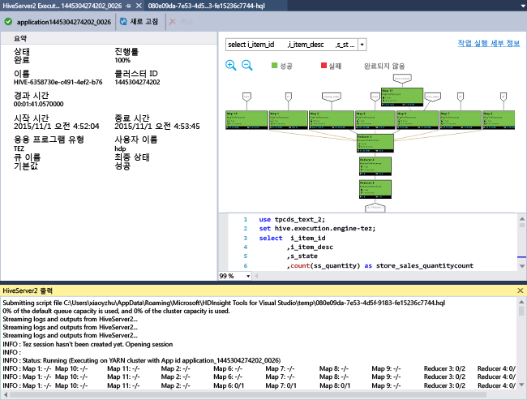
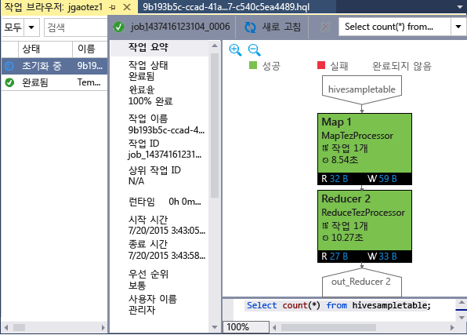

# Visual Studio용 Azure Data Lake(HDInsight) 도구를 사용하여 Hive 쿼리 실행 시작
Visual Studio용 Data Lake(HDInsight) 도구를 사용하여 HDInsight 클러스터에 연결하고 Hive 쿼리를 제출하는 방법에 대해 알아봅니다. HDInsight 사용에 대한 자세한 내용은 [HDInsight 소개][hdinsight.introduction] 및 [HDInsight 시작][hdinsight.get.started]을 참조하세요. Storm 클러스터에 연결하는 방법에 대한 자세한 내용은 Visual Studio를 사용하여 [HDInsight에서 Apache Storm용 C# 토폴로지 개발][hdinsight.storm.visual.studio.tools]을 참조하세요.

Visual Studio용 Data Lake 도구는 Data Lake Analytics 및 HDInsight에 모두 액세스하는 데 사용할 수 있습니다.  Data Lake 도구에 대한 자세한 내용은 [자습서: Visual Studio용 Data Lake 도구를 사용하여 U-SQL 스크립트 개발](../data-lake-analytics/data-lake-analytics-data-lake-tools-get-started.md)을 참조하세요.

**필수 구성 요소**

이 자습서를 완료하고 Visual Studio에서 Data Lake 도구를 사용하려면 다음이 필요합니다.

* Azure HDInsight 클러스터: 만들려면 [Linux 기반 HDInsight 사용 시작](hdinsight-hadoop-linux-tutorial-get-started.md)을 참조하세요.
* 다음 소프트웨어가 설치된 워크스테이션
  
  * Windows 10, Windows 8.1, Windows 8 또는 Windows 7.
  * Visual Studio 2013/2015/2017.
    
    > [!NOTE]
    > 현재 Visual Studio용 Data Lake 도구는 영어 버전으로만 제공됩니다.
    > 
    > 

## Visual Studio용 Data Lake 도구 설치

Data Lake Tools은 Visual Studio 2017에 기본적으로 설치됩니다. 이전 버전의 경우 [웹 플랫폼 설치 관리자](https://www.microsoft.com/web/downloads/)를 사용하여 설치할 수 있습니다. 사용 중인 Visual Studio 버전과 일치하는 버전을 선택해야 합니다. Visual Studio가 설치되어 있지 않은 경우 [웹 플랫폼 설치 관리자](https://www.microsoft.com/web/downloads/)를 사용하여 최신 Visual Studio Community 및 Azure SDK를 설치할 수 있습니다.

![Visual Studio용 Data Lake 도구 웹 플랫폼 설치 관리자][1]

## Azure 구독에 연결
Visual Studio용 Data Lake 도구를 사용하면 HDInsight 클러스터에 연결하고, 기본적인 관리 작업을 수행하고, Hive 쿼리를 실행할 수 있습니다.

> [!NOTE]
> 일반 Hadoop 클러스터 연결에 대한 자세한 내용은 [Visual Studio를 사용하여 Hive 쿼리 작성 및 제출](http://blogs.msdn.com/b/xiaoyong/archive/2015/05/04/how-to-write-and-submit-hive-queries-using-visual-studio.aspx)을 참조하세요.
> 
> 

**Azure 구독에 연결하려면**

1. Visual Studio를 엽니다.
2. **보기** 메뉴에서 **서버 탐색기**를 클릭하여 서버 탐색기 창을 엽니다.
3. **Azure**를 확장한 다음 **HDInsight**를 확장합니다.
   
   > [!NOTE]
   > **HDInsight 작업 목록** 창이 열립니다. 이 창이 표시되지 않는 경우 **보기** 메뉴에서 **다른 창**을 클릭한 후 **HDInsight 작업 목록 창**을 클릭합니다.  
   > 
   > 
4. Azure 구독 자격 증명을 입력한 후 **로그인**을 클릭합니다. 이 과정은 이 워크스테이션의 Visual Studio에서 Azure 구독에 연결한 적이 없는 경우에만 필요합니다.
5. 서버 탐색기에서 기존 HDInsight 클러스터 목록이 표시됩니다. 클러스터가 없는 경우 Azure Portal, Azure PowerShell 또는 HDInsight SDK를 사용하여 클러스터를 만들 수 있습니다. 자세한 내용은 [HDInsight 클러스터 만들기][hdinsight-create-clusters]를 참조하세요.
   
   ![Visual Studio용 Data Lake 도구 서버 탐색기 클러스터 목록][5]
6. HDInsight 클러스터를 확장합니다. **Hive 데이터베이스**, 기본 저장소 계정, 연결 저장소 계정 및 **Hadoop 서비스 로그**가 표시됩니다. 엔터티를 더 확장할 수 있습니다.

Azure 구독에 연결한 후에는 다음을 수행할 수 있습니다.

**Visual Studio에서 Azure 포털에 연결하려면**

* 서버 탐색기에서 **Azure** > **HDInsight**를 확장하고, HDInsight 클러스터를 마우스 오른쪽 단추로 클릭한 후 **Azure Portal에서 클러스터 관리**를 클릭합니다.

**Visual Studio에서 질문하고 피드백을 제공하려면**

* **도구** 메뉴에서 **HDInsight**를 클릭한 후 **MSDN 포럼**을 클릭하여 질문하거나 **피드백 제공**을 클릭합니다.

## 연결된 리소스 탐색
서버 탐색기에서 기본 저장소 계정 및 연결된 저장소 계정을 확인할 수 있습니다. 기본 저장소 계정을 확장한 경우 저장소 계정의 컨테이너를 확인할 수 있습니다. 기본 저장소 계정과 기본 컨테이너가 표시되어 있습니다. 컨테이너를 마우스 오른쪽 단추로 클릭하여 내용을 확인할 수도 있습니다.

![Visual Studio용 Data Lake 도구 서버 탐색기 클러스터 목록][2]

컨테이너를 연 후에 다음 단추를 사용하여 Blob을 업로드, 삭제 및 다운로드할 수 있습니다.

## HIVE 쿼리 실행
[Apache Hive][apache.hive]는 Hadoop을 기반으로 하는 데이터 웨어하우스 인프라로, 데이터 요약, 쿼리 및 분석 기능을 제공합니다. Visual Studio용 Data Lake 도구는 Visual Studio에서 Hive 쿼리를 실행하도록 지원합니다. Hive에 대한 자세한 내용은 [HDInsight와 함께 Hive 사용][hdinsight.hive]을 참조하세요.

HDInsight 클러스터에 대해 Hive 스크립트를 테스트하려면 많은 시간이 걸립니다. 몇 분 이상 걸릴 수 있습니다. Visual Studio용 Data Lake 도구는 로컬로 라이브 클러스터에 연결하지 않고 Hive 스크립트의 유효성 검사를 할 수 있습니다.

Visual Studio용 Data Lake 도구를 사용하여 일부 Hive 작업의 YARN 로그를 수집하고 표시하여 사용자가 Hive 작업 내에 무엇이 있는지 볼 수 있습니다.

### **hivesampletable**
모든 HDInsight 클러스터에는 *hivesampletable*이라는 샘플 Hive 테이블이 함께 제공됩니다. 여기서는 이 테이블을 사용하여 Hive 테이블을 나열하고, 테이블 스키마를 보고, Hive 테이블의 행을 나열하는 방법을 보여줍니다.

**Hive 테이블을 나열하고 Hive 테이블 스키마를 보려면**

1. **서버 탐색기**에서 **Azure** > **HDInsight** > 선택한 클러스터 > **Hive 데이터베이스** > **기본값** > **hivesampletable**을 확장하여 테이블 스키마를 표시합니다.
2. **hivesampletable**을 마우스 오른쪽 단추로 클릭한 후 **상위 100개 행 보기**를 클릭하여 행을 나열합니다. 이는 Hive ODBC 드라이버를 사용하여 다음 Hive 쿼리를 실행하는 것과 동일합니다.
   
     SELECT * FROM hivesampletable LIMIT 100
   
   행 개수를 사용자 지정할 수 있습니다.
   
   ![Data Lake 도구: HDInsight Hive Visual Studio 스키마 쿼리][6]

### Hive 테이블 만들기
GUI를 사용하여 Hive 테이블을 만들거나 Hive 쿼리를 사용할 수 있습니다. Hive 쿼리 사용에 대한 자세한 내용은 [Hive 쿼리 실행](#run.queries)을 참조하세요.

**Hive 테이블을 만들려면**

1. **서버 탐색기**에서 **Azure** > **HDInsight 클러스터** HDInsight 클러스터 > **Hive 데이터베이스**를 확장한 후 **기본값**을 마우스 오른쪽 단추로 클릭하고 **테이블 만들기**를 클릭합니다.
2. 테이블을 구성합니다.
3. **테이블 만들기** 를 클릭하여 새 Hive 테이블을 만들기 위한 작업을 제출합니다.
   
    ![Data Lake 도구: HDInsight Visual Studio 도구 hive 테이블 만들기][7]

### Hive 쿼리 유효성 검사 및 실행
다음 두 가지 방법으로 Hive 쿼리를 만들고 실행할 수 있습니다.

* 임시 쿼리 만들기
* Hive 응용 프로그램 만들기

**임시 쿼리를 만들고 유효성을 검사하고 실행하려면**

1. **서버 탐색기**에서 **Azure**를 확장한 후 **HDInsight 클러스터**를 확장합니다.
2. 쿼리를 실행할 클러스터를 마우스 오른쪽 단추로 클릭하고 **Hive 쿼리 작성**을 클릭합니다.
3. Hive 쿼리를 입력합니다. Hive 편집기는 IntelliSense를 지원합니다. Visual Studio용 Data Lake 도구는 Hive 스크립트를 편집할 때 원격 메타데이터 로드를 지원합니다. 예를 들어 "SELECT * FROM"을 입력하면 IntelliSense가 제안된 테이블 이름을 모두 나열합니다. 테이블 이름을 지정하면 IntelliSense가 열 이름을 나열합니다. 이 도구는 거의 모든 Hive DML 문, 하위 쿼리 및 기본 제공 UDF를 지원합니다.
   
    ![Data Lake 도구: HDInsight Visual Studio 도구 IntelliSense][13]
   
    ![Data Lake 도구: HDInsight Visual Studio 도구 IntelliSense][14]
   
   > [!NOTE]
   > HDInsight 도구 모음에서 선택한 클러스터의 메타데이터만 제안됩니다.
   > 
   > 
4. (선택 사항) **스크립트 유효성 검사** 를 클릭하여 스크립트 구문 오류를 확인합니다.
   
    ![Data Lake 도구: Visual Studio용 Data Lake 도구 로컬 유효성 검사][10]
5. **제출** 또는 **제출(고급)**을 클릭합니다. 고급 제출 옵션을 사용할 경우 스크립트에 대한 **작업 이름**, **인수**, **추가 구성** 및 **상태 디렉터리**를 구성합니다.
   
    ![HDInsight Hadoop Hive 쿼리][9]
   
    작업을 제출하면 **Hive 작업 요약** 창이 표시됩니다.
   
    ![HDInsight Hadoop Hive 쿼리 요약][8]
6. 작업 상태가 **완료**로 변경될 때까지 **새로 고침** 단추를 사용하여 상태를 새로 고칩니다.
7. 아래 쪽의 링크를 클릭하여 **작업 쿼리**, **작업 출력**, **작업 로그** 또는 **Yarn 로그**를 표시합니다.

**Hive 솔루션을 만들고 실행하려면**

1. **파일** 메뉴에서 **새로 만들기**를 클릭한 다음 **프로젝트**를 클릭합니다.
2. 왼쪽 창에서 **HDInsight**를 선택하고 가운데 창에서 **Hive 응용 프로그램**을 선택한 후 속성을 입력하고 **확인**을 클릭합니다.
   
    ![Data Lake 도구: HDInsight Visual Studio 도구 새 Hive 프로젝트][11]
3. **솔루션 탐색기**에서 **Script.hql**을 두 번 클릭하여 엽니다.
4. Hive 스크립트의 유효성을 검사하려면 **스크립트 유효성 검사** 단추를 클릭하거나 Hive 편집기에서 스크립트를 마우스 오른쪽 단추로 클릭한 후 상황에 맞는 메뉴에서 **스크립트 유효성 검사**를 클릭합니다.

### Hive 작업 보기
Hive 작업에 대한 작업 쿼리, 작업 출력, 작업 로그 및 Yarn 로그를 볼 수 있습니다. 자세한 내용은 이전 스크린샷을 참조하세요.

최신 릴리스의 도구에서는 YARN 로그를 수집하고 표시하여 Hive 작업 내의 항목을 확인할 수 있습니다. YARN 로그를 사용하여 성능 문제를 조사할 수 있습니다. HDInsight가 YARN 로그를 수집하는 방법에 대한 자세한 내용은 [프로그래밍 방식으로 HDInsight 응용 프로그램 로그에 액세스][hdinsight.access.application.logs]를 참조하세요.

**Hive 작업을 보려면**

1. **서버 탐색기**에서 **Azure**를 확장한 후 **HDInsight**를 확장합니다.
2. HDInsight 클러스터를 마우스 오른쪽 단추로 클릭한 다음 **작업 보기**를 클릭합니다. 클러스터에서 실행한 Hive 작업 목록이 표시됩니다.
3. 작업 목록에서 작업을 클릭하여 선택하고 **Hive 작업 요약** 창을 사용하여 **작업 쿼리**, **작업 출력**, **작업 로그** 또는 **Yarn 로그**를 엽니다.
   
    ![Data Lake 도구: HDInsight Visual Studio 도구 보기 Hive 작업][12]

### HiveServer2를 통해 더 빠른 경로 하이브 실행
> [!NOTE]
> 이 기능은 HDInsight 클러스터 버전 3.2 이상에만 적용됩니다.
> 
> 

[WebHCat](https://cwiki.apache.org/confluence/display/Hive/WebHCat) (Templeton라고도 함)를 통해 Hive 작업을 제출하는 데 사용되는 Data Lake 도구입니다. 작업 세부 정보 및 오류 정보를 반환 하는 데 오랜 시간이 걸렸습니다.
이 성능 문제를 해결하기 위해 Data Lake 도구는 RDP/SSH를 무시하도록 HiveServer2를 통해 클러스터에서 직접 Hive 작업을 실행합니다.
성능 향상 외에도 사용자는 Tez의 Hive 그래프 및 작업 세부 정보를 볼 수 있습니다.

HDInsight 클러스터 버전 3.2 이상의 경우 **HiveServer2를 통해 실행** 단추를 볼 수 있습니다.

그리고 실시간으로 스트리밍 백 된 로그를 확인하고 Hive 쿼리가 Tez에서 실행된 경우 작업 그래프를 볼 수 있습니다.

**HiveServer2를 통한 쿼리 실행과 WebHCat을 통한 쿼리 제출 간의 차이**

HiveServer2를 통한 쿼리 실행에 다양한 성능 이점이 있지만 몇 가지 제한 사항이 있습니다. 일부 제한 사항은 프로덕션 사용에 적합하지 않습니다. 다음 테이블은 차이점을 보여줍니다.

|  | HiveServer2를 통한 실행 | WebHCat을 통한 제출 |
| --- | --- | --- |
| 쿼리 실행 |("TempletonControllerJob"이라는 MapReduce 작업을 시작하는)WebHCat의 오버헤드를 제거합니다. |WebHCat을 통해 쿼리를 실행하는 한 WebHCat은 추가 대기 시간을 도입하는 MapReduce 작업을 시작합니다. |
| 로그 다시 스트리밍 |거의 실시간으로. |작업 실행 로그는 작업이 완료될 때 사용할 수 있습니다. |
| 작업 기록 보기 |HiveServer2를 통해 쿼리를 실행하는 경우 작업 기록(작업 로그, 작업 출력)은 유지되지 않습니다. 제한된 정보로 YARN UI에서 응용 프로그램을 볼 수 있습니다. |WebHCat을 통해 쿼리를 실행하는 경우 작업 기록(작업 로그, 작업 출력)은 유지되고 Visual Studio/HDInsight SDK/PowerShell을 사용하여 볼 수 있습니다. |
| 창 닫기 |HiveServer2를 통한 실행은 "동기적인" 방식이므로 창을 열어 두어야 합니다. 창을 닫은 경우 쿼리 실행은 취소됩니다. |WebHCat을 통한 제출은 "비동기적인" 방식이므로 WebHCat을 통해 쿼리를 제출하고 Visual Studio를 닫을 수 있습니다. 돌아와서 언제든지 결과를 참조할 수 있습니다. |

### Tez Hive 작업 성능 그래프
Data Lake 도구는 Tez 실행 엔진이 실행한 Hive 작업에 대한 성능 그래프를 보여 줍니다. Tez를 사용하는 방법에 대한 자세한 내용은 [HDInsight에서 Hive 사용][hdinsight.hive]을 참조하세요. Visual Studio에서 Hive 작업을 제출하면 Visual Studio가 작업이 완료될 때 그래프를 보여줍니다.  최신 작업 상태를 가져오기 위해 **새로 고침** 단추를 클릭해야 할 수도 있습니다.

> [!NOTE]
> 이 기능은 HDInsight 클러스터의 3.2.4.593 상위 버전에서만 사용할 수 있으며 완료된 작업에 대해서만 작동합니다.(WebHCat을 통해 작업을 제출한 경우, 이 그래프는 HiveServer2를 통해 쿼리를 실행한 경우에만 표시됩니다.) Windows 및 Linux 기반 클러스터 모두에 대해 동작합니다.
> 
> 

Hive 쿼리를 파악하는 데 도움이 되도록 이 릴리스에서는 도구에 Hive 운영자 뷰 기능이 추가되었습니다. 작업 그래프의 꼭짓점을 두 번 클릭해야 꼭짓점 내의 모든 운영자를 볼 수 있습니다. 특정 운영자에 대한 자세한 정보를 보려면 이 운영자를 마우스로 가리킵니다.

### Tez의 Hive 작업을 위한 작업 실행 보기
Tez의 Hive 작업을 위한 작업 실행 보기는 Hive 작업에 대한 정보를 구조화 및 시각화하는 데 사용할 수 있으며 작업 세부 정보를 가져올 수 합니다. 성능 문제가 있는 경우 세부 정보를 얻기위해 보기를 사용할 수 있습니다. 예를 들어, 각 작업의 작동 방식과 각 작업(데이터 읽기/쓰기, 일정/시작/종료 시간 등)에 대한 세부 정보의 경우, 가상된 정보를 기반으로 작업 구성 또는 시스템 아키텍처를 조정할 수 있도록 합니다.

## Pig 스크립트 실행
Visual Studio용 Data Lake 도구는 Pig 스크립트를 만들어 HDInsight 클러스터에 제출하도록 지원합니다. 템플릿에서 Pig 프로젝트를 만들고 HDInsight 클러스터에 스크립트를 제출할 수 있습니다.

## 피드백 및 알려진 문제
* 현재 HiveServer2 결과는 일반 텍스트 버전으로 표시되며, 이것은 바람직하지 않습니다. 이 문제를 해결하기 위해 개발 중에 있습니다.
* 결과가 NULL 값으로 시작되는 경우, 현재는 결과가 표시되지 않습니다. 이 문제는 해결되었습니다. 이 문제로 인해 어려움이 있으면, 전자 메일을 보내거나 지원 팀에 문의해 주시기 바랍니다.
* Visual Studio에서 만든 HQL 스크립트는 사용자의 로컬 지역 설정에 따라 인코딩됩니다. 사용자가 스크립트를 클러스터에 이진으로 업로드하는 경우 올바르게 실행되지 않을 수 있습니다.

## 다음 단계
이 문서에서는 Data Lake(HDInsight) 도구 패키지를 사용하여 Visual Studio에서 HDInsight 클러스터에 연결하는 방법 및 Hive 쿼리를 실행하는 방법에 대해 알아보았습니다. 자세한 내용은 다음을 참조하세요.

* [HDInsight에서 Hadoop Hive 사용][hdinsight.hive]
* [HDInsight에서 Hadoop 사용 시작][hdinsight.get.started]
* [HDInsight에서 Hadoop 작업 제출][hdinsight.submit.jobs]
* [HDInsight에서 Hadoop으로 Twitter 데이터 분석][hdinsight.analyze.twitter.data]

<!--Anchors-->
[Installation]: #installation
[Connect to your Azure subscription]: #connect-to-your-azure-subscription
[Navigate the linked resources]: #navigate-the-linked-resources
[Run Hive queries]: #run-hive-queries
[Next steps]: #next-steps

<!--Image references-->
[1]: ./media/hdinsight-hadoop-visual-studio-tools-get-started/hdinsight.visual.studio.tools.wpi.png
[2]: ./media/hdinsight-hadoop-visual-studio-tools-get-started/hdinsight.visual.studio.tools.linked.resources.png
[5]: ./media/hdinsight-hadoop-visual-studio-tools-get-started/hdinsight.visual.studio.tools.server.explorer.png
[6]: ./media/hdinsight-hadoop-visual-studio-tools-get-started/hdinsight.visual.studio.tools.hive.schema.png
[7]: ./media/hdinsight-hadoop-visual-studio-tools-get-started/hdinsight.visual.studio.tools.create.hive.table.png
[8]: ./media/hdinsight-hadoop-visual-studio-tools-get-started/hdinsight.visual.studio.tools.run.hive.job.summary.png
[9]: ./media/hdinsight-hadoop-visual-studio-tools-get-started/hdinsight.visual.studio.tools.submit.jobs.advanced.png
[10]: ./media/hdinsight-hadoop-visual-studio-tools-get-started/hdinsight.visual.studio.tools.validate.hive.script.png
[11]: ./media/hdinsight-hadoop-visual-studio-tools-get-started/hdinsight.visual.studio.tools.new.hive.project.png
[12]: ./media/hdinsight-hadoop-visual-studio-tools-get-started/hdinsight.visual.studio.tools.view.hive.jobs.png
[13]: ./media/hdinsight-hadoop-visual-studio-tools-get-started/hdinsight.visual.studio.tools.intellisense.table.names.png
[14]: ./media/hdinsight-hadoop-visual-studio-tools-get-started/hdinsight.visual.studio.tools.intellisense.column.names.png

<!--Link references-->
[hdinsight-create-clusters]: hdinsight-hadoop-provision-linux-clusters.md
[hdinsight.introduction]: hdinsight-hadoop-introduction.md
[hdinsight.get.started]: hdinsight-hadoop-linux-tutorial-get-started.md
[hdinsight.hive]: hdinsight-use-hive.md
[hdinsight.submit.jobs]: hdinsight-submit-hadoop-jobs-programmatically.md
[hdinsight.analyze.twitter.data]: hdinsight-analyze-twitter-data.md
[hdinsight.storm.visual.studio.tools]: hdinsight-storm-develop-csharp-visual-studio-topology.md
[hdinsight.access.application.logs]: hdinsight-hadoop-access-yarn-app-logs.md

[apache.hive]: http://hive.apache.org

