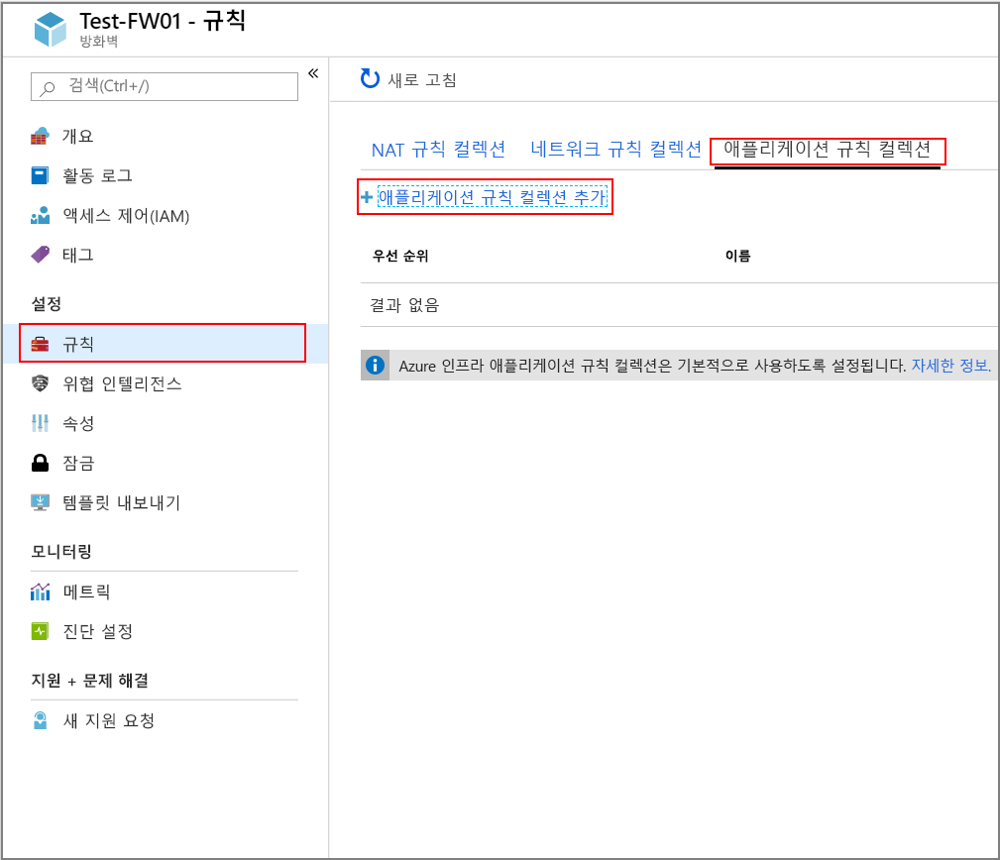
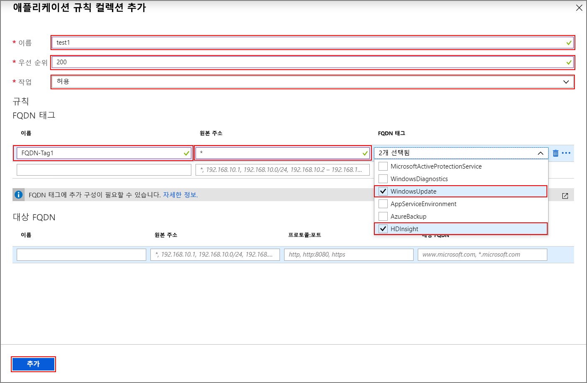
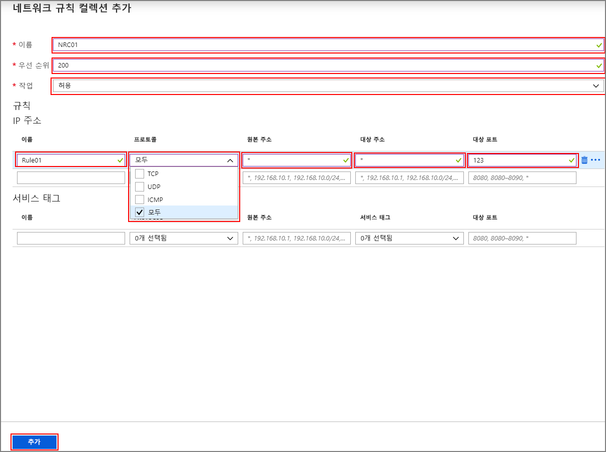

# <a name="configure-outbound-network-traffic-for-azure-hdinsight-clusters-using-firewall-preview"></a>방화벽 (미리 보기)를 사용 하 여 Azure HDInsight 클러스터에 대 한 아웃 바운드 네트워크 트래픽 구성

이 문서에서는 Azure 방화벽을 사용 하 여 HDInsight 클러스터에서 아웃 바운드 트래픽의 보안을 유지 하는 단계를 제공 합니다. 다음 단계는 기존 클러스터에 대 한 Azure 방화벽을 구성 하는 것을 가정 합니다. 새 클러스터를 배포 하는 경우를 방화벽 뒤에 있는 HDInsight 클러스터 및 서브넷을 처음 만들기 한 다음이 가이드의 단계를 따릅니다.

## <a name="background"></a>배경

Azure HDInsight 클러스터는 일반적으로 사용자 고유의 가상 네트워크에 배포 됩니다. 클러스터가 제대로 작동 하려면 네트워크 액세스 해야 하는 해당 가상 네트워크 외부에서 서비스에 대 한 종속성입니다.

인바운드 트래픽을 요구 하는 몇 가지 종속성이 있습니다. 인바운드 관리 트래픽은 방화벽 디바이스를 통해 보낼 수 없습니다. 이 트래픽에 대 한 원본 주소는 알려져와 게시할 [여기](hdinsight-extend-hadoop-virtual-network.md#hdinsight-ip)합니다. 또한 클러스터로의 인바운드 트래픽을 보호를 위해이 정보를 사용 하 여 네트워크 보안 그룹 (NSG) 규칙을 만들 수 있습니다.

HDInsight 아웃 바운드 트래픽을 종속성 Fqdn 뒤에 고정 IP 주소 없는 거의 전적으로 정의 됩니다. 고정 주소 부족 클러스터에서 아웃 바운드 트래픽을 잠글 네트워크 보안 그룹 (Nsg)을 사용할 수 없음을 의미 합니다. 주소를 현재 이름 확인에 따라 규칙을 설정할 수 없습니다 및 NSG 규칙을 설정 하는 사용 하 여 하나는 충분히 자주 변경 합니다.

아웃 바운드 주소를 보호 하기 위한 솔루션 도메인 이름을 기준으로 아웃 바운드 트래픽을 제어할 수 있는 방화벽 장치를 사용 하는 것입니다. Azure 방화벽에는 대상의 FQDN을 기반으로 아웃 바운드 HTTP 및 HTTPS 트래픽을 제한할 수 있습니다 또는 [FQDN 태그](https://docs.microsoft.com/azure/firewall/fqdn-tags)합니다.

## <a name="configuring-azure-firewall-with-hdinsight"></a>HDInsight를 사용 하 여 Azure 방화벽 구성

Azure 방화벽을 사용 하 여 기존에 HDInsight에서의 송신을 잠그려면 단계 요약은 다음과 같습니다.
1. 방화벽을 만듭니다.
1. 응용 프로그램 규칙을 방화벽에 추가
1. 네트워크 규칙을 방화벽에 추가 합니다.
1. 라우팅 테이블을 만듭니다.

### <a name="create-a-new-firewall-for-your-cluster"></a>클러스터에 대 한 새 방화벽 만들기

1. 이라는 서브넷을 만듭니다 **AzureFirewallSubnet** 클러스터에 있는 가상 네트워크에 있습니다. 
1. 새 방화벽 만들기 **테스트 FW01** 의 단계를 사용 하 여 [자습서: Azure Portal을 사용하여 Azure Firewall 배포 및 구성](../firewall/tutorial-firewall-deploy-portal.md#deploy-the-firewall)을 참조하세요.

### <a name="configure-the-firewall-with-application-rules"></a>응용 프로그램 규칙을 사용 하 여 방화벽을 구성 합니다.

중요 한 통신을 수신 하는 클러스터를 허용 하는 응용 프로그램 규칙 컬렉션을 만듭니다.

새 방화벽 선택 **테스트 FW01** Azure portal에서 합니다. 클릭 **규칙** 아래에서 **설정** > **응용 프로그램 규칙 컬렉션** > **추가 응용 프로그램 규칙 컬렉션**.



에 **응용 프로그램 규칙 컬렉션 추가** 화면에서 다음 단계를 완료 합니다.

1. 입력을 **이름을**, **우선 순위**, 클릭 **허용** 에서 합니다 **작업** 드롭다운 메뉴.
1. 다음 규칙을 추가 합니다.
    1. HDInsight 및 Windows 업데이트 트래픽을 허용 하는 규칙:
        1. 에 **FQDN 태그** 섹션에서 제공을 **이름**, 설정 및 **원본 주소** 에 `*`입니다.
        1. 선택 **HDInsight** 하며 **WindowsUpdate** 에서 합니다 **FQDN 태그** 드롭다운 메뉴입니다.
    1. Windows 로그인 작업을 허용 하는 규칙:
        1. 에 **대상 Fqdn** 섹션에서 제공을 **이름**, 설정 및 **원본 주소** 에 `*`입니다.
        1. 입력 `https:443` 아래에서 **프로토콜: 포트** 하 고 `login.windows.net` 아래 **FQDN 대상**합니다.
    1. 클러스터 WASB에서 지 원하는, 하는 경우 다음 WASB에 대 한 규칙을 추가 합니다.
        1. 에 **대상 Fqdn** 섹션에서 제공을 **이름**, 설정 및 **원본 주소** 에 `*`입니다.
        1. 입력 `http:80,https:443` 아래에서 **프로토콜: 포트** 아래에서 저장소 계정 url **대상 FQDN**합니다. 형식은 < storage_account_name.blob.core.windows.net > 비슷하게 됩니다. 만 https를 사용 하도록 연결 했는지 ["보안 전송 필요"](https://docs.microsoft.com/azure/storage/common/storage-require-secure-transfer) 저장소 계정에서 사용 하도록 설정 됩니다.
1. **추가**를 클릭합니다.



### <a name="configure-the-firewall-with-network-rules"></a>네트워크 규칙을 사용 하 여 방화벽을 구성 합니다.

HDInsight 클러스터를 올바르게 구성 하도록 네트워크 규칙을 만듭니다.

1. 새 방화벽 선택 **테스트 FW01** Azure portal에서 합니다.
1. 클릭 **규칙** 아래에서 **설정** > **네트워크 규칙 컬렉션** > **네트워크 규칙 컬렉션 추가**합니다.
1. 에 **네트워크 규칙 컬렉션을 추가** 화면에서 입력을 **이름**, **우선 순위**, 클릭 **허용** 에서 **작업** 드롭다운 메뉴입니다.
1. 다음 규칙을 만듭니다.
    1. NTP를 사용 하 여 클록 동기화를 수행 하려면 클러스터를 허용 하는 IP 주소 섹션에는 네트워크 규칙.
        1. 에 **규칙** 섹션에서 제공을 **이름** 선택한 **UDP** 에서 **프로토콜** 드롭다운 합니다.
        1. 설정할 **원본 주소** 하 고 **대상 주소** 에 `*`입니다.
        1. 설정할 **대상 포트** 123으로 합니다.
    1. 엔터프라이즈 보안 패키지 (ESP)를 사용 하는 경우 다음 ESP 클러스터에 대 한 AAD DS와의 통신을 허용 하는 IP 주소 섹션에서 네트워크 규칙을 추가 합니다.
        1. 도메인 컨트롤러에 대 한 두 개의 IP 주소를 확인 합니다.
        1. 다음 행에는 **규칙** 섹션에서 제공을 **이름** 선택한 **모든** 에서 합니다 **프로토콜** 드롭다운 합니다.
        1. 설정할 **원본 주소** `*`합니다.
        1. 도메인 컨트롤러에 대 한 모든 IP 주소를 입력 **대상 주소** 쉼표로 구분 합니다.
        1. 설정할 **대상 포트** 에 `*`입니다.
    1. Azure Data Lake Storage를 사용 하는 네트워크 규칙을 ADLS Gen1 Gen2와 SNI 문제를 해결 하려면 IP 주소 섹션에서 추가할 수 있습니다. 이 옵션은 대량의 데이터 로드에 대 한 높은 비용이 발생 시킬 수 있는 방화벽에 트래픽이 라우팅되 하지만 트래픽이 기록 되 고 방화벽 로그에서 감사 됩니다.
        1. Data Lake Storage 계정에 대 한 IP 주소를 확인 합니다. 와 같은 powershell 명령을 사용할 수 있습니다 `[System.Net.DNS]::GetHostAddresses("STORAGEACCOUNTNAME.blob.core.windows.net")` IP 주소에 FQDN을 확인할 수 있습니다.
        1. 다음 행에는 **규칙** 섹션에서 제공을 **이름** 선택한 **TCP** 에서 합니다 **프로토콜** 드롭다운 합니다.
        1. 설정할 **원본 주소** `*`합니다.
        1. 저장소 계정에 대 한 IP 주소를 입력 **대상 주소**합니다.
        1. 설정할 **대상 포트** 에 `*`입니다.
    1. (선택 사항) Log Analytics를 사용 하는 경우 Log Analytics 작업 영역을 사용 하 여 통신할 수 있도록 IP 주소 섹션에서 네트워크 규칙을 만듭니다.
        1. 다음 행에는 **규칙** 섹션에서 제공을 **이름** 선택한 **TCP** 에서 합니다 **프로토콜** 드롭다운 합니다.
        1. 설정할 **원본 주소** `*`합니다.
        1. 설정할 **대상 주소** 에 `*`입니다.
        1. 설정할 **대상 포트** 에 `12000`입니다.
    1. SQL을 사용 하면 로그인 하 고 SQL 트래픽 감사 방화벽을 바이패스 하는 HDInsight 서브넷의 SQL Server에 대 한 서비스 끝점을 구성 하지 않은 경우에 대 한 서비스 태그 섹션에서 네트워크 규칙을 구성 합니다.
        1. 다음 행에는 **규칙** 섹션에서 제공을 **이름** 선택한 **TCP** 에서 합니다 **프로토콜** 드롭다운 합니다.
        1. 설정할 **원본 주소** `*`합니다.
        1. 설정할 **대상 주소** 에 `*`입니다.
        1. 선택 **Sql** 에서 합니다 **서비스 태그** 드롭다운 합니다.
        1. 설정할 **대상 포트** 에 `1433,11000-11999,14000-14999`입니다.
1. 클릭 **추가** 네트워크 규칙 컬렉션 만들기를 완료 합니다.



### <a name="create-and-configure-a-route-table"></a>만들기 및 경로 테이블을 구성 합니다.

다음 항목을 사용 하 여 경로 테이블을 만듭니다.

1. 주소 6 [이 필요한 HDInsight 관리 IP 주소이 목록을](../hdinsight/hdinsight-extend-hadoop-virtual-network.md#hdinsight-ip) 의 다음 홉 **인터넷**:
    1. 모든 지역에서 모든 클러스터에 대해 네 개의 IP 주소
    1. 클러스터가 만들어지는 지역에 대 한 관련 된 두 개의 IP 주소
1. 하나의 가상 어플라이언스 IP 주소 0.0.0.0/0 다음 홉이 Azure 방화벽 개인 IP 주소를 사용 하 여에 대 한 경로.

예를 들어, "미국 중부" 미국 지역에서 만든 클러스터에 대 한 경로 테이블을 구성 하려면 다음 단계를 사용 합니다.

1. Azure 포털에 로그인합니다.
1. Azure 방화벽이 선택 **테스트 FW01**합니다. 복사를 **개인 IP 주소** 에 나열 된 **개요** 페이지입니다. 이 예제에 대 한 사용을 **10.1.1.4 주소의 샘플**
1. 새 경로 테이블을 만듭니다.
1. 클릭 **경로** 아래에서 **설정**합니다.
1. 클릭 **추가** 아래 표의 IP 주소에 대 한 경로 만들어야 합니다.

| 경로 이름 | 주소 접두사 | 다음 홉 형식 | 다음 홉 주소 |
|---|---|---|---|
| 168.61.49.99 | 168.61.49.99/32 | 인터넷 | 해당 없음 |
| 23.99.5.239 | 23.99.5.239/32 | 인터넷 | 해당 없음 |
| 168.61.48.131 | 168.61.48.131/32 | 인터넷 | 해당 없음 |
| 138.91.141.162 | 138.91.141.162/32 | 인터넷 | 해당 없음 |
| 13.67.223.215 | 13.67.223.215/32 | 인터넷 | 해당 없음 |
| 40.86.83.253 | 40.86.83.253/32 | 인터넷 | 해당 없음 |
| 0.0.0.0 | 0.0.0.0/0 | 가상 어플라이언스 | 10.1.1.4 |

경로 테이블 구성을 완료 합니다.

1. 클릭 하 여 HDInsight 서브넷에 만든 경로 테이블에 할당 **서브넷** 아래에서 **설정** 차례로 **연결**합니다.
1. 에 **서브넷 연결** 화면에서 클러스터에 만든 가상 네트워크를 선택 하며 **HDInsight 서브넷** HDInsight 클러스터에 대 한 사용 합니다.
1. **확인**을 클릭합니다.

## <a name="edge-node-or-custom-application-traffic"></a>에 지 노드 또는 사용자 지정 응용 프로그램 트래픽

위의 단계를 문제 없이 작동 하도록 클러스터를 허용 됩니다. 해당 하는 경우에 지 노드로 실행 사용자 지정 응용 프로그램에 맞게 종속성을 구성 해야 합니다.

응용 프로그램 종속성을 식별 하 고 Azure 방화벽 또는 경로 테이블에 추가 해야 합니다.

비대칭 라우팅 문제를 방지 하려면 응용 프로그램 트래픽에 대 한 경로 만들어야 합니다.

응용 프로그램에 다른 종속성이 있는 경우 Azure 방화벽에 추가 해야 합니다. 다른 모든 항목에 대해 HTTP/HTTPS 트래픽 및 네트워크 규칙을 허용하는 애플리케이션 규칙을 만듭니다.

## <a name="logging"></a>로깅

Azure 방화벽은 몇 가지 다른 저장소 시스템에 로그를 보낼 수 있습니다. 단계에 따라 방화벽에 대 한 로깅 구성에 대 한 지침에 대 한 [자습서: Azure 방화벽 로그와 메트릭 모니터링](../firewall/tutorial-diagnostics.md)합니다.

로깅을 설정 하는 경우 Log Analytics로 로깅 데이터를 마친 후에 다음과 같은 쿼리를 사용 하 여 차단 된 트래픽을 볼 수 있습니다.

```
AzureDiagnostics | where msg_s contains "Deny" | where TimeGenerated >= ago(1h)
```

Azure Monitor 로그로 Azure 방화벽 통합 먼저 모든 응용 프로그램 종속성의 인식할 수 없는 경우는 응용 프로그램 작업을 시작 하는 경우 유용 합니다. Azure Monitor 로그에 대한 자세한 내용은 [Azure Monitor에서 로그 데이터 분석](../azure-monitor/log-query/log-query-overview.md)을 참조하세요.

## <a name="access-to-the-cluster"></a>클러스터에 대 한 액세스
방화벽 설치를 성공적으로 알게 된 후 내부 끝점을 사용할 수 있습니다 (`https://<clustername>-int.azurehdinsight.net`) VNET 내에서 Ambari에 액세스할 수 있습니다. 공용 끝점을 사용 하도록 (`https://<clustername>.azurehdinsight.net`) 또는 ssh 끝점 (`<clustername>-ssh.azurehdinsight.net`), 경로 테이블의 올바른 경로 있고 NSG 규칙 설명 asymetric 라우팅 문제를 방지 하려면 설치 했는지 [여기](https://docs.microsoft.com/azure/firewall/integrate-lb)합니다.

## <a name="configure-another-network-virtual-appliance"></a>다른 네트워크 가상 어플라이언스를 구성 합니다.

>[!Important]
> 다음 정보를 **만** Azure 방화벽 이외의 다른 네트워크 가상 어플라이언스 (NVA)를 구성 하려는 경우 필요 합니다.

이전 지침을 HDInsight 클러스터에서 아웃 바운드 트래픽을 제한 하는 것에 대 한 Azure 방화벽을 구성할 수 있습니다. Azure 방화벽의 일반적인 중요 한 시나리오에 대 한 트래픽을 허용 하도록 자동으로 구성 됩니다. 다른 네트워크 가상 어플라이언스를 사용 하려는 경우 추가 기능의 수를 수동으로 구성 해야 합니다. 염두에 다음으로에 네트워크 가상 어플라이언스를 구성 합니다.

* 서비스 엔드포인트 지원 서비스는 서비스 엔드포인트로 구성되어야 합니다.
* HTTP/S 아닌 트래픽 (TCP 및 UDP 모두 트래픽)에 대 한 IP 주소 종속성은입니다.
* NVA 장치의 FQDN HTTP/HTTPS 끝점을 배치할 수 있습니다.
* 와일드 카드 HTTP/HTTPS 끝점은 한정자의 수에 따라 다를 수 있는 종속성입니다.
* 사용자가 만든 HDInsight 서브넷에 경로 테이블에 할당 합니다.

### <a name="service-endpoint-capable-dependencies"></a>서비스 엔드포인트 지원 종속성

| **엔드포인트** |
|---|
| Azure SQL |
| Azure Storage |
| Azure Active Directory |

#### <a name="ip-address-dependencies"></a>IP 주소 종속성

| **엔드포인트** | **세부 정보** |
|---|---|
| \*:123 | NTP 클록 확인. 트래픽이 포트 123의 여러 엔드포인트에서 확인됩니다. |
| 게시 하는 Ip [여기](hdinsight-extend-hadoop-virtual-network.md#hdinsight-ip) | 이 HDInsight 서비스 |
| 클러스터 AAD DS ESP에 대 한 개인 Ip |
| \*: 16800 KMS Windows 정품 인증 |
| \*Log Analytics에 대 한 12000 |

#### <a name="fqdn-httphttps-dependencies"></a>FQDN HTTP/HTTPS 종속성

>[!Important]
> 아래 목록에는 가장 중요 한 Fqdn의 몇 가지를 제공합니다. NVA 구성에 대 한 Fqdn의 전체 목록을 가져올 수 있습니다 [이 파일의](https://github.com/Azure-Samples/hdinsight-fqdn-lists/blob/master/HDInsightFQDNTags.json)합니다.

| **엔드포인트**                                                          |
|---|
| azure.archive.ubuntu.com:80                                           |
| security.ubuntu.com:80                                                |
| ocsp.msocsp.com:80                                                    |
| ocsp.digicert.com:80                                                  |
| wawsinfraprodbay063.blob.core.windows.net:443                         |
| registry-1.docker.io:443                                              |
| auth.docker.io:443                                                    |
| production.cloudflare.docker.com:443                                  |
| download.docker.com:443                                               |
| us.archive.ubuntu.com:80                                              |
| download.mono-project.com:80                                          |
| packages.treasuredata.com:80                                          |
| security.ubuntu.com:80                                                |
| azure.archive.ubuntu.com:80                                                |
| ocsp.msocsp.com:80                                                |
| ocsp.digicert.com:80                                                |

## <a name="next-steps"></a>다음 단계

* [Azure HDInsight 가상 네트워크 아키텍처](hdinsight-virtual-network-architecture.md)
