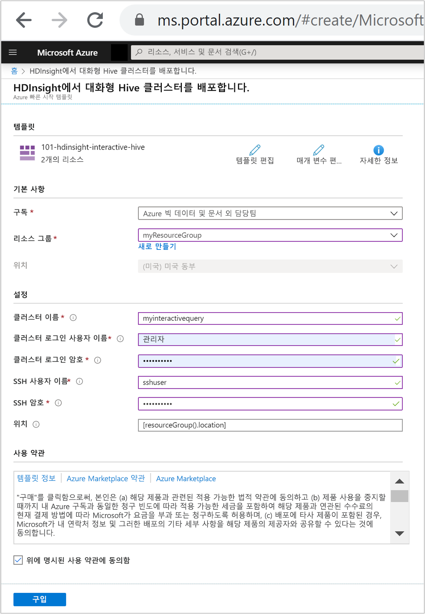
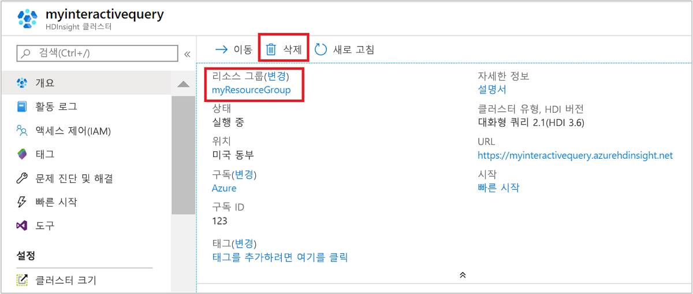

# 빠른 시작: Azure HDInsight에서 ARM 템플릿을 사용하여 Interactive Query 클러스터 만들기

이 빠른 시작에서는 ARM 템플릿(Azure Resource Manager 템플릿)을 사용하여 Azure HDInsight에서 [Interactive Query](./apache-interactive-query-get-started.md) 클러스터를 만듭니다. 대화형 쿼리(Apache Hive LLAP 또는 [짧은 대기 시간 분석 처리](https://cwiki.apache.org/confluence/display/Hive/LLAP)라고도 함)는 Azure HDInsight [클러스터 유형](../hdinsight-hadoop-provision-linux-clusters.md#cluster-type)입니다.

[!INCLUDE [About Azure Resource Manager](../../../includes/resource-manager-quickstart-introduction.md)]

환경이 필수 구성 요소를 충족하고 ARM 템플릿 사용에 익숙한 경우 **Azure에 배포** 단추를 선택합니다. 그러면 Azure Portal에서 템플릿이 열립니다.

## 필수 구성 요소

Azure 구독이 아직 없는 경우 시작하기 전에 [체험 계정](https://azure.microsoft.com/free/?WT.mc_id=A261C142F)을 만듭니다.

## 템플릿 검토

이 빠른 시작에서 사용되는 템플릿은 [Azure 빠른 시작 템플릿](https://azure.microsoft.com/resources/templates/101-hdinsight-interactive-hive/)에서 나온 것입니다.

:::code language="json" source="~/quickstart-templates/101-hdinsight-interactive-hive/azuredeploy.json":::

템플릿에는 두 개의 Azure 리소스가 정의되어 있습니다.

* [Microsoft.Storage/storageAccounts](/azure/templates/microsoft.storage/storageaccounts): Azure Storage 계정을 만듭니다.
* [Microsoft.HDInsight/cluster](/azure/templates/microsoft.hdinsight/clusters): HDInsight 클러스터를 만듭니다.

### 템플릿 배포

1. 아래 **Azure에 배포** 단추를 선택하여 Azure에 로그인하고 ARM 템플릿을 엽니다.

    

1. 다음 값을 입력하거나 선택합니다.

    |속성 |Description |
    |---|---|
    |Subscription|드롭다운 목록에서 클러스터에 사용할 Azure 구독을 선택합니다.|
    |Resource group|드롭다운 목록에서 기존 리소스 그룹을 선택하거나 **새로 만들기**를 선택합니다.|
    |위치|이 값은 리소스 그룹에 사용되는 위치로 자동 입력됩니다.|
    |클러스터 이름|전역적으로 고유한 이름을 입력합니다. 이 템플릿의 경우 소문자와 숫자만 사용합니다.|
    |클러스터 로그인 사용자 이름|사용자 이름을 입력합니다. 기본값은 **admin**입니다.|
    |클러스터 로그인 암호|암호를 입력합니다. 암호는 10자 이상이어야 하며, 숫자, 대문자, 소문자 및 영숫자가 아닌 문자(' " ` 문자 제외)를 각각 하나 이상 포함해야 합니다. |
    |SSH 사용자 이름|사용자 이름을 입력합니다. 기본값은 sshuser입니다.|
    |SSH 암호|암호를 입력합니다.|

    

1. **사용 약관**을 검토합니다. 그런 다음, **위에 명시된 사용 약관에 동의함**을 선택한 다음, **구매**를 선택합니다. 배포가 진행 중이라는 알림이 표시됩니다. 클러스터를 만들려면 20분 정도가 걸립니다.

## 배포된 리소스 검토

클러스터가 만들어지면 **리소스로 이동** 링크가 포함된 **배포 성공** 알림이 표시됩니다. 리소스 그룹 페이지에 새 HDInsight 클러스터와 해당 클러스터에 연결된 기본 스토리지가 나열됩니다. 각 클러스터에는 [Azure Storage](../hdinsight-hadoop-use-blob-storage.md) 계정 또는 [Azure Data Lake Storage 계정](../hdinsight-hadoop-use-data-lake-store.md) 종속성이 있습니다. 이 스토리지 계정을 기본 스토리지 계정이라고 합니다. HDInsight 클러스터와 해당 기본 스토리지 계정은 같은 Azure 지역에 있어야 합니다. 클러스터를 삭제하더라도 스토리지 계정은 삭제되지 않습니다.

## 리소스 정리

빠른 시작을 완료한 후 클러스터를 삭제하는 것이 좋습니다. HDInsight를 사용하면 데이터가 Azure Storage에 저장되기 때문에 클러스터를 사용하지 않을 때 안전하게 삭제할 수 있습니다. HDInsight 클러스터를 사용하지 않는 기간에도 요금이 청구됩니다. 클러스터에 대한 요금이 스토리지에 대한 요금보다 몇 배 더 많기 때문에, 클러스터를 사용하지 않을 때는 삭제하는 것이 경제적인 면에서 더 합리적입니다.

Azure Portal에서 클러스터로 이동하여 **삭제**를 선택합니다.

또한 리소스 그룹 이름을 선택하여 리소스 그룹 페이지를 연 다음, **리소스 그룹 삭제**를 선택할 수도 있습니다. 리소스 그룹을 삭제하여 HDInsight 클러스터와 기본 스토리지 계정을 삭제합니다.

## 다음 단계

이 빠른 시작에서는 HDInsight에서 ARM 템플릿을 사용하여 Interactive Query 클러스터를 만드는 방법을 알아보았습니다. 다음 문서에서는 Apache Zeppelin을 사용하여 Apache Hive 쿼리를 실행하는 방법을 알아봅니다.

> [!div class="nextstepaction"]
> [Apache Zeppelin을 사용하여 Azure HDInsight에서 Apache Hive 쿼리 실행](./hdinsight-connect-hive-zeppelin.md)
