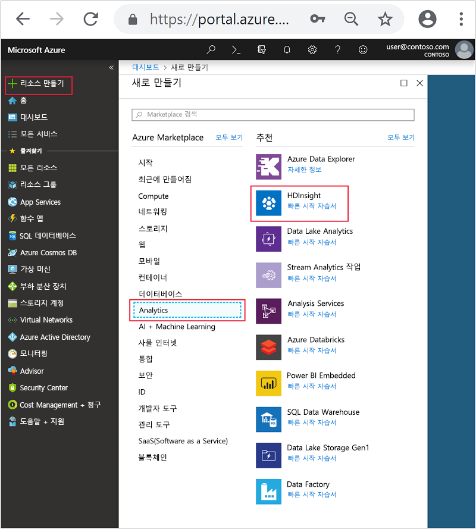
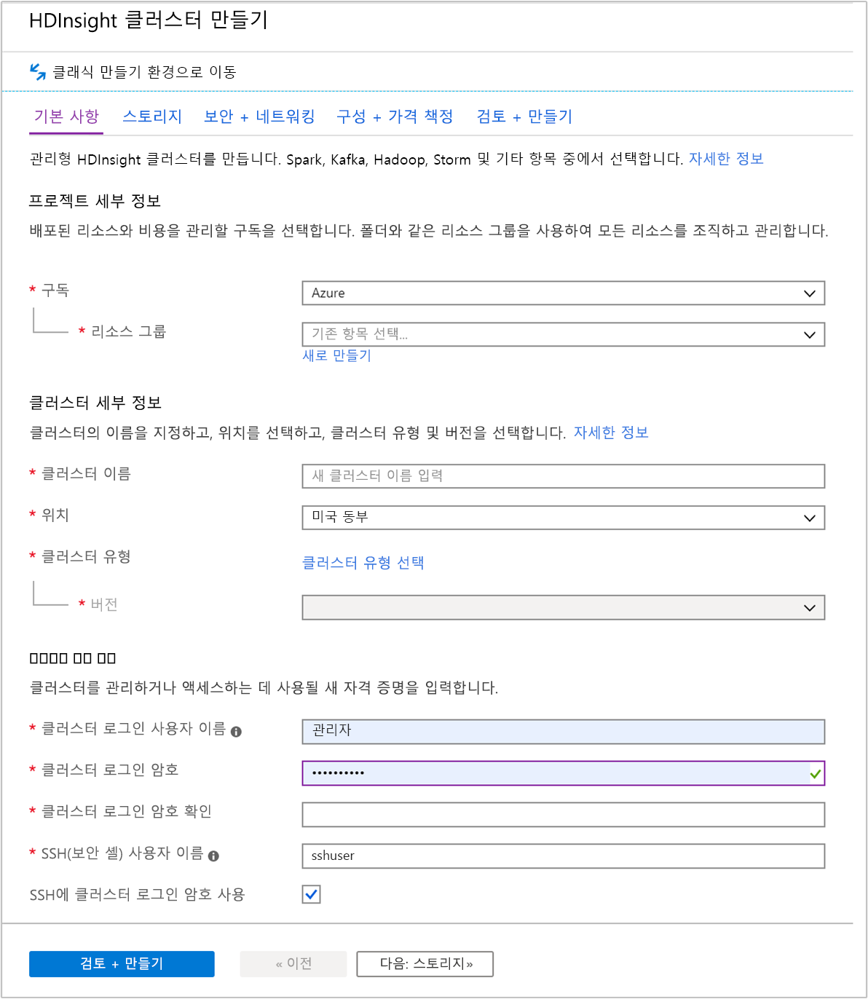
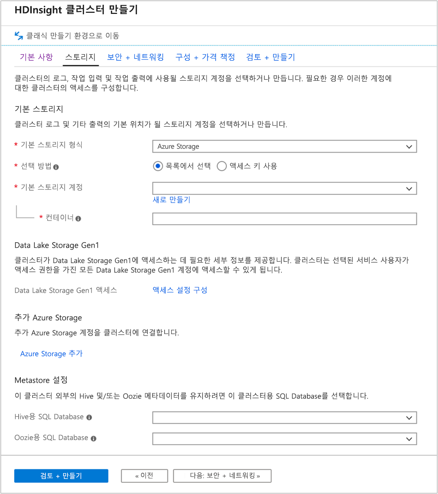
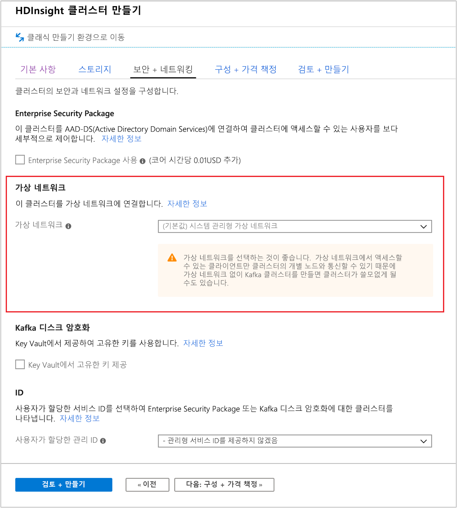
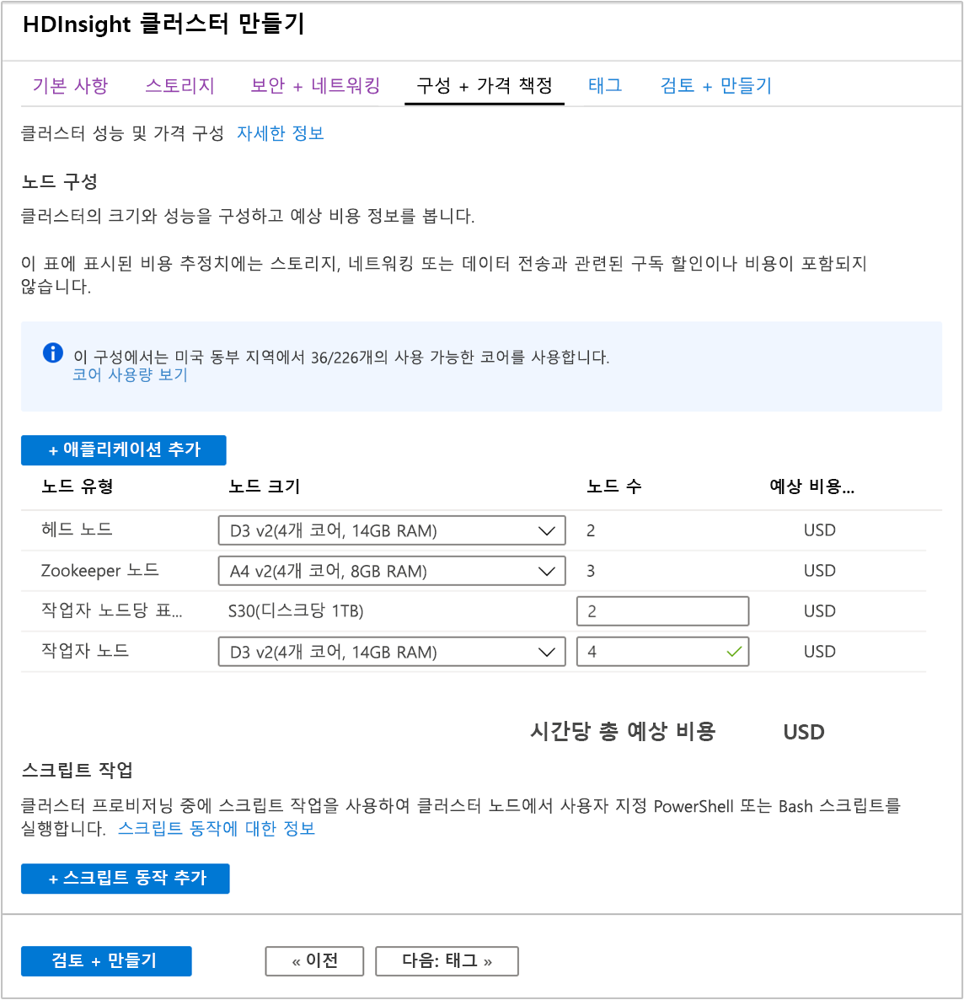
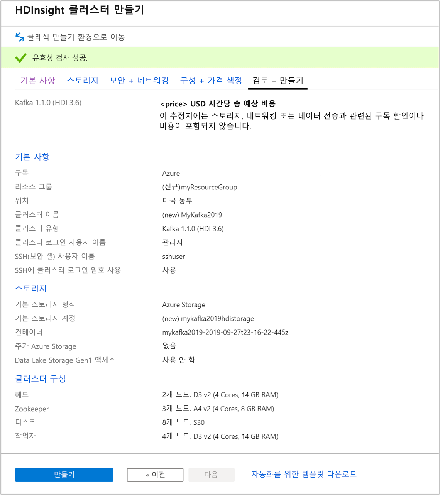

# <a name="quickstart-create-apache-kafka-cluster-in-azure-hdinsight-using-azure-portal"></a>빠른 시작: Azure Portal을 사용하여 Azure HDInsight에서 Apache Kafka 클러스터 만들기

Apache Kafka는 오픈 소스 분산형 스트리밍 플랫폼입니다. 게시-구독 메시지 큐와 유사한 기능을 제공하므로 메시지 브로커로 자주 사용됩니다.

이 빠른 시작에서는 Azure Portal을 사용하여 [Apache Kafka](https://kafka.apache.org) 클러스터를 만드는 방법에 대해 알아봅니다. 또한 Apache Kafka를 사용하여 메시지를 받거나 보내기 위해 제공되는 유틸리티를 사용하는 방법을 알아봅니다.

[!INCLUDE [delete-cluster-warning](../../../includes/hdinsight-delete-cluster-warning.md)]

Apache Kafka API는 동일한 가상 네트워크 내에서만 리소스에서 액세스할 수 있습니다. 이 빠른 시작에서는 직접 SSH를 사용하여 클러스터에 액세스합니다. 다른 서비스, 네트워크 또는 가상 머신을 Apache Kafka에 연결하려면 먼저 가상 네트워크를 만든 다음, 네트워크 내에 리소스를 만듭니다. 자세한 내용은 [가상 네트워크를 사용하여 Apache Kafka에 연결](apache-kafka-connect-vpn-gateway.md) 문서를 참조하세요.

Azure 구독이 아직 없는 경우 시작하기 전에 [체험 계정](https://azure.microsoft.com/free/?WT.mc_id=A261C142F)을 만듭니다.

## <a name="prerequisites"></a>필수 조건

SSH 클라이언트. 자세한 내용은 [SSH를 사용하여 HDInsight(Apache Hadoop)에 연결](../hdinsight-hadoop-linux-use-ssh-unix.md)을 참조하세요.

## <a name="create-an-apache-kafka-cluster"></a>Apache Kafka 클러스터 만들기

HDInsight 클러스터에 Apache Kafka를 만들려면 다음 단계를 수행합니다.

1. [Azure Portal](https://portal.azure.com)에 로그인합니다.

1. 왼쪽 메뉴에서 **+ 리소스 만들기** > **Analytics** > **HDInsight**로 이동합니다.

    

1. **기본 사항**에서 다음 값을 입력하거나 선택합니다.

    |자산  |설명  |
    |---------|---------|
    |Subscription    |  Azure 구독을 선택합니다. |
    |Resource group     | 리소스 그룹을 만들거나 기존 리소스 그룹을 선택합니다.  리소스 그룹은 Azure 구성 요소의 컨테이너입니다.  이 경우 리소스 그룹에는 HDInsight 클러스터 및 종속 Azure Storage 계정이 포함되어 있습니다. |
    |클러스터 이름   | Hadoop 클러스터에 사용할 이름을 입력합니다. HDInsight의 모든 클러스터는 동일한 DNS 네임스페이스를 공유하므로 이 이름은 고유해야 합니다. 이름은 문자, 숫자 및 하이픈을 포함하여 최대 59자로 구성할 수 있습니다. 이름의 첫 번째 및 마지막 문자에는 하이픈을 사용할 수 없습니다. |
    |위치    | 클러스터를 만들려는 Azure 위치를 선택합니다.  성능 향상을 위해 가까운 곳을 선택합니다. |
    |클러스터 유형| **클러스터 유형 선택**을 선택합니다. 그런 다음, 클러스터 유형으로 **Kafka**를 선택합니다.|
    |버전|클러스터 유형에 대한 기본 버전이 지정됩니다. 다른 버전을 지정하려면 드롭다운 목록에서 선택합니다.|
    |클러스터 로그인 사용자 이름 및 암호    | 기본 로그인 이름은 **admin**입니다. 암호는 10자 이상이어야 하며, 숫자, 대문자, 소문자 및 영숫자가 아닌 문자(' " ` 문자 제외\)를 각각 하나 이상 포함해야 합니다. "Pass@word1"과 같은 일반적인 암호를 **제공하지 않았는지** 확인합니다.|
    |SSH(보안 셸) 사용자 이름 | 기본 사용자 이름은 **sshuser**입니다.  SSH 사용자 이름에 다른 이름을 입력할 수 있습니다. |
    |SSH에 클러스터 로그인 암호 사용| 클러스터 로그인 사용자에 대해 입력한 것과 동일한 암호를 SSH 사용자에 사용하려면 이 확인란을 선택합니다.|

   

    각 Azure 지역(위치)은 _장애 도메인_을 제공합니다. 장애 도메인은 Azure 데이터 센터에 있는 기본 하드웨어의 논리적 그룹입니다. 장애 도메인마다 공통 전원과 네트워크 스위치를 공유합니다. HDInsight 클러스터 내의 노드를 구현하는 가상 머신과 관리 디스크는 이러한 장애 도메인에 분산되어 있습니다. 이 아키텍처에서는 실제 하드웨어 오류의 잠재적 영향을 제한합니다.

    데이터의 고가용성을 위해 __세 개의 장애 도메인__ 을 포함하는 지역(위치)을 선택합니다. 영역에서 장애 도메인의 수에 대한 자세한 내용은 [Linux 가상 머신의 가용성](../../virtual-machines/windows/manage-availability.md#use-managed-disks-for-vms-in-an-availability-set) 문서를 참조하세요.

    페이지 맨 아래에서 **다음: Storage >>** 탭을 선택하여 스토리지 설정으로 이동합니다.

1. **스토리지** 탭에서 다음 값을 입력합니다.

    |자산  |설명  |
    |---------|---------|
    |기본 스토리지 유형|기본값 **Azure Storage**를 사용합니다.|
    |선택 방법|기본값 **목록에서 선택**을 사용합니다.|
    |기본 스토리지 계정|드롭다운 목록을 사용하여 기존 스토리지 계정을 선택하거나 **새로 만들기**를 선택합니다. 새 계정을 만드는 경우 이름의 길이가 3~24자여야 하고, 숫자 및 소문자만 포함할 수 있습니다.|
    |컨테이너|자동으로 채워진 값을 사용합니다.|

    

    **보안 + 네트워킹** 탭을 선택합니다.

1. 이 빠른 시작에서는 기본 보안 설정을 유지합니다. Enterprise Security 패키지에 대해 자세히 알아보려면 [Azure Active Directory Domain Services를 사용하여 Enterprise Security Package로 HDInsight 클러스터 구성](../domain-joined/apache-domain-joined-configure-using-azure-adds.md)을 참조하세요. Apache Kafka 디스크 암호화에 고유한 키를 사용하는 방법을 알아보려면 [Azure HDInsight에서 Apache Kafka에 대한 고유한 키 가져오기](apache-kafka-byok.md)를 참조하세요.

   클러스터를 가상 네트워크에 연결하려는 경우에는 **가상 네트워크** 드롭다운에서 가상 네트워크를 선택합니다.

   

    **구성 + 가격 책정** 탭을 선택합니다.

1. HDInsight에서 Apache Kafka의 가용성을 보장하려면 **작업자 노드**에 대한 __노드 수__ 항목을 3 이상으로 설정해야 합니다. 기본값은 4입니다.

    **작업자 노드당 표준 디스크** 항목은 HDInsight에서 Apache Kafka의 확장성을 구성합니다. HDInsight의 Apache Kafka는 클러스터에서 가상 머신의 로컬 디스크를 사용하여 데이터를 저장합니다. Apache Kafka는 입출력이 많으므로 높은 처리량과 노드당 더 많은 스토리지를 제공하기 위해 [Azure Managed Disks](../../virtual-machines/windows/managed-disks-overview.md)를 사용합니다. 관리 디스크 유형은 __표준__ (HDD) 또는 __프리미엄__ (SSD)일 수 있습니다. 디스크 유형은 작업자 노드(Apache Kafka broker)에서 사용하는 VM 크기에 따라 달라집니다. 프리미엄 디스크는 DS 및 GS 시리즈 VM에 자동으로 사용됩니다. 다른 모든 VM 유형은 표준을 사용합니다.

   

    **검토 + 만들기** 탭을 선택합니다.

1. 클러스터에 대한 구성을 검토합니다. 잘못된 설정을 변경합니다. 마지막으로, **만들기**를 선택하여 클러스터를 만듭니다.

    

    클러스터를 만드는 데 최대 20분이 걸릴 수 있습니다.

## <a name="connect-to-the-cluster"></a>클러스터에 연결

1. Apache Kafka 클러스터의 기본 헤드 노드에 연결하려면 다음 명령을 사용합니다. `sshuser`를 SSH 사용자 이름으로 바꿉니다. `mykafka`를 Apache Kafka 클러스터의 이름으로 바꿉니다.

    ```bash
    ssh sshuser@mykafka-ssh.azurehdinsight.net
    ```

2. 클러스터에 처음 연결할 때 호스트의 신뢰성을 설정할 수 없다는 경고가 SSH 클라이언트에 표시될 수도 있습니다. 메시지가 표시되면 __예__ 를 입력한 다음, __Enter__ 키를 눌러 SSH 클라이언트의 신뢰할 수 있는 서버 목록에 호스트를 추가합니다.

3. 확인 메시지가 표시되면 SSH 사용자의 암호를 입력합니다.

    연결되면 다음 텍스트와 유사한 정보가 표시됩니다.

    ```output
    Authorized uses only. All activity may be monitored and reported.
    Welcome to Ubuntu 16.04.4 LTS (GNU/Linux 4.13.0-1011-azure x86_64)

     * Documentation:  https://help.ubuntu.com
     * Management:     https://landscape.canonical.com
     * Support:        https://ubuntu.com/advantage

      Get cloud support with Ubuntu Advantage Cloud Guest:
        https://www.ubuntu.com/business/services/cloud

    83 packages can be updated.
    37 updates are security updates.


    Welcome to Apache Kafka on HDInsight.

    Last login: Thu Mar 29 13:25:27 2018 from 108.252.109.241
    ```

## <a id="getkafkainfo"></a>Apache Zookeeper 및 Broker 호스트 정보 가져오기

Kafka를 사용할 때는 *Apache Zookeeper* 및 *Broker* 호스트를 알고 있어야 합니다. 이러한 호스트는 Apache Kafka API 및 Kafka와 함께 제공되는 다양한 유틸리티에서 사용됩니다.

이 섹션에서는 클러스터에서 Apache Ambari REST API에서 호스트 정보를 가져옵니다.

1. 간단한 명령줄 JSON 프로세서인 [jq](https://stedolan.github.io/jq/)를 설치합니다. 이 유틸리티는 JSON 문서를 구문 분석하는 데 사용되며, 호스트 정보를 구문 분석할 때 유용합니다. 열린 SSH 연결에서 다음 명령을 실행하여 `jq`를 설치합니다.

    ```bash
    sudo apt -y install jq
    ```

1. 암호 변수를 설정합니다. `PASSWORD`를 클러스터 로그인 암호로 바꾼 다음, 다음 명령을 입력합니다.

    ```bash
    export password='PASSWORD'
    ```

1. 대/소문자가 올바르게 지정된 클러스터 이름을 추출합니다. 클러스터 생성 방법에 따라 클러스터 이름의 실제 대/소문자가 예상과 다를 수 있습니다. 이 명령은 실제 대/소문자를 가져온 다음, 변수에 저장합니다. 다음 명령을 입력합니다.

    ```bash
    export clusterName=$(curl -u admin:$password -sS -G "http://headnodehost:8080/api/v1/clusters" | jq -r '.items[].Clusters.cluster_name')
    ```
    > [!Note]  
    > 클러스터 외부에서 이 프로세스를 수행하는 경우 클러스터 이름을 저장하는 다른 절차가 있습니다. Azure Portal에서 소문자로 클러스터 이름을 가져옵니다. 그런 다음, 다음 명령에서 `<clustername>`에 대한 클러스터 이름을 대체하고 `export clusterName='<clustername>'`을 실행합니다.


1. Zookeeper 호스트 정보를 사용하여 환경 변수를 설정하려면 아래 명령을 사용합니다. 이 명령은 모든 Zookeeper 호스트를 검색한 다음, 처음 두 개의 항목만 반환합니다. 하나의 호스트에 연결할 수 없는 경우 일부 중복이 필요하기 때문입니다.

    ```bash
    export KAFKAZKHOSTS=$(curl -sS -u admin:$password -G https://$clusterName.azurehdinsight.net/api/v1/clusters/$clusterName/services/ZOOKEEPER/components/ZOOKEEPER_SERVER | jq -r '["\(.host_components[].HostRoles.host_name):2181"] | join(",")' | cut -d',' -f1,2);
    ```

    > [!Note]  
    > 이 명령에는 Ambari 액세스 권한이 필요합니다. 클러스터가 NSG 뒤에 있는 경우 Ambari에 액세스할 수 있는 머신에서 이 명령을 실행합니다. 

1. 환경 변수가 올바르게 설정되었는지 확인하려면 다음 명령을 사용합니다.

    ```bash
    echo $KAFKAZKHOSTS
    ```

    이 명령은 다음 텍스트와 유사한 정보를 반환합니다.

    `zk0-kafka.eahjefxxp1netdbyklgqj5y1ud.ex.internal.cloudapp.net:2181,zk2-kafka.eahjefxxp1netdbyklgqj5y1ud.ex.internal.cloudapp.net:2181`

1. Apache Kafka broker 호스트 정보를 사용하여 환경 변수를 설정하려면 다음 명령을 사용합니다.

    ```bash
    export KAFKABROKERS=$(curl -sS -u admin:$password -G https://$clusterName.azurehdinsight.net/api/v1/clusters/$clusterName/services/KAFKA/components/KAFKA_BROKER | jq -r '["\(.host_components[].HostRoles.host_name):9092"] | join(",")' | cut -d',' -f1,2);
    ```

    > [!Note]  
    > 이 명령에는 Ambari 액세스 권한이 필요합니다. 클러스터가 NSG 뒤에 있는 경우 Ambari에 액세스할 수 있는 머신에서 이 명령을 실행합니다. 

1. 환경 변수가 올바르게 설정되었는지 확인하려면 다음 명령을 사용합니다.

    ```bash
    echo $KAFKABROKERS
    ```

    이 명령은 다음 텍스트와 유사한 정보를 반환합니다.

    `wn1-kafka.eahjefxxp1netdbyklgqj5y1ud.cx.internal.cloudapp.net:9092,wn0-kafka.eahjefxxp1netdbyklgqj5y1ud.cx.internal.cloudapp.net:9092`

## <a name="manage-apache-kafka-topics"></a>Apache Kafka 토픽 관리

Kafka는 *토픽*에 데이터 스트림을 저장합니다. 토픽을 관리하는 데 `kafka-topics.sh` 유틸리티를 사용할 수 있습니다.

* **토픽을 만들려면** SSH 연결에서 다음 명령을 사용합니다.

    ```bash
    /usr/hdp/current/kafka-broker/bin/kafka-topics.sh --create --replication-factor 3 --partitions 8 --topic test --zookeeper $KAFKAZKHOSTS
    ```

    이 명령은 `$KAFKAZKHOSTS`에 저장된 호스트 정보를 사용하여 Zookeeper에 연결합니다. 그런 후 **test**라는 Apache Kafka 토픽을 만듭니다.

    * 이 토픽에 저장된 데이터는 8개의 파티션에 분할됩니다.

    * 각 파티션은 클러스터에서 세 개의 작업자 노드에 복제됩니다.

        세 개의 장애 도메인을 제공하는 Azure 지역에서 클러스터를 만든 경우 3의 복제 인수를 사용합니다. 그렇지 않으면 4의 복제 요소를 사용합니다.
        
        세 개의 장애 도메인 지역에서는 3의 복제 인수를 사용하면 복제본을 오류 도메인에 분산할 수 있습니다. 두 개의 장애 도메인 지역에서는 4의 복제 인수로 복제본을 도메인에 동일하게 분산할 수 있습니다.
        
        영역에서 장애 도메인의 수에 대한 자세한 내용은 [Linux 가상 머신의 가용성](../../virtual-machines/windows/manage-availability.md#use-managed-disks-for-vms-in-an-availability-set) 문서를 참조하세요.

        Apache Kafka는 Azure 장애 도메인을 인식하지 않습니다. 항목에 대한 파티션 복제본을 만들 때 고가용성에 대해 복제본을 제대로 배포하지 않을 수 있습니다.

        고가용성을 보장하려면 [Apache Kafka 파티션 재조정 도구](https://github.com/hdinsight/hdinsight-kafka-tools)를 사용합니다. 이 도구는 Apache Kafka 클러스터의 헤드 노드에 대한 SSH 연결에서 실행되어야 합니다.

        가장 높은 Apache Kafka 데이터 가용성을 보장하려면 다음과 같은 경우에 토픽에 대한 파티션 복제본의 부하를 다시 조정해야 합니다.

        * 새 토픽 또는 파티션을 만들 때

        * 클러스터를 강화할 때

* **토픽을 나열하려면** 다음 명령을 사용합니다.

    ```bash
    /usr/hdp/current/kafka-broker/bin/kafka-topics.sh --list --zookeeper $KAFKAZKHOSTS
    ```

    이 명령은 Apache Kafka 클러스터에서 사용할 수 있는 토픽을 나열합니다.

* **토픽을 삭제하려면** 다음 명령을 사용합니다.

    ```bash
    /usr/hdp/current/kafka-broker/bin/kafka-topics.sh --delete --topic topicname --zookeeper $KAFKAZKHOSTS
    ```

    이 명령은 `topicname`이라고 명명된 토픽을 삭제합니다.

    > [!WARNING]  
    > 이전에 만든 `test` 토픽을 삭제하는 경우에는 다시 만들어야 합니다. 이는 이 문서의 뒷부분에서 사용됩니다.

`kafka-topics.sh` 유틸리티에서 사용할 수 있는 명령에 대한 자세한 정보는 다음 명령을 사용합니다.

```bash
/usr/hdp/current/kafka-broker/bin/kafka-topics.sh
```

## <a name="produce-and-consume-records"></a>레코드 생성 및 소비

Kafka는 토픽에 *레코드*를 저장합니다. *생산자*에서 레코드를 생성하고, *소비자*에서 이 레코드를 소비합니다. 생산자와 소비자는 *Kafka broker* 서비스와 통신합니다. HDInsight 클러스터의 각 작업자 노드는 Apache Kafka broker 호스트입니다.

앞에서 만든 test 토픽에 레코드를 저장한 다음, 소비자를 통해 레코드를 읽으려면 다음 단계를 사용합니다.

1. 토픽에 레코드를 작성하려면 SSH 연결에서 `kafka-console-producer.sh` 유틸리티를 사용합니다.

    ```bash
    /usr/hdp/current/kafka-broker/bin/kafka-console-producer.sh --broker-list $KAFKABROKERS --topic test
    ```

    이 명령 후 빈 줄에 도달합니다.

2. 빈 줄에 문자 메시지를 입력하고 Enter 키를 누릅니다. 이와 같은 방식으로 메시지 몇 개를 입력한 후 **Ctrl + C** 키를 사용하여 일반 프롬프트로 돌아갑니다. 각 줄은 별도의 레코드로 Apache Kafka 토픽에 전송됩니다.

3. 토픽에서 레코드를 읽으려면 SSH 연결에서 `kafka-console-consumer.sh` 유틸리티를 사용합니다.

    ```bash
    /usr/hdp/current/kafka-broker/bin/kafka-console-consumer.sh --bootstrap-server $KAFKABROKERS --topic test --from-beginning
    ```

    이 명령은 토픽에서 레코드를 검색하여 표시합니다. `--from-beginning`을 사용하면 스트림 시작 부분부터 시작하도록 소비자에 지시하여 모든 레코드를 검색합니다.

    이전 버전의 Kafka를 사용하는 경우 `--bootstrap-server $KAFKABROKERS`를 `--zookeeper $KAFKAZKHOSTS`로 바꿉니다.

4. __Ctrl+C__ 를 사용하여 소비자를 중지합니다.

또한 프로그래밍 방식으로 생산자와 소비자를 만들 수 있습니다. 이 API를 사용하는 예제는 [HDInsight의 Apache Kafka 생산자 및 소비자 API](apache-kafka-producer-consumer-api.md) 문서를 참조하세요.

## <a name="clean-up-resources"></a>리소스 정리

이 빠른 시작에서 만든 리소스를 정리하려면 리소스 그룹을 삭제하면 됩니다. 리소스 그룹을 삭제하면 연결된 HDInsight 클러스터 및 리소스 그룹에 연결된 다른 모든 리소스가 함께 삭제됩니다.

Azure Portal을 사용하여 리소스 그룹을 제거하려면:

1. Azure Portal에서 왼쪽의 메뉴를 확장하여 서비스 메뉴를 연 다음 __리소스 그룹__ 을 선택하여 리소스 그룹 목록을 표시합니다.
2. 삭제할 리소스 그룹을 찾은 다음 목록 오른쪽에 있는 __자세히__ 단추(...)를 마우스 오른쪽 단추로 클릭합니다.
3. __리소스 그룹 삭제__ 를 선택한 다음 확인합니다.

> [!WARNING]  
> 클러스터가 만들어지면 HDInsight 클러스터 청구가 시작되고 클러스터가 삭제되면 중지됩니다. 분 단위로 청구되므로 더 이상 사용하지 않으면 항상 클러스터를 삭제해야 합니다.
>
> HDInsight 클러스터의 Apache Kafka를 삭제하면 Kafka에 저장된 데이터가 모두 삭제됩니다.

## <a name="next-steps"></a>다음 단계

> [!div class="nextstepaction"]
> [Apache Kafka에서 Apache Spark 사용](../hdinsight-apache-kafka-spark-structured-streaming.md)
