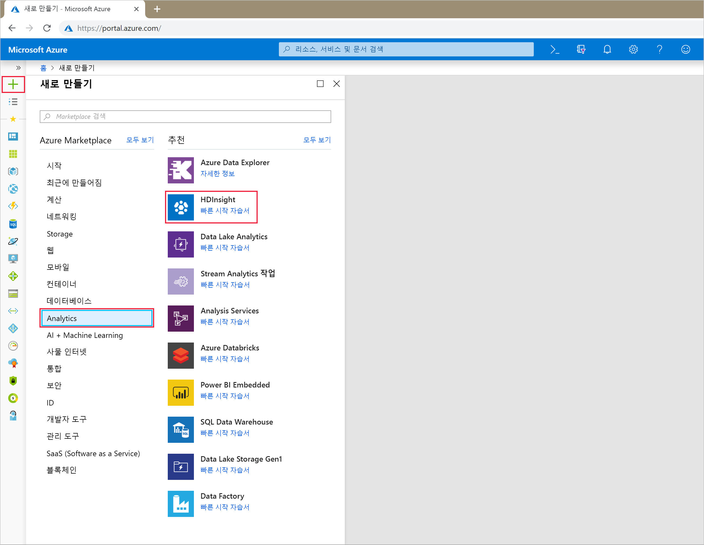
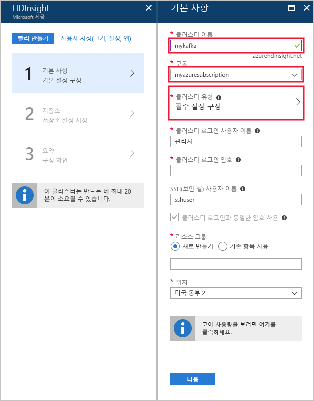
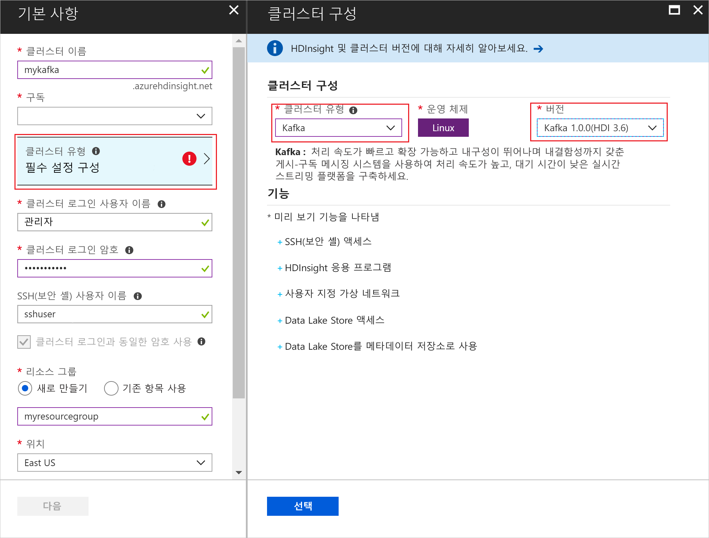
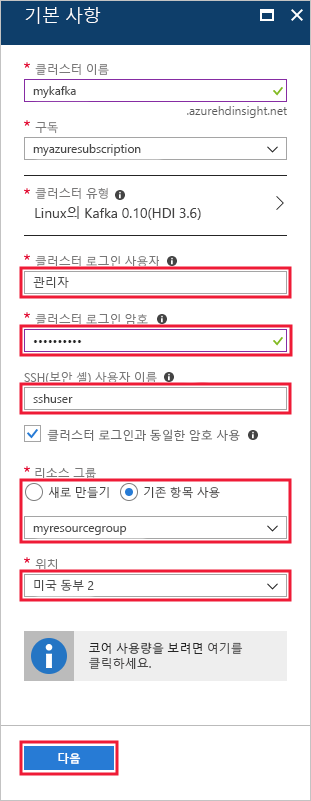
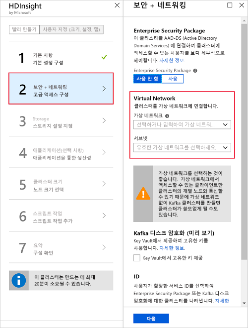
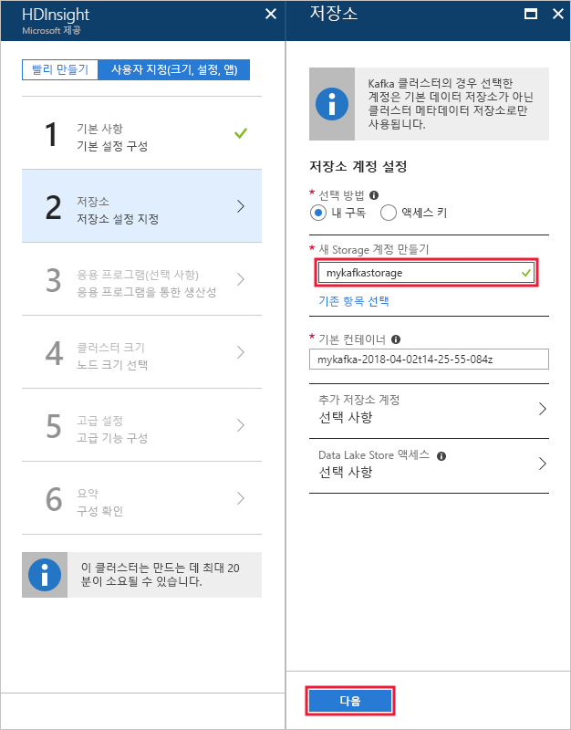
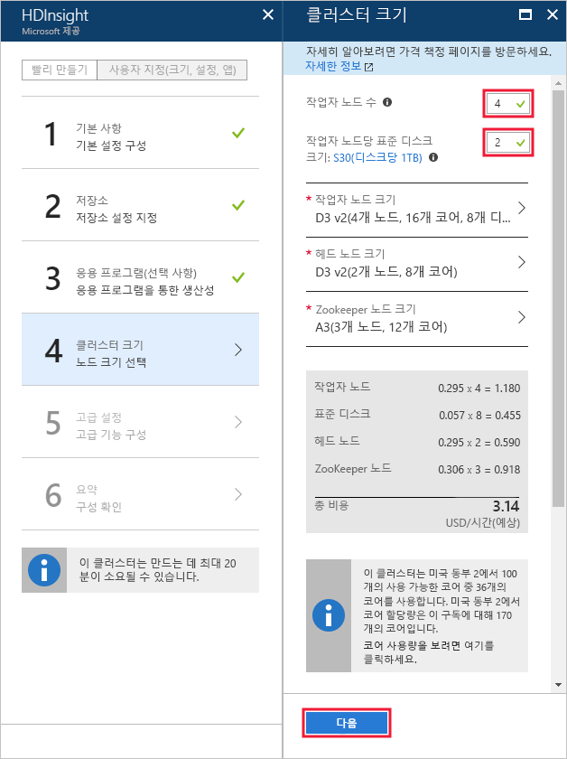
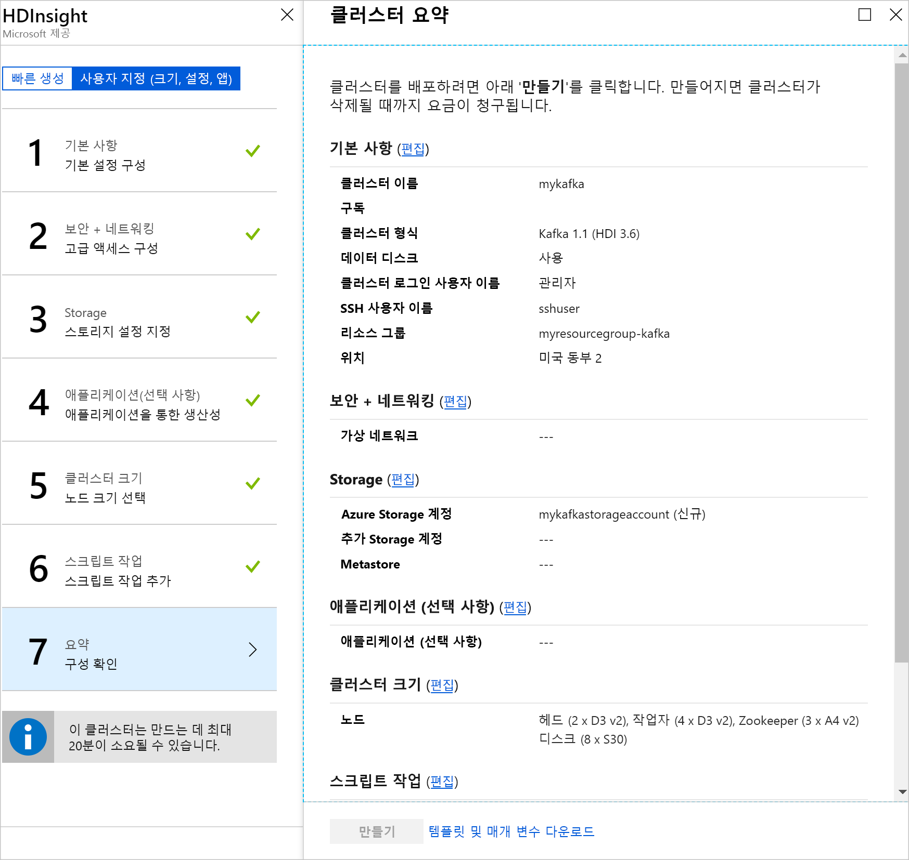

# <a name="quickstart-create-an-apache-kafka-on-hdinsight-cluster"></a>빠른 시작: HDInsight 클러스터에서 Apache Kafka 만들기

Apache Kafka는 오픈 소스 분산형 스트리밍 플랫폼입니다. 게시-구독 메시지 큐와 유사한 기능을 제공하므로 메시지 브로커로 자주 사용됩니다. 

이 빠른 시작에서는 Azure Portal을 사용하여 [Apache Kafka](https://kafka.apache.org) 클러스터를 만드는 방법에 대해 알아봅니다. 또한 Apache Kafka를 사용하여 메시지를 받거나 보내기 위해 제공되는 유틸리티를 사용하는 방법을 알아봅니다.

[!INCLUDE [delete-cluster-warning](../../../includes/hdinsight-delete-cluster-warning.md)]

> [!IMPORTANT]
> Apache Kafka API는 동일한 가상 네트워크 내에서만 리소스에서 액세스할 수 있습니다. 이 빠른 시작에서는 직접 SSH를 사용하여 클러스터에 액세스합니다. 다른 서비스, 네트워크 또는 가상 머신을 Apache Kafka에 연결하려면 먼저 가상 네트워크를 만든 다음, 네트워크 내에 리소스를 만듭니다.
>
> 자세한 내용은 [가상 네트워크를 사용하여 Apache Kafka에 연결](apache-kafka-connect-vpn-gateway.md) 문서를 참조하세요.

## <a name="prerequisites"></a>필수 조건

* Azure 구독. Azure 구독이 아직 없는 경우 시작하기 전에 [무료 계정](https://azure.microsoft.com/free/?WT.mc_id=A261C142F) 을 만듭니다.

* SSH 클라이언트. 이 문서의 단계는 SSH를 사용하여 클러스터에 연결합니다.

    `ssh` 명령은 Linux, Unix 및 macOS 시스템에서 기본적으로 제공됩니다. Windows 10에서 다음 방법 중 하나를 사용하여 `ssh` 명령을 설치합니다.

    * [Azure Cloud Shell](https://docs.microsoft.com/azure/cloud-shell/quickstart)을 사용합니다. Cloud Shell은 `ssh` 명령을 제공하며, 셸 환경으로 Bash 또는 PowerShell을 사용하도록 구성할 수 있습니다.

    * [Linux용 Windows 하위 시스템을 설치](https://docs.microsoft.com/windows/wsl/install-win10)합니다. Microsoft Store를 통해 사용할 수 있는 Linux 배포판은 `ssh` 명령을 제공합니다.

    > [!IMPORTANT]
    > 이 문서의 단계는 사용자가 위에서 언급한 SSH 클라이언트 중 하나를 사용한다고 가정합니다. 다른 SSH 클라이언트를 사용하는 중에 문제가 발생하는 경우에는 SSH 클라이언트에 대한 설명서를 참조하세요.
    >
    > 자세한 내용은 [HDInsight와 함께 SSH 사용](../hdinsight-hadoop-linux-use-ssh-unix.md) 문서를 참조하세요.

## <a name="create-an-apache-kafka-cluster"></a>Apache Kafka 클러스터 만들기

HDInsight 클러스터에 Apache Kafka를 만들려면 다음 단계를 수행합니다.

1. [Azure Portal](https://portal.azure.com)에서 **+ 리소스 만들기**, **데이터 + 분석**, **HDInsight**를 차례로 선택합니다.
   
    

2. **기본**에서 다음 정보를 입력하거나 선택합니다.

    | 설정 | 값 |
    | --- | --- |
    | 클러스터 이름 | HDInsight 클러스터에 사용할 고유한 이름입니다. |
    | 구독 | 구독을 선택합니다. |
    
   __클러스터 유형__을 선택하여 **클러스터 구성**을 표시합니다.
   
   

3. __클러스터 구성__에서 다음 값을 선택합니다.

    | 설정 | 값 |
    | --- | --- |
    | 클러스터 유형 | Kafka |
    | 버전 | Kafka 1.1.0(HDI 3.6) |

    **선택** 단추를 사용하여 클러스터 유형 설정을 저장하고 __기본__으로 돌아갑니다.

    

4. __기본__에서 다음 정보를 입력하거나 선택합니다.

    | 설정 | 값 |
    | --- | --- |
    | 클러스터 로그인 사용자 이름 | 클러스터에서 호스트되는 웹 서비스 또는 REST API에 액세스할 때의 로그인 이름입니다. 기본값(admin)을 유지합니다. |
    | 클러스터 로그인 암호 | 클러스터에서 호스트되는 웹 서비스 또는 REST API에 액세스할 때의 로그인 암호입니다. |
    | SSH(보안 셸) 사용자 이름 | SSH를 통해 클러스터에 액세스할 때 사용되는 로그인입니다. 기본적으로 암호는 클러스터 로그인 암호와 동일합니다. |
    | 리소스 그룹 | 클러스터를 만들어 놓은 리소스 그룹입니다. |
    | 위치 | 클러스터를 만들어 놓은 Azure 지역입니다. |

    > [!TIP]
    > 각 Azure 지역(위치)은 _장애 도메인_을 제공합니다. 장애 도메인은 Azure 데이터 센터에 있는 기본 하드웨어의 논리적 그룹입니다. 장애 도메인마다 공통 전원과 네트워크 스위치를 공유합니다. HDInsight 클러스터 내의 노드를 구현하는 가상 머신과 관리 디스크는 이러한 장애 도메인에 분산되어 있습니다. 이 아키텍처에서는 실제 하드웨어 오류의 잠재적 영향을 제한합니다.
    >
    > 데이터의 고가용성을 위해 __세 개의 장애 도메인__을 포함하는 지역(위치)을 선택합니다. 영역에서 장애 도메인의 수에 대한 자세한 내용은 [Linux 가상 머신의 가용성](../../virtual-machines/windows/manage-availability.md#use-managed-disks-for-vms-in-an-availability-set) 문서를 참조하세요.

   

    __다음__ 단추를 사용하여 기본 구성을 완료합니다.

5. 이 빠른 시작에서는 기본 보안 설정을 유지합니다. Enterprise Security 패키지에 대해 자세히 알아보려면 [Azure Active Directory Domain Services를 사용하여 Enterprise Security Package로 HDInsight 클러스터 구성](../domain-joined/apache-domain-joined-configure-using-azure-adds.md)을 참조하세요. Apache Kafka 디스크 암호화에 고유한 키를 사용하는 방법을 알아보려면 [Azure HDInsight에서 Apache Kafka에 대한 고유한 키 가져오기](apache-kafka-byok.md)를 참조하세요.

   클러스터를 가상 네트워크에 연결하려는 경우에는 **가상 네트워크** 드롭다운에서 가상 네트워크를 선택합니다.

   

6. **Storage**에서 Storage 계정을 선택하거나 만듭니다. 이 문서의 단계에서는 다른 필드를 기본값으로 둡니다. __다음__ 단추를 사용하여 저장소 구성을 저장합니다. Data Lake Storage Gen2를 사용하는 방법에 대한 자세한 내용은 [빠른 시작: HDInsight에서 클러스터 설정](../../storage/data-lake-storage/quickstart-create-connect-hdi-cluster.md)을 참조하세요.

   

7. __응용 프로그램(선택 사항)__ 에서 __다음__을 선택하여 기본 설정을 사용해서 계속 진행합니다.

8. __클러스터 크기__에서 __다음__을 선택하여 기본 설정을 사용해서 계속 진행합니다.

    > [!IMPORTANT]
    > HDInsight에서 Apache Kafka의 가용성을 보장하려면 __작업자 노드 수__ 항목을 3 이상으로 설정해야 합니다. 기본값은 4입니다.
    
    > [!TIP]
    > **작업자 노드 항목당 디스크**에 따라 HDInsight에서 Apache Kafka의 확장성이 구성됩니다. HDInsight의 Apache Kafka는 클러스터에서 가상 머신의 로컬 디스크를 사용하여 데이터를 저장합니다. Apache Kafka는 입출력이 많으므로 높은 처리량과 노드당 더 많은 저장소를 제공하기 위해 [Azure Managed Disks](../../virtual-machines/windows/managed-disks-overview.md)를 사용합니다. 관리 디스크 유형은 __표준__(HDD) 또는 __프리미엄__(SSD)일 수 있습니다. 디스크 유형은 작업자 노드(Apache Kafka broker)에서 사용하는 VM 크기에 따라 달라집니다. 프리미엄 디스크는 DS 및 GS 시리즈 VM에 자동으로 사용됩니다. 다른 모든 VM 유형은 표준을 사용합니다.

   

9. __고급 설정__에서 __다음__을 선택하여 기본 설정을 사용해서 계속 진행합니다.

10. **요약**에서 클러스터에 대한 구성을 검토합니다. __편집__ 링크를 사용하여 올바르지 않은 설정을 변경합니다. 마지막으로 __만들기__ 단추를 사용하여 클러스터를 만듭니다.
   
    
   
    > [!NOTE]
    > 클러스터를 만드는 데 최대 20분이 걸릴 수 있습니다.

## <a name="connect-to-the-cluster"></a>클러스터에 연결

1. Apache Kafka 클러스터의 기본 헤드 노드에 연결하려면 다음 명령을 사용합니다. `sshuser`를 SSH 사용자 이름으로 바꿉니다. `mykafka`를 Apache Kafka 클러스터의 이름으로 바꿉니다.

    ```bash
    ssh sshuser@mykafka-ssh.azurehdinsight.net
    ```

2. 클러스터에 처음 연결할 때 호스트의 신뢰성을 설정할 수 없다는 경고가 SSH 클라이언트에 표시될 수도 있습니다. 메시지가 표시되면 __예__를 입력한 다음, __Enter__ 키를 눌러 SSH 클라이언트의 신뢰할 수 있는 서버 목록에 호스트를 추가합니다.

3. 확인 메시지가 표시되면 SSH 사용자의 암호를 입력합니다.

연결되면 다음 텍스트와 유사한 정보가 표시됩니다.

```text
Authorized uses only. All activity may be monitored and reported.
Welcome to Ubuntu 16.04.4 LTS (GNU/Linux 4.13.0-1011-azure x86_64)

 * Documentation:  https://help.ubuntu.com
 * Management:     https://landscape.canonical.com
 * Support:        https://ubuntu.com/advantage

  Get cloud support with Ubuntu Advantage Cloud Guest:
    http://www.ubuntu.com/business/services/cloud

83 packages can be updated.
37 updates are security updates.


Welcome to Apache Kafka on HDInsight.

Last login: Thu Mar 29 13:25:27 2018 from 108.252.109.241
ssuhuser@hn0-mykafk:~$
```

## <a id="getkafkainfo"></a>Zookeeper 및 Broker 호스트 정보 가져오기

Kafka를 사용할 때는 *Zookeeper* 및 *Broker* 호스트를 알고 있어야 합니다. 이러한 호스트는 Apache Kafka API 및 Kafka와 함께 제공되는 다양한 유틸리티에서 사용됩니다.

이 섹션에서는 클러스터에서 Ambari REST API에서 호스트 정보를 가져옵니다.

1. 클러스터에 대한 SSH 연결에서 다음 명령을 사용하여 `jq` 유틸리티를 설치합니다. 이 유틸리티는 JSON 문서를 구문 분석하는 데 사용되며 호스트 정보 검색에 유용합니다.
   
    ```bash
    sudo apt -y install jq
    ```

2. 환경 변수를 클러스터 이름으로 설정하려면 다음 명령을 사용합니다.

    ```bash
    read -p "Enter the Kafka on HDInsight cluster name: " CLUSTERNAME
    ```

    메시지가 표시되면 Apache Kafka 클러스터 이름을 입력합니다.

3. Zookeeper 호스트 정보를 사용하여 환경 변수를 설정하려면 다음 명령을 사용합니다.
    
    ```bash
    export KAFKAZKHOSTS=`curl -sS -u admin -G http://headnodehost:8080/api/v1/clusters/$CLUSTERNAME/services/ZOOKEEPER/components/ZOOKEEPER_SERVER | jq -r '["\(.host_components[].HostRoles.host_name):2181"] | join(",")' | cut -d',' -f1,2`
    ```

    > [!TIP]
    > 이 명령은 클러스터 헤드 노드에서 Ambari 서비스를 직접 쿼리합니다. `https://$CLUSTERNAME.azurehdinsight.net:80/`의 공용 주소를 사용하여 ambari에 액세스할 수도 있습니다. 일부 네트워크 구성은 공용 주소에 대한 액세스를 방지할 수 있습니다. 예를 들어 NSG(네트워크 보안 그룹)를 사용하여 가상 네트워크에서 HDInsight에 대한 액세스를 제한합니다.

    메시지가 표시되면 클러스터 로그인 계정(SSH 계정 아님)에 대한 암호를 입력합니다.

    > [!NOTE]
    > 이 명령은 모든 Zookeeper 호스트를 검색한 다음, 처음 두 개의 항목만 반환합니다. 하나의 호스트에 연결할 수 없는 경우 일부 중복이 필요하기 때문입니다.

4. 환경 변수가 올바르게 설정되었는지 확인하려면 다음 명령을 사용합니다.

    ```bash
     echo '$KAFKAZKHOSTS='$KAFKAZKHOSTS
    ```

    이 명령은 다음 텍스트와 유사한 정보를 반환합니다.

    `zk0-kafka.eahjefxxp1netdbyklgqj5y1ud.ex.internal.cloudapp.net:2181,zk2-kafka.eahjefxxp1netdbyklgqj5y1ud.ex.internal.cloudapp.net:2181`

5. Apache Kafka broker 호스트 정보를 사용하여 환경 변수를 설정하려면 다음 명령을 사용합니다.

    ```bash
    export KAFKABROKERS=`curl -sS -u admin -G http://headnodehost:8080/api/v1/clusters/$CLUSTERNAME/services/KAFKA/components/KAFKA_BROKER | jq -r '["\(.host_components[].HostRoles.host_name):9092"] | join(",")' | cut -d',' -f1,2`
    ```

    메시지가 표시되면 클러스터 로그인 계정(SSH 계정 아님)에 대한 암호를 입력합니다.

6. 환경 변수가 올바르게 설정되었는지 확인하려면 다음 명령을 사용합니다.

    ```bash   
    echo '$KAFKABROKERS='$KAFKABROKERS
    ```

    이 명령은 다음 텍스트와 유사한 정보를 반환합니다.
   
    `wn1-kafka.eahjefxxp1netdbyklgqj5y1ud.cx.internal.cloudapp.net:9092,wn0-kafka.eahjefxxp1netdbyklgqj5y1ud.cx.internal.cloudapp.net:9092`

## <a name="manage-apache-kafka-topics"></a>Apache Kafka 토픽 관리

Kafka는 *토픽*에 데이터 스트림을 저장합니다. 토픽을 관리하는 데 `kafka-topics.sh` 유틸리티를 사용할 수 있습니다.

* **토픽을 만들려면** SSH 연결에서 다음 명령을 사용합니다.

    ```bash
    /usr/hdp/current/kafka-broker/bin/kafka-topics.sh --create --replication-factor 3 --partitions 8 --topic test --zookeeper $KAFKAZKHOSTS
    ```

    이 명령은 `$KAFKAZKHOSTS`에 저장된 호스트 정보를 사용하여 Zookeeper에 연결합니다. 그런 후 **test**라는 Apache Kafka 토픽을 만듭니다. 

    * 이 토픽에 저장된 데이터는 8개의 파티션에 분할됩니다.

    * 각 파티션은 클러스터에서 세 개의 작업자 노드에 복제됩니다.

        > [!IMPORTANT]
        > 세 개의 장애 도메인을 제공하는 Azure 지역에서 클러스터를 만든 경우 3의 복제 인수를 사용합니다. 그렇지 않으면 4의 복제 요소를 사용합니다.
        
        세 개의 장애 도메인 지역에서는 3의 복제 인수를 사용하면 복제본을 오류 도메인에 분산할 수 있습니다. 두 개의 장애 도메인 지역에서는 4의 복제 인수로 복제본을 도메인에 동일하게 분산할 수 있습니다.
        
        영역에서 장애 도메인의 수에 대한 자세한 내용은 [Linux 가상 머신의 가용성](../../virtual-machines/windows/manage-availability.md#use-managed-disks-for-vms-in-an-availability-set) 문서를 참조하세요.

        > [!IMPORTANT] 
        > Apache Kafka는 Azure 장애 도메인을 인식하지 않습니다. 항목에 대한 파티션 복제본을 만들 때 고가용성에 대해 복제본을 제대로 배포하지 않을 수 있습니다.

        고가용성을 보장하려면 [Kafka 파티션 재조정 도구](https://github.com/hdinsight/hdinsight-kafka-tools)를 사용합니다. 이 도구는 Apache Kafka 클러스터의 헤드 노드에 대한 SSH 연결에서 실행되어야 합니다.

        가장 높은 Apache Kafka 데이터 가용성을 보장하려면 다음과 같은 경우에 토픽에 대한 파티션 복제본의 부하를 다시 조정해야 합니다.

        * 새 토픽 또는 파티션을 만들 때

        * 클러스터를 강화할 때

* **토픽을 나열하려면** 다음 명령을 사용합니다.

    ```bash
    /usr/hdp/current/kafka-broker/bin/kafka-topics.sh --list --zookeeper $KAFKAZKHOSTS
    ```

    이 명령은 Apache Kafka 클러스터에서 사용할 수 있는 토픽을 나열합니다.

* **토픽을 삭제하려면** 다음 명령을 사용합니다.

    ```bash
    /usr/hdp/current/kafka-broker/bin/kafka-topics.sh --delete --topic topicname --zookeeper $KAFKAZKHOSTS
    ```

    이 명령은 `topicname`이라고 명명된 토픽을 삭제합니다.

    > [!WARNING]
    > 이전에 만든 `test` 토픽을 삭제하는 경우에는 다시 만들어야 합니다. 이는 이 문서의 뒷부분에서 사용됩니다.

`kafka-topics.sh` 유틸리티에서 사용할 수 있는 명령에 대한 자세한 정보는 다음 명령을 사용합니다.

```bash
/usr/hdp/current/kafka-broker/bin/kafka-topics.sh
```

## <a name="produce-and-consume-records"></a>레코드 생성 및 소비

Kafka는 토픽에 *레코드*를 저장합니다. *생산자*에서 레코드를 생성하고, *소비자*에서 이 레코드를 소비합니다. 생산자와 소비자는 *Kafka broker* 서비스와 통신합니다. HDInsight 클러스터의 각 작업자 노드는 Apache Kafka broker 호스트입니다.

앞에서 만든 test 토픽에 레코드를 저장한 다음, 소비자를 통해 레코드를 읽으려면 다음 단계를 사용합니다.

1. 토픽에 레코드를 작성하려면 SSH 연결에서 `kafka-console-producer.sh` 유틸리티를 사용합니다.
   
    ```bash
    /usr/hdp/current/kafka-broker/bin/kafka-console-producer.sh --broker-list $KAFKABROKERS --topic test
    ```
   
    이 명령 후 빈 줄에 도달합니다.

2. 빈 줄에 문자 메시지를 입력하고 Enter 키를 누릅니다. 이와 같은 방식으로 메시지 몇 개를 입력한 후 **Ctrl + C** 키를 사용하여 일반 프롬프트로 돌아갑니다. 각 줄은 별도의 레코드로 Apache Kafka 토픽에 전송됩니다.

3. 토픽에서 레코드를 읽으려면 SSH 연결에서 `kafka-console-consumer.sh` 유틸리티를 사용합니다.
   
    ```bash
    /usr/hdp/current/kafka-broker/bin/kafka-console-consumer.sh --bootstrap-server $KAFKABROKERS --topic test --from-beginning
    ```
   
    이 명령은 토픽에서 레코드를 검색하여 표시합니다. `--from-beginning`을 사용하면 스트림 시작 부분부터 시작하도록 소비자에 지시하여 모든 레코드를 검색합니다.

    > [!NOTE]
    > 이전 버전의 Kafka를 사용하는 경우 `--bootstrap-server $KAFKABROKERS`를 `--zookeeper $KAFKAZKHOSTS`로 바꿉니다.

4. __Ctrl+C__를 사용하여 소비자를 중지합니다.

또한 프로그래밍 방식으로 생산자와 소비자를 만들 수 있습니다. 이 API를 사용하는 예제는 [HDInsight의 Kafka 생산자 및 소비자 API](apache-kafka-producer-consumer-api.md) 문서를 참조하세요.

## <a name="clean-up-resources"></a>리소스 정리

이 빠른 시작에서 만든 리소스를 정리하려면 리소스 그룹을 삭제하면 됩니다. 리소스 그룹을 삭제하면 연결된 HDInsight 클러스터 및 리소스 그룹에 연결된 다른 모든 리소스가 함께 삭제됩니다.

Azure Portal을 사용하여 리소스 그룹을 제거하려면:

1. Azure Portal에서 왼쪽의 메뉴를 확장하여 서비스 메뉴를 연 다음 __리소스 그룹__을 선택하여 리소스 그룹 목록을 표시합니다.
2. 삭제할 리소스 그룹을 찾은 다음 목록 오른쪽에 있는 __자세히__ 단추(...)를 마우스 오른쪽 단추로 클릭합니다.
3. __리소스 그룹 삭제__를 선택한 다음 확인합니다.

> [!WARNING]
> 클러스터가 만들어지면 HDInsight 클러스터 청구가 시작되고 클러스터가 삭제되면 중지됩니다. 분 단위로 청구되므로 더 이상 사용하지 않으면 항상 클러스터를 삭제해야 합니다.
> 
> HDInsight 클러스터의 Apache Kafka를 삭제하면 Kafka에 저장된 데이터가 모두 삭제됩니다.

## <a name="next-steps"></a>다음 단계

> [!div class="nextstepaction"]
> [Kafka에서 Apache Spark 사용](../hdinsight-apache-kafka-spark-structured-streaming.md)

