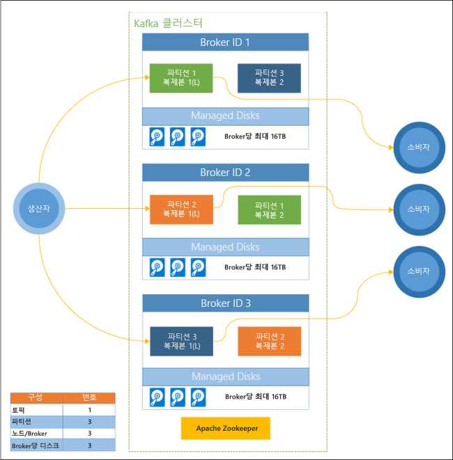

# Azure HDInsight에서 Apache Kafka란?

[Apache Kafka](https://kafka.apache.org)는 실시간 스트리밍 데이터 파이프라인과 애플리케이션을 만드는 데 사용할 수 있는 오픈 소스 분산형 스트리밍 플랫폼입니다. 또한 Kafka는 명명된 데이터 스트림을 게시하고 구독할 수 있는 메시지 대기열과 비슷한 메시지 브로커 기능을 제공합니다. 

다음은 HDInsight의 Kafka가 갖는 고유한 특성입니다.

* 단순화된 구성 프로세스를 제공하는 관리되는 서비스입니다. Microsoft에서는 테스트를 거쳐 해당 구성을 지원합니다.

* Microsoft는 Kafka 작동 시간에 대해 99.9%의 SLA(서비스 수준 계약)를 제공합니다. 자세한 내용은 [HDInsight에 대한 SLA 정보](https://azure.microsoft.com/support/legal/sla/hdinsight/v1_0/) 문서를 참조하세요.

* Azure Managed Disks를 Kafka에 대한 백업 저장소로 사용합니다. Managed Disks는 Kafka 브로커당 최대 16TB의 저장소를 제공할 수 있습니다. HDInsight에서 Kafka로 관리 디스크 구성에 대한 자세한 내용은 [HDInsight에서 Apache Kafka의 확장성 높이기](apache-kafka-scalability.md)를 참조하세요.

    관리 디스크에 대한 자세한 내용은 [Azure Managed Disks](../../virtual-machines/windows/managed-disks-overview.md)를 참조하세요.

* Kafka는 랙의 단일 차원 보기로 디자인되었습니다. Azure는 랙을 두 개의 차원, 즉 UD(업데이트 도메인)와 FD(장애 도메인)로 구분합니다. Microsoft에서는 UD와 FD에서 Kafka 파티션 및 복제본 균형을 다시 조정하는 도구를 제공합니다. 

    자세한 내용은 [HDInsight에서 Apache Kafka의 고가용성](apache-kafka-high-availability.md)을 참조하세요.

* HDInsight를 통해 클러스터를 만든 후 작업자 노드 수(Kafka-브로커를 호스트하는)를 변경할 수 있습니다. 크기 조정은 Azure Portal, Azure PowerShell 및 기타 Azure 관리 인터페이스에서 수행할 수 있습니다. Kafka의 경우 크기 조정 작업 후 파티션 복제본의 균형을 다시 조정해야 합니다. 파티션 균형을 다시 조정하면 Kafka가 새 작업자 노드 수를 활용할 수 있습니다.

    자세한 내용은 [HDInsight에서 Apache Kafka의 고가용성](apache-kafka-high-availability.md)을 참조하세요.

* Azure Monitor 로그를 사용하여 HDInsight에서 Kafka를 모니터링할 수 있습니다. Azure Monitor 로그는 디스크 및 NIC 메트릭, Kafka의 JMX 메트릭과 같은 가상 머신 수준 정보를 표시합니다.

    자세한 내용은 [HDInsight에서 Apache Kafka에 대한 로그 분석](apache-kafka-log-analytics-operations-management.md)을 참조하세요.

### HDInsight의 Apache Kafka 아키텍처

다음 다이어그램은 소비자 그룹, 분할 및 복제를 사용하여 내결함성으로 이벤트의 병렬 읽기를 제공하는 일반적인 Kafka 구성을 보여 줍니다.

Apache ZooKeeper는 Kafka 클러스터의 상태를 관리합니다. Zookeeper는 복원 가능하고 대기 시간이 낮은 동시 트랜잭션용으로 작성되었습니다. 

Kafka는 **토픽**에 레코드(데이터)를 저장합니다. **생산자**에서 레코드를 생성하고, **소비자**에서 이 레코드를 소비합니다. 생산자는 Kafka **brokers**로 레코드를 보냅니다. HDInsight 클러스터의 각 작업자 노드는 Kafka broker입니다. 

토픽은 브로커 간에 레코드를 분할합니다. 레코드를 소비할 때 데이터의 병렬 처리를 위해 파티션당 최대 1개의 소비자를 사용할 수 있습니다.

복제는 노드(브로커) 가동 중단으로부터 보호하여 노드 간에 파티션을 복제하기 위해 사용됩니다. 다이어그램에서 *(L)* 로 표시되는 파티션은 특정 파티션에 대한 선행부입니다. 생산자 트래픽은 ZooKeeper에서 관리하는 상태를 사용하여 각 노드의 선행부로 라우팅됩니다.

## HDInsight의 Apache Kafka를 사용하는 이유

다음은 HDInsight에서 Kafka를 사용하여 수행할 수 있는 일반 작업 및 패턴입니다.

* **Apache Kafka 데이터 복제**: Kafka는 Kafka와 클러스터 간에 데이터를 복제하는 MirrorMaker 유틸리티를 제공합니다.

    MirrorMaker 사용에 대한 내용은 [HDInsight에서 Apache Kafka를 사용하여 Apache Kafka 항목 복제](apache-kafka-mirroring.md)를 참조하세요.

* **게시-구독 메시지 패턴**: Kafka는 Kafka 토픽에 레코드를 게시하는 생산자 API를 제공합니다. 소비자 API는 토픽을 구독할 때 사용됩니다.

    자세한 내용은 [HDInsight에서 Apache Kafka 시작](apache-kafka-get-started.md)을 참조하세요.

* **스트림 처리**: Kafka는 실시간 스트리밍 처리를 위해 Apache Storm 또는 Spark와 함께 사용되는 경우가 많습니다. Kafka 0.10.0.0(HDInsight 버전 3.5 및 3.6)은 Storm이나 Spark를 요구하지 않고 스트리밍 솔루션을 빌드할 수 있는 스트리밍 API를 도입했습니다.

    자세한 내용은 [HDInsight에서 Apache Kafka 시작](apache-kafka-get-started.md)을 참조하세요.

* **수평 확장**: Kafka는 HDInsight 클러스터의 노드에서 스트림을 분할합니다. 소비자 프로세스는 개별 파티션에 연결하여 레코드를 소비할 때 부하 분산을 제공할 수 있습니다.

    자세한 내용은 [HDInsight에서 Apache Kafka 시작](apache-kafka-get-started.md)을 참조하세요.

* **순차적 전달**: 각 파티션 내에서 레코드는 수신된 순서로 스트림에 저장됩니다. 파티션마다 소비자 프로세스를 하나씩 연결하여 레코드가 순서대로 처리되도록 보장할 수 있습니다.

    자세한 내용은 [HDInsight에서 Apache Kafka 시작](apache-kafka-get-started.md)을 참조하세요.

## 사용 사례

* **메시징**: Kafka는 게시-구독 메시지 패턴을 지원하기 때문에 메시지 브로커로 자주 사용됩니다.

* **활동 추적**: Kafka는 순서대로 레코드 로그를 기록하기 때문에 활동을 추적하고 다시 만드는 데 사용할 수 있습니다. 예를 들어 웹 사이트 또는 애플리케이션에서의 사용자 작업이 여기에 해당합니다.

* **집계**: 스트림 처리를 사용하여 결합할 서로 다른 스트림의 정보를 한데 모으고 중앙에서 이 정보를 운영 데이터로 집중적으로 처리할 수 있습니다.

* **변환**: 스트림 처리를 사용하여 여러 입력 토픽의 데이터를 하나 이상의 출력 토픽으로 결합하고 보강할 수 있습니다.

## 다음 단계

다음 링크를 사용하여 HDInsight에서 Apache Kafka를 사용하는 방법에 대해 알아봅니다.

* [빠른 시작: HDInsight에서 Apache Kafka 만들기](apache-kafka-get-started.md)

* [자습서: HDInsight에서 Apache Spark 및 Apache Kafka 사용](../hdinsight-apache-spark-with-kafka.md)

* [자습서: HDInsight에서 Apache Storm 및 Apache Kafka 사용](../hdinsight-apache-storm-with-kafka.md)
