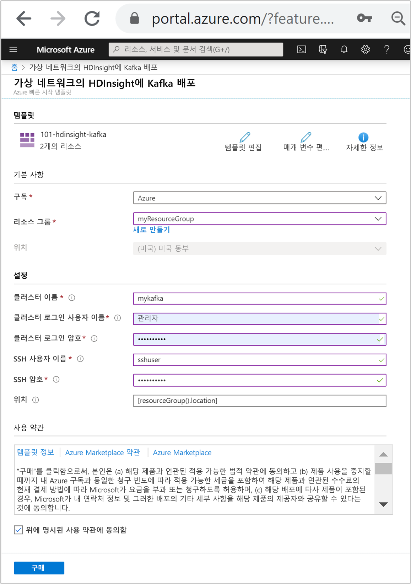
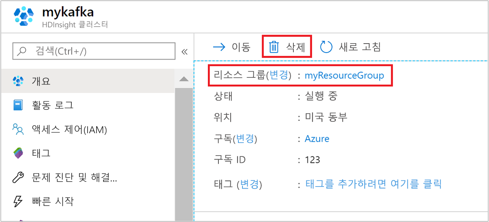

# <a name="quickstart-create-apache-kafka-cluster-in-azure-hdinsight-using-arm-template"></a>빠른 시작: ARM 템플릿을 사용하여 Azure HDInsight에서 Apache Kafka 클러스터 만들기

이 빠른 시작에서는 ARM 템플릿(Azure Resource Manager 템플릿)을 사용하여 Azure HDInsight에서 [Apache Kafka](./apache-kafka-introduction.md) 클러스터를 만듭니다. Kafka는 오픈 소스 분산형 스트리밍 플랫폼입니다. 게시-구독 메시지 큐와 유사한 기능을 제공하므로 메시지 브로커로 자주 사용됩니다.

[!INCLUDE [About Azure Resource Manager](../../../includes/resource-manager-quickstart-introduction.md)]

Kafka API는 동일한 가상 네트워크 내에서만 리소스에서 액세스할 수 있습니다. 이 빠른 시작에서는 직접 SSH를 사용하여 클러스터에 액세스합니다. 다른 서비스, 네트워크 또는 가상 머신을 Kafka에 연결하려면 먼저 가상 네트워크를 만든 다음, 네트워크 내에 리소스를 만듭니다. 자세한 내용은 [가상 네트워크를 사용하여 Apache Kafka에 연결](apache-kafka-connect-vpn-gateway.md) 문서를 참조하세요.

환경이 필수 구성 요소를 충족하고 ARM 템플릿 사용에 익숙한 경우 **Azure에 배포** 단추를 선택합니다. 그러면 Azure Portal에서 템플릿이 열립니다.

[](https://portal.azure.com/#create/Microsoft.Template/uri/https%3A%2F%2Fraw.githubusercontent.com%2FAzure%2Fazure-quickstart-templates%2Fmaster%2F101-hdinsight-kafka%2Fazuredeploy.json)

## <a name="prerequisites"></a>필수 구성 요소

Azure 구독이 아직 없는 경우 시작하기 전에 [체험 계정](https://azure.microsoft.com/free/?WT.mc_id=A261C142F)을 만듭니다.

## <a name="review-the-template"></a>템플릿 검토

이 빠른 시작에서 사용되는 템플릿은 [Azure 빠른 시작 템플릿](https://azure.microsoft.com/resources/templates/101-hdinsight-kafka/)에서 나온 것입니다.

:::code language="json" source="~/quickstart-templates/101-hdinsight-kafka/azuredeploy.json" range="1-203" highlight="103-135":::

템플릿에는 두 개의 Azure 리소스가 정의되어 있습니다.

* [Microsoft.Storage/storageAccounts](/azure/templates/microsoft.storage/storageaccounts): Azure Storage 계정을 만듭니다.
* [Microsoft.HDInsight/cluster](/azure/templates/microsoft.hdinsight/clusters): HDInsight 클러스터를 만듭니다.

## <a name="deploy-the-template"></a>템플릿 배포

1. 아래 **Azure에 배포** 단추를 선택하여 Azure에 로그인하고 ARM 템플릿을 엽니다.

   [](https://portal.azure.com/#create/Microsoft.Template/uri/https%3A%2F%2Fraw.githubusercontent.com%2FAzure%2Fazure-quickstart-templates%2Fmaster%2F101-hdinsight-kafka%2Fazuredeploy.json)

1. 다음 값을 입력하거나 선택합니다.

    |속성 |Description |
    |---|---|
    |Subscription|드롭다운 목록에서 클러스터에 사용할 Azure 구독을 선택합니다.|
    |Resource group|드롭다운 목록에서 기존 리소스 그룹을 선택하거나 **새로 만들기**를 선택합니다.|
    |위치|이 값은 리소스 그룹에 사용되는 위치로 자동 입력됩니다.|
    |클러스터 이름|전역적으로 고유한 이름을 입력합니다. 이 템플릿의 경우 소문자와 숫자만 사용합니다.|
    |클러스터 로그인 사용자 이름|사용자 이름을 입력합니다. 기본값은 **admin**입니다.|
    |클러스터 로그인 암호|암호를 입력합니다. 암호는 10자 이상이어야 하며, 숫자, 대문자, 소문자 및 영숫자가 아닌 문자(' " ` 문자 제외)를 각각 하나 이상 포함해야 합니다. |
    |SSH 사용자 이름|사용자 이름을 입력합니다. 기본값은 **sshuser**입니다.|
    |SSH 암호|암호를 입력합니다.|

    

1. **사용 약관**을 검토합니다. 그런 다음, **위에 명시된 사용 약관에 동의함**을 선택한 다음, **구매**를 선택합니다. 배포가 진행 중이라는 알림이 표시됩니다. 클러스터를 만들려면 20분 정도가 걸립니다.

## <a name="review-deployed-resources"></a>배포된 리소스 검토

클러스터가 만들어지면 **리소스로 이동** 링크가 포함된 **배포 성공** 알림이 표시됩니다. 리소스 그룹 페이지에 새 HDInsight 클러스터와 해당 클러스터에 연결된 기본 스토리지가 나열됩니다. 각 클러스터에는 [Azure Storage](../hdinsight-hadoop-use-blob-storage.md) 계정 또는 [Azure Data Lake Storage 계정](../hdinsight-hadoop-use-data-lake-store.md) 종속성이 있습니다. 이 스토리지 계정을 기본 스토리지 계정이라고 합니다. HDInsight 클러스터와 해당 기본 스토리지 계정은 같은 Azure 지역에 있어야 합니다. 클러스터를 삭제하더라도 스토리지 계정은 삭제되지 않습니다.

## <a name="get-the-apache-zookeeper-and-broker-host-information"></a>Apache Zookeeper 및 Broker 호스트 정보 가져오기

Kafka를 사용할 때는 *Apache Zookeeper* 및 *Broker* 호스트를 알고 있어야 합니다. 이러한 호스트는 Kafka API 및 Kafka와 함께 제공되는 다양한 유틸리티에서 사용됩니다.

이 섹션에서는 클러스터에서 Ambari REST API에서 호스트 정보를 가져옵니다.

1. [ssh command](../hdinsight-hadoop-linux-use-ssh-unix.md) 명령을 사용하여 클러스터에 연결합니다. CLUSTERNAME을 클러스터 이름으로 바꿔서 아래 명령을 편집하고, 다음 명령을 입력합니다.

    ```cmd
    ssh sshuser@CLUSTERNAME-ssh.azurehdinsight.net
    ```

1. SSH 연결에서 다음 명령을 사용하여 `jq` 유틸리티를 설치합니다. 이 유틸리티는 JSON 문서를 구문 분석하는 데 사용되며 호스트 정보 검색에 유용합니다.

    ```bash
    sudo apt -y install jq
    ```

1. 환경 변수를 클러스터 이름으로 설정하려면 다음 명령을 사용합니다.

    ```bash
    read -p "Enter the Kafka on HDInsight cluster name: " CLUSTERNAME
    ```

    메시지가 표시되면 Kafka 클러스터 이름을 입력합니다.

1. Zookeeper 호스트 정보를 사용하여 환경 변수를 설정하려면 아래 명령을 사용합니다. 이 명령은 모든 Zookeeper 호스트를 검색한 다음, 처음 두 개의 항목만 반환합니다. 하나의 호스트에 연결할 수 없는 경우 일부 중복이 필요하기 때문입니다.

    ```bash
    export KAFKAZKHOSTS=`curl -sS -u admin -G https://$CLUSTERNAME.azurehdinsight.net/api/v1/clusters/$CLUSTERNAME/services/ZOOKEEPER/components/ZOOKEEPER_SERVER | jq -r '["\(.host_components[].HostRoles.host_name):2181"] | join(",")' | cut -d',' -f1,2`
    ```

    메시지가 표시되면 클러스터 로그인 계정(SSH 계정 아님)에 대한 암호를 입력합니다.

1. 환경 변수가 올바르게 설정되었는지 확인하려면 다음 명령을 사용합니다.

    ```bash
     echo '$KAFKAZKHOSTS='$KAFKAZKHOSTS
    ```

    이 명령은 다음 텍스트와 유사한 정보를 반환합니다.

    `zk0-kafka.eahjefxxp1netdbyklgqj5y1ud.ex.internal.cloudapp.net:2181,zk2-kafka.eahjefxxp1netdbyklgqj5y1ud.ex.internal.cloudapp.net:2181`

1. Kafka broker 호스트 정보를 사용하여 환경 변수를 설정하려면 다음 명령을 사용합니다.

    ```bash
    export KAFKABROKERS=`curl -sS -u admin -G https://$CLUSTERNAME.azurehdinsight.net/api/v1/clusters/$CLUSTERNAME/services/KAFKA/components/KAFKA_BROKER | jq -r '["\(.host_components[].HostRoles.host_name):9092"] | join(",")' | cut -d',' -f1,2`
    ```

    메시지가 표시되면 클러스터 로그인 계정(SSH 계정 아님)에 대한 암호를 입력합니다.

1. 환경 변수가 올바르게 설정되었는지 확인하려면 다음 명령을 사용합니다.

    ```bash
    echo '$KAFKABROKERS='$KAFKABROKERS
    ```

    이 명령은 다음 텍스트와 유사한 정보를 반환합니다.

    `wn1-kafka.eahjefxxp1netdbyklgqj5y1ud.cx.internal.cloudapp.net:9092,wn0-kafka.eahjefxxp1netdbyklgqj5y1ud.cx.internal.cloudapp.net:9092`

## <a name="manage-apache-kafka-topics"></a>Apache Kafka 토픽 관리

Kafka는 *토픽*에 데이터 스트림을 저장합니다. 토픽을 관리하는 데 `kafka-topics.sh` 유틸리티를 사용할 수 있습니다.

* **토픽을 만들려면** SSH 연결에서 다음 명령을 사용합니다.

    ```bash
    /usr/hdp/current/kafka-broker/bin/kafka-topics.sh --create --replication-factor 3 --partitions 8 --topic test --zookeeper $KAFKAZKHOSTS
    ```

    이 명령은 `$KAFKAZKHOSTS`에 저장된 호스트 정보를 사용하여 Zookeeper에 연결합니다. 그런 후 **test**라는 Kafka 토픽을 만듭니다.

    * 이 토픽에 저장된 데이터는 8개의 파티션에 분할됩니다.

    * 각 파티션은 클러스터에서 세 개의 작업자 노드에 복제됩니다.

        세 개의 장애 도메인을 제공하는 Azure 지역에서 클러스터를 만든 경우 3의 복제 인수를 사용합니다. 그렇지 않으면 4의 복제 요소를 사용합니다.
        
        세 개의 장애 도메인 지역에서는 3의 복제 인수를 사용하면 복제본을 오류 도메인에 분산할 수 있습니다. 두 개의 장애 도메인 지역에서는 4의 복제 인수로 복제본을 도메인에 동일하게 분산할 수 있습니다.
        
        영역에서 장애 도메인의 수에 대한 자세한 내용은 [Linux 가상 머신의 가용성](../../virtual-machines/windows/manage-availability.md#use-managed-disks-for-vms-in-an-availability-set) 문서를 참조하세요.

        Kafka는 Azure 장애 도메인을 인식하지 않습니다. 항목에 대한 파티션 복제본을 만들 때 고가용성에 대해 복제본을 제대로 배포하지 않을 수 있습니다.

        고가용성을 보장하려면 [Apache Kafka 파티션 재조정 도구](https://github.com/hdinsight/hdinsight-kafka-tools)를 사용합니다. 이 도구는 Kafka 클러스터의 헤드 노드에 대한 SSH 연결에서 실행되어야 합니다.

        가장 높은 Kafka 데이터 가용성을 보장하려면 다음과 같은 경우에 토픽에 대한 파티션 복제본의 부하를 다시 조정해야 합니다.

        * 새 토픽 또는 파티션을 만들 때

        * 클러스터를 강화할 때

* **토픽을 나열하려면** 다음 명령을 사용합니다.

    ```bash
    /usr/hdp/current/kafka-broker/bin/kafka-topics.sh --list --zookeeper $KAFKAZKHOSTS
    ```

    이 명령은 Kafka 클러스터에서 사용할 수 있는 토픽을 나열합니다.

* **토픽을 삭제하려면** 다음 명령을 사용합니다.

    ```bash
    /usr/hdp/current/kafka-broker/bin/kafka-topics.sh --delete --topic topicname --zookeeper $KAFKAZKHOSTS
    ```

    이 명령은 `topicname`이라고 명명된 토픽을 삭제합니다.

    > [!WARNING]  
    > 이전에 만든 `test` 토픽을 삭제하는 경우에는 다시 만들어야 합니다. 이는 이 문서의 뒷부분에서 사용됩니다.

`kafka-topics.sh` 유틸리티에서 사용할 수 있는 명령에 대한 자세한 정보는 다음 명령을 사용합니다.

```bash
/usr/hdp/current/kafka-broker/bin/kafka-topics.sh
```

## <a name="produce-and-consume-records"></a>레코드 생성 및 소비

Kafka는 토픽에 *레코드*를 저장합니다. *생산자*에서 레코드를 생성하고, *소비자*에서 이 레코드를 소비합니다. 생산자와 소비자는 *Kafka broker* 서비스와 통신합니다. HDInsight 클러스터의 각 작업자 노드는 Kafka broker 호스트입니다.

앞에서 만든 test 토픽에 레코드를 저장한 다음, 소비자를 통해 레코드를 읽으려면 다음 단계를 사용합니다.

1. 토픽에 레코드를 작성하려면 SSH 연결에서 `kafka-console-producer.sh` 유틸리티를 사용합니다.

    ```bash
    /usr/hdp/current/kafka-broker/bin/kafka-console-producer.sh --broker-list $KAFKABROKERS --topic test
    ```

    이 명령 후 빈 줄에 도달합니다.

1. 빈 줄에 문자 메시지를 입력하고 Enter 키를 누릅니다. 이와 같은 방식으로 메시지 몇 개를 입력한 후 **Ctrl + C** 키를 사용하여 일반 프롬프트로 돌아갑니다. 각 줄은 별도의 레코드로 Kafka 토픽에 전송됩니다.

1. 토픽에서 레코드를 읽으려면 SSH 연결에서 `kafka-console-consumer.sh` 유틸리티를 사용합니다.

    ```bash
    /usr/hdp/current/kafka-broker/bin/kafka-console-consumer.sh --bootstrap-server $KAFKABROKERS --topic test --from-beginning
    ```

    이 명령은 토픽에서 레코드를 검색하여 표시합니다. `--from-beginning`을 사용하면 스트림 시작 부분부터 시작하도록 소비자에 지시하여 모든 레코드를 검색합니다.

    이전 버전의 Kafka를 사용하는 경우 `--bootstrap-server $KAFKABROKERS`를 `--zookeeper $KAFKAZKHOSTS`로 바꿉니다.

1. __Ctrl+C__ 를 사용하여 소비자를 중지합니다.

또한 프로그래밍 방식으로 생산자와 소비자를 만들 수 있습니다. 이 API를 사용하는 예제는 [HDInsight의 Apache Kafka 생산자 및 소비자 API](apache-kafka-producer-consumer-api.md) 문서를 참조하세요.

## <a name="clean-up-resources"></a>리소스 정리

빠른 시작을 완료한 후 클러스터를 삭제하는 것이 좋습니다. HDInsight를 사용하면 데이터가 Azure Storage에 저장되기 때문에 클러스터를 사용하지 않을 때 안전하게 삭제할 수 있습니다. HDInsight 클러스터를 사용하지 않는 기간에도 요금이 청구됩니다. 클러스터에 대한 요금이 스토리지에 대한 요금보다 몇 배 더 많기 때문에, 클러스터를 사용하지 않을 때는 삭제하는 것이 경제적인 면에서 더 합리적입니다.

Azure Portal에서 클러스터로 이동하여 **삭제**를 선택합니다.



또한 리소스 그룹 이름을 선택하여 리소스 그룹 페이지를 연 다음, **리소스 그룹 삭제**를 선택할 수도 있습니다. 리소스 그룹을 삭제하여 HDInsight 클러스터와 기본 스토리지 계정을 삭제합니다.

## <a name="next-steps"></a>다음 단계

이 빠른 시작에서는 HDInsight에서 ARM 템플릿을 사용하여 Apache Kafka 클러스터를 만드는 방법을 알아보았습니다. 다음 문서에서는 Apache Kafka Streams API를 사용하는 애플리케이션을 만들고 HDInsight의 Kafka에서 이를 실행하는 방법을 알아봅니다.

> [!div class="nextstepaction"]
> [Azure HDInsight에서 Apache Kafka Streams API 사용](./apache-kafka-streams-api.md)
