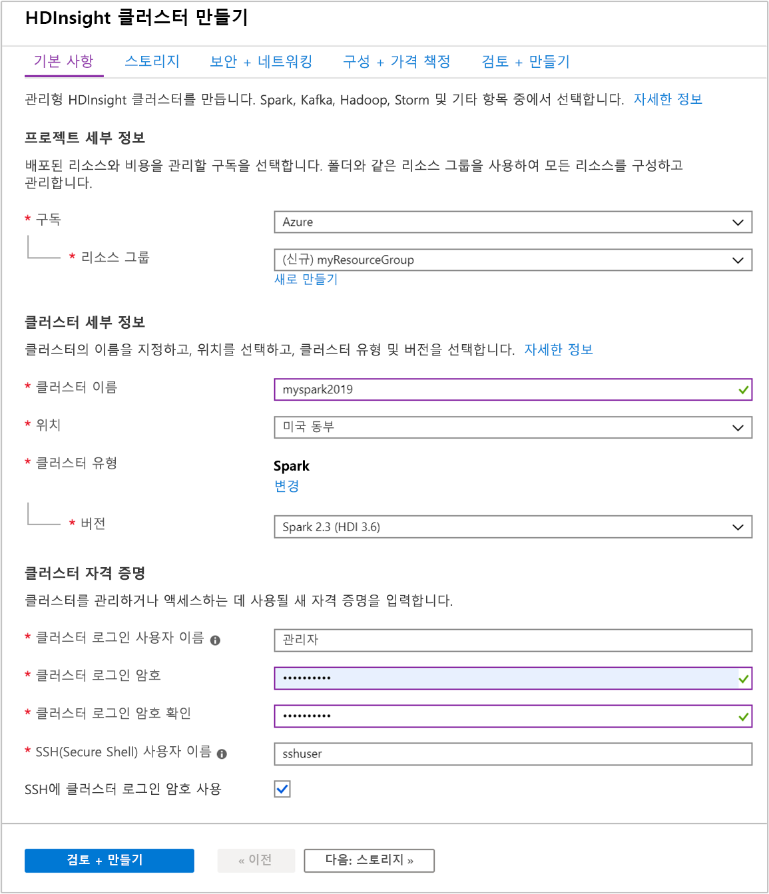
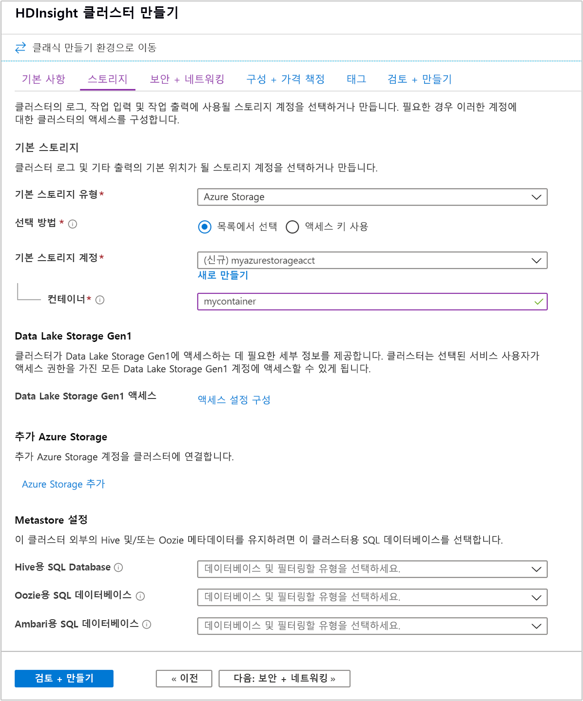
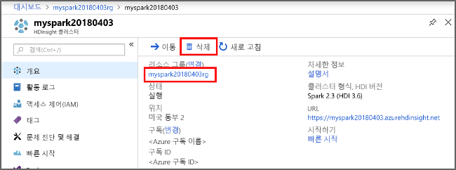

# <a name="quickstart-create-apache-spark-cluster-in-azure-hdinsight-using-azure-portal"></a>빠른 시작: Azure Portal을 사용하여 Azure HDInsight에서 Apache Spark 클러스터 만들기

이 빠른 시작에서는 Azure Portal을 사용하여 Azure HDInsight에서 Apache Spark 클러스터를 만듭니다. 그런 다음, Jupyter Notebook을 만들고 이를 사용하여 Apache Hive 테이블에 대해 Spark SQL 쿼리를 실행합니다. Azure HDInsight는 엔터프라이즈를 위한 관리형의 전체 스펙트럼 오픈 소스 분석 서비스입니다. HDInsight용 Apache Spark 프레임워크를 통해 메모리 내 처리 기능을 사용하여 데이터 분석 및 클러스터 컴퓨팅을 신속하게 처리합니다. Jupyter Notebook을 사용하면 데이터와 상호 작용하고, 코드를 markdown 텍스트와 결합하고, 간단한 시각화를 수행할 수 있습니다.

사용 가능한 구성에 대한 자세한 설명은 [HDInsight에서 클러스터 설정](../hdinsight-hadoop-provision-linux-clusters.md)을 참조하세요. 포털을 사용하여 클러스터를 만드는 방법에 대한 자세한 내용은 [포털에서 클러스터 만들기](../hdinsight-hadoop-create-linux-clusters-portal.md)를 참조하세요.

> [!IMPORTANT]  
> HDInsight 클러스터에 대한 결제는 사용 여부에 관계없이 분마다 비례 배분됩니다. 사용한 후에 클러스터를 삭제해야 합니다. 자세한 내용은 이 문서의 [리소스 정리](#clean-up-resources) 섹션을 참조하세요.

## <a name="prerequisites"></a>사전 요구 사항

활성 구독이 있는 Azure 계정. [체험 계정을 만듭니다](https://azure.microsoft.com/free/?ref=microsoft.com&utm_source=microsoft.com&utm_medium=docs&utm_campaign=visualstudio).

## <a name="create-an-apache-spark-cluster-in-hdinsight"></a>HDInsight에서 Apache Spark 클러스터 만들기

Azure Portal을 사용하여 Azure Storage Blob을 클러스터 스토리지로 사용하는 HDInsight 클러스터를 만듭니다. Data Lake Storage Gen2를 사용하는 방법에 대한 자세한 내용은 [빠른 시작: HDInsight에서 클러스터 설정](../../storage/data-lake-storage/quickstart-create-connect-hdi-cluster.md)을 참조하세요.

1. [Azure Portal](https://portal.azure.com/)에 로그인합니다.

1. 위쪽 메뉴에서 **+ 리소스 만들기**를 선택합니다.

    

1. **분석** > **Azure HDInsight**를 차례로 선택하여  **HDInsight 클러스터 만들기** 페이지로 이동합니다.

1. **기본** 탭에서 다음 정보를 제공합니다.

    |속성  |Description  |
    |---------|---------|
    |Subscription  | 드롭다운 목록에서 클러스터에 사용할 Azure 구독을 선택합니다. |
    |Resource group | 드롭다운 목록에서 기존 리소스 그룹을 선택하거나 **새로 만들기**를 선택합니다.|
    |클러스터 이름 | 전역적으로 고유한 이름을 입력합니다.|
    |지역   | 드롭다운 목록에서 클러스터를 만들 지역을 선택합니다. |
    |클러스터 유형| [클러스터 유형 선택]을 선택하여 목록을 엽니다. 목록에서 **Spark**를 선택합니다.|
    |클러스터 버전|클러스터 유형을 선택하면 이 필드가 기본 버전으로 자동으로 채워집니다.|
    |클러스터 로그인 사용자 이름| 클러스터 로그인 사용자 이름을 입력합니다.  기본 이름은 **admin**입니다. 이 계정을 사용하여 빠른 시작의 뒷부분에 나오는 Jupyter 노트북에 로그인합니다. |
    |클러스터 로그인 암호| 클러스터 로그인 암호를 입력합니다. |
    |SSH(보안 셸) 사용자 이름| SSH 사용자 이름을 입력합니다. 이 빠른 시작에 사용되는 SSH 사용자 이름은 **sshuser**입니다. 기본적으로 이 계정에는 *클러스터 로그인 사용자 이름* 계정과 동일한 암호를 공유합니다. |

    

    완료되면 **다음: Storage >>** 를 선택하여 **Storage** 페이지를 계속합니다.

1. **스토리지**에서 다음 값을 입력합니다.

    |속성  |Description  |
    |---------|---------|
    |기본 스토리지 유형|기본값 **Azure Storage**를 사용합니다.|
    |선택 방법|기본값 **목록에서 선택**을 사용합니다.|
    |기본 스토리지 계정|자동으로 채워진 값을 사용합니다.|
    |컨테이너|자동으로 채워진 값을 사용합니다.|

    

    **검토 + 만들기**를 선택하여 계속 진행합니다.

1. **검토 + 만들기**에서 **만들기**를 선택합니다. 클러스터를 만드는 데 약 20분이 걸립니다. 다음 세션을 계속하려면 먼저 클러스터를 만들어야 합니다.

HDInsight 클러스터를 만드는 데 문제가 발생하는 경우 이를 수행하기 위한 적절한 사용 권한이 없을 수 있습니다. 자세한 내용은 [액세스 제어 요구 사항](../hdinsight-hadoop-customize-cluster-linux.md#access-control)을 참조하세요.

## <a name="create-a-jupyter-notebook"></a>Jupyter Notebook 만들기

Jupyter Notebook은 다양한 프로그래밍 언어를 지원하는 대화형 Notebook 환경입니다. Notebook을 사용하면 데이터와 상호 작용하고, 코드를 markdown 텍스트와 결합하고, 간단한 시각화를 수행할 수 있습니다.

1. 웹 브라우저에서 `https://CLUSTERNAME.azurehdinsight.net/jupyter`로 이동합니다. 여기서 `CLUSTERNAME`은 클러스터의 이름입니다. 메시지가 표시되면 클러스터에 대한 클러스터 로그인 자격 증명을 입력합니다.

1. **새로 만들기** > **PySpark**를 선택하여 Notebook을 만듭니다.

   

   새 Notebook이 만들어지고 Untitled(Untitled.pynb) 이름으로 열립니다.

## <a name="run-apache-spark-sql-statements"></a>Apache Spark SQL 문 실행

SQL(구조적 쿼리 언어)은 데이터 쿼리 및 정의에 가장 일반적이며 널리 사용되는 언어입니다. Spark SQL은 익숙한 SQL 구문을 사용하여 구조화된 데이터를 처리하기 위한 Apache Spark에 대한 확장으로 작동합니다.

1. 커널이 준비되었는지 확인합니다. Notebook의 커널 이름 옆에 속이 빈 원이 보이면 커널이 준비된 것입니다. 속이 찬 원은 커널이 사용 중이라는 뜻입니다.

    

    Notebook을 처음으로 시작하면 커널이 백그라운드에서 몇 가지 작업을 수행합니다. 커널이 준비될 때까지 기다립니다.

1. 빈 셀에 다음 코드를 붙여 넣은 다음, **SHIFT + ENTER**를 눌러 코드를 실행합니다. 이 명령은 클러스터의 Hive 테이블을 나열합니다.

    ```PySpark
    %%sql
    SHOW TABLES
    ```

    Jupyter Notebook을 HDInsight 클러스터와 함께 사용하는 경우 Spark SQL을 사용하여 Hive 쿼리를 실행하는 데 사용할 수 있는 미리 설정된 `sqlContext`를 얻게 됩니다. `%%sql`은 Jupyter Notebook에 미리 설정된 `sqlContext`를 사용하여 Hive 쿼리를 실행하도록 지시합니다. 쿼리는 기본적으로 모든 HDInsight 클러스터와 함께 제공되는 Hive 테이블(**hivesampletable**)에서 상위 10개의 행을 검색합니다. 결과를 얻는데 약 30초가 걸립니다. 출력은 다음과 같이 표시됩니다.

    

    Jupyter에서 쿼리를 실행할 때마다, 웹 브라우저 창 제목에 Notebook 제목과 함께 **(사용 중)** 상태가 표시됩니다. 또한 오른쪽 위 모서리에 있는 **PySpark** 텍스트 옆에 단색 원이 표시됩니다.

1. 또 다른 쿼리를 실행하여 `hivesampletable`의 데이터를 봅니다.

    ```PySpark
    %%sql
    SELECT * FROM hivesampletable LIMIT 10
    ```

    쿼리 출력이 표시되도록 화면이 새로 고쳐집니다.

    

1. Notebook의 **파일** 메뉴에서 **닫기 및 중지**를 선택합니다. Notebook을 종료하면 클러스터 리소스가 릴리스됩니다.

## <a name="clean-up-resources"></a>리소스 정리

HDInsight는 데이터를 Azure Storage 또는 Azure Data Lake Storage에 저장하므로 사용하지 않을 때 클러스터를 안전하게 삭제할 수 있습니다. HDInsight 클러스터를 사용하지 않는 기간에도 요금이 청구됩니다. 클러스터에 대한 요금이 스토리지에 대한 요금보다 몇 배 더 많기 때문에, 클러스터를 사용하지 않을 때는 삭제하는 것이 경제적인 면에서 더 합리적입니다. [다음 단계](#next-steps)에 나열된 자습서를 즉시 수행하려는 경우 클러스터를 유지할 수 있습니다.

Azure Portal로 다시 전환하고, **삭제**를 선택합니다.



또한 리소스 그룹 이름을 선택하여 리소스 그룹 페이지를 연 다음, **리소스 그룹 삭제**를 선택할 수도 있습니다. 리소스 그룹을 삭제하여 HDInsight 클러스터와 기본 스토리지 계정을 삭제합니다.

## <a name="next-steps"></a>다음 단계

이 빠른 시작에서는 HDInsight에서 Apache Spark 클러스터를 만들고 기본 Spark SQL 쿼리를 실행하는 방법을 알아보았습니다. 다음 자습서를 진행하여 샘플 데이터에서 대화형 쿼리를 실행하는 데 HDInsight 클러스터를 사용하는 방법에 대해 알아보세요.

> [!div class="nextstepaction"]
> [Apache Spark에서 대화형 쿼리 실행](./apache-spark-load-data-run-query.md)
