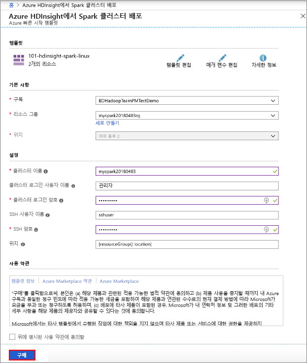
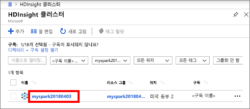
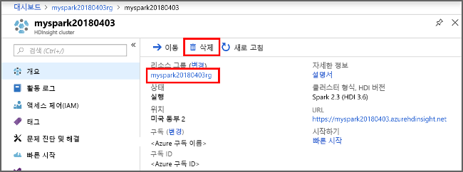

# <a name="quickstart-create-an-apache-spark-cluster-in-hdinsight-using-template"></a>빠른 시작: 템플릿을 사용하여 HDInsight에서 Apache Spark 클러스터 만들기

Azure HDInsight에서 [Apache Spark](https://spark.apache.org/) 클러스터를 만드는 방법과 [Apache Hive](https://hive.apache.org/) 테이블에 대해 Spark SQL 쿼리를 실행하는 방법을 알아봅니다. Apache Spark를 통해 메모리 내 처리 기능을 사용하여 데이터 분석 및 클러스터 컴퓨팅을 신속하게 처리합니다. HDInsight의 Spark에 대한 자세한 내용은 [개요: Azure HDInsight에서 Apache Spark](apache-spark-overview.md)를 참조하세요.

이 빠른 시작에서는 Resource Manager 템플릿을 사용하여 HDInsight Spark 클러스터를 만듭니다. 클러스터는 클러스터 저장소로 Azure Storage Blob을 사용합니다. Data Lake Storage Gen2를 사용하는 방법에 대한 자세한 내용은 [빠른 시작: HDInsight에서 클러스터 설정](../../storage/data-lake-storage/quickstart-create-connect-hdi-cluster.md)을 참조하세요.

> [!IMPORTANT]
> HDInsight 클러스터에 대한 결제는 사용 여부에 관계없이 분당으로 비례 배분됩니다. 사용한 후에 클러스터를 삭제해야 합니다. 자세한 내용은 이 문서의 [리소스 정리](#clean-up-resources) 섹션을 참조하세요.

Azure 구독이 아직 없는 경우 시작하기 전에 [체험](https://azure.microsoft.com/free/) 계정을 만듭니다.

## <a name="create-an-hdinsight-spark-cluster"></a>HDInsight Spark 클러스터 만들기

Azure Resource Manager 템플릿을 사용하여 HDInsight Spark 클러스터를 만듭니다. 이 템플릿은 [GitHub](https://azure.microsoft.com/resources/templates/101-hdinsight-spark-linux/)에서 찾을 수 있습니다. 

1. 다음 링크를 선택하여 새 브라우저 탭의 Azure Portal에서 템플릿을 엽니다.         

    <a href="https://portal.azure.com/#create/Microsoft.Template/uri/https%3A%2F%2Fraw.githubusercontent.com%2FAzure%2Fazure-quickstart-templates%2Fmaster%2F101-hdinsight-spark-linux%2Fazuredeploy.json" target="_blank">Azure에 배포</a>

2. 다음 값을 입력합니다.

    | 자산 | 값 |
    |---|---|
    |**구독**|이 클러스터를 만드는 데 사용되는 Azure 구독을 선택합니다. 이 빠른 시작에 사용되는 구독은 **&lt;Azure 구독 이름>** 입니다. |
    | **리소스 그룹**|리소스 그룹을 만들거나 기존 그룹을 선택합니다. 리소스 그룹은 프로젝트에 대한 Azure 리소스를 관리하는 데 사용됩니다. 이 빠른 시작에 사용되는 새 리소스 그룹 이름은 **myspark20180403rg**입니다.|
    | **위치**:|리소스 그룹의 위치를 선택합니다. 템플릿에서는 기본 클러스터 저장소뿐만 아니라 클러스터를 만드는 데 이 위치를 사용합니다. 이 빠른 시작에 사용되는 위치는 **미국 동부 2**입니다.|
    | **ClusterName**|만들려는 HDInsight 클러스터의 이름을 입력합니다. 이 빠른 시작에 사용되는 새 클러스터 이름은 **myspark20180403**입니다.|
    | **클러스터 로그인 이름 및 암호**|기본 로그인 이름은 admin입니다. 클러스터 로그인에 대한 암호를 선택합니다. 이 빠른 시작에 사용되는 로그인 이름은 **admin**입니다.|
    | **SSH 사용자 이름 및 암호**|SSH 사용자에 대한 암호를 선택합니다. 이 빠른 시작에 사용되는 SSH 사용자 이름은 **sshuser**입니다.|

    

3. **위에 명시된 사용 약관에 동의함**을 선택하고, **대시보드에 고정**을 선택한 다음, **구매**를 선택합니다. **템플릿 배포 중**이라는 제목의 새 타일을 볼 수 있습니다. 클러스터를 만드는 데 약 20분이 걸립니다. 다음 세션을 계속하려면 먼저 클러스터를 만들어야 합니다.

HDInsight 클러스터를 만드는 데 문제가 발생하는 경우 이를 수행하기 위한 적절한 사용 권한이 없을 수 있습니다. 자세한 내용은 [액세스 제어 요구 사항](../hdinsight-administer-use-portal-linux.md#create-clusters)을 참조하세요.

## <a name="install-intellijeclipse-for-spark-application"></a>Spark 애플리케이션에 대한 IntelliJ/Eclipse 설치
IntelliJ/Eclipse 플러그 인용 Azure 도구 키트를 사용하여 [Scala](https://www.scala-lang.org/)로 작성된 Spark 애플리케이션을 개발한 후 IntelliJ/Eclipse IDE(통합 개발 환경)에서 직접 Azure HDInsight Spark 클러스터로 제출합니다. 자세한 내용은 [IntelliJ를 사용하여 Spark 애플리케이션 작성/제출](./apache-spark-intellij-tool-plugin.md) 및 [Eclipse를 사용하여 Spark 애플리케이션 작성/제출](./apache-spark-eclipse-tool-plugin.md)을 참조하세요.

## <a name="install-vscode-for-pysparkhive-applications"></a>PySpark/hive 애플리케이션에 대한 VSCode 설치
Azure HDInsight Tools for Visual Studio Code(VSCode)를 사용하여 Hive 배치, 대화형 Hive 쿼리, PySpark 일괄 처리 및 PySpark 대화형 스크립트를 만들고 제출하는 방법에 대해 알아봅니다. Azure HDInsight Tools는 VSCode에서 지원하는 플랫폼에 설치할 수 있습니다. 여기에는 Windows, Linux, macOS가 포함됩니다. 자세한 내용은 [VSCode를 사용하여 PySpark 애플리케이션 작성/제출](../hdinsight-for-vscode.md)을 참조하세요.

## <a name="create-a-jupyter-notebook"></a>Jupyter Notebook 만들기

[Jupyter Notebook](https://jupyter.org/)은 다양한 프로그래밍 언어를 지원하는 대화형 Notebook 환경입니다. Notebook을 사용하면 데이터와 상호 작용하고, 코드를 markdown 텍스트와 결합하고, 간단한 시각화를 수행할 수 있습니다. 

1. [Azure Portal](https://portal.azure.com)을 엽니다.
2. **HDInsight 클러스터**를 선택한 다음, 만든 클러스터를 선택합니다.

    

3. 포털의 **클러스터 대시보드** 섹션에서 **Jupyter Notebook**을 클릭합니다. 메시지가 표시되면 클러스터에 대한 클러스터 로그인 자격 증명을 입력합니다.

   

4. **새로 만들기** > **PySpark**를 선택하여 Notebook을 만듭니다. 

   

   새 Notebook이 만들어지고 Untitled(Untitled.pynb) 이름으로 열립니다.


## <a name="run-spark-sql-statements"></a>Spark SQL 문 실행

SQL(구조적 쿼리 언어)은 데이터 쿼리 및 변환에 가장 일반적이며 널리 사용되는 언어입니다. Spark SQL은 익숙한 SQL 구문을 사용하여 구조화된 데이터를 처리하기 위한 Apache Spark에 대한 확장으로 작동합니다.

1. 커널이 준비되었는지 확인합니다. Notebook의 커널 이름 옆에 속이 빈 원이 보이면 커널이 준비된 것입니다. 속이 찬 원은 커널이 사용 중이라는 뜻입니다.

    

    Notebook을 처음으로 시작하면 커널이 백그라운드에서 몇 가지 작업을 수행합니다. 커널이 준비될 때까지 기다립니다. 
2. 빈 셀에 다음 코드를 붙여 넣은 다음, **SHIFT + ENTER**를 눌러 코드를 실행합니다. 이 명령은 클러스터의 Hive 테이블을 나열합니다.

    ```sql
    %%sql
    SHOW TABLES
    ```
    Jupyter Notebook을 HDInsight Spark 클러스터와 함께 사용하는 경우 Spark SQL을 사용하여 Hive 쿼리를 실행하는 데 사용할 수 있는 미리 설정된 `spark` 세션을 얻게 됩니다. `%%sql`은 Jupyter Notebook에 미리 설정된 `spark` 세션을 사용하여 Hive 쿼리를 실행하도록 지시합니다. 쿼리는 기본적으로 모든 HDInsight 클러스터와 함께 제공되는 Hive 테이블(**hivesampletable**)에서 상위 10개의 행을 검색합니다. 쿼리 Jupyter를 처음으로 제출하면 Notebook에 대한 Spark 애플리케이션이 만들어집니다. 완료하는 데 약 30초가 걸립니다. Spark 애플리케이션이 준비되면 약 1초 후 쿼리가 실행되어 결과를 생성합니다. 출력은 다음과 같이 표시됩니다. 

    

    Jupyter에서 쿼리를 실행할 때마다, 웹 브라우저 창 제목에 Notebook 제목과 함께 **(사용 중)** 상태가 표시됩니다. 또한 오른쪽 위 모서리에 있는 **PySpark** 텍스트 옆에 단색 원이 표시됩니다.
    
2. 또 다른 쿼리를 실행하여 `hivesampletable`의 데이터를 봅니다.

    ```sql
    %%sql
    SELECT * FROM hivesampletable LIMIT 10
    ```
    
    쿼리 출력이 표시되도록 화면이 새로 고쳐집니다.

    

2. Notebook의 **파일** 메뉴에서 **닫기 및 중지**를 선택합니다. Notebook을 종료하면 Spark 애플리케이션을 비롯한 클러스터 리소스가 릴리스됩니다.

## <a name="clean-up-resources"></a>리소스 정리
HDInsight는 Azure Storage 또는 Azure Data Lake Store에 데이터와 Jupyter Notebook을 저장하므로 클러스터를 사용하지 않을 때 안전하게 삭제할 수 있습니다. HDInsight 클러스터를 사용하지 않는 기간에도 요금이 청구됩니다. 클러스터에 대한 요금이 저장소에 대한 요금보다 몇 배 더 많기 때문에, 클러스터를 사용하지 않을 때는 삭제하는 것이 경제적인 면에서 더 합리적입니다. [다음 단계](#next-steps)에 나열된 자습서를 즉시 수행하려는 경우 클러스터를 유지할 수 있습니다.

Azure Portal로 다시 전환하고, **삭제**를 선택합니다.



또한 리소스 그룹 이름을 선택하여 리소스 그룹 페이지를 연 다음, **리소스 그룹 삭제**를 선택할 수도 있습니다. 리소스 그룹을 삭제하여 HDInsight Spark 클러스터와 기본 저장소 계정을 삭제합니다.

## <a name="next-steps"></a>다음 단계 

이 빠른 시작에서는 HDInsight Spark 클러스터를 만들고 기본 Spark SQL 쿼리를 실행하는 방법을 알아보았습니다. 다음 자습서를 진행하여 샘플 데이터에서 대화형 쿼리를 실행하는 데 HDInsight Spark 클러스터를 사용하는 방법에 대해 알아보세요.

> [!div class="nextstepaction"]
>[Apache Spark에서 대화형 쿼리 실행](./apache-spark-load-data-run-query.md)


