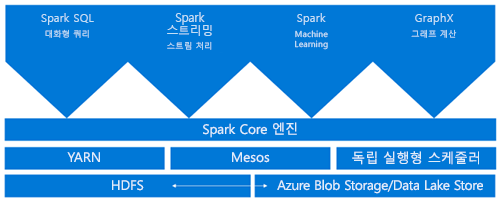
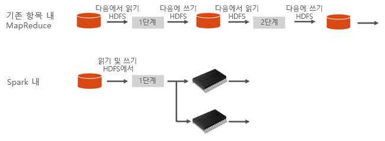
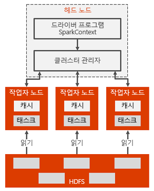

# Azure HDInsight에서 Apache Spark란

Apache Spark는 메모리 내 처리를 지원하여 빅 데이터 분석 애플리케이션의 성능을 향상하는 병렬 처리 프레임워크입니다. Azure HDInsight의 Apache Spark는 Microsoft가 Apache Spark를 클라우드에서 구현한 것입니다. HDInsight를 사용하면 Azure에서 Spark 클러스터를 더 쉽게 만들고 구성할 수 있습니다. HDInsight의 Spark 클러스터는 Azure Storage 및 Azure Data Lake Storage와 호환됩니다. 따라서 HDInsight Spark 클러스터를 사용하여 Azure에 저장된 데이터를 처리할 수 있습니다. 구성 요소 및 버전 관리 정보를 보려면 [Azure HDInsight의 Apache Hadoop 구성 요소 및 버전](../hdinsight-component-versioning.md)을 참조하세요.

## Apache Spark란?

Spark는 메모리 내 클러스터 컴퓨팅을 위한 기본 형식을 제공합니다. Spark 작업은 메모리로 데이터를 로드하고 캐시하여 반복적으로 쿼리할 수 있습니다. 메모리 내 컴퓨팅은 HDFS(Hadoop 분산 파일 시스템)를 통해 데이터를 공유하는 Hadoop 같은 디스크 기반 애플리케이션보다 훨씬 빠릅니다. 또한 Spark는 지역 컬렉션과 같이 분산 데이터 집합을 조작할 수 있도록 Scala 프로그래밍 언어로 통합합니다. 매핑 및 reduce 작업으로 모든 것을 구조화하지 않아도 됩니다.

HDInsight에서 Spark 클러스터는 완벽하게 관리되는 Spark 서비스를 제공합니다. HDInsight에서 Spark 클러스터를 만드는 이점은 다음과 같습니다.

| 기능 | 설명 |
| --- | --- |
| 쉽게 만들기 |Azure Portal, Azure PowerShell 또는 HDInsight .NET SDK를 사용하여 몇 분 만에 HDInsight에서 새 Spark 클러스터를 만들 수 있습니다. [HDInsight에서 Apache Spark 클러스터 시작](apache-spark-jupyter-spark-sql-use-portal.md)을 참조하세요. |
| 사용 편의성 |HDInsight의 Spark 클러스터에는 Jupyter 및 Apache Zeppelin 노트북이 포함되어 있습니다. 이러한 노트북을 대화형 데이터 처리 및 시각화에 사용할 수 있습니다.|
| REST API |HDInsight의 Spark 클러스터에는 원격으로 작업을 제출하고 모니터링하는 REST API 기반 Spark 작업 서버인 [Apache Livy](https://github.com/cloudera/hue/tree/master/apps/spark/java#welcome-to-livy-the-rest-spark-server)가 포함되어 있습니다. [Apache Spark REST API를 사용하여 HDInsight Spark 클러스터에 원격 작업 제출](apache-spark-livy-rest-interface.md)을 참조하세요.|
| Azure Data Lake Storage에 대한 지원 | HDInsight의 Spark 클러스터는 Azure Data Lake Storage를 기본 스토리지 또는 추가 스토리지로 모두 사용할 수 있습니다. Data Lake Storage에 대한 자세한 내용은 [Azure Data Lake Storage 개요](../../data-lake-store/data-lake-store-overview.md)를 참조하세요. |
| Azure 서비스와의 통합 |HDInsight에서 Spark 클러스터는 Azure Event Hubs에 대한 커넥터와 함께 제공됩니다. Spark의 일부로 이미 사용 가능한 [Apache Kafka](https://kafka.apache.org/)외에, Event Hubs를 사용하여 스트리밍 애플리케이션을 빌드할 수 있습니다. |
| ML Server에 대한 지원 | HDInsight의 ML Server에 대한 지원은 **ML 서비스** 클러스터 형식으로 제공됩니다. Spark 클러스터와 약속된 속도로 분산된 R 계산을 실행하도록 ML 서비스 클러스터를 설정할 수 있습니다. 자세한 내용은 [HDInsight에서 ML Server를 사용하기 시작](../r-server/r-server-get-started.md)을 참조하세요. |
| 타사 IDE와의 통합 | HDInsight는 유용한 여러 IDE 플러그인을 제공하여 애플리케이션을 만들고 HDInsight Spark 클러스터에 제출합니다. 자세한 내용은 [Azure Toolkit for IntelliJ IDEA 사용](apache-spark-intellij-tool-plugin.md), [VSCode용 HDInsight 사용](../hdinsight-for-vscode.md) 및 [Azure Toolkit for Eclipse 사용](apache-spark-eclipse-tool-plugin.md)을 참조하세요.|
| 동시 쿼리 |HDInsight의 Spark 클러스터는 동시 쿼리를 지원합니다. 이 기능을 통해 한 사용자의 여러 개 쿼리 또는 여러 사용자 및 애플리케이션의 여러 개 쿼리에서 동일한 클러스터 리소스를 공유할 수 있습니다. |
| SSD에서 캐시 |클러스터 노드에 연결된 메모리 또는 SSD에서 데이터를 캐시하도록 선택할 수 있습니다. 메모리에서 캐시하면 최고의 쿼리 성능을 제공하지만 리소스가 많이 들 수 있습니다. SSD에서 캐시하면 메모리에서 전체 데이터 세트에 맞게 필요한 크기의 클러스터를 만들 필요 없이 쿼리 성능 향상을 위한 훌륭한 옵션을 제공합니다. |
| BI 도구와의 통합 |HDInsight에서 Spark 클러스터는 데이터 분석을 위해 [Power BI](https://www.powerbi.com/)와 같은 BI 도구용 커넥터를 제공합니다. |
| 미리 로드된 Anaconda 라이브러리 |HDInsight에서 Spark 클러스터는 미리 설치된 Anaconda 라이브러리와 함께 제공됩니다. [Anaconda](https://docs.continuum.io/anaconda/) 는 기계 학습, 데이터 분석, 시각화 등을 위해 약 200개의 라이브러리를 제공합니다. |
| 확장성 | HDInsight를 사용하면 클러스터 노드의 수를 변경할 수 있습니다. 또한 모든 데이터가 Azure Storage 또는 Data Lake Storage에 저장되므로 데이터 손실 없이 Spark 클러스터를 삭제할 수 있습니다. |
| SLA |HDInsight의 Spark 클러스터는 24/7 지원 및 99.9% 가동 시간 SLA와 함께 제공됩니다. |

HDInsight의 Apache Spark 클러스터에는 기본적으로 클러스터에서 사용할 수 있는 다음 구성 요소가 포함되어 있습니다.

* [Spark Core](https://spark.apache.org/docs/latest/). Spark Core, Spark SQL, Spark 스트리밍 API, GraphX 및 MLlib가 포함됩니다.
* [Anaconda](https://docs.continuum.io/anaconda/)
* [Apache Livy](https://github.com/cloudera/hue/tree/master/apps/spark/java#welcome-to-livy-the-rest-spark-server)
* [Jupyter Notebook](https://jupyter.org)
* [Apache Zeppelin Notebook](http://zeppelin-project.org/)

또한 HDInsight의 Spark 클러스터는 Microsoft Power BI와 같은 BI 도구에서 HDInsight의 Spark 클러스터에 연결하기 위한 [ODBC 드라이버](https://go.microsoft.com/fwlink/?LinkId=616229)도 제공합니다.

## Spark 클러스터 아키텍처

Spark가 HDInsight 클러스터에서 실행되는 방식을 이해하면 Spark의 구성 요소를 이해하는 것이 쉬워집니다.

Spark 애플리케이션은 클러스터의 독립 프로세스 집합으로 실행되며 기본 프로그램(드라이버 프로그램이라고 함)에서 SparkContext 개체에 의해 조정됩니다.

SparkContext는 애플리케이션 간에 리소스를 할당하는 여러 유형의 클러스터 관리자에 연결합니다. 이러한 클러스터 관리자에는 [Apache Mesos](https://mesos.apache.org/), [Apache Hadoop YARN](https://hadoop.apache.org/docs/current/hadoop-yarn/hadoop-yarn-site/YARN.html) 또는 Spark 클러스터 관리자가 포함됩니다. HDInsight에서 Spark는 YARN 클러스터 관리자를 사용하여 실행합니다. 일단 연결되면 Spark는 클러스터의 작업자 노드에서 실행기를 얻습니다. 이 실행기는 계산을 실행하고 애플리케이션의 데이터를 저장하는 프로세스입니다. 그런 다음, 애플리케이션 코드(SparkContext에 전달된 JAR 또는 Python 파일에 의해 정의됨)를 실행기에 보냅니다. 마지막으로, SparkContext는 실행할 실행기로 작업을 전송합니다.

SparkContext는 사용자의 주 함수를 실행하고 작업자 노드에서 다양한 병렬 작업을 실행합니다. 그런 다음, SparkContext는 작업 결과를 수집합니다. 작업자 노드는 Hadoop 분산 파일 시스템 간에 데이터를 읽고 씁니다. 또한 작업자 노드는 RDD(Resilient Distributed Datasets)로 메모리 내 변환된 데이터를 캐시합니다.

SparkContext는 Spark 마스터에 연결하고 작업자 노드의 실행기 프로세스 내에서 실행되는 개별 작업의 방향 그래프(DAG)로 애플리케이션을 변환하는 작업을 수행합니다. 각 애플리케이션은 전체 애플리케이션의 기간에 대해 유지하고 여러 스레드에서 작업을 실행하는 자체 실행기 프로세스를 가져옵니다.

## HDInsight의 Spark 사용 사례

HDInsight의 Spark 클러스터는 다음과 같은 주요 시나리오를 사용합니다.

- 대화형 데이터 분석 및 BI

    HDInsight의 Apache Spark는 Azure Storage 또는 Azure Data Lake Storage에 데이터를 저장합니다. 비즈니스 전문가 및 주요 의사 결정권자는 해당 데이터에 대한 보고서를 분석 및 작성하고 Microsoft Power BI를 사용하여 분석된 데이터에서 대화형 보고서를 작성합니다. 분석자는 클러스터 저장소의 비구조적/반구조적 데이터부터 시작하여 노트북으로 데이터에 대한 스키마를 정의한 다음 Microsoft Power BI를 사용하여 데이터 모델을 작성할 수 있습니다. HDInsight에서 Spark 클러스터는 Tableau와 같은 많은 타사 BI 도구를 지원하므로 데이터 분석가, 비즈니스 전문가 및 핵심 의사 결정자가 쉽게 사용할 수 있습니다.

    [자습서: Power BI를 사용하여 Spark 데이터 시각화](apache-spark-use-bi-tools.md)

- Spark Machine Learning

    Apache Spark는 [MLlib](https://spark.apache.org/mllib/), 즉 Spark를 기반으로 하여 빌드되어 HDInsight의 Spark 클러스터에서 사용할 수 있는 기계 학습 라이브러리와 함께 제공됩니다. HDInsight의 Spark 클러스터에는 기계 학습을 위한 다양한 패키지가 포함된 Python 배포인 Anaconda도 있습니다. 이와 Jupyter 및 Zeppelin Notebook의 기본 제공되는 지원이 결합되면 기계 학습 애플리케이션을 만들기 위한 환경이 갖추어집니다.

    [자습서: HVAC 데이터를 사용하여 건물 온도 예측](apache-spark-ipython-notebook-machine-learning.md)  
    [자습서: 식품 검사 결과 예측](apache-spark-machine-learning-mllib-ipython.md)

- Spark 스트리밍 및 실시간 데이터 분석

    HDInsight의 Spark 클러스터는 실시간 분석 솔루션을 빌드하기 위한 풍부한 지원을 제공합니다. Spark가 이미 커넥터를 가지고 Kafka, Flume, Twitter, ZeroMQ 또는 TCP 소켓 같은 여러 소스에서 데이터를 수집하는 동안 HDInsight에서 Spark는 Azure Event Hubs에서 데이터 수집을 위한 최상의 지원을 추가합니다. Event Hubs는 Azure에서 가장 널리 사용되는 큐 서비스입니다. Event Hubs에 대한 즉각적인 지원이 가능하므로 HDInsight의 Spark 클러스터는 실시간 분석 파이프라인을 빌드하기 위한 이상적인 플랫폼이 됩니다.

## 시작 단계

다음 문서를 사용하여 HDInsight의 Apache Spark에 대해 자세히 알아볼 수 있습니다.

- [빠른 시작: HDInsight에서 Apache Spark 클러스터 만들기 및 Jupyter를 사용하여 대화형 쿼리 실행](./apache-spark-jupyter-spark-sql-use-portal.md)
- [자습서: Jupyter를 사용하여 Apache Spark 작업 실행](./apache-spark-load-data-run-query.md)
- [자습서: BI 도구를 사용하여 데이터 분석](./apache-spark-use-bi-tools.md)
- [자습서: Apache Spark를 사용한 기계 학습](./apache-spark-ipython-notebook-machine-learning.md)
- [자습서: IntelliJ를 사용하여 Scala Maven 애플리케이션 만들기](./apache-spark-create-standalone-application.md)

## 다음 단계

이 개요를 통해 Azure HDInsight의 Apache Spark에 대한 몇 가지 기본 사항을 이해할 수 있습니다. 다음 문서에서는 HDInsight Spark 클러스터를 만들고 일부 Spark SQL 쿼리를 실행하는 방법을 알아봅니다.

- [HDInsight에서 Apache Spark 클러스터 만들기](./apache-spark-jupyter-spark-sql-use-portal.md)
