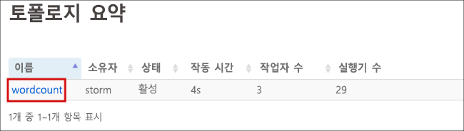
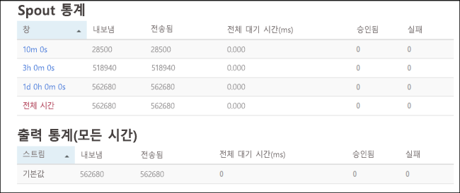

# <a name="quickstart-create-and-monitor-an-apache-storm-topology-in-azure-hdinsight"></a>빠른 시작: Azure HDInsight에서 Apache Storm 토폴로지 만들기 및 모니터링

Apache Storm은 데이터 스트림 처리용 확장 가능한 분산형 실시간 계산 시스템입니다. Azure HDInsight의 Storm을 사용하여 실시간 데이터 분석을 수행하는 클라우드 기반 Storm 클러스터를 만들 수 있습니다.

이 빠른 시작에서는 Apache [storm-starter](https://github.com/apache/storm/tree/v2.0.0/examples/storm-starter) 프로젝트의 예제를 사용하여 기존 Apache Storm 클러스터에 Apache Storm 토폴로지를 만들고 모니터링합니다.

## <a name="prerequisites"></a>필수 조건

* HDInsight의 Apache Storm 클러스터. [Azure Portal을 사용하여 Apache Hadoop 클러스터 만들기](../hdinsight-hadoop-create-linux-clusters-portal.md)를 참조하고 **클러스터 유형**에 **Storm**을 선택합니다.

* SSH 클라이언트. 자세한 내용은 [SSH를 사용하여 HDInsight(Apache Hadoop)에 연결](../hdinsight-hadoop-linux-use-ssh-unix.md)을 참조하세요.

## <a name="create-the-topology"></a>토폴로지 만들기

1. Storm 클러스터에 연결합니다. `CLUSTERNAME`을 사용자의 Storm 클러스터 이름으로 바꿔서 아래 명령을 편집한 다음, 다음 명령을 입력합니다.

    ```cmd
    ssh sshuser@CLUSTERNAME-ssh.azurehdinsight.net
    ```

2. **WordCount** 예제는 `/usr/hdp/current/storm-client/contrib/storm-starter/`에서 사용자의 HDInsight 클러스터에 포함되어 있습니다. 토폴로지는 임의의 문장을 생성하고 단어 발생 횟수를 계산합니다. 다음 명령을 사용하여 클러스터에서 **wordcount** 토폴로지를 시작합니다.

    ```bash
    storm jar /usr/hdp/current/storm-client/contrib/storm-starter/storm-starter-topologies-*.jar org.apache.storm.starter.WordCountTopology wordcount
    ```

## <a name="monitor-the-topology"></a>토폴로지 모니터링

Storm은 토폴로지를 실행하여 함께 작업하기 위한 웹 인터페이스를 제공하고 HDInsight 클러스터에 포함됩니다.

Storm UI를 사용하여 토폴로지를 모니터링하려면 다음 단계를 사용합니다.

1. Storm UI를 표시하려면 웹 브라우저를 열고 `https://CLUSTERNAME.azurehdinsight.net/stormui`로 이동합니다. `CLUSTERNAME`을 클러스터의 이름으로 바꿉니다.

2. **토폴로지 요약**의 **이름** 열에서 **wordcount** 항목을 선택합니다. 토폴로지에 대한 정보가 표시됩니다.

    

    새 페이지에서는 다음 정보를 제공합니다.

    |자산 | 설명 |
    |---|---|
    |토폴로지 통계|기간으로 구성된 토폴로지 성능에 대한 기본 정보입니다. 특정 기간을 선택하면 페이지의 다른 섹션에 표시되는 정보에 대한 기간이 변경됩니다.|
    |Spout|각 Spout에서 반환된 마지막 오류를 포함한 Spout에 대한 기본 정보입니다.|
    |Bolt|Bolt에 대한 기본 정보입니다.|
    |토폴로지 구성|토폴로지 구성에 대한 자세한 정보입니다.|
    |활성화|비활성화된 토폴로지 처리를 다시 시작합니다.|
    |비활성화|실행 중인 토폴로지를 일시 중지합니다.|
    |균형 재조정|토폴로지의 병렬 처리를 조정합니다. 클러스터에서 노드 수를 변경한 후 실행 중인 토폴로지의 균형을 다시 맞추어야 합니다. 균형을 다시 맞추면 병렬 처리가 조정되어 클러스터에서 증가/감소한 노드 수가 보정됩니다. 자세한 내용은 [Apache Storm 토폴로지의 병렬 처리 이해](https://storm.apache.org/documentation/Understanding-the-parallelism-of-a-Storm-topology.html)를 참조하세요.|
    |종료|지정된 시간 제한 후 Storm 토폴로지를 종료합니다.|

3. 이 페이지의 **Spouts** 또는 **Bolts** 섹션에서 항목을 선택합니다. 선택한 구성 요소에 대한 정보가 표시됩니다.

    

    새 페이지에는 다음 정보가 표시됩니다.

    |자산 | 설명 |
    |---|---|
    |Spout/Bolt 통계|기간으로 구성된 구성 요소 성능에 대한 기본 정보입니다. 특정 기간을 선택하면 페이지의 다른 섹션에 표시되는 정보에 대한 기간이 변경됩니다.|
    |입력 통계(Bolt에만 해당)|Bolt에서 사용되는 데이터를 생성하는 구성 요소에 대한 정보입니다.|
    |출력 통계|이 Bolt에서 내보낸 데이터에 대한 정보입니다.|
    |실행자|이 구성 요소의 인스턴스에 대한 정보입니다.|
    |오류|이 구성 요소에 의해 생성된 오류입니다.|

4. Spout 또는 Bolt에 대한 세부 정보를 볼 때 구성 요소의 특정 인스턴스에 대한 세부 정보를 확인하려면 **실행자** 섹션의 **포트** 열에서 항목을 선택합니다.

        2015-01-27 14:18:02 b.s.d.task [INFO] Emitting: split default ["with"]
        2015-01-27 14:18:02 b.s.d.task [INFO] Emitting: split default ["nature"]
        2015-01-27 14:18:02 b.s.d.executor [INFO] Processing received message source: split:21, stream: default, id: {}, [snow]
        2015-01-27 14:18:02 b.s.d.task [INFO] Emitting: count default [snow, 747293]
        2015-01-27 14:18:02 b.s.d.executor [INFO] Processing received message source: split:21, stream: default, id: {}, [white]
        2015-01-27 14:18:02 b.s.d.task [INFO] Emitting: count default [white, 747293]
        2015-01-27 14:18:02 b.s.d.executor [INFO] Processing received message source: split:21, stream: default, id: {}, [seven]
        2015-01-27 14:18:02 b.s.d.task [INFO] Emitting: count default [seven, 1493957]

    이 예제의 경우 **seven**이라는 단어가1493957번 발생했습니다. 이 숫자는 이 토폴로지가 시작된 이후 단어가 발생한 횟수입니다.

## <a name="stop-the-topology"></a>토폴로지 중지

단어 개수 토폴로지에 대한 **토폴로지 요약** 페이지로 돌아가 **토폴로지 작업** 섹션에서 **Kill** 단추를 선택합니다. 메시지가 표시되면 토폴로지를 중지하기 전에 대기할 시간(초)으로 10을 입력합니다. 시간 제한이 지난 후에는 대시보드의 **Storm UI** 섹션을 방문한 경우 토폴로지가 더 이상 표시되지 않습니다.

## <a name="clean-up-resources"></a>리소스 정리

빠른 시작을 완료한 후 클러스터를 삭제하는 것이 좋습니다. HDInsight를 사용하면 데이터가 Azure Storage에 저장되기 때문에 클러스터를 사용하지 않을 때 안전하게 삭제할 수 있습니다. HDInsight 클러스터를 사용하지 않는 기간에도 요금이 청구됩니다. 클러스터에 대한 요금이 저장소에 대한 요금보다 몇 배 더 많기 때문에, 클러스터를 사용하지 않을 때는 삭제하는 것이 경제적인 면에서 더 합리적입니다.

클러스터를 삭제하려면 [브라우저, PowerShell 또는 Azure CLI를 사용하여 HDInsight 클러스터 삭제](../hdinsight-delete-cluster.md)를 참조하세요.

## <a name="next-steps"></a>다음 단계

이 빠른 시작에서는 Apache [storm-starter](https://github.com/apache/storm/tree/v2.0.0/examples/storm-starter) 프로젝트의 예제를 사용하여 기존 Apache Storm 클러스터에 Apache Storm 토폴로지를 만들고 모니터링했습니다. Apache Storm 토폴로지의 관리 및 모니터링의 기본 사항을 알아보려면 다음 문서로 계속 진행하세요.

> [!div class="nextstepaction"]
>[Azure HDInsight에서 Apache Storm 토폴로지 배포 및 관리](./apache-storm-deploy-monitor-topology-linux.md)