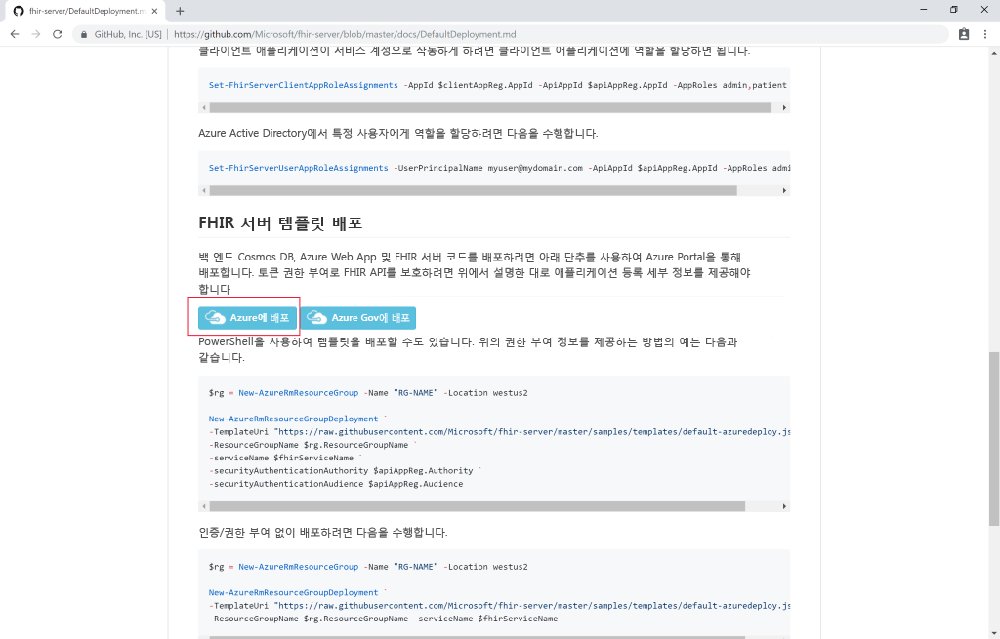
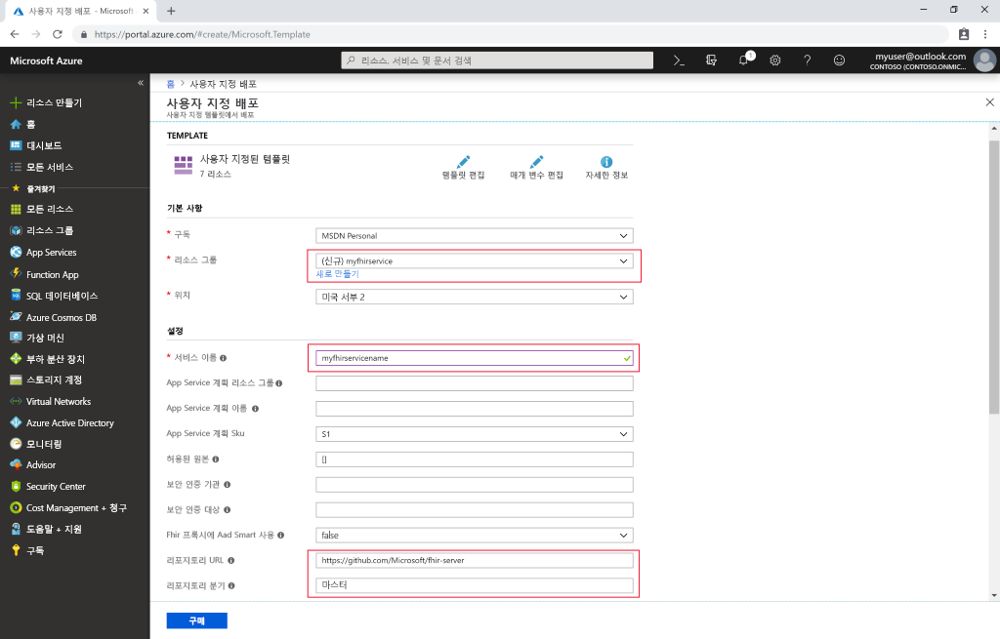

# 빠른 시작: Azure Portal을 사용하여 오픈 소스 FHIR 서버 배포

이 빠른 시작에서는 Azure Portal을 사용하여 Azure에서 오픈 소스 FHIR 서버를 배포하는 방법을 알아봅니다. [오픈 소스 리포지토리](https://github.com/Microsoft/fhir-server)에서 간편한 배포 링크를 사용합니다.

Azure 구독이 아직 없는 경우 시작하기 전에 [체험 계정](https://azure.microsoft.com/free/?WT.mc_id=A261C142F)을 만듭니다.

## GitHub 오픈 소스 리포지토리

[GitHub 배포 페이지](https://github.com/Microsoft/fhir-server/blob/master/docs/DefaultDeployment.md)로 이동하여 "Azure에 배포" 단추를 찾습니다.

>[!div class="mx-imgBorder"]
>

배포 단추를 클릭하면 Azure Portal이 열립니다.

## 배포 매개 변수 입력

새 리소스 그룹을 만들고 고유한 이름을 지정하려면 선택합니다. 다른 필수 매개 변수만 서비스의 이름과 Sql 관리자 암호입니다.

>[!div class="mx-imgBorder"]
>

세부 정보를 입력한 후 배포를 시작할 수 있습니다.

## FHIR 서버가 실행 중인지 확인

배포가 완료되면 브라우저에서 `https://SERVICENAME.azurewebsites.net/metadata`를 가리켜 기능 문을 얻을 수 있습니다. 서버가 처음 응답하는 데 1분 정도 소요됩니다.

## 리소스 정리

더 이상 필요하지 않으면 리소스 그룹 및 모든 관련 리소스를 삭제할 수 있습니다. 이렇게 하려면 프로비저닝된 리소스가 포함된 리소스 그룹을 선택하고, **리소스 그룹 삭제**를 선택한 다음, 삭제할 리소스 그룹의 이름을 확인합니다.

## 다음 단계

이 자습서에서는 Azure용 Microsoft 오픈 소스 FHIR 서버를 구독에 배포했습니다. Postman을 사용하여 FHIR API에 액세스하는 방법을 알아보려면 Postman 자습서로 이동합니다.
 
>[!div class="nextstepaction"]
>[Postman을 사용하여 FHIR API에 액세스](access-fhir-postman-tutorial.md)