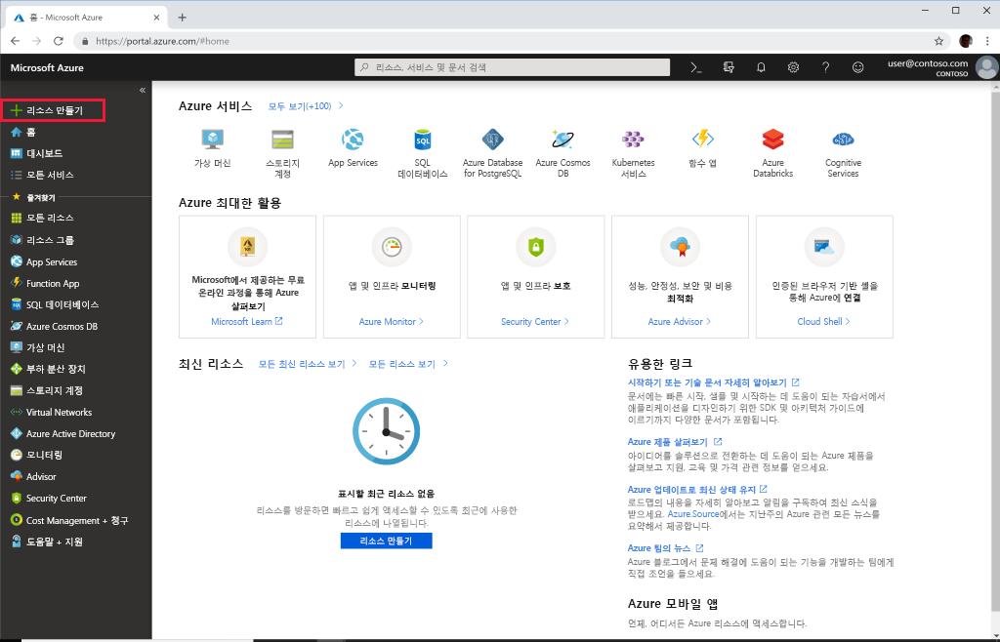

# 빠른 시작: Azure Portal을 사용하여 Azure API for FHIR 배포

이 빠른 시작에서는 Azure Portal을 사용하여 Azure API for FHIR을 배포하는 방법을 알아봅니다.

Azure 구독이 아직 없는 경우 시작하기 전에 [체험 계정](https://azure.microsoft.com/free/?WT.mc_id=A261C142F)을 만듭니다.

## 새 리소스 만들기

[Azure Portal](https://portal.azure.com)을 열고 **리소스 만들기**를 클릭합니다.

## Azure API for FHIR 검색

검색 상자에 "FHIR"을 입력하여 Azure API for FHIR을 찾을 수 있습니다.

:::image type="content" source="media/quickstart-paas-portal/portal-search-healthcare-apis.png" alt-text="Healthcare API 검색":::

## Azure API for FHIR 계정 만들기

**만들기**를 선택하여 새 Azure API for FHIR 계정을 만듭니다.

:::image type="content" source="media/quickstart-paas-portal/portal-create-healthcare-apis.png" alt-text="Azure API for FHIR 계정 만들기":::

## 계정 세부 정보 입력

기존 리소스 그룹을 선택하거나 새 리소스 그룹을 만들고, 계정에 대한 이름을 선택하고, 마지막으로 **검토 + 만들기**를 클릭합니다.

:::image type="content" source="media/quickstart-paas-portal/portal-new-healthcareapi-details.png" alt-text="새 의료 API 세부 정보":::

만들기를 확인하고 FHIR API 배포를 기다립니다.

## 추가 설정(선택 사항)

**다음: 추가 설정**을 클릭하여 인증 설정을 볼 수도 있습니다. Azure API for FHIR의 기본 구성은 [데이터 평면 역할 할당에 Azure RBAC를 사용](configure-azure-rbac.md)하는 것입니다. 이 모드에서 구성된 경우 FHIR 서비스에 대한 "권한"이 구독의 Azure Active Directory 테넌트로 설정됩니다.

:::image type="content" source="media/rbac/confirm-azure-rbac-mode-create.png" alt-text="기본 인증 설정":::

이 경우 역할 할당을 구성하는 데 Azure RBAC를 사용하기 때문에 허용된 개체 ID를 입력하는 상자가 회색으로 표시됩니다.

외부 또는 보조 Azure Active Directory 테넌트를 사용하도록 FHIR 서비스를 구성하려는 경우 권한을 변경하고 서버에 대한 액세스를 허용해야 하는 사용자 및 그룹의 개체 ID를 입력할 수 있습니다. 자세한 내용은 [로컬 RBAC 구성](configure-local-rbac.md) 가이드를 참조하세요.

## Fetch FHIR API 기능 문

새 FHIR API 계정이 프로비저닝되었는지 확인하려면 브라우저를 `https://<ACCOUNT-NAME>.azurehealthcareapis.com/metadata`로 가리켜 기능 문을 인출합니다.

## 리소스 정리

더 이상 필요 없는 경우 리소스 그룹, Azure API for FHIR 및 모든 관련 리소스를 삭제할 수 있습니다. 이렇게 하려면 Azure API for FHIR 계정이 포함된 리소스 그룹을 선택하고, **리소스 그룹 삭제**를 선택한 다음, 삭제할 리소스 그룹의 이름을 확인합니다.

## 다음 단계

이 빠른 시작 가이드에서는 Azure API for FHIR을 구독에 배포했습니다. Azure API for FHIR에서 추가 설정을 설정하려면 추가 설정 방법 가이드로 이동합니다.

>[!div class="nextstepaction"]
>[Azure API for FHIR의 추가 설정](azure-api-for-fhir-additional-settings.md)
